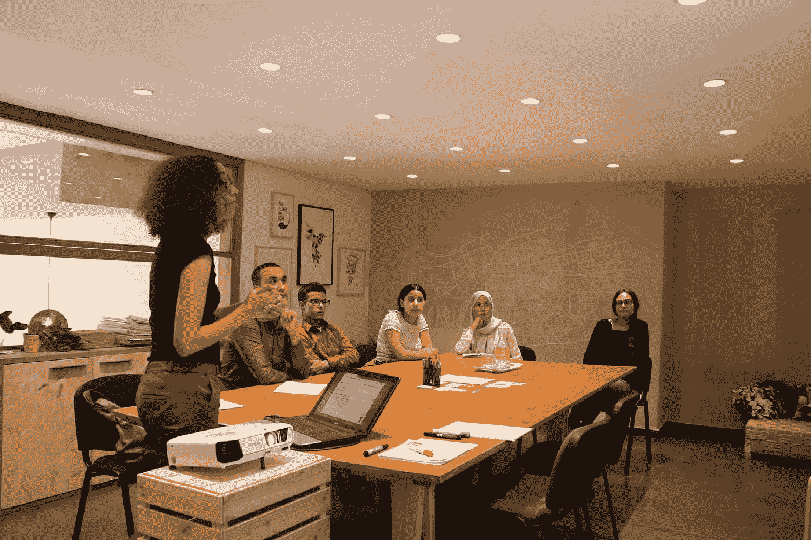

# 阅读这篇文章会让你重新思考如何在网上赚钱

> 原文：<https://medium.datadriveninvestor.com/reading-this-will-make-you-rethink-how-you-make-your-money-online-a48a8db061a?source=collection_archive---------1----------------------->

## 教育

## 我刚刚在我的在线课程上发布了最后一课。以下是我一路走来学到的东西

Photo by [Cytonn Photography](https://unsplash.com/@cytonn_photography?utm_source=medium&utm_medium=referral) on [Unsplash](https://unsplash.com?utm_source=medium&utm_medium=referral)

当我开始从事我的在线课程项目时，我不得不重新思考整个教学过程，特别是创建在线课程这一相当全面的工作中所包含的元素和学习活动。

作为一名超过 35 年的语言和写作教师，我习惯于在课堂上传达内容，与一群年轻人交谈，用粉笔在黑板上写字，布置写作任务并接收学生的论文，阅读和修改产品并向作者提供反馈。

在我职业生涯的最后 13 年里，我一直担任一家成人教育中心的负责人，当几年后我辞职退休时，我很高兴地发现教育世界即将发生巨大的变化。远程学习和在线课程开始出现，为教师和教育工作者提供了全新的机会。

总而言之，这是关于这个问题的:

# 好的学习有什么特征？

今天，我们在教学方面面临着一个全新的、与 20 年前完全不同的局面。在传统的课堂教学中，学习是一种社会活动，学习过去是，现在仍然是学生在教室里与他人一起做的事情。这是一项以教师为中心，引导学习过程的活动。在更早的时候，在许多情况下，人们更关注教师这个人，而不是学习内容。

早期和现在学习的另一个要求是学习必须是高质量的。而当我们第一次开始谈论学习过程中的质量和教学中的质量时，那么我们就处于另一个有许多不同观点、观点和理论的大领域:什么是学习中的好质量？

本文并不打算深入所有这些内容，也不打算为所有关于学习过程质量和教学质量的问题提供完整的答案，但让我们先回顾一些关键概念。

 [## 教科书行业如何最终被颠覆，并将继续改变|数据驱动…

### 就此而言，教科书产业在美国乃至全世界都有着悠久的历史。事实上，他们已经…

www.datadriveninvestor.com](https://www.datadriveninvestor.com/2018/09/25/how-the-textbook-industry-has-finally-been-disrupted-and-will-continue-to-change/) 

在早期，我们经常谈论课程和课程目标，而“课程目标”的概念是核心。教学非常注重课程目标。我们喜欢谈论目标管理。

虽然我们过去常常谈论达到课程目标有多重要，但现在焦点已经转向一个新术语，即**“预期学习结果”(ILO)** 。

根据 Biggs 和 Tang (2011)的研究总结，

> “我们现在认为‘预期学习结果’(ILO)这个词更好，因为它比‘目标’更强调我们指的是学生必须学什么，而不是老师必须教什么。“有目的的学习结果”阐明了学生在教学后应该能够完成以前无法完成的任务，而且很可能会有意想不到的积极教学结果。”(比格斯、j .和 c .唐(2011 年)。麦格劳-希尔国际大学优质学习教学。)

# 我们如何促进学习过程？

传播很重要，几个有趣的相关问题值得研究:

*   是什么让学生和其他学习者学习他们需要学习的东西？
*   作为课程持有者，我应该如何传达课程内容，以便学生学习？
*   什么是学习？—我们是否应该说，学习是导致行为改变的输入和有用的信息或影响？

# 好的学习有什么特点？

当我开始准备创建我的在线课程时，我不得不问自己一些关于学习过程的基本问题。

*   我如何确保学生做了相关的学习活动？
*   我如何给学生相关的形成性反馈？
*   我如何能确定学生有适当的动机？
*   我如何给学生一个基本的和相关的知识基础？
*   我如何确保学生参与反思性学习？

总之，这些问题概括起来就是:

> 好的学习有什么特点？

总之，我们可以说，重要的是学生能够通过思考自己在学习过程中相对于预期学习结果的位置来评估自己的学习(劳工组织)。

Photo by [Campaign Creators](https://unsplash.com/@campaign_creators?utm_source=medium&utm_medium=referral) on [Unsplash](https://unsplash.com?utm_source=medium&utm_medium=referral)

另一个重要的方面是，课堂内外都涉及相关的学习活动。当更多的感官参与到学习过程中，我们会记得更好。

反馈在两方面都很重要，从老师到学生，从学生到老师。如果学生敢于犯错误，并设法从错误中学习，以更接近预期的学习结果，则反馈提供了特别好的学习。

远程学习中课程讲师或教师给学生的反馈不同于课堂教学。在在线教学中，课程创建者应方便学生从课程讲师处获得对其提交作品的反馈。此外，学生应该有机会向课程教师提交反馈。课程的设计必须让学生真正感到受到鼓励，并欢迎他们提供反馈。

该系统必须鼓励课程参与者以允许学生实际主动提供反馈并以其他方式获得反馈的方式提供反馈。系统应该以某种方式鼓励你，让学生实际上花一些时间，所以在那里，要求反馈或给反馈。

在这里，我们处于学生角色或学生角色，以及早期许多教师拥有的理想，这是传统上在教学中强调的，即 AFEL 口号(挪威语:“ans var For Eiga l ring”-对自己的学习负责)。遵循这一理想，模范学生/学习者应该积极地为他或她的学习工作负责。

在有在线课程的新的教育课程世界里，我们有一个全新的学生角色，或者说学生角色仍然假设学生有很大一部分责任:学生自己有一个开始学习的理由。

*   他或她想要学习一些东西，并在网上搜索许多可以帮助他/她实现目标的合适课程。
*   理想的网上学生对这个过程的所有部分承担全部责任。这包括制定学习过程的目标，在网上搜索相关课程，根据自己的需要评估不同的课程，选择相关课程，与课程提供者联系，并要求提供更多关于课程内容以及条款和价格的信息。
*   然后，他或她最终购买了课程并开始在课程上工作。

不言而喻，当一个学生开始这样一个项目时，她与这个项目的关系比一个可能讨厌上学并被迫上学的在校年轻学生更积极主动。

网络课程是学生自己的项目。项目和学习工作牢牢扎根于购买课程的人，通过这种方式为学习项目的实施奠定了非常好的基础。

# 学习者是焦点的中心

Biggs 和 Tang (2011)的研究表明，良好的学习环境具有以下特征:

*   学生对自己的思维过程有知识和洞察力，并参与反思性学习
*   学生积极参与相关的学习活动
*   学生接受形成性反馈
*   这个学生受到了适当的激励
*   给学生一个基本的和相关的知识库
*   学习是社会性的
*   教学质量很高。

在这种背景下，我们可以说，对于学生来说，通过反思自己在学习过程中相对于学习目标的位置来评估自己的学习是很重要的。学生参与课堂内外的相关学习活动也很重要。当多种感官参与学习过程时，我们会记得更好。

教师和学生以及学生和教师之间的双向反馈也很重要。如果学生敢于犯错误，并能够处理错误，以便更接近学习目标，反馈证明是特别好的学习。通过帮助学生了解学习工作如何使他们更接近学习目标，可以增强学生的动机。此外，重要的是谈论成功时要让学生觉得，只要他们付出足够的努力，他们就能达到目标。

我们可以和学生一起建立知识库，通过重组新知识，帮助学生了解学科的结构以及它与学生所学的其他学科的关系。

Photo by [Claire Nakkachi](https://unsplash.com/@bidaya?utm_source=medium&utm_medium=referral) on [Unsplash](https://unsplash.com?utm_source=medium&utm_medium=referral)

社会背景在学习中显然很重要。给学生提供合作和讨论彼此观点的机会，为思考和扩展他们自己的理解打开了一个舞台。

老师如何组织教学也很重要。变化和节奏是很重要的，人们不应该试图涵盖主题中的“一切”。

你应该花更多的时间在对整体理解最重要的事情上，并确保学生在继续之前已经理解。

最后一点很重要，那就是与学生就在线课程的内容以及他们自己需要阅读的内容达成“协议”。

# 完成我作为课程创建者的第一个在线课程后的想法

当我决定创建在线课程时，我的意图是为有一点写作经验的学生创建一个创意写作课程，这个课程可能对新的、即将到来的作家有用。

我开始这个项目的意图是，这个课程可能会对那些曾经写了一点东西并想写更多东西的人感兴趣。我想接触更多的观众，帮助人们接触更多的读者。

关于目标群体和写作语言，我决定向世界各地的学生提供这门课程，并将英语作为工作语言。我选择英语作为工作语言，因为这是世界上使用最广泛的语言之一。

当我开始从事这个项目时，我是以一名经验丰富的挪威讲师的身份这样做的，他在高中教授写作和挪威语、德语和法语超过 35 年。许多挪威语教学时间以及部分法语和德语教学时间都围绕着写作教育。

我自己也写过并出版过小说和非小说类的书籍。此外，我还撰写和发表关于 medium.com 的文章、散文、实验文本、散文和诗歌。我写的许多关于 medium.com 的文章都是关于写作的，我发现我可以用这些材料的一部分作为我在线课程写作课的背景。

在球场上的工作是一次令人兴奋和有趣的旅程，让我在几个领域获得了许多新知识。

# 经验教训

当然，有起有落，这是非常有教育意义的，所以在这里我将尝试总结我的经验教训。

关于这门课的工作，我必须学习许多关于网络课程和写作的不同东西。一件事是课程内容本身，课程的结构以及如何建立课程，使其对那些将要参加课程的人变得有趣。这里是关于主题的选择，与不同主题相关的角度，以及课程是否应该专注于偏好，即课程应该关注哪些特殊主题。非常重要的一点是创建一个包含学生最感兴趣的内容的在线课程。

我还学到了很多关于如何接触到课程的潜在买家的知识，我也学到了一些关于脸书和谷歌上的广告。我不会在这里深入讨论这个话题，但是我可以说我至少没有了解到建立和销售在线课程的成本很高。

# 在线课程的工具和软件

为了能够提供课程，你需要大量的工具，而这些工具部分可以通过自由软件来实现。但是，如果一个人要提供相当广泛的课程，并且当涉及到辅助技术和传达复杂的内容时，对课程持有者要求很高，那么花费一点钱的工具可能是必要的，然后最好承担必要的成本。

我自己也参加了一个关于创建在线课程的课程，这也许是让我能够开始创建自己的在线课程，而没有太多的卷曲。关于建设在线课程的课程是一门昂贵的课程，但它实际上给了我很多关于制作在线课程的知识。

毕竟，我学到的一些东西是，无论是金钱还是劳动，都没有免费的东西。

如果您想创建在线课程，有几件事需要考虑:

一个很好的课程想法。人们需要什么？定义课程主题和受众。你需要有一个人们想学的课程主题，比如一门新语言或一项新技能，或者如何在夫妻关系中运用它。

传播很重要，也就是你给课程参与者内容的方式。

课程的销售方式必须有吸引力。课程必须以顾客需要的形式出现。它一定不仅仅是美好的东西。

当我开始学习在线课程时，我没有这方面的经验。但是我有在课堂上教学的经验，我有很多关于如何制作在线课程的想法。

课堂教学和网络课程教学有很大的不同。当在教室里与学生面对面站在一起，观察他们是否理解和掌握了你所说的内容时，你必须依靠网络，学生学习他们期望学习的内容，而不是直接接触和观察学生在教室里学习的内容。

网络上的交流首先是视觉和听觉的。web tutor 提供文本和图像课程，并可以将音频文件、视频、播客和 PDF 文件与课程的解释和补充内容相链接。所有的内容都必须精心制作，质量上乘，任何购买了课程的人都可以无限制地使用。这也适用于解释、补充材料和实时指导，它们在特殊情况下以额外支持、辅导或一对一服务的形式提供。

Photo by [You X Ventures](https://unsplash.com/@youxventures?utm_source=medium&utm_medium=referral) on [Unsplash](https://unsplash.com?utm_source=medium&utm_medium=referral)

教室里的老师有这样的优势，她可以观察学生的学习情况，因此她可以捕捉到每个学生的特殊需求。

在教室里，老师必须让每个人都能听到。这并不总是没有问题的。也许老师把教材讲得太难或太容易，以至于个别学生不及格，要么是因为他们不理解教学内容，要么是因为他们失去了兴趣。

在网上教学中，原则上，所有的内容都必须是结构化的和公式化的，这样网站才能解决所有可能出现的问题。这就是它在实践中很少起作用的原因，因此在线课程也必须有帮助页面和其他与网络教师直接联系的渠道。电子邮件通常是后者最广泛使用的渠道。

在在线教育中，从定义上来说，学生比课堂上的学生有更积极的作用。在线学生已经购买了课程，因此以稍微不同的方式渴望成功完成课程。

网上教学的好处在于，你有机会给学生他们想要的东西，因为你得到了主动选择这门课程并因此感兴趣的学生。最大的挑战是让足够多的学生对课程感兴趣。也许只有两种方法可以做到——创建非常好的课程，并非常擅长营销，以便足够多的成熟学生意识到课程的存在。

创建一个新的在线课程可能会非常鼓舞人心，因为你在何时创建课程以及如何呈现内容和材料方面是完全自由的。你可以完全决定课程的范围，你可以决定如何传播，设计网页和课程，使用音频文件，播客和视频等。

如果你决定开设一门课程，并且你自己拥有所有的资源，那么在这门课程上进行创造性的工作是非常容易的。你可以结合口头和书面交流，你可以增加各种各样的交流方式，你可以决定主题，范围，完成和出版的速度和时间。

为了创建在线课程，除了专业和教育能力之外，你还需要一些工具。首先也是最重要的，你需要好的书写工具，然后 PC 或电脑很重要，还有智能手机。此外，拥有一台 iPad 可能是个好主意，这样你就可以同时使用两个屏幕工作。

为了收集想法和发展想法，你至少需要两个，至少你的智能手机和电脑。构思阶段非常重要。你应该随时准备好手机、电脑或记事本，这样你就可以随时记下课程想法。

您还可以使用手机上的听写功能，例如，您可以使用该功能编写新的电子邮件，您可以点击麦克风符号，让邮件程序为您写下您想要记住的内容。

想多读点？访问此处:

 [## Kompetanse 背心-洞察在线课程

### 编辑描述

the-creative-writing-alliance.simplerosites.com](https://the-creative-writing-alliance.simplerosites.com/course-overview-insight-writing-alliance-successful-writing-in-english)