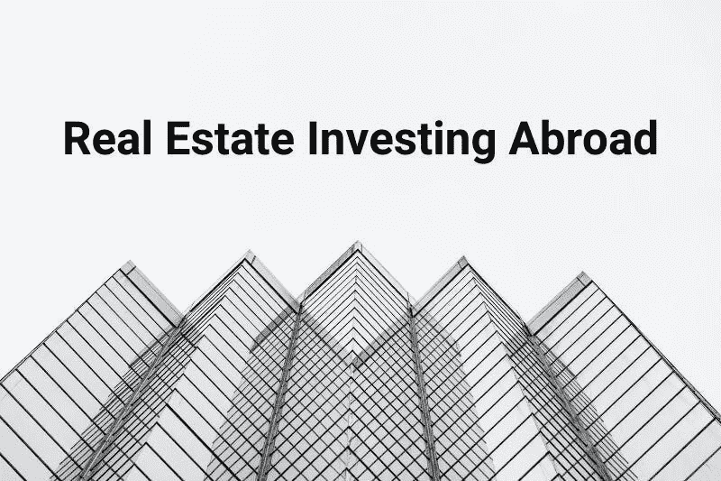
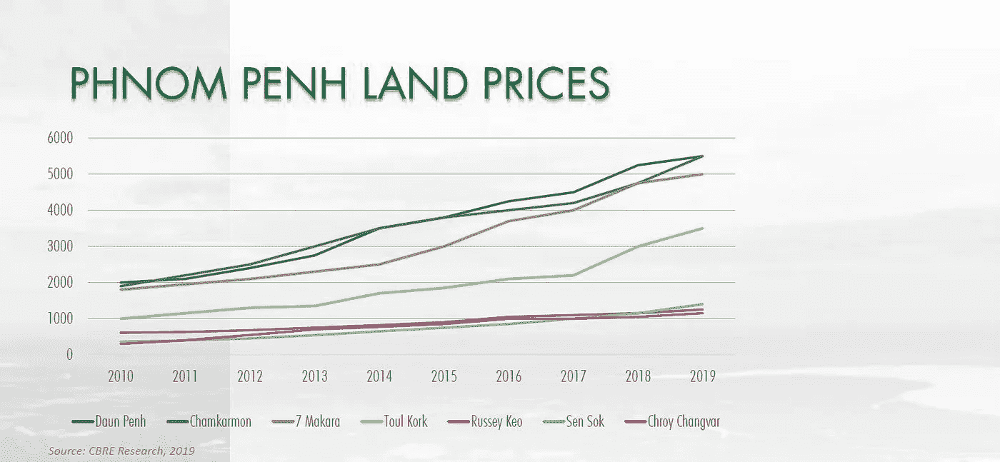
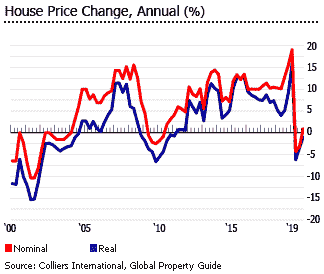

# 海外房地产投资——利润最大化，风险最小化

> 原文：<https://medium.datadriveninvestor.com/real-estate-investing-abroad-maximize-profit-and-minimize-risks-16ab82dd2697?source=collection_archive---------39----------------------->

## 在每周一次的快速赚钱[YouTube 直播会议](https://youtu.be/1mHwdKuVy3I)中，我与在三个国家拥有三处房产的[金融幻想家](https://www.financial-imagineer.com/)讨论了作为一名外国房地产投资者，你应该注意哪些事情

在我最近[对来自](https://www.fasttrack.life/episodes/21)[游牧资本家](https://nomadcapitalist.com/)的 Andrew Henderson 的采访中，他提到他在 6 个国家拥有 6 处房产。对他来说，前沿市场比西欧等成熟市场更有潜力。这是很有意思的一点。在柬埔寨金边，实际土地价格自 2010 年以来一直在上涨，到 2018 年平均每年增长 6.6%，在 9 年的时间里几乎增长了两倍。自 2004/2005 年以来，菲律宾马尼拉的房地产价格(包括土地和公寓)一直在上涨。

2010 年至 2018 年，菲律宾经历了房价热潮，马卡蒂 CBD 房价上涨了近 132%。2019 年第三季度，公寓价格同比上涨 [29.1%](https://www.globalpropertyguide.com/Asia/Philippines/Price-History) ，复式住宅上涨 24.8%，单身住宅上涨 2.4%，联排别墅上涨 6%。不仅在菲律宾，许多前沿市场的房地产也显示出了良好的增长前景。

然而，尽管回报丰厚，但并非没有风险。随着 2019 年美中贸易战的影响，2019 年房价大幅下降。这是海外房地产投资的风险之一。

在这里，我总结了我们在现场会议中谈到的一些要点。

1.  **房地产增长的驱动力**

当你考虑投资一个市场时，你应该考虑整体经济前景、人口趋势和当地法律法规。在人口增长、商业环境改善、收入水平提高的地区，这表明这个地区正在发展。这个地区将会有更多的工作机会，这意味着对住房的更多需求。你需要看这个领域未来的趋势，预估潜在的增长，而不是看现状。它可能是一个成熟的领域，进一步的增长是有限的，那么它仍然是一个好的投资吗？

**2。房地产投资相关风险**

在海外投资时，尤其是在前沿和新兴市场，政治不稳定是你不应忽视的一个因素。在菲律宾，房地产市场一直在上涨，但贸易战可能会在很大程度上影响不断上涨的房地产市场。或者可能是最近的缅甸政变事件，这可能会影响外国投资者和企业如何决定他们是否想在这个国家经营。

如果地方政府负债累累，可能会导致更高的利息支付、税收激增和财政危机。这对经济不利，你的房地产投资也是如此。

外汇风险会耗尽你的回报。当你用本币购买，用外币出售时，你是在两次换钱。与此同时，外汇汇率可能会大幅波动，这可能会吞噬你的回报。比如 2020 年 3 月，1 马来西亚林吉特=新币 0.43。2021 年 2 月，1 马来西亚林吉特= 0.33 新加坡元。如果你用新币买入，用马来西亚林吉特卖出，你会损失 30%，因为马来西亚林吉特在最近 10 年贬值了 30%。

对资金流动的限制会阻止你把钱带出国。我们以前在中国台湾和其他市场看到，地方政府希望阻止资金流向海外，因此他们限制转移到国外的资金数量，制定了许多法规。居民和外国人最多只能向国外转移 5000 美元外币。这远远不是一笔财产买卖的价格。但这并不是不可能的，如果你和你的银行合作，最好是国际银行，有很多方法可以解决这个问题。

**3。海外房地产投资小贴士**

尽管有风险，你还是有很多理由投资海外。它可以分散您的投资，帮助您获得更多的流动性，如葡萄牙黄金签证或通过投资项目获得其他移民。如果你做得好，它也能给你带来惊人的回报。

当你在国外投资时，你应该咨询专家，了解什么是你的**税收影响**。了解外国人买卖房产是否有一些限制。也许有一个**配额**或其他限制会约束你的流动性。在新加坡，外国人在购买公寓时必须支付 20%的印花税，与新加坡有条约的国家除外。考虑到许多公寓的起价都是 100 万新加坡元，在购买价格的基础上再加 20%是一笔巨款。

除了财务和法规，你还应该注意文化差异，在不了解当地文化甚至更好的语言的情况下不要投资，了解人们的心态以了解潜力:尽量减少文化冲击

最重要的是，当你不在那个国家生活时，你需要一个值得信赖的团队在当地帮助你管理财产。如果你把它租出去或者改成 AirBnB，你需要有人帮你安排参观、租赁合同、维修和清洁。当你不在现场时，你不能控制一切。所以在这方面，找到**一个可靠的代理或者管理公司**是至关重要的。

如果你做得好，海外房地产投资会非常有利可图和有趣。如果你刚刚起步，也许可以适度投资。决定你投资成败的因素太多了。从一些研究工作开始，与在这些国家投资或来自那里的人联系，了解什么是增长潜力、投资限制、税收影响等等。当你在这方面做得更好时，也许你可以将你的模式复制到其他市场。投资海外从来都不简单，因此找到一个值得信赖的顾问或专业服务至关重要。

如果你想了解更多关于如何管理你的钱，开始投资和改善你的个人理财，一定要订阅[快速跟踪 YouTube 频道](https://bit.ly/3ngv4KQ)，每周三加入我们的金钱对话。

**相关文章**

[**一步一步指导决定在瑞士买还是租**](https://www.fasttrack.life/blog/step-by-step-guide-to-decide-buy-or-rent-in-switzerland)

[**为什么你可能会在住房上花费过多，如何降低住房成本**](https://www.fasttrack.life/blog/why-you-might-spend-too-much-on-housing-and-how-to-reduce-your-housing-cost)

[**购买房产:直接还是间接摊销？**](https://www.fasttrack.life/blog/buying-a-property-direct-or-indirect-amortisation)

[**如何建立投资组合**](https://www.fasttrack.life/blog/how-to-build-an-investment-portfolio)

[**使用这两个移动交易应用让自己走上财富积累的轨道**](https://www.fasttrack.life/blog/tradingapps)

*原载于 2021 年 2 月 16 日*[*https://www . fast track . life*](https://www.fasttrack.life/blog/investing-in-real-estate-abroad-maximize-profit-and-minimize-risks)*。*