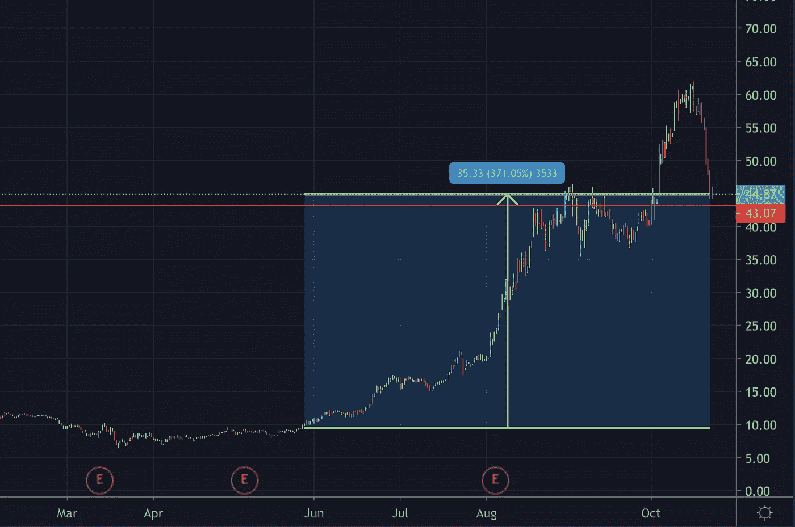
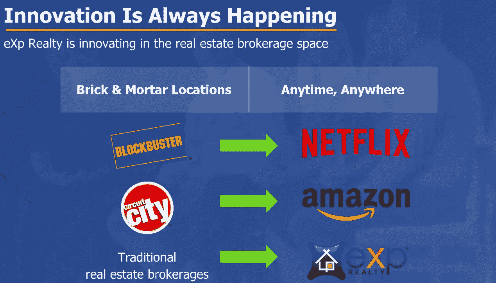

# 房地产无国界:在一个完全虚拟的企业

> 原文：<https://medium.datadriveninvestor.com/real-estate-without-borders-inside-a-fully-virtual-business-77adb95a7d6?source=collection_archive---------6----------------------->

这家公司从一开始就做好了被封锁的准备。2020 年是这家公司发展壮大品牌的完美风暴。

VR: Future of work. Credit: macrovector

**eXp Realty** 为房地产经纪人提供世界一流的技术、高于市场平均水平的佣金、收入分成和复杂的虚拟工作平台，使其成为委托人和代理人。

## 他们是怎么赚钱的？

与任何房地产经纪公司一样，他们的主要收入来源是佣金。然而，关键的区别在于他们如何构建他们的委员会结构。传统的经纪公司提供 60-40 的标准分成，代理人只获得 40%的佣金。通过 Exp Realty，代理人可以获得 80-20 的分成，直到第一笔 80，000 美元。第一笔 80000 美元之后，佣金 100%可以由代理保管。

例如，如果代理一年产生 120，000 美元的总佣金。

1.  标准分割收入为 72，000 美元(0.6 x 120，000)
2.  Exp Realty split 为他/她赢得 104，000 美元((0.8 x 80，0000 +40，000))

换句话说，在第一笔 80，000 美元之后，代理人实质上就成了他/她自己的经纪人。

**激励措施**在吸引全球顶级经纪人、员工忠诚度、公司文化以及最终公司的成功方面发挥着重要作用。

> “当你应该考虑激励的力量时，永远不要去想别的事情。”——查理·芒格

## 游戏中的皮肤

如果激励结构没有足够的吸引力，公司的员工可以通过**股票期权**获得进一步的补偿，作为实现某些里程碑的结果。

1.  通过激励计划获得股权奖励:第一次成交时获得 200 美元的 EXPI 股票，代理封顶时获得 400 美元的 EXPI 股票(80，000 美元)，在代理完成第一笔交易(MLM？)
2.  代理股权佣金方案:**自愿**按现行市场价九折收取 5%的代理佣金。
3.  图标代理奖:顶级代理在实现某些里程碑、文化目标、参加重要活动时，将获得高达 16，000 美元的股票。代理在达到**图标**状态时也会获得奖励。图标地位是实现了一定的条件，其中主要的是每年总佣金收入 500，000 美元或以上，至少有 10 笔成交。

由于这些佣金，代理商更有可能产生更多的销售，提供卓越的客户服务，甚至将一些成本效益转移给最终客户。截至 2020 年 10 月 8 日，eXp 拥有 32，000 名代理，而就在上周，他们又增加了 500 名代理。

如果你是年初的经纪人，你就不会抱怨了。自 2020 年 5 月以来，eXp World Holdings Inc(纳斯达克股票代码:EXPI)的股价已经上涨了超过 370%。

eXp World Holdings Inc (NASDAQ: EXPI). Source: TradingView

> 要想在商业和投资上取得成功，你必须参与其中，在公司中拥有股份——沃伦·巴菲特

此外，每周还为员工提供超过 50 小时的现场培训，内容涉及广泛的主题，包括社交媒体、销售、说服、公共演讲和结束。

eXp Realty 还通过利用“Facebook workplace”为他们的代理人创造了另一个**生态系统**，允许更多的社交互动、即时通信和知识共享。

## 高科技的采用

Exp Realty 十多年来一直处于封闭状态，由于其基于云的经纪业务，他们在过去几年中一直蓬勃发展。

eXp 使用 KvCORE CRM 平台来帮助代理产生高质量的销售线索。业务分析支持流量洞察、高级营销策略、线索生成和**行为自动化**。行为自动化是一个有趣的功能，它可以识别销售线索的某些行为，并允许代理根据这些行为设置自动操作。例如，如果领导花费高于平均水平的时间研究某个郊区，CRM 可以自动发送特定的动作，例如包含该郊区最有价值的资产的后续电子邮件。

## 维尔贝拉:工作的未来

eXp 控股在 2018 年收购了 VirBela。

Use case of VirBela. WaiDATATHON held virtually by Women in AI in October 2020 in the VirBela open campus auditorium.

VirBela 是一个虚拟工作场所解决方案，支持员工、学生和与会者基于云的开放式协作。通过在云中连接公司，VirBela 提高了所有相关方的成本和时间效率。

**VirBela 的主要特性，**

*   支持弹性工作制，雇佣最优秀的员工
*   在提供教育、培训和其他服务时，取消地理位置限制
*   创建虚拟共享空间，改善沟通。

VirBela 基于 unity 软件构建，这是支持流行游戏的最佳实时开发平台之一。

VirBela 已经帮助了全球的客户，包括德勤、斯坦福大学、奇点大学以及最近的 NBA。

它还使可控的和**个性化的虚拟角色**能够在虚拟世界中导航。过去几个季度，随着虚拟音乐会、会议和大会的需求不断增长，虚拟世界的业务出现了爆炸式增长。事实上，eXp holdings 的[股东峰会](https://www.youtube.com/watch?v=59j0jDa3u4c)实际上是在利益相关者提问并与社区积极互动的地方举行的。

在 2020 年 Q2 奥运会上，VirBela 的用户增长了 260 %, 5X 的月用户增长了**。**

Virtual collaboration through VirBela. Credit : eXp Realty

疫情加速了在家工作的趋势，这种趋势将会持续到未来，用不了多久，我们就会看到整个公司都建立在虚拟平台上。对于未来的公司来说，这不仅仅是在 30 公里的范围内雇佣最优秀的人才，而是通过使用创新的平台来拓展和获得最优秀的人才

维尔贝拉直接从黑镜里出来了。

## 管理

你不能在游戏中谈论皮肤而不谈管理。

eXp World holdings 由 Glenn Sanford 于 2007 年创立，他目前持有 30%的股份。他的妻子拥有控股公司另外 27%的股份。他目前的 glassdoor 评分为 93%,大多数员工称他是一位有远见的领导者。该公司的玻璃门评级为 4.6/5，员工对公司与员工成功的一致性非常满意。

该公司成立于 2009 年全球金融危机的背景下，旨在节省影响传统实体企业的间接成本。eXp 的目标是建立一个经得起未来考验的商业模式，在 2020 年的下一次危机中，eXp 成为人们关注的焦点，进一步验证了它的弹性。

eXp Realty 有一个独立的首席执行官，这是 eXp World Holdings 的主要收入来源。杰森·格辛目前持有该公司 3%的股份。

净推广得分(NPS)是一个范围从-100 到+100 的指数，衡量客户体验，然后可以用来预测业务增长。eXp 目前 NPS 为 70。举个例子，网飞的 NPS 是 68，亚马逊是 62。

## 未来展望

在这十年中，胜出公司的一个关键特征是，它们为用户提供交换产品和服务的基础设施。亚马逊创建了一个市场，Fiverr 创建了一个技能市场，Teladoc 创建了一个医生/病人平台。

同样，eXp realty 为有志的房地产代理商提供了一个全面的平台，以不断学习，提高和创造销售。

目前，美国、加拿大、英国和澳大利亚都有 eXp。eXp 最近宣布，到 2021 年底，他们的服务将扩展到印度、墨西哥、葡萄牙和南非。值得注意的是，印度有超过 12 亿人口，其中大多数人正处于拥有先进 It 技能的最佳工作年龄。

对于传统经纪公司来说，由于地理限制，扩展要困难得多，但 eXp 利用的虚拟工作环境相对更容易扩展。

The future belongs to scalable products and services.

美国现有住宅房地产市场的交易量约为 1.5 万亿美元，仅在 2019 年就售出了 530 万套房屋。这个机会就在美国，随着 eXp 拥有全球扩张的工具，潜在市场总量(TAM)显著增加。

此外，当前低利率和宽松信贷的宏观经济环境将推动房屋交易飙升(不是双关语)。

基于云的平台对新一代的 Z 世代和 Alpha 世代更有吸引力，他们更喜欢在虚拟世界上花更多的时间。

## 纳斯达克:EXPI

*   收入增长—1 年:95%/3 年平均:162.5%/**5 年平均:136%**
*   债务/权益:0.02
*   毛利率:8.6 %
*   过去 12 个月的净收入:730 万美元(第一个盈利季度)
*   用积极的惊喜打破每个季度的收益预期。
*   分析师增长率—明年:88%/5 年:10%
*   分析师对 2021 年收入的预测:22%
*   价格/销售额:3.11(当前)/ 1.02(2019)
*   股本回报率:12.27%
*   **%内部人持股比例:60.15%** / %机构持股比例:12.11%

## 作为投资的风险

*   来自 Redfin、Zillow 和 open door 等其他房地产科技公司的竞争日益激烈。
*   eXp world 的流通股为 6800 万股，而流通股仅为 2800 万股。这代表着大量的内部持股，这对任何投资者来说都是一个好信号。然而，**低流通股**由于缺乏足够的流动性，会增加股价的波动性。此外，内部人员抛售会给股价带来巨大的下行压力。
*   尽管多种股票期权和奖励很有吸引力，但随着每一个代理人和里程碑的增加，流通股的数量也会增加，这可能会导致股份稀释。
*   多层次营销方案中常见的一些特点，如推荐和过度奖励( **MLM** )带来了一些警示。虽然推荐可以增加公司的网络效应，但它也可能激励当前的代理商更多地关注如何让他们的伙伴加入进来，而不是按照最终消费者的最佳利益行事
*   毛利润下降。2013 年 16.8%，2017 年 10.6%，2020 年 9.3%。
*   全球扩张过程中的文化和监管障碍
*   宏观环境对任何需要轻松获得信贷的经济活动都极其有利。最大的房地产行业正在经历一场历史性的顺风，在可预见的未来，利率将达到创纪录的低水平。

> 为什么人们不能传送到他们想去的任何地方？- Palmer Luckey，Oculus VR 创始人

感谢您的阅读。更多内容，请在 substack 上注册我的电子邮件，[https://ashperera.substack.com/](https://ashperera.substack.com/)

[支持供应链弹性的区块链](https://medium.com/datadriveninvestor/blockchain-for-supply-chain-resilience-fa2e67904201)

我们处于长期牛市吗？

*声明:我目前没有 EXPI 的股份。这篇文章代表我的想法，不能作为财务建议。*

## 参考

1.  eXp World Holdings 投资者演示，2020 年 9 月

2.《维尔贝拉:工作的未来》(2020)。可在:[https://www.virbela.com/](https://www.virbela.com/)