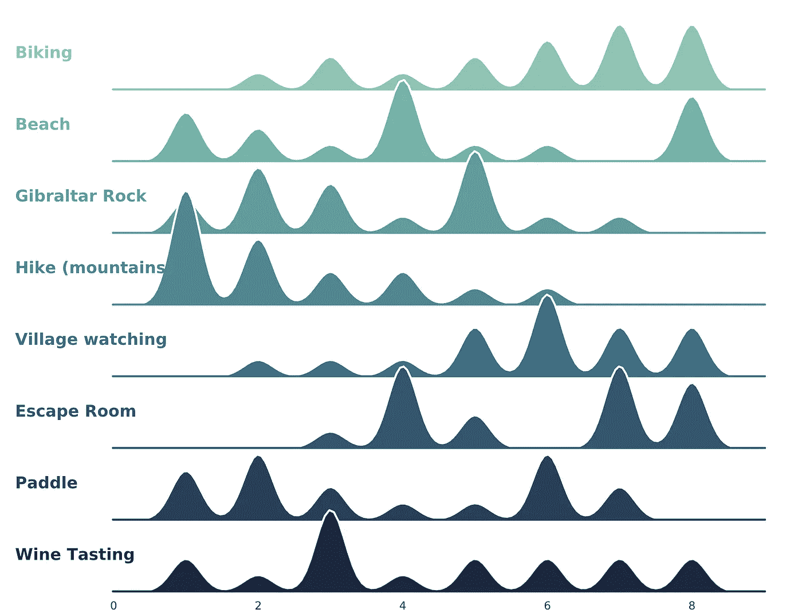
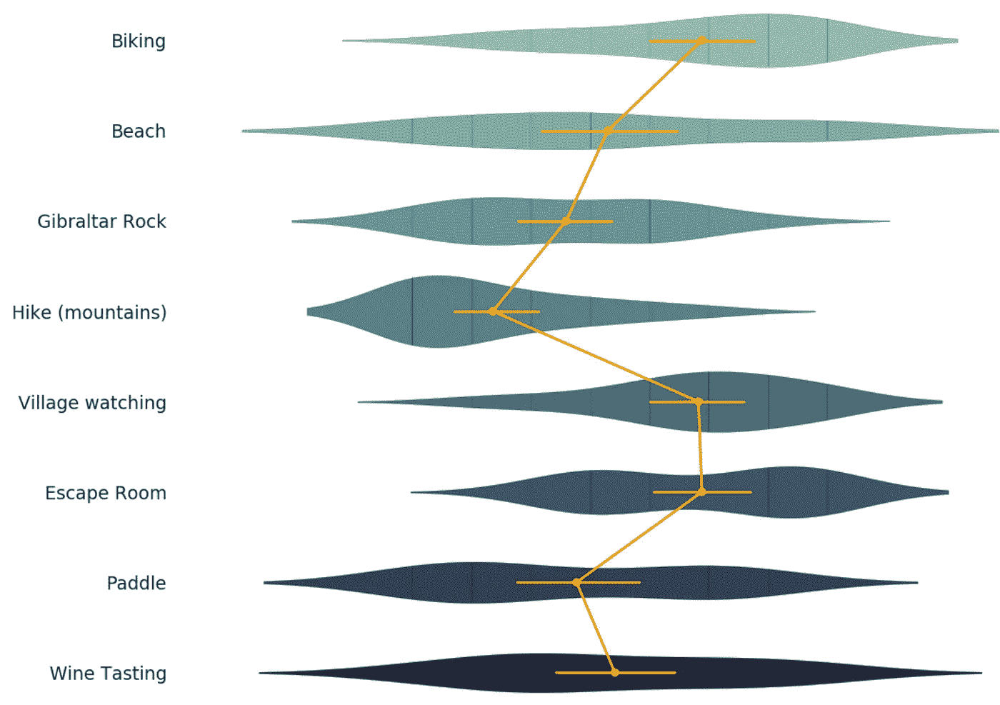
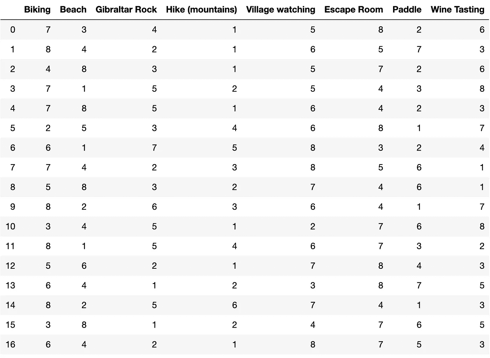
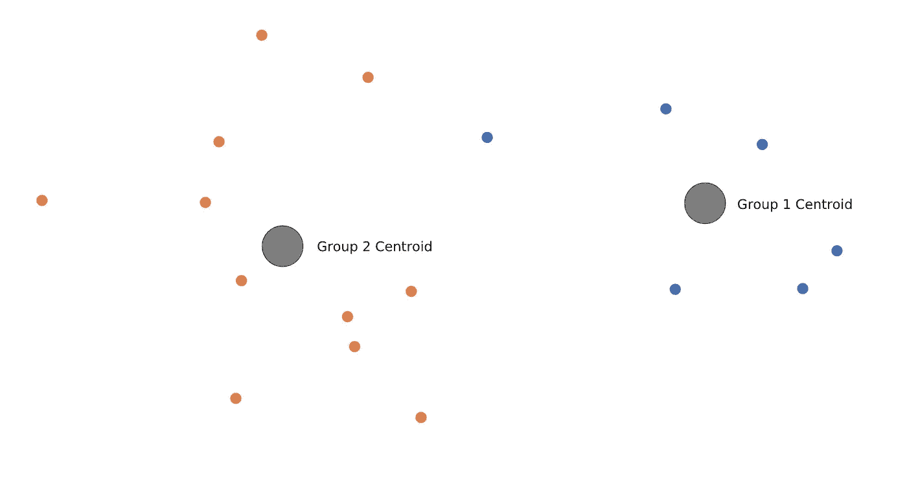
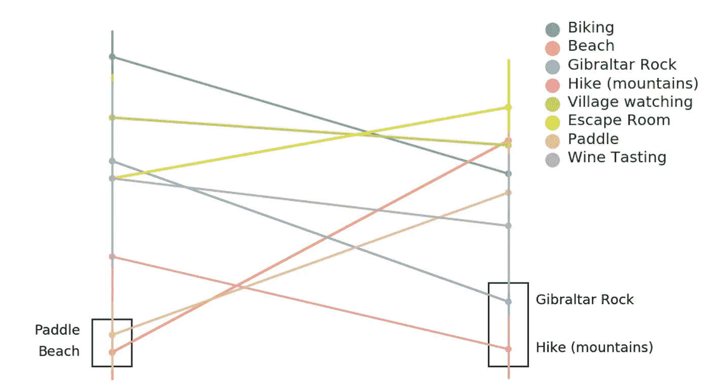
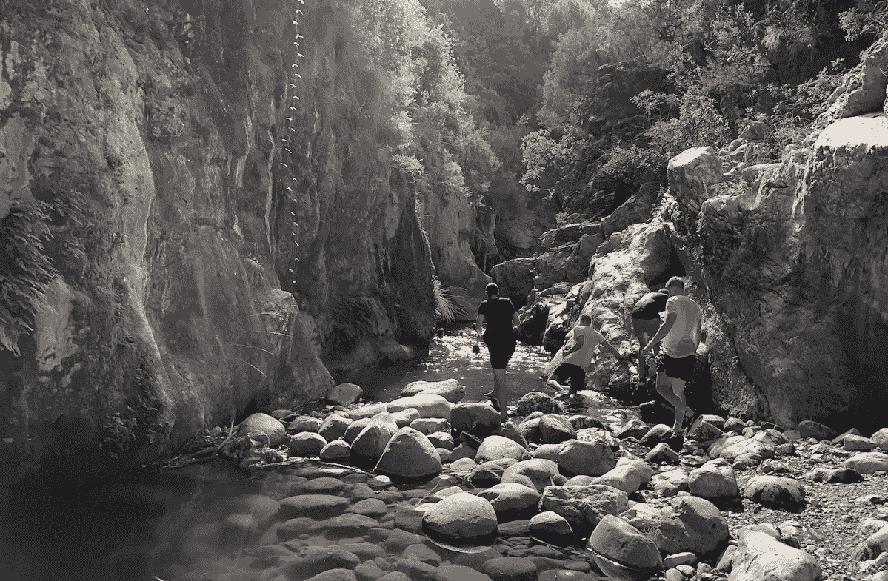

# 当你的小组在做什么活动上有分歧时——使用 Kmeans 聚类！

> 原文：<https://medium.datadriveninvestor.com/real-life-adventure-planning-decision-making-5192e55a8710?source=collection_archive---------15----------------------->

## 使用 KMeans 聚类解决一个常见的日常生活决策问题。

Image from [Pexels](https://www.pexels.com/photo/round-grey-and-black-compass-1736222/)

在今年的[大会](https://codecation.se/)上，我们计划了一个活动来打破编程会议。作为一个 17 人的小组，很难满足每个人的愿望，所以我们组织了一次会议，在会上我们为我们想做的事情投票。该调查包括 8 个选项:

🚴‍自行车
🏖海滩
🧗‍直布罗陀岩石
👟远足(山脉)
👀村看着
🕵️‍ ️Escape 的房间
🏸桨
🍷品酒

每个人都被要求在 1(最喜欢)和 8(最不喜欢)之间排列活动的优先级。这是一个强大的投票系统，因为你也可以指定你不想做什么。以下是每项活动的投票分布。

Vote distribution, lower is more preferred (e.g hiking)

我们可以看到，没有人想去骑自行车，大多数人对登山感兴趣，品酒是典型的第三种选择，而人们对乒乓球的看法两极分化。

如果我们要根据上面的情节和我们的直觉来决定做什么活动，那就是徒步旅行。我们可以通过绘制每项活动的密度来进一步加强我们的直觉:

Lower (left) is more preffered

在上面的小提琴图中，我们可以看到，与其他活动相比，徒步旅行的平均分最低，投票的标准差非常低(橙色水平线)。如果一把小提琴看起来像一个沙漏，这意味着人们对这一活动有着两极分化的看法。

决定整个团队去徒步旅行是一个没有人可以责怪你的决定，但我们可以做得更好。例如，那些没有优先考虑徒步旅行的人可以优先考虑同样的其他活动。这意味着如果我们分开，没有人会不高兴。人们不介意分成两组。但是我们如何进行这样的分割呢？

# k 均值聚类

我们将根据人们选择的相似程度来分组。通过将每个活动表示为一个特性，并将每个用户的投票表示为该特性的一个值，我们最终得到了这样一个数据帧(其中每一行都是一个特定人的投票行):

The raw data of peoples’ prioritizations

KMeans 聚类将每个人划分到一个组中，其中每个人属于具有最接近的特征向量均值的组。这意味着有相似选择的人将被分配到同一个集群。在 8 维中绘制数据是不太可行的，因此在对我们的数据进行聚类和降维(PCA 到二维)之后，我们可以观察 2D 空间中的点和聚类质心:

2D-space centroids of KMeans clustering

上面的图并没有真正告诉你太多，但是它给了你一个思路，如果集群工作，以及在哪里进行了千钧一发的呼叫。例如，最左边的蓝点与橙色和蓝色群集质心的距离大致相同，如果有机会，它可能是最有可能转换组的人。

通过以稍微不同的方式绘制原始数据，加上我们新发现的聚类，我们可以获得进一步的见解。

*Preferred activities for the two groups. Lower y-value is more preferred. Hiking places high for both groups, but isn’t the most popular option for Group 1.*

瞧，我们让每个人都更开心了。第一组要么去海滩，要么打网球(或者两者都去！？)，而第二组将去远足或去直布罗陀岩。

# 学习，以及我们最终做了什么

该小组赞赏这一分析，并对他们的小组感到满意。这些小组很容易在内部决定做什么。然而，当我们在寻找徒步旅行的地方时，我们在一个峡谷里找到了一个可以在河里散步的地方，这是每个人都想做的。像往常一样，你应该把你的分析建立在你信任的数据上，并确保你的数据收集方法是坚如磐石的。

After all, we decided to none of the proposed activities, sometimes science doesn’t cut it, Image by Author