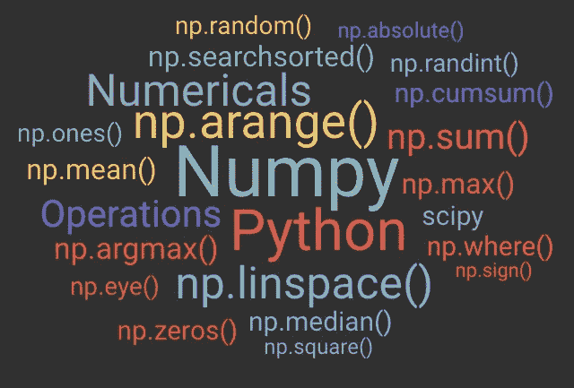

# NumPy 的实时介绍

> 原文：<https://medium.datadriveninvestor.com/real-time-introduction-to-numpy-d556deb56f49?source=collection_archive---------0----------------------->



NumPy library consists of many functions.

在科学计算、深度学习和金融分析等许多领域，我们都使用高维数组。你可能认为 Python 的数据结构如列表、元组和字典可以用来存储这样的数据。是的，它们可以使用，但性能比预期的慢得多。
**为什么列表不能用？** 1。在列表中可以存储异构数据，因此列表包含类型检查的开销，而在现实生活中，我们处理的是具有同构数据的高维数组。
例如:图像是由数字形式的像素值组成的矩阵。
2。列表没有完全使用低级硬件机制来加速操作。

> Numpy 旨在提高数值计算的性能和功能。

NumPy(**Num**erical**Py**thon)是一个试图高效处理和存储高维数组的库。它是 Python 中一个几乎在所有领域都广为人知且被广泛使用的包。NumPy 对于在大型高维数组和矩阵上执行数学和逻辑运算非常有用。它有很多功能，可以用来有效地执行各种数值运算。


A Brief Description of what NumPy offers at various levels.

# 在 NumPy 中创建数组。

要开始使用 NumPy 和 NumPy 中所有可用的功能，您需要导入它。这可以通过以下 import 语句轻松完成:

```
import numpy as np
```

NumPy 数组是一个**同质网格**的值。阵列沿其每个维度的大小称为其形状。

```
***#  Creating 1D array***arr1d = np.array([1, 2, 3])***#  Creating 2D array***arr2d = np.array([                    
                   [1,2,3],
                   [4,5,6]
                ])***#  Creating 3D array***arr3d = np.array([
                   [
                     [1,2,3],
                     [4,5,6]
                   ],
                   [
                     [7,8,9],
                     [10,11,12],
                   ]
                ])
```

下面列出了在 NumPy 中创建数组的一些替代方法。

```
**#  *Create an array of all zeros*** a = np.zeros((2,2))**#  *Create an array of all ones*** b = np.ones((2,2))**#  *Create a constant array of x*** x = 0.8
c = np.full((2,2), x)**#  *Creates a 3x3 identity matrix*** d = np.eye(3)**#  *Create an array of random values*** e = np.random.randn((2,2))f = np.arange(0, 30, 5)
**Output: [0, 5, 10, 15, 20, 25]** g = np.linspace(1, 15, 3)
**Output: [ 1.0,  8.0, 15.0]**
```

1.  这里 **np.arange()** 返回一个由给定区间内均匀分布的值组成的数组。第三个参数是步长。
2.  **np.linspace()** 返回一个数组，该数组由给定间隔内均匀分布的值组成。第三个参数是数组中所需的元素数量。

# 索引数组

我们可以像编程一样索引 1D 和 2D 数组，但是索引 3D 数组有点棘手。让我们考虑一个例子


Dimensions are ordered as shown here. (Source — [https://www.pythoninformer.com](https://www.pythoninformer.com/python-libraries/numpy/index-and-slice/))

```
arr3d[0, 0, 0]  ***#*** ***(i=0, j=0, k=0)***   
**Output: 10**arr3d[1, 0, 2]  ***# (i=1, j=0, k=2)***           
**Output: 22**arr3d[0, :, 1]        **Output: [11, 14, 17]**arr3d[:, 1, 2]           **Output: [15, 25, 35]**arr3d[:, :, 0]
**Output: [[10 13 16]
         [20 23 26]
         [30 33 36]]**arr3d[2, :, :]   
**Output: [[30 31 32]
         [33 34 35]
         [36 37 38]]**
```

前两个例子非常简单，但是从第三个例子开始，我们可以看到一个新的索引“**:**”。它表示**全切片**，这意味着必须打印沿该尺寸的所有数字。

## 基于条件的索引

```
arr3d[arr3d % 2 == 1]         
**Output: [11, 13, 15, 17, .... 37]**arr3d[(arr3d % 2 == 1) & (arr3d > 30)]   
**Output: [31, 33, 35, 37]**
```

# 个案研究

让我们考虑一个数据集，该数据集由 Sachin 和 Dravid 以及印度队在比赛子集上的得分组成。数据集包含 225 个匹配项。让我们试着回答几个问题。你可以在这里下载数据[。](https://drive.google.com/file/d/1lBEeQ9iycLmQX9LkA8gq2Tm1Utd9sKu8/view?usp=sharing)


A subset of a given data set.

首先，让我们使用命令加载数据集—

```
cric_data = np.loadtxt("cric_data.tsv", skiprows=1)
cric_data.shape()      
**Output: (225,4) Indicates 225 matches.**
```

输出如下所示，其中第一列表示指数，第二列表示 Sachin 的得分，第三列表示 Dravid 的得分，第四列表示印度在每场比赛中的得分。

```
array([[  0., 100.,  78., 342.],        
       [  1.,  11.,  62., 191.],        
       [  2.,   8.,  85., 252.],        
       [  3.,  71.,  24., 307.],............
```

让我们首先把 n-d 数组分成几个独立的部分。

```
Sachin = cric_data[:,1]  
Dravid = cric_data[:,2]   
India  = cric_data[:,3] (Note - ':' indicates all values along that dimension)**Example Output:**
Sachin = [100, 11, 8, 71.......]
```

需要注意的重要一点是，上述数组 Sachin、Dravid 和 India 是实际数组的**切片**，而**不是深度副本。如果你知道切片是如何工作的，我想你已经明白我的意思了。这里，上述三个数组仅仅是对实际 cric_data 的引用或视图，而不是深层副本。**

## 1)求 Sachin，Dravid，India 的均值和中位数。

要了解平均值和中间值，你可以参考我以前的文章[。现在让我们写一个函数，返回上述各项的平均值和中值。我们可以使用 NumPy 库函数 **np.mean()** 和 **np.median()** 来达到想要的结果。](https://link.medium.com/WI04Vgv2y5)

```
def stats(col):
    print('Mean', np.mean(col))
    print('Median', np.median(col))stats(Sachin)     
**Output: Mean 39.87  Median 27.0**stats(Dravid)     
**Output: Mean 32.06  Median 22.0**stats(India)      
**Output: Mean 220.79  Median 216.0**
```

## 2)萨钦和德拉维德的分数是多少世纪？

使用**count _ 非零方法(condition)** 我们可以找到满足给定条件的元素的数量。

```
np.count_nonzero(Sachin>99)     
**Output: 23**np.count_nonzero(Dravid>**Output: 8**
```

## 3)萨钦和德拉维德用了多少场比赛才达到 1000 分？

我们可以用累计和的概念来解决这个问题。方法 **np.cumsum(array)** 将执行数组中所有元素的累加和。例如:a=[1，2，3，4]。
np.cumsum(a)将返回[1，3，6，10]

```
sachin_cumscores = np.cumsum(sachin)
np.searchsorted(sachin_cumscores, 1000)
**Output: 29**
```

这意味着 Sachin 用了 29 场比赛来获得他的第一个 1000 分。在这里，search sorted 查找应该插入元素的索引，以便保持顺序。
**NP . search sorted**([1，2，3，4，5]，3)
Output: 2(为了保持排序的性质，只能在第二个索引后插入 3)

## 4)每场比赛找出谁得分更多——萨钦还是德拉维德

我们希望所有 225 场比赛的输出都是[Sachin，Dravid，Sachin，Sachin……]形式。

```
*## To store runs scored by both Sachin and Dravid.*Sachin_and_Dravid = cric_data[:, [0:2]]*## The below method would return [0,1,1,0,1......] for all the matches where 0 denotes Sachin scored more and 1 denotes Dravid scored more.*is_dravid_higher = np.argmax(Sachin_and_Dravid, axis=1)np.where(is_dravid_higher == 0, 'Sachin', 'Rahul')**Output:**
array(['Sachin', 'Rahul', 'Rahul', 'Sachin', 'Sachin', 'Rahul', 'Rahul', .......])
```

1.  **np.argmax()** 有一个参数‘axis ’,它指定查找跨行/列的最大元素。1 表示跨行，0 表示跨列。
2.  **np.where(condition，[x，y])** 根据条件返回‘x’或‘y’。

希望你对 NumPy 的使用方法有一个清晰的认识。敬请关注下一篇关于熊猫的文章！！！