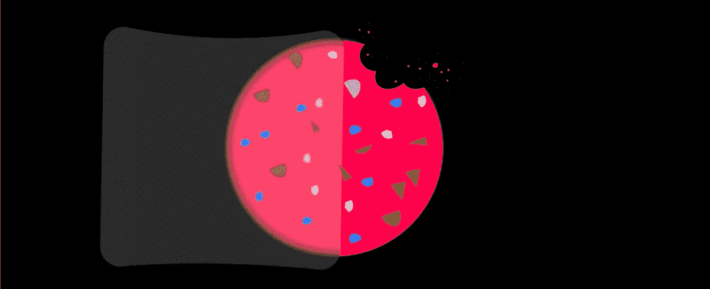

# 吃该死的饼干的理由(弗雷德里克·拜克曼的《焦虑的人》书评)

> 原文：<https://medium.datadriveninvestor.com/reasons-to-eat-the-damn-cookie-book-review-on-anxious-people-by-fredrick-backman-d7f66acebe5c?source=collection_archive---------36----------------------->

## 每天的危险和解放都是一样的。

The story arc of eating a cookie is quite complex (and dare I say thrilling).

这不是 2020 年的反映。这一年，一切似乎都崩溃了，留给我们的是挥之不去的怀疑和歇斯底里。当我在 12 月 30 日写这篇文章时，距离 2021 年还有两个晚上，一切都感觉*极其*虎头蛇尾。

这是一个关于饼干的故事。

就在我们迈入新的一年之前，我如饥似渴地阅读了弗雷德里克·拜克曼的小说《T2 焦虑的人们》。这是一本引人入胜的书。故事的大部分发生在一个场景中:一个公寓开放日变成了一场意外的银行劫匪挟持人质事件。此外，一座桥在字面上和象征上都成为一个重要的地点。

**荒诞的人物和离奇的情节真实地展现了我们平凡的一切。**我们肚子里的苦水，为某样东西冒一切风险的愚蠢，我们防御性假设的固执，以及我们肩上重量的精确。最重要的是，我们有能力重塑自我，尽管偶尔会有狂风袭击我们。

弗雷德里克·巴克曼丰富的写作风格给我留下了深刻的印象，他说了一切，同时隐藏了我们假设没有丢失的信息。我们身处的这个疫情现实中缺少了很多东西。也许是我们在 Zoom 上学习、工作或社交时缺乏感官信息。在一瞬间，缺乏真实感变得令人筋疲力尽——没有任何有形的东西来提醒自己发生了一些事情。

过去也是如此。有一天，一个 50 多岁的人告诉我，他们 30 多岁的样子在记忆中已经变得一片模糊。发生了吗？嗯，肯定是，但是时间和记忆都去哪了？

最近我看了皮克斯的*灵魂*和*比小说还离奇*的电影。这些电影和这本书都不约而同地传达了关于我们生命中不可避免的死亡的温和信息。这种焦虑必须在某个地方释放。压力和焦虑有时会完全包围我们的工作和身份。我们背信弃义的爬上阶梯。记录平凡而简单的快乐极其重要——或者至少我们应该让它成为值得关注的事情。

即使在全球化的疫情中，我们没有向家里吐露心声，我们大多数人也过着松散重复的生活。比如在不同的物理位置睡觉、吃饭、工作和社交。我们会记得什么？当有结束的幻觉时，什么会突出？它可能是一辆拥挤的公交车，车上经常出现陌生人，你从不认识他们，但他们每天都在同一条公交路线上。或者你为一件你倾注了多年心血的真正重要的事情写的论文。

所以我要吃那该死的饼干。也许做折纸，对我不利的是从“五个相交的四面体十二面体”的复杂教程开始。用我的面具遮住脸，在海滩上和一只固执的乌鸦进行一场凝视比赛。敢把笔记本电脑收起来看书。悄悄地跳上 NYT 烹饪的马车。与朋友和家人开怀大笑。即使可能不是特别“有用”,也要这样做，因为事实上就是这样。

我会把*焦虑的人*作为一本边缘自助书，这本书可能会让我打破抑制自己焦虑的障碍。然而，我知道什么？也许我所说的真相只是我所知道的故事。我们不都是“傻逼”吗？

感谢您阅读我的短文和书评。新年快乐。

**访问专家视图—** [**订阅 DDI 英特尔**](https://datadriveninvestor.com/ddi-intel)