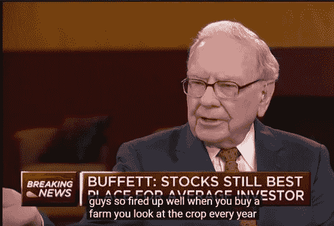
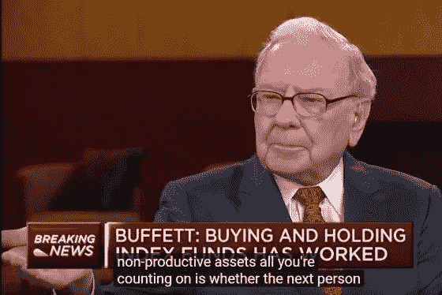

# 沃伦·巴菲特讨厌比特币的原因

> 原文：<https://medium.datadriveninvestor.com/reasons-why-warren-buffett-hates-bitcoin-5bb030c13a6c?source=collection_archive---------4----------------------->

*投资比特币就像投资 WeWork。*

这基本上就是巴菲特在 2018 年“臭名昭著”的美国消费者新闻与商业频道采访中暗示的。不仅不投资比特币，对于所有非生产性投资，巴菲特都尽量远离，但在比特币上他批评最多。不过，这和巴菲特的投资理念关系更大。

 [## 算法交易的机器学习|数据驱动的投资者

### 当你的一个朋友在脸书上传你的新海滩照，平台建议给你的脸加上标签，这是…

www.datadriveninvestor.com](https://www.datadriveninvestor.com/2019/01/30/machine-learning-for-stock-market-investing/) 

在 CBNC 对巴菲特的采访中，巴菲特本人详细解释了自己不投资比特币的原因，认为比特币根本不是投资，它只是一个后来者接手并流血的游戏。

他在采访中非常详细地表达了自己的观点。我摘录一点，解释一下为什么他从不投资非生产性资产，这和伯克希尔哈撒韦的商业模式有关系。

资产可以分为两种类型:

*   生产资产
*   非生产性资产。

比如一个工厂，或者一块种庄稼的土地，都属于生产性资产。至于黄金首饰，古董字画，本身不生产任何东西的，叫非生产性资产。巴菲特自己也经常用农场来比喻，他自己也在很久以前买了一个农场。

> 如果你买了一个农场，你成为一个农民，你会关注农场每年生产多少粮食。然后你可以根据粮食年产量来看农场价格，我们就可以判断这个农场是否值得购买。

**投资者必须关心资产本身能为投资者带来什么。这是一个有逻辑的头脑在投资中的想法。**

这种逻辑，即评估资产的方式，现在已经变得显而易见了。股票定价模型中的折现未来现金流量模型就是这种评价的量化。

即一项资产在未来能给你带来持续的现金流或实物收入。根据贴现的思想，我们可以为资产的当前价格设定一个价格。

举个例子，我借钱给 A，A 给我写了一张借条，用这张借条他会归还 100 美元的本金和 10 美元的利息。假设 A 的信用很好，而我刚好破产了，因为我的女朋友想要 99 朵玫瑰作为情人节礼物。如果我把这张借据卖掉，我能得到多少钱？

这张钞票的售价不能超过 110 美元，因为如果有 100 美元现金，那么我们就不需要等一年。类似地，如果某人在银行有 110 美元现金，那么一年后它的价值将超过 110 美元。所以以高于 110 美元的价格购买这张借条是不理智的。(尽管你可能会辩称，这种奇迹出现在负利率的欧洲债券市场。)

价格有可能低于 100 美元吗？这是可能的。假设现在利率飙升，借给别人 100 美元将在未来获得 120 美元的本金和利息偿还，因此花 100 美元获得 110 美元的借据不如获得一张新借据有利可图。同样的 100 美元可以给你带来额外的 20 美元。所以 110 美元的借据只能以低于 100 美元的价格出售。

如果我把这张借据的价格降到 90 美元，那么未来买家可以得到 110 美元，相当于买家的回报率超过 22%，也就是(110–90)/90 * 100%，收益率 120 美元(20%)。

因此，投资债券，即使没有违约，也有可能亏损，尤其是在利率飙升的时候。

回到资产定价，未来一个农场每年给你生产多少粮食，标明贴现值，再考虑到现在的农场价值，基本就能知道这次出售是否划算了。

我们可以根据资产在未来能够产生多少产出来计算贴现价格(价值)，然后将贴现价格与市场价格进行比较。与折扣价(内在价值)相比，低估时买入，反之亦然。这种利用价格围绕价值波动的投资方式，是价值投资的简化定义(现实中要复杂得多)。

现在我们可以谈谈投资的另一个基本概念:回收期

当我们的资产给我们的收益达到我们购买资产的价格时，我们称这样的时间跨度为回收期。如果我们买一块种有土豆的田地，并雇佣农民耕种。然后，在扣除农民的工资后，当资产所有者的收入达到一个土豆时，回收期就到了。

回报期是不确定的，因为我们不知道未来的具体年产量是多少，但可以估计。

这种未来现金流贴现资产估值模型有问题吗？

是的，它有两大缺陷。一是未来产出高度不确定的资产无法估值。另一个是，对于非生产性资产，我们绝对无能为力。

比如迈克尔杰克逊太阳镜系列，维多利亚女王吃了一半的薯片，百年后还会升值。但是收藏品本身不会神奇地创造更多。对于这样的资产，这种模式是无能为力的。

**比特币等加密货币是典型的非生产性资产。**

所以，对于投资者来说，非生产性资产投资只有一种获利方式，就是等待下一个人出现，以更高的价格买入。一个“替罪羊”。

对于这种非生产性资产，都是纯粹的庞氏骗局吗？我不这么认为。我不认为所有的非生产性资产都是没有意义的。

**但对伯克希尔·哈撒韦公司来说，这绝对没有意义。**

这涉及到伯克希尔哈撒韦公司的商业模式，该公司必须只投资于生产性资产，并且可以估计有限时期内的贴现价格。巴菲特表示，你不仅必须放弃非生产性资产，还必须放弃不容易估值的生产性资产，并保持在自己的舒适区内。

让我们更深入地探究伯克希尔·哈撒韦公司的商业模式。

上面的链接是巴菲特写给股东的年度信。今年的投资者信再次介绍了伯克希尔·哈撒韦的商业模式。

巴菲特经常开玩笑说他们其实是卖保险的。如果你仔细想想，这是相当准确的。

首先说一下“保险浮动”。假设我们开办了一家人寿保险公司，销售了大量保险，收入高达数十亿美元。通过精算师的计算，在大数定律或者再保险公司承保的情况下，我们知道未来 30 年，我们需要支付 8 亿的赔款，剩下的 2 亿美元就是“承保利润”。

这种模式最好的部分不是盈利 2 亿美元，而是现在收到钱，以后再付，时间的价值。

如果我们收集了 10 亿美元，并在未来 30 年支付 8 亿美元。这可以看作是负利率的长期债务。从会计角度来看，这十亿美元被称为保费收入，但从资本角度来看，这是一个周期长、负利息的完美负债。

一般来说，比如 30 年期国债，折价比较低，因为你可以每年从财政部领取利息，最后一年返还本金。

也就是说，保险公司获得保费收入后，从准备金中扣除资金，购买国债，最终的利润远高于其他情况。

再者，未来 30 年资本市场有没有比国债产生更多的现金流收入？以当前价格低于政府债券价格的同样资本？

是的，如果目前的资产价格明显低于贴现后的应有价格，也就是说，如果我们找到了一种未来 30 年现金流回报良好的资产，那么用保险浮存代替国债购买这种资产是合理的。

这里我们只关心购买时的资产价格。如果低于折扣价，那就是赢了。买入并持有，持续获利。最后，在保险赔付周期中，理赔所需资金全部覆盖。这个时候资产还是我们的，未来资产会继续为我们产生现金流。这些现金流也可以为我们提供弹药，为市场上的其他购买寻找廉价的现金流。

这不是自由杠杆，这是反向杠杆。

该模型的出发点原则是保费收入必须稳定且巨大，理赔概率必须准确。伯克希尔·哈撒韦公司持有多家保险公司。其中，巴菲特称赞了一位名叫 Ajti 的 CEO，他是获取保险浮存的绝世高手。

巴菲特在年会上开玩笑说，如果芒格和 Ajti 同时掉进河里，作为伯克希尔哈撒韦的股东，应该先把 Ajti 救出来。

总而言之，市场的定价不会无缘无故的低，尤其是在货币宽松的环境下。一些公司因现金流短缺而无法实现其经营潜力，导致二级市场股价疲软。

商业巨头巴菲特看到了潜力，就用保险浮存来注入被投资的公司，然后公司未来的现金流就会大幅增加，这样原来的收购价和折扣价的差价看起来就很悬殊了。

**因此，他不是炒股高手，而是估算公司未来现金流、获取资本的尤达。**

除了保险浮存作为杠杆，可以使用的更便宜的杠杆是银行。银行可以凭空创造货币。伯克希尔·哈撒韦公司持有大量银行股票。

首先，银行作为一家以廉价估值盈利的公司，购买银行股符合公司的商业模式原则。这样做的奇妙之处在于，当其子公司被投资，母公司的存款在它们的银行时，银行可以通过信用衍生为各个公司提供现金流支持，从而使收到现金的子公司实现其潜力。

提供初始流动资金的保险公司、银行、非银行和非保险公司都是盈利公司，都为伯克希尔哈撒韦的母公司贡献了利润和收入。

这三者的作用是相乘的，而不是相加的。整个模型最需要的两个关键点是保险浮存的获取和未来现金流收入的确定。

**整个模型决定了伯克希尔哈撒韦只能且只能投资生产性资产，不得投资非生产性资产。因为后者无法融入整个集团的商业模式。**

伯克希尔·哈撒韦的商业模式甚至可以理解为套利，(被投资公司的未来现金流-保险理赔现金流)*银行杠杆，银行杠杆的财务成本变成了其银行的收入。

伯克希尔·哈撒韦公司不能投资没有未来现金流回报的资产，比如黄金。所以所有巴菲特改变投资比特币想法的消息一定是假的，**也不是像孙正义(Justin Sun)用一顿午餐就能改变的廉价骗局。**