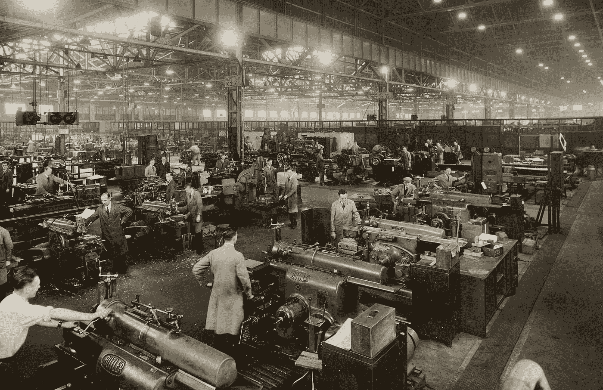
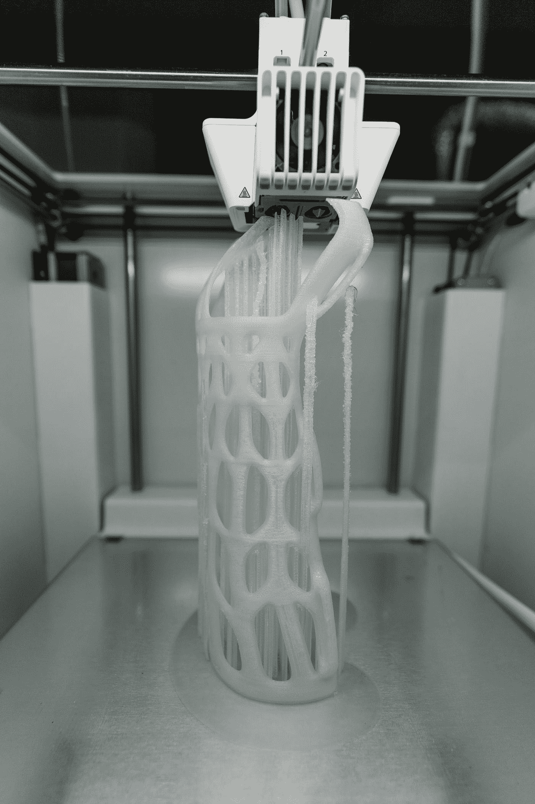

# 为什么你应该对技术的未来感到兴奋

> 原文：<https://medium.datadriveninvestor.com/reasons-why-you-should-be-excited-about-the-future-of-technology-82c8928623c?source=collection_archive---------16----------------------->

## 欢迎来到第四次工业革命！

Photo by [NASA](https://unsplash.com/@nasa?utm_source=medium&utm_medium=referral) on [Unsplash](https://unsplash.com?utm_source=medium&utm_medium=referral)

我将谈论未来 5-10 年将会发生的事情，这意味着大多数读者将会关注这些事情，所以你将会观看并体验它们。

首先，让我先问你这些问题，看看你对技术的掌握程度。

> 技术对人类是一种威胁吗？机器人会取代人类吗？
> 未来的语言是什么？
> 你听说过纳米技术吗？
> 你能从空气中提取什么？
> 未来的外科医生会是什么样子？
> 未来需要什么专业？

这篇文章是一个类似未来的旅程，所以希望我能让你受益。

# 无人驾驶汽车

Photo by [Marvin Meyer](https://unsplash.com/@marvelous?utm_source=medium&utm_medium=referral) on [Unsplash](https://unsplash.com?utm_source=medium&utm_medium=referral)

自动驾驶汽车是一种能够感知环境并在没有人类参与的情况下运行的车辆。我想让你们和我一起描绘未来的汽车会是什么样子；由于汽车是独自移动的，所以有传感器，以每秒 2100 张照片的速度设想它周围的 360 度，分析它以从树木了解周围的情况，并通过汽车超越，即使有人经过它也停下来。

每年有一百万人死于交通事故。所以，自动驾驶汽车的最大影响预计将消除 90%的交通事故，因为这种技术以传感器和摄像头而闻名，比人类更准确，错误更少。

第二个好处，和我一起想象一下，如果汽车可以自己驾驶，并且它们都连接在一起，这意味着这辆车连接到这辆车上，它知道这辆车来了，换句话说，我们不再需要红绿灯。汽车知道什么时候停下来，然后下一辆开过去，再下一辆过去。甚至被称为“**德国体制下的印度混乱”，**原来是混乱，但却是有组织的或安全的混乱。

这些是将改变汽车历史的一些基本变化，并将从明年开始在一些国家实施。

 [## Neuralink:未来还是终结？数据驱动的投资者

### 见见 Neuralink，埃隆·马斯克的新宝贝。一个微小的大脑植入物，可以将脑电波实时传送到你的手机上…

www.datadriveninvestor.com](https://www.datadriveninvestor.com/2020/09/01/neuralink-future-or-the-end/) 

# 取代人类

关于技术对工作的影响有两种观点。悲观的观点认为，技术正在取代人类，接管我们的工作。例如，任何基于遵循一些标准程序的工作将在未来消失，因为系统可以在几秒钟内完成这些工作。这个系统能够在几秒钟内完成，误差更小，而我们需要几个小时才能完成。

乐观的观点是，技术将会取代一些工作，但也会创造其他工作。有一个统计，很快，技术将取代全球 7500 万个工作岗位，但作为回报，它将创造 1.3 亿个工作岗位。

这确实以前发生过；让我们以汽车工厂为例。如果我们看到一个 20 世纪初的汽车工厂，我们会发现成千上万的员工在流水线上工作。

Photo by [Birmingham Museums Trust](https://unsplash.com/@birminghammuseumstrust?utm_source=medium&utm_medium=referral) on [Unsplash](https://unsplash.com?utm_source=medium&utm_medium=referral)

如图所示，每个人都有一份安装汽车部件的工作。今天，汽车工厂由机器人管理，在它们成为 20 世纪最大的雇佣部门后，机器人接管了手工劳动。现在，为了弥补取代体力劳动的工作，新的工作被创造出来。

> “未来 60%的工作并不存在于今天”——未知。

像设计这些仪器，制造它们，维护它们，所有这些工作以前都不存在。

# 从空气中提取水分

Photo by [Letizia Bordoni](https://unsplash.com/@letyi?utm_source=medium&utm_medium=referral) on [Unsplash](https://unsplash.com?utm_source=medium&utm_medium=referral)

空气是我们忽略的地球上水的主要来源之一。全世界有 20 亿人遭受缺水和水污染之苦。

空气中的水量是所有河流水量总和的 9 倍。这些水有时会被当作雨水倾倒，但现在一些技术会将任何地方的水转化为纯净的饮用水。它不用电，而是用太阳能。此外，这可能是解决世界各地水资源短缺的一个办法。

一些人提出了使用这项技术的问题，在肯尼亚的一所学校建立了几个供水站，使用空气电动发电机装置来产生饮用水。

希望对这个领域感兴趣的人可以帮助其他需要使用这项技术的人。

# **3d 打印**

Photo by [Tom Claes](https://unsplash.com/@tomspentys?utm_source=medium&utm_medium=referral) on [Unsplash](https://unsplash.com?utm_source=medium&utm_medium=referral)

让我们一起梦想，印刷技术，会走到什么程度。3d 打印是多年来改变我们生活的最重要的技术之一。有了 3d 打印，我们每个人都可以在 48 小时内打印出自己的房子和成本最低的**。它的尺寸没有限制。此外，它还有许多优点，不仅建造速度快，而且成本低，劳动力少，设计灵活。任何人能想象到的东西都可以设计出来，而且比常规施工容易多了。**

**想象一下，在你家开派对，你的杯子用完了。别担心，你可以在家里打印你的 3d 咖啡杯。**

**它的好处之一就是专业化。你可以打印任何东西，甚至打印你自己。30 或 40 年前，这个过程会非常昂贵和复杂。**

## **纳米技术**

> **“很快我们将开始吞噬我们的外科医生”——未知。**

**纳米技术是利用微小粒子来实现科学目标。它有许多应用，但涉及健康领域；它的最新发明之一是一个胶囊，它有一个相机，可以在 8 小时内拍摄 55，000 张照片。它能到达比内窥镜检查更好的地方。科学家们说，它将发展到由遥控控制。**

**纳米技术是未来重要的专业之一。它将是能够帮助年轻人毕业时容易找到工作的专业之一。员工团队需要此字段。因此，未来对它的需求将会增加。**

## **未来的语言**

****

**Photo by [Florian Olivo](https://unsplash.com/@florianolv?utm_source=medium&utm_medium=referral) on [Unsplash](https://unsplash.com?utm_source=medium&utm_medium=referral)**

> **技术正在拖垮公司，并创造新的公司。一些伟大的公司一眨眼就倒闭了，只是因为他们没有跟上时代的步伐。**

**编码就像英语一样是一种国际语言。如果你想预见未来并成为社区的一员——看到它的内容并自己开发它，你应该学习编码语言。**

**回到 1990 年，如果我们看看世界上最大的 10 家公司。只有一家公司与技术有关。其中大多数是银行和石油公司。2018 年，这 10 家顶级公司中有 7 家与技术相关。当今世界排名前 4 的公司都与编程有关。**

**除了技术，今天最热门的工作之一是开发人员。这意味着从现在开始，每个专门从事这个领域的人都将从大学直接进入一个有保障的职业。**

# **最后一个音符**

**事情几乎不可能一成不变，尤其是因为我们正在见证有史以来最快的技术进步。还有，最后一件重要的事情应该注意；技术不仅仅是为了奢侈和娱乐，它确实是解决全球问题的严肃方法。**

****进入专家视角—** [**订阅 DDI 英特尔**](https://datadriveninvestor.com/ddi-intel)**