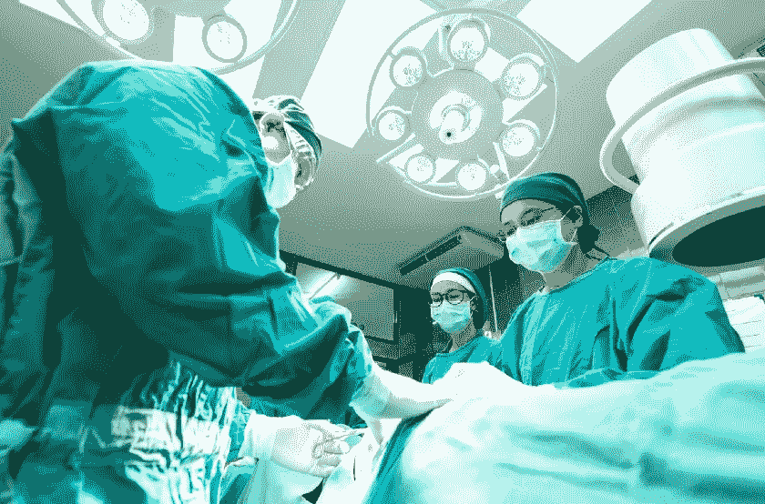

# 卫生部门的最新法规

> 原文：<https://medium.datadriveninvestor.com/recent-regulations-in-the-health-sector-beec9b6d993e?source=collection_archive---------14----------------------->

当前的卫生紧急情况迫使我们突然改变我们的观点，并增加我们的防御以保护个人。

正是因为这个原因，欧盟委员会发布了一系列指导方针，旨在规范基本医疗设备的生产，并为生产企业提供适当的补贴。

在大洋的另一边，HIPAA 法律，关于受保护的健康信息，试图给出“规则”，以避免分散，扩散和操纵，以及对卫生系统的盗窃和网络攻击。

*欧共体新冠肺炎紧急指导方针*

在这一紧急时期，确定了三个关键领域:3D 打印、个人防护系统、DPI(个人防护用品)和洗涤剂。上个月的建议 2020/403 也有助于放松对紧急医疗系统的合规要求和警戒检查。因此，根据世界卫生组织的建议，生产应根据欧盟的安全要求确保足够的防护水平，即使他们尚未完成 ce 认证程序。

因此，建议:

-将 DPI 推向市场；
-引入 3D 打印系统，称为增材制造(AM)，制造商必须确保 3D 打印机符合机械指令(2006/42/EC)的基本健康和安全要求，方法是在将 3D 打印机投放到欧盟内部市场之前，起草一份技术文件并贴上 CE 标志。
-按照欧洲疾病预防和控制中心的建议‘*,遵守水醇手洗餐具洗涤剂生产的基本要求，用肥皂和水洗手至少 20 秒，或在任何情况下使用醇基溶液、凝胶或抹布’*。此类产品可能属于化妆品法规或生物杀灭产品法规的范围(通常只有一种法规适用于特定产品)。由此可知:
——以清洁或清洁皮肤为主要目的时，产品一般归入化妆品规管；
-如果未声明主要用途，且产品含有活性物质，且在销售时标明具有生物杀灭活性或特定的交叉污染减少效果，则生物杀灭产品法规通常适用。

许多本地制造商已将生产线转向，以促进充分的疫情保护的传播，并在紧急状态下帮助市场，这并非巧合。

*HIPAA 漏洞扫描*

健康保险流通和责任法案(HIPAA)是 1966 年的一项法律，由美国前总统比尔·克林顿颁布，旨在建立有关医疗保健、支付和运营的受保护健康信息(PHI)流动的隐私和安全标准，即所谓的“*覆盖实体*必须遵循的标准。虽然这些实体可能在没有患者明确书面同意的情况下向特定方披露 PHI，以促进他们的治疗、支付或医疗保健操作，但通常任何其他披露都需要个人的书面同意，并结合适当的数据最小化。

PHI 或**受保护的健康信息**是个人数据，如姓名、出生日期、处理历史、财务信息。

在医疗保健行业工作并使用数字技术跟踪患者的每个组织都必须首先确保该服务符合 HIPAA，从而“*准确、全面地评估受覆盖实体或业务合作伙伴*保护的电子健康信息的保密性、完整性和可用性的潜在风险和漏洞”。事实上，**漏洞扫描**用于指示任何可能危及电子健康信息安全和防御的弱点，扫描旨在预测和提供足够的防御。也就是说，通过这些扫描，我们可以识别漏洞、缺失或遗漏的实现或不正确的系统配置。如果供应商发布了安全补丁，正确安装补丁可以阻止系统故障。

通过上述扫描，可以检测到两类缺陷:

-软件中的缺陷。这些缺陷可以在操作系统(如微软 7)或软件程序(微软 Office、谷歌 Chrome 或 Internet Explorer)中找到。

-硬件缺陷。漏洞扫描可以揭示硬件设备(网络防火墙、打印机或路由器)上的漏洞。

正如我们所注意到的，在卫生紧急情况的这一阶段，网络犯罪分子的主要目标之一恰恰是卫生部门，这是一项必不可少的服务，充满了关于我们每个人的重要敏感数据。HIPAA 定义了对 PHI 机密性的攻击，这是一种安全事件，在法规中是这样定义的:

-企图或未经授权的访问，其目的是使用、披露、修改或破坏信息系统中的数据；或者

-未经授权、企图或成功地对信息系统进行未经授权的访问、使用、披露、修改或干扰。

从本质上讲，HIPAA 安全事件是一种尝试(可能成功，也可能失败)做一些未经授权的事情。未经授权的“东西”是指未经授权的访问、使用、披露、修改、破坏或干扰。

HIPAA 本身列出了属于 ***【安全事件】*** 类别的现象类型，它们是:
——用于访问电子受保护健康信息(ePHI)的密码被盗。
-使用 ePHI 干扰信息系统运行的病毒、恶意软件或黑客攻击。
-未能关闭前雇员的账户，该账户随后被未经授权的用户用于访问 ePHI 的信息系统。
-在删除存储在介质上的 ePHI 之前，向未被授权访问 ePHI 的其他用户提供带有 ePHI 的介质，如 PC 或笔记本电脑硬盘。

理所当然地，资源、监管和信息技术都旨在保护和捍卫一个部门，即卫生部门，其重要性始终是根本性的，在疫情的这些时期已经充分发挥了作用。

版权所有
***Raffaella Aghemo，律师***