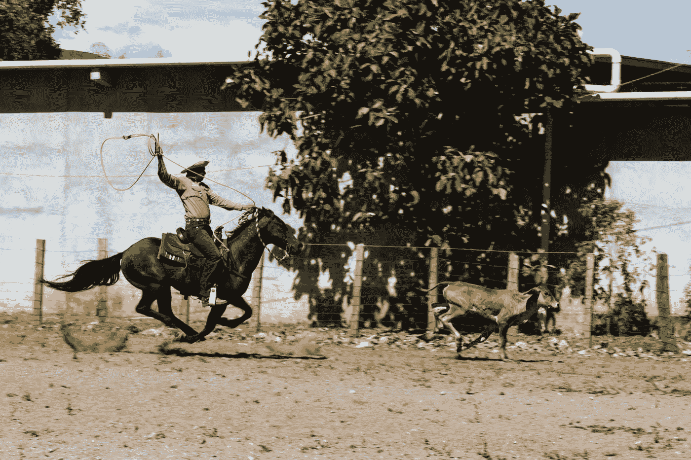

# 抗衰退 101:创造 12 个子收入流

> 原文：<https://medium.datadriveninvestor.com/recession-proof-101-create-12-sub-streams-of-income-229a814629bb?source=collection_archive---------6----------------------->

## 新财富

专注于为你工作的支流，而不是其他人。

Photo by [fran hogan](https://unsplash.com/@franagain?utm_source=medium&utm_medium=referral) on [Unsplash](https://unsplash.com?utm_source=medium&utm_medium=referral)

这不是什么秘密，大多数百万富翁都有多种收入来源。事实上，他们平均有 ***7 流*** 的收入。这些收入流以各种方式划分，如*房地产收入、股息收入、投资收入、业务收入、版税收入、广告收入和劳动所得。*

 [## 百万富翁的 7 种收入来源

### 今天我将给你一个关于百万富翁收入流的独家报道。在你的某个时候…

danlok.com](https://danlok.com/7-income-streams-of-millionaires/) 

尽管这些不同的收入流可能有所不同，但如果目标是增加财富和变得更加成功，那么这就需要*探索*和*利用*为你工作的 ***子流*** ，同时不要过于执着于尝试一下子创造或成熟所有 7 个收入流。

出于这个原因，我想与你们分享我是如何缩小了五个特定收入流的范围，并在这些领域中创建了 12 个子流，以此来最大限度地提高我家庭的收入。我的五个是:

***获得的收入***

***营业收入***

***股息收入***

***投资收益***

***版税收入***

现在，在我们进一步分析这些收入的子流之前，让我们做一些比较。

 [## 现金为王，比我们想象的更强大|数据驱动的投资者

### 2020 年 3 月 12 日，在川普总统宣布新冠肺炎进入国家紧急状态的前夕，纽约时报报道…

www.datadriveninvestor.com](https://www.datadriveninvestor.com/2020/03/26/cash-is-king-more-potent-than-we-think/) 

在 2010 年温哥华奥运会上，前奥运会曲棍球金牌教练迈克·巴贝科克在执教加拿大队赢得金牌后接受了一次著名的采访。在他的新书《采访》中，采访者表示，他是一个聪明的教练，在加时赛中将最好的球员(悉尼·克罗斯比)放在冰上，因为他最终打进了“黄金进球”，让加拿大队赢得了金牌。巴贝科克立即反驳了这一结论，并回答说:

> “我没有让‘希德’上场，因为他是最好的球员。我让他上场是因为他是当时对抗对方防线的最佳球员。”

Courtesy: [CBC.ca](http://www.cbc.ca)

如果你还不知道，教练的决定永远地改变了加拿大和奥林匹克的历史。

这里的相似之处是，你必须 ***审视你所拥有的*** 和 ***而不是寻找最佳的收入子流来构建，你如何在竞技场上与这 7 种收入形式相匹配*** 来做出最适合你的决定。 ***对你没意义，就是没意义。***

例如，我目前没有房地产，那么我会在疫情/衰退期间去买房子吗？在这个时候，市场和市场中存在的看似安全的工作都很脆弱。也许吧。但很可能不是。这对我来说毫无意义。这将使我的队员们超出他们的能力，并在第一阶段结束前耗尽我的板凳。

对我来说，更好的问题是— *我还能在我拥有的其他 5-6 个收入流中做些什么来最大化我的财务增长，例如投资我的企业、教育、当前投资和我的工作？*

对我来说，获得金球，并不是要把最好的球员放在冰上，而是要把我的线和我在这个特定时间在冰上看到的相匹配。这是一个 ***战略游戏计划***——而不是一个用金钱喷撒祈祷的方法。

对于我的战略游戏计划，下面是我创造的 12 个子收入流。

1.  **收入子流#1 —全职工作**

**2。挣得的子流# 2——兼职工作**

**3。业务子流#1 —客户 1**

**4。业务子流#2 —客户 2**

**5。版税子流#1 —第 1 册**

6。版税子流#2 —第 2 册

**7。版税子流#3 —** [**中**](https://medium.com/u/504c7870fdb6?source=post_page-----229a814629bb--------------------------------)

**8。版税子流#4 —关联收入**

**9。版税子流#5 — *(即将推出)***

**10。股息子流#1 —投资#1**

**11。股息子流#2 —投资#2**

**12。投资子流#1 —投资#3**

**13。投资子流#2 —投资#4**

虽然我还没有最大化所有 7 个收入流，但我能够很容易地 ***扩展我的子收入流*** ，因为我是用战略 从优势出发 ***。我最好的球员是根据我的战略比赛计划和我在板凳上看到的来搭配的。***

子流最好的一点是，它们很容易管理，而且不管我的家庭进入了生活的哪个阶段，它们都可以持续。

暗示经济衰退——没关系。

提示一个疫情——仍然没关系。

Photo by [NeONBRAND](https://unsplash.com/@neonbrand?utm_source=medium&utm_medium=referral) on [Unsplash](https://unsplash.com?utm_source=medium&utm_medium=referral)

一旦这些支流开始流动，它们产生的数量可能会发生巨大的变化，是的。然而，只要我随着时间的推移根据需要调整游戏策略并让他们参与到游戏中，玩家们就会一直努力工作。

我对你的鼓励是，花些时间清楚地写下你已经在探索的收入流，并思考在进入另一个收入流之前，你可以通过子流进一步开发这些收入流的方法。简单地说， ***关注支流*** 而不是试图撒一张大网看看会发生什么。设置你的花名册，让一些好的事情发生。去赢些金牌吧！

## **瑞恩**

**访问专家视图—** [**订阅 DDI 英特尔**](https://datadriveninvestor.com/ddi-intel)

 [## 如何在远程工作环境中茁壮成长

### 如何在远程工作环境中茁壮成长电子书:法赫、瑞安、费思、乔伊:亚马逊

www .亚马逊. ca](https://www.amazon.ca/dp/B091MSMR2D/ref=sr_1_1?dchild=1&keywords=how+to+thrive+in+remote+working+environment&qid=1617484066&sr=8-1)