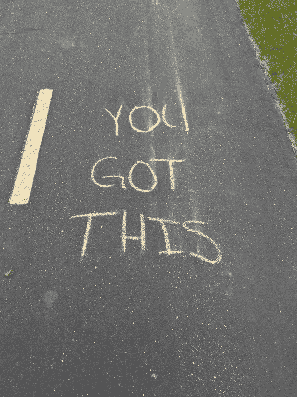
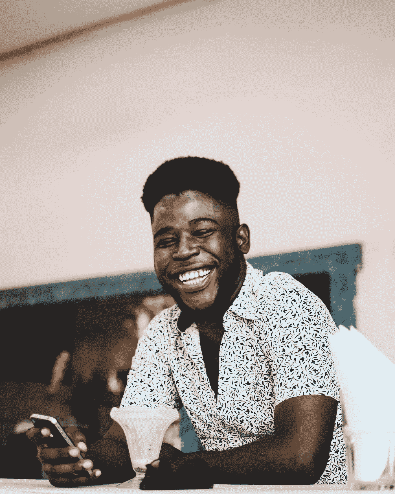

# 找回你的微笑

> 原文：<https://medium.datadriveninvestor.com/reclaim-your-smile-581299776ab6?source=collection_archive---------18----------------------->

快乐不仅仅属于其他人——它也应该属于你(二手灵感项目)

Photo by [Adrian S. Potter](http://www.adrianspotter.com/)

二手灵感项目从一句激励性的引语开始，在创造性道路蜿蜒的任何地方冒险。

> “我认为一个人一生中的大多数事情在一段时间内都是好的，即使那不会持续很久。也许这就是为什么，即使在事情出了问题之后，我们还会花那么多时间去修复它。因为我们记得它没坏的时候。”――克莱尔·勒格朗，[某种幸福](https://www.amazon.com/Some-Kind-Happiness-Claire-Legrand/dp/1442466022)

最近一直在做幸福的白日梦。大概从 2020 年开始——这个被疫情袭击的、社会距离遥远的日历年——几乎充满了一切，除了欢乐。

但是没有积极的氛围只会让我更加渴望它们。它让我专注于寻找并最终找到幸福的挑战。

像许多其他人一样，我的自然倾向是把事业和家务放在第一位，然后随着我像一部过度使用的智能手机一样崩溃而疲惫不堪。现代社会把我们都设计成了毫无意义的殉道者。即使没有人明确指示我们为他人牺牲自己的需求，我们也通过观察父母和导师学会了这种行为。

但是本能地帮助同事、亲戚和朋友而不满足你的愿望只会引发疲劳和怨恨。你最终会责怪你最关心的人让你筋疲力尽——即使是你选择推迟你的梦想。我自己也为此感到内疚。

 [## 当谈到个人发展|数据驱动的投资者时，不要再用这些借口了

### "百分之九十九的失败来自那些习惯找借口的人."―乔治·华盛顿·卡弗……

www.datadriveninvestor.com](https://www.datadriveninvestor.com/2019/11/25/stop-using-these-excuses-when-it-comes-to-personal-development/) 

想想你回忆童年时的怀旧情绪。充满玩耍和好奇的日子，还没有沉浸在永恒的折磨、空洞的承诺和成人生活的无尽责任中。发现和冒险就在你的门外，而安全和舒适总是在家等着你。

但是最终，一些事情打破了你的乐观主义。后来，一切都不一样了。

也许它来自于你第一次听到父母争吵，或者他们第一次不得不严厉地责骂你。也许是校园恶霸、严厉的老师或背弃友谊的同学的言语或行为。或者这可能是你第一次遇到性别歧视或偏见，永久玷污了人类尊严的概念。

不管是什么，有什么让你动摇了，偷走了你最初纯真的微笑。之后的每一个微笑都让人感觉很好，但是它们并不像在你的本质善良的理想主义观念被污染之前那样令人满意。

Photo by [Mwabonje](https://www.pexels.com/@mwabonje?utm_content=attributionCopyText&utm_medium=referral&utm_source=pexels) from [Pexels](https://www.pexels.com/photo/man-wearing-white-button-up-shirt-2033447/?utm_content=attributionCopyText&utm_medium=referral&utm_source=pexels)

你的任务是找回最初的微笑，重新点燃幸福是可能的想法，拼凑足够的信念，知道你——即使有所有的缺点和恐惧——值得拥有你小时候曾经拥有的幸福。

不容易，但是可以完成。

在《欢乐之书》中，达赖喇嘛和大主教德斯蒙德·图图提到，“……欢乐是我们的本质，每个人都能意识到。我们可以说，在某种程度上，我们对幸福的渴望是试图重新发现我们最初的精神状态。”

哇哦。乐观是你内在电路的一部分。你天生就以快乐为基础。也就是说你在这里拼命寻找一直藏在你心里的东西。

你是怎么找到它的？嗯，*你的*快乐内部寻宝游戏的方向是独特的，有密码保护，所以我不能给你提供作弊代码或路线图。

但是你总是可以从积极地重新构想生活的糟糕场景开始。然后你可以学会感恩，培养对你拥有的东西的欣赏，而不是纠结于你没有的东西。

最后，善待自己，朝着正确的方向前进。相信我——你忘记做这件事的次数比你记得的还要多。但是给自己一点爱是你变得真诚富有同情心和给予他人的唯一方法。如果你学会承认你的欲望和梦想，你就不会那么疲惫和痛苦。这会让你更容易给予和接受快乐。

我知道 2020 年让你感觉像被踢了屁股一样。但即使在这些棘手的时候，也不要害怕勇敢的改变，从日常琐事的残骸中抢救出你应得的快乐。这是让生活一帆风顺的最好方式，而不是像蛇一样不知所踪。

那么，你将如何开始重拾笑容呢？

阿德里安·s·波特是一名作家、工程师、顾问和演说家。他写诗歌、短篇小说和各种主题的文章，包括创造力和个人成长。他是诗集[和散文集](https://www.amazon.com/Everything-Wrong-Feels-Adrian-Potter/dp/109519061X/ref=sr_1_4?qid=1560264651&refinements=p_27%3AAdrian+S.+Potter&s=books&sr=1-4&text=Adrian+S.+Potter)[的作者。最近，阿德里安被提名为 2020 年 Lightscatter Press Prize](https://e2857002-6118-41be-9746-64261e36cacb.filesusr.com/ugd/21d2c2_03522f10c7c84340a05a8d03a97e1642.pdf) 的决赛选手。在[http://adrianspotter.com/](http://adrianspotter.com/)在线拜访他。

# 附加文字

[你真了不起](https://medium.com/datadriveninvestor/you-are-amazing-274651127432?source=friends_link&sk=34312c5fa72f2109d6031c2a4b7c2e4c)

[选择乐观(即使别人都不乐观)](https://medium.com/datadriveninvestor/choose-optimism-even-when-nobody-else-is-6e41c467c7b9?source=friends_link&sk=e5d927fb83b6298c8f82f2fe28840729)

[有点疼没关系](https://medium.com/datadriveninvestor/its-okay-if-it-hurts-a-little-5d653f272fa9?source=friends_link&sk=eca8de67d1a967df4f65adc9f8443f8c)

**访问专家视图—** [**订阅 DDI 英特尔**](https://datadriveninvestor.com/ddi-intel)