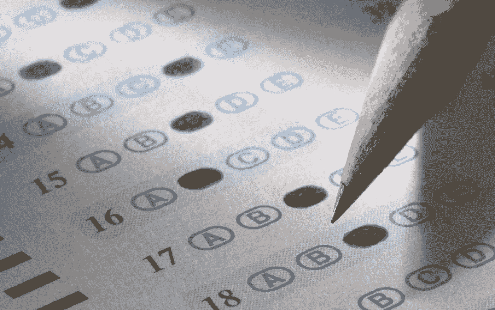

# 识别标记元素

> 原文：<https://medium.datadriveninvestor.com/recognizing-marked-elements-87df7460b64e?source=collection_archive---------6----------------------->

帕特里克·维多利亚

假设你已经使用文档扫描仪对一篇杂志文章或一份印刷合同进行了数字化处理，那么你可能会偶然发现一个表达方式**(OCR)。它是一种软件技术，用于将扫描的文档或图像转换为可编辑和可搜索的文本。但是您是否注意到文档中的一些元素(如复选框或单选按钮)中的数据根本没有被捕获？让我们找出原因。**

**基本 OCR 利用**模式识别**或**特征提取**来识别手边的文本。模式识别依靠字符模板来检测文档中出现了哪个字符。另一方面，特征提取依赖于特定字符的一般特征，例如直线、曲线和空白。如上所述，这两种方法只识别字符，这就是为什么复选框和单选按钮被错误地识别为随机字符或有时被忽略的原因。**

** [## 不管准备好了没有，革命就在我们面前|数据驱动的投资者

### “对于技术如何影响我们的生活和重塑经济，我们必须形成全面的全球共识……

www.datadriveninvestor.com](https://www.datadriveninvestor.com/2019/02/12/ready-or-not-the-revolution-is-upon-us/) 

检测这些复选框或单选按钮的一种方法是通过称为光学标记识别的电子方法。**光学标记识别(OMR)** 是用于从文档中读取标记数据的技术。传统的 OMR 应用程序使用一种特殊的扫描仪，将光线照射到纸张上，然后通过测量光线被阻挡的程度来识别纸张是否有标记。OMR 通常用于调查表格、测试问卷、彩票，甚至时间表。使用传统 OMR 的一个常见场景是，你在多项选择的试卷上画圈来表示你的答案，然后当试卷通过扫描仪时，自动评分。

Multiple Choice Examination Sample

光学标记识别**有两种**:基于**硬件的**和基于**软件的**。基于硬件的 OMR 需要专用的扫描机器和纸张来识别文本，而软件 OMR 可以使用随机扫描仪和纸张，因为该软件应该具有定位和分析输入字段的算法或功能。

但是，当软件中指定的模板与要扫描的文件的模板不同时，OMR 可能会遇到一些问题。此外，如果不调整软件配置，文档中的结构/布局更改可能会影响结果。

为了改进 OMR 技术，已经努力利用 [**卷积神经网络**](https://medium.com/datadriveninvestor/introducing-transfer-learning-as-your-next-engine-to-drive-future-innovations-5e81a15bb567) (CNN)，其帮助检测、识别和分类文档的标记和未标记区域。这些标记的元素在某些情况下绝对有用，不仅会带来更好的自动化，还会带来更好的工作质量。** 

****立即获得免费的机器人流程自动化(RPA)软件！** [下载这里](https://www.raxsuite.com/freedownload?utm_source=Medium%20Post&utm_medium=medium&utm_campaign=medium_footer)**

**参考资料:**

** [## 为什么是 OCR？

### 瓦尔迪兹公主

medium.com](https://medium.com/datadriveninvestor/why-ocr-93c898bb0cb4)  [## 什么是 OMR(光学标记识别)？-备注软件

### OMR 代表光学标记识别。这种流行的识别技术用于从…收集数据

remarksoftware.com](https://remarksoftware.com/omr-technology/what-is-omr-optical-mark-recognition/)  [## OCR -光学字符识别解释|学习中心

### 假设您想要数字化一篇杂志文章或一份印刷合同。你可以花几个小时重新打字，然后…

www.abbyy.com](https://www.abbyy.com/en-eu/finereader/what-is-ocr/)  [## 基于软件的光学标记识别中标记检测的新方法

### 软件光学标记识别(SOMR)是在调查表或问卷上输入信息的过程…

journals.plos.org](https://journals.plos.org/plosone/article?id=10.1371/journal.pone.0206420)**