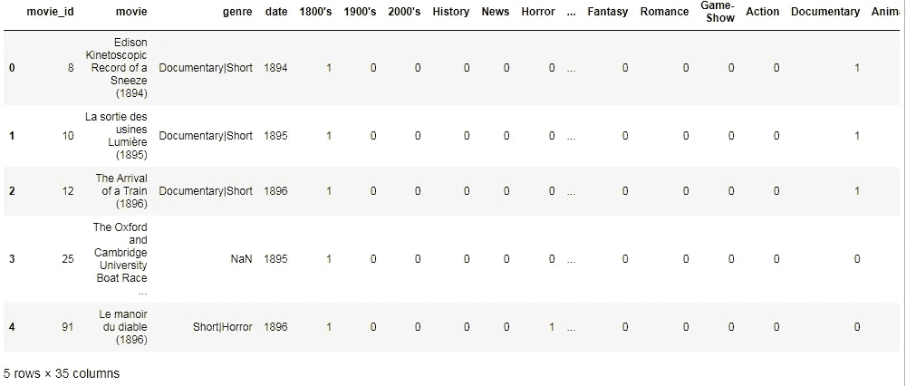
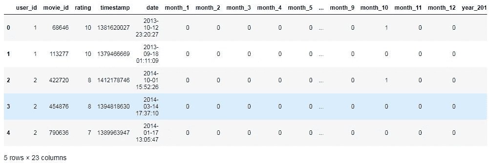
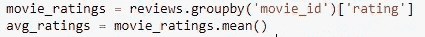
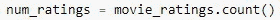
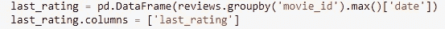
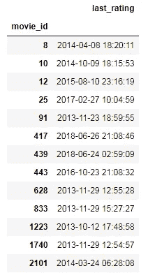
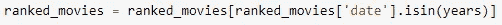
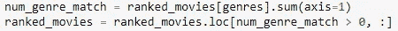

# 推荐引擎:A 到 Z(第 1 部分)

> 原文：<https://medium.datadriveninvestor.com/recommendation-engines-a-to-z-part-1-3ab585c11324?source=collection_archive---------5----------------------->

## 人工智能

这个博客系列将从头开始介绍推荐引擎。

(Source: Pinterest.com)

**一切从一个问题开始……**

*为什么我们需要推荐系统？*

从很多代以来，人类都偏向于购买伴侣推荐的东西。

让我们考虑一个非常基本的电影推荐的例子…

*你有没有想过，网飞、亚马逊 Prime、苹果电视是如何向我们推荐电影节目的？？*

事实上，他们在向客户推荐电影的背后有非常复杂的算法，因为他们很容易在自己的主屏幕上获得他们喜欢看的内容。

> 抓紧了！我们将在这个博客系列中讨论所有的系统。

> 旁白:你看过《网飞巫师》吗？我喜欢它…😍

我想现在你知道什么是推荐系统了吧？
但为了正式起见，你应该知道它的恰当定义。

## *推荐系统是一个广泛的 web 应用程序类别，涉及预测用户对选项的反应。*

主要有三种推荐系统，

1.  基于知识的遥感
2.  协同过滤 RS
3.  基于内容的 RS
    *(RS 指推荐系统)*

今天，我们来看看基于知识的推荐系统。

# 基于知识的推荐系统:

如果你在网上找房子或汽车，你可能会找到这样的例子。基于知识的推荐是使用关于项目或用户偏好的知识来进行推荐的推荐。

 [## 将定义 2020 年就业前景的五大数据科学和机器学习趋势|数据驱动…

### 数据科学和 ML 是 2019 年最受关注的趋势之一，毫无疑问，它们将继续发展…

www.datadriveninvestor.com](https://www.datadriveninvestor.com/2020/02/19/five-data-science-and-machine-learning-trends-that-will-define-job-prospects-in-2020/) 

购买奢侈品时，基于知识的推荐很常见。看看下图中 Zillow(美国房地产公司)提供的过滤器。这是一个构建基于知识的推荐的示例，因为用户可以将自己的偏好添加到所提供的项目中。

(Source: Zillow.com)

难道你不认为，这只会返回过滤后的结果。那它怎么可能是推荐系统呢？

嗯，它比你想象的要深得多。它不仅限于过滤你的结果，而是你的偏好将用于推荐你下次。

但是，如果你不提供任何你的偏好呢？然后，这个系统会给你提供受欢迎的推荐。我们将讨论电影数据的例子。

## 热门推荐:循序渐进

这里我们有四个决策循环来考虑最受欢迎电影列表中的电影…

1.  平均评分最高的电影被认为是最好的
2.  收视率最高的电影更好
3.  如果上述所有条件都满足，则排名由最新评级的电影确定。
4.  被考虑的电影应该至少有五个评级才能被考虑在流行电影中。

通过这四个条件，我们来推荐热门电影。

在进入方法论之前，我们应该知道我们的数据是什么样的。这里我们有两个文件，一个是电影文件，另一个包含评论数据。

> 另请阅读:[星巴克数据的图解报价优化](https://medium.com/@prashantjadiya/offer-optimization-using-machine-learning-46a1f5d1b59b)

First five rows of movies.csv

`Movies.csv`有电影的数据，包括 id、电影名称、类型、电影年份，我通过创建电影类型和年份的虚拟列对其进行了预处理。

First five rows of reviews.csv

在评论数据中，我们有用户的数据，这些用户用它的数据给电影打分。(这将用于检查我们的第四个条件—最近的评级)

现在我们将通过上面定义的条件来解决它。

**1。最高平均评分:** 获得最高平均评分的电影可以按如下方式进行。

这将生成一个名为`movies_ratings`的新数据帧，该数据帧由带有评级的`movie_id`分组。并且可以通过做`movie_ratings`数据帧的平均值来计算平均评级。

**2。收视率最高的电影:**

为了获得每部电影的收视率，我们可以对`movie_ratings`进行 count()操作。所以它会列出电影的收视率。
(这将用于过滤至少有五个分级的电影)

**3。最近分级的电影:**

这里，我们创建了一个新的数据框，它将包含电影 id 和分级日期。

可以通过查看`last_rating`数据帧输出来适当理解。

每部电影在分级时都有相应的日期。

**4。评级的最小数量应为五个。**

这可以在获得最终排名的电影的最后处理。

现在我们已经过滤了数据，所以现在我们可以把它放在一起。

这里，我们将`avg_rating`和`num_rating`合并到一个名为`rating_count_df`的新数据帧中。然后我们用`last_rating`数据框将其连接起来。并将该数据帧与电影相结合。

在这之后，我们仍然只对`movie_recs`中的值进行排序，所以首先，我们用`avg_rating`排序，然后用`num_ratings`排序，然后用`last_rating`排序。最后，我们通过过滤超过四个等级的`num_ratings`来满足第四个条件。

> 注意:很抱歉这一部分比较专业，但是需要理解整个过程。

现在我们可以通过使用我们的功能来推荐电影。

> 你可以在这里找到这篇博客的代码[。](https://github.com/prashantjadiya/Recommendation-engines/tree/master/most-popular-recommendation)

但是，如果我想在那里添加过滤器，一个流派和发行年份的过滤器。
这可以通过对我们的数据进行几项操作来实现。

1.  添加年度过滤器:

它将存储电影是在规定的年份。`years`是将在函数中传递的变量。参考这个[笔记本](https://github.com/prashantjadiya/Recommendation-engines/tree/master/most-popular-recommendation)。

2.添加流派过滤器:

匹配类型的电影将会在`num_genre_match`中，如果匹配，那么它将会被存储在`ranked_movies`中。

添加这个片段将使我们能够推荐受欢迎的电影，并根据年份和流派进行筛选。

Wohooo 我们做了一个推荐热门电影的推荐系统。

在下一篇博客中，我们将看到协同过滤技术对相同数据的处理。看博客[这里](https://medium.com/@prashantjadiya/recommendation-engines-a-to-z-part-2-a099ca021121)。

> 感谢您抽出宝贵的时间来阅读这篇博客，希望您能阅读本系列即将推出的博客。敬请期待！如果你喜欢这种解释方式，喜欢我的文章，请鼓掌，这对我意义重大。

你可以在 [GitHub](https://github.com/prashantjadiya/Recommendation-engines/tree/master/most-popular-recommendation) 上查阅这篇博客附带的代码。请务必在 LinkedIn 上与我联系。