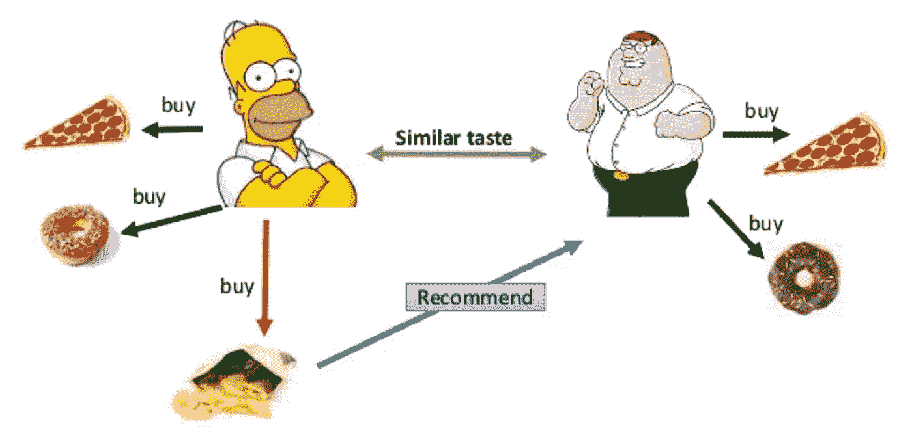
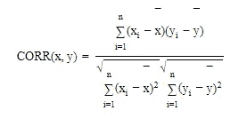
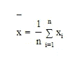
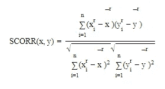
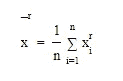
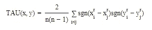
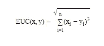

# 推荐引擎:A 到 Z(第 2 部分)

> 原文：<https://medium.datadriveninvestor.com/recommendation-engines-a-to-z-part-2-a099ca021121?source=collection_archive---------9----------------------->

## 内部人工智能

这是推荐引擎博客系列的第 2 部分。这个博客系列将从头开始介绍推荐引擎。

你没看过第一部分吗？不后悔，从[这里得到。](https://medium.com/datadriveninvestor/recommendation-engines-a-to-z-part-1-3ab585c11324)

至此，我们已经介绍了推荐系统的类型，之后是基于知识的推荐系统和基于排名的推荐系统。

在这篇博客中，我们将讨论协同过滤技术，我将解释它是如何向用户推荐商品的。

# 协作过滤:

**协同过滤**是一种仅基于用户和项目之间的交互进行推荐的方法。这张图片会帮助你…

**明白了吗？**如果买披萨、甜甜圈、薯条；而另一个买披萨和甜甜圈的人，那么他也会被推荐买薯条。因为系统会发现你们俩口味相似。

通常协同过滤有两种:
**基于 Item-Item** 的协同过滤: ***喜欢过 X item 的用户也喜欢 y .*****基于 User-Item** 的协同过滤:***和你相似的用户也喜欢 XYZ。***

## q)上图是哪一个？如果你的答案是逐项的，那么你是对的！

> 思考如何实现？

抓紧了！现在就开始讨论…

实现协同过滤有两种方法:1)基于邻居的方法 2)基于模型的方法(在下一篇博客中)

# 1.基于邻域的协同过滤

在这种方法中，用户-用户和项目-项目之间的距离可以以多种方式找到，并且它将给予我们它们之间的相似性的值。

计算相似度有五种方法:
1)皮尔逊相关系数
2)斯皮尔曼相关系数
3)肯德尔τ
4)欧氏距离
5)曼哈顿距离
6)余弦距离

哦！这么无聊？别担心，我们不会深入讨论的。(只是见解😉)

1.皮尔逊相关系数:与线性的强弱和方向有关。

在哪里，

2.斯皮尔曼相关系数:它是一个[非参数](https://en.wikipedia.org/wiki/Nonparametric_statistics)统计量。这里 r0 表示排名值。

在哪里，

3.肯德尔τ:类似于斯皮尔曼的相关系数，因为它是关系中的非参数测量。

其中 sgn 采用与排序值的差异相关联的符号。

4.欧几里得距离:两个向量之间的直线距离。

5.曼哈顿距离:沿垂直轴测量的两点之间的距离。

6.余弦距离:使用欧几里得点积公式。

所以，这些是发现用户-用户和物品-物品之间相似性的方法。

现在我们已经找到了相似之处，让我们开始实现；

> 我在这里不包括太多的编码部分，因为许多人看到它会感到厌烦！😃你可以在这里访问本博客附带的笔记本[。](https://github.com/prashantjadiya/Recommendation-engines/tree/master/Collaborative%20filtering)

在通过相关得到相似性之后，我们不能得到满意的结果，因为我们有稀疏的数据(许多值是 NaN)。所以我试着用欧几里德距离来得到相似性。你可以参考这里的[。](https://github.com/prashantjadiya/Recommendation-engines/tree/master/Collaborative%20filtering)

首先，我们不想推荐用户自己已经购买的商品。

之后，我们找到最近的邻居，并检索他们喜欢的项目列表。该列表将用于推荐相似的用户。

你可以在我的 [Github 库](https://github.com/prashantjadiya/Recommendation-engines/tree/master/Collaborative%20filtering)中的基于电影的推荐示例中看到整个方法。

> 因为我的许多同行建议不要在博客中包含更多的技术细节，比如代码，所以我没有这样做。如果您对此有任何建议，请在下面回复。

谢谢你阅读这篇博客。如果你喜欢我的博客，请在你的左边鼓掌，这将意味着很多。在 [LinkedIn](http://www.linkedin.com/in/prashant-jadiya) 上连线吧。

在下一篇博文中，我们将讨论基于模型的协同过滤方法。敬请期待！