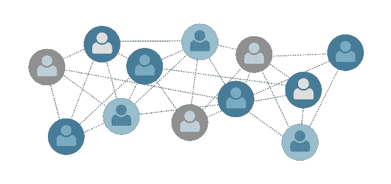
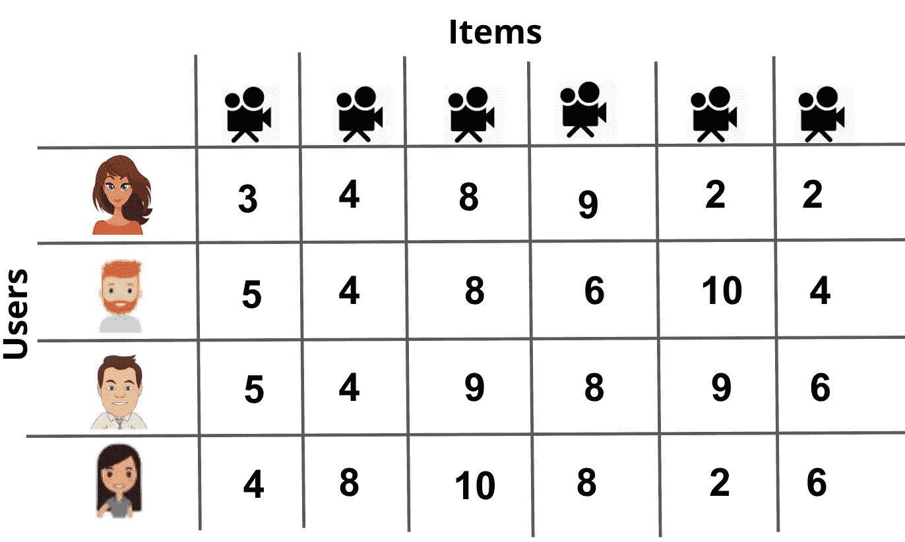
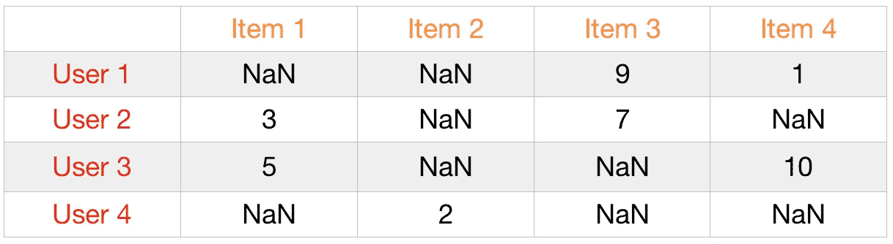
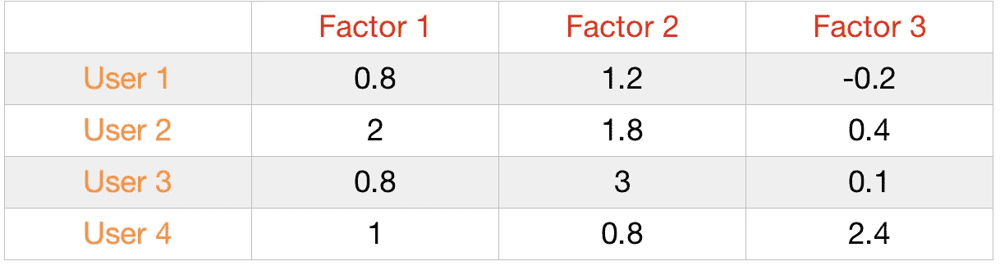
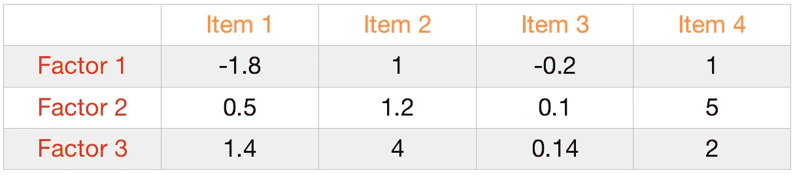
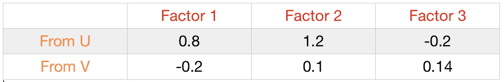
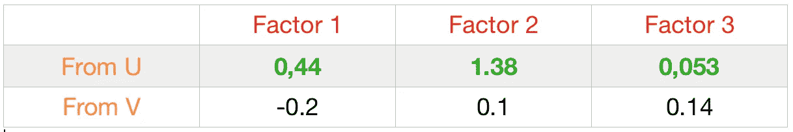
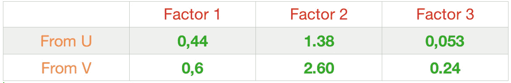
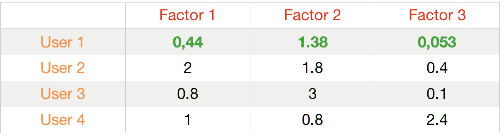
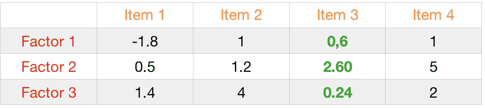

# 推荐引擎:A 到 Z(第 3 部分)

> 原文：<https://medium.datadriveninvestor.com/recommendation-engines-a-to-z-part-3-b3991f98fb15?source=collection_archive---------7----------------------->

## 内部人工智能

在推荐系统系列的这一部分中，我们将讨论基于模型的协同过滤推荐方法。

在基于邻居的方法中，我们已经使用了一些技术来测量用户的相似性。但是现在我们将在这里谈一些关于矩阵分解的见解。

本博客系列的前一部分:

 [## 推荐引擎:A 到 Z(第 2 部分)

### 这是推荐引擎博客系列的第 2 部分。这个博客系列将涵盖来自…的推荐引擎

medium.com](https://medium.com/datadriveninvestor/recommendation-engines-a-to-z-part-2-a099ca021121) 

# 基于模型的方法(矩阵分解)

基于模型的方法假设一个潜在的“生成”模型，该模型解释用户-项目交互并试图发现它以便做出新的预测。在学习矩阵分解时，我们需要了解一些术语。

> 什么是用户-项目交互？

说明:这里有一个电影推荐的例子。用户给电影打分。

我想现在你已经明白是什么了。现在让我们找出潜在的因素。

> 什么是潜在因素？

在我们的数据中无法直接观察到的值，但在观察观察到的数据值之间存在的关系和趋势时可能会识别出来。例如，对于用户电影矩阵，潜在因素可以是电影的类型、对整个电影的情感等。

虽然我们的数据集中没有直接给出它，但是我们可以通过单值分解(SVD)来生成它。

> 什么是 SVD？

基于线性代数，任何实矩阵 R(用户-电影)都可以分解为 3 个矩阵 U、σ和 V。继续使用电影示例，U 是 n × r 用户-潜在特征矩阵，V 是 m × r 电影-潜在特征矩阵。σ是一个 r × r 对角矩阵，包含原始矩阵的奇异值，简单表示某个特定特征对预测用户偏好有多重要。

在现实生活中，奇异值分解在数据上并不奏效。为什么？

因为 SVD 可以在非稀疏数据上获得非常好的结果，我指的是没有丢失值的数据。但是我们中有多少人在每部电影或购买结束时给出分数呢？嗯，不多。

事实上，推荐引擎的真实数据集可能非常稀疏，您可以找到超过 95% NaN 值的用户项目矩阵。这就是 Funk SVD 的用武之地。

> 什么是 Funk SVD？

Funk SVD 将忽略这些缺失值，并找到一种仅使用已知值计算潜在因子的方法。要使用 Funk SVD 实现这种矩阵分解方法，需要遵循以下步骤:

1 建立两个矩阵 u 和 V^T，分别是根据选择的潜在因素的数量的用户矩阵和根据项目的这些相同潜在因素的矩阵，并用随机数填充这些矩阵。

在这一步，我们有两个矩阵:

用户-项目矩阵:

U 矩阵(用户用随机值填充潜在因子):

V^T 矩阵(用随机值填充的项目的潜在因素):

2 在用户-商品矩阵中搜索一个用户-商品对的现有价格。找到的第一个评级是由用户 1 对项目 3 给出的 **9** 。所以 **9 是我们的实际值**，真实值。

在 U 矩阵中，我们取与用户 1(行)相关的所有随机值。我们为这个用户准备了[0.8，1.2，-0.2]

请记住，9 是用户 1 给项目 3 的。在 V^T 矩阵中，我们也取与第 3 项相关的所有随机值。这个项目我们有[-0.2，0.1，0.14]^T

4 我们计算找到的行和列之间的点积，以便进行预测。(0.8 x-0.2)+(1.2 x 0.1)+(-0.2 x 0.14)=-0.07

这时我们有**实际=9** 和**预测=-0.07。**

所以**误差**为(9+0.07) = **82.26**

5 使用梯度下降最小化误差。
公式: **U(i)或 V(i) + ⍺ 2(实际-预测)x V(i)或 U(i)** 其中 U(i)是来自 u 矩阵的随机值，V(i)是 V^T 矩阵中关联的随机值，⍺是学习率。

让我们回顾一下，这是 U 和 V 的值，并进行预测:

使用梯度下降和⍺=0.1:更新 0.8

新值= 0.8+0.1 x 2(9+0.07)x-0.2 =**0.44**

通过更新 U 的所有值，我们得到 **0.44，1.38，0.053。**所以现在我们有了:

然后，我们可以更新 v 中的值。注意，U 中新更新的值已经影响了我们将从 v 中计算的值。

最后，用同样的公式我们得到:

6 替换 u 和 V^T 矩阵中的更新值，
并对剩余行进行相同的迭代。

> 附加内容:Funk SVD 的历史——2006 年因制作最佳协同过滤算法而获得 Netflix 奖竞赛的西蒙·芬克(Simon Funk)。[来源:[https://sifter.org/~simon/journal/20061211.html](https://sifter.org/~simon/journal/20061211.html)

通过这种矩阵分解的方法，我们可以基于每个用户-项目对来推荐项目。

> 但是如果用户/电影是新的呢？我们能预测这两个也一样吗？

没有；这就是所谓的**冷启动问题**。

**冷启动问题**是一个平台的新用户和新物品没有任何评分的问题。因为这些用户和物品没有任何评分，所以无法使用协同过滤的方法进行推荐。

因此，像基于排名和基于内容的推荐这样的方法是开始为这些个人进行推荐的唯一方法。

您可以访问本博客附带的代码。

 [## prashantjadiya/推荐-发动机

github.com](https://github.com/prashantjadiya/Recommendation-engines/tree/master/Collaborative%20filtering) 

> 感谢您阅读本博客！如果您有任何建议/疑问，请在回复部分发表评论。