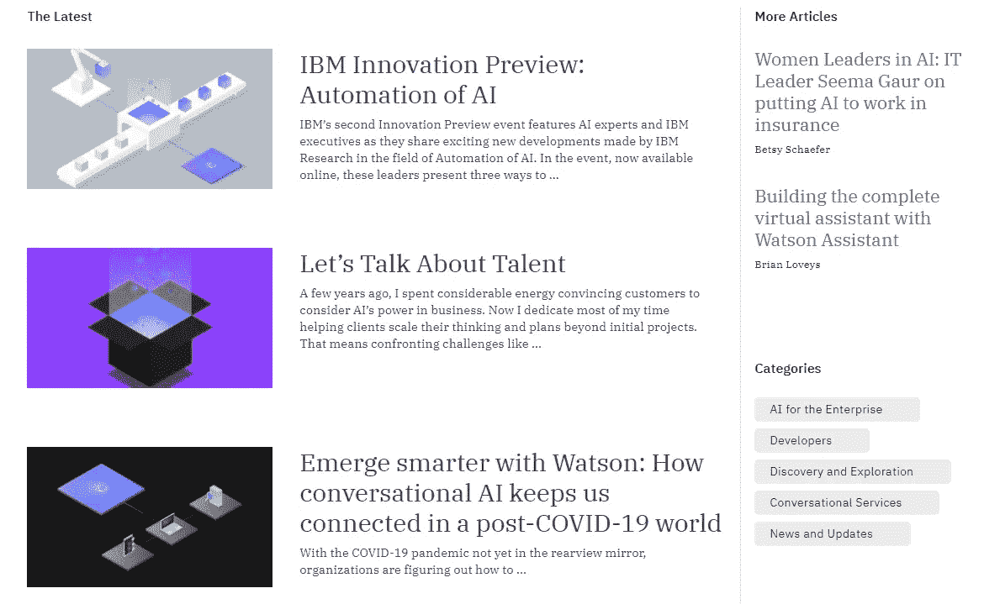
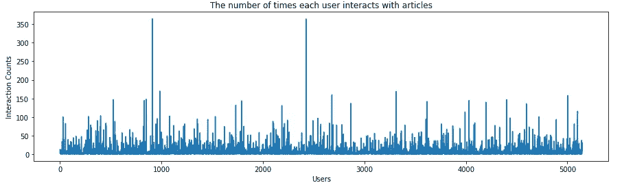
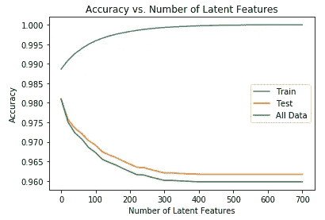

# 推荐引擎:A 到 Z(第 4 部分)

> 原文：<https://medium.datadriveninvestor.com/recommendation-engines-a-to-z-part-4-97d336beea25?source=collection_archive---------7----------------------->

## 人工智能

在这个系列的最后一篇博客中，我们将讨论一个为 IBM Watson dashboard 文章的部分推荐文章的场景。我们已经讨论了主要的推荐技术，比如基于等级的、基于用户的、协作的和基于内容的过滤，所以现在我们正朝着一个 IBM Watson 仪表板的所有技术混合的正确说明前进。

Source: cloud.ibm.com

首先，我们来讨论一下数据集。数据集有两个文件:
1)user _ item _ interactions . CSV—包含 article_id、标题和查看过它的用户的电子邮件。
2) articles_community.csv —包含文章详细信息，如描述、全名、正文、状态(活动或已删除)

作为整个数据科学周期的一部分，第一步总是 EDA(探索性数据分析)所以对于这一点，我们应该找到以下问题的答案:
—唯一用户和唯一文章的数量。
—数据集中用户-项目交互(阅读/查看)的数量。
—每个用户与文章互动的次数。
—数据集中是否有重复的用户或文章？
—哪个用户查看了最多的文章？
—哪篇文章被看得最多？

跳过编码过程，因为对某些人来说会很无聊，所以这部分可以在 GitHub 仓库中看到。

 [## prashantjadiya/推荐-发动机

### 这个知识库涵盖了推荐系统的方法——prashantjadiya/推荐引擎

github.com](https://github.com/prashantjadiya/Recommendation-engines/tree/master/Recommendations%20with%20IBM) 

这里简单介绍一下答案，
—唯一文章:714，唯一用户:5148
—用户-物品(文章)互动:45993
—每个用户与文章互动的次数

—重复记录:5 条
—用户 id:364 已查看最多的文章
—文章 id:1429 是查看最多的文章

现在，我们将在接下来的步骤中使用这一分析，就像在数据建模和构建推荐引擎中一样。

## 基于排名的推荐

最基本和广泛使用的推荐方法是基于排名的。大多数被观看的文章将被首先推荐。

在这里，该过程将遵循获取大多数视图文章 id，然后基于 id 和用户/系统查询的文章总数(N-top 文章)的名称。

## 推荐的协同过滤方法

在这种方法中，将测量用户的选择。像相似性一样，用户 x、y 和 z 是朋友，他们更喜欢看同一类型的电影…所以这种推荐系统将会非常有用。这被称为基于用户的协同过滤。

为此，我们可以创建一个新的数据框(矩阵),其中行是用户 id，列是商品 id。假设第 5 行的用户已经查看了放置在第 3 列的文章。那么交互作用点(5，3)的值将为 1，否则为 0。

 [## 人工智能和“智力资源”的新领域|数据驱动的投资者

### “智力来源”是最近由赫尔辛基大学的研究人员开发的一项技术，它使用…

www.datadriveninvestor.com](https://www.datadriveninvestor.com/2020/06/19/artificial-intelligence-and-the-new-frontiers-of-brainsourcing/) 

然后，用户将按相似性降序排列。与 x 用户最相似的用户将位于顶部，以此类推。用户 X 在这里是一个查询用户。因此，系统将比较查询用户与所有其他用户的相似性，然后显示与其最相似的用户的文章。

看起来你通过简单的文字理解了整个场景，你也可以在 [GitHub 库](https://github.com/prashantjadiya/Recommendation-engines/tree/master/Recommendations%20with%20IBM)中探索更多的东西。

但是这里出现了一个问题，如果有新用户或者没有看过任何文章的用户怎么办？
这个问题叫做**冷启动问题**。相反，我们可以使用基于排名的技术为新用户推荐。这意味着我们将向新用户推荐最受欢迎的文章。

## 矩阵分解

我们可以使用用户-项目矩阵(我们在上面创建的)来对它执行 SVD(奇异值分解)。不熟悉矩阵分解、奇异值分解和 FunkSVD？在这里得到它。

 [## 推荐引擎:A 到 Z(第 3 部分)

### 在推荐系统系列的这一部分中，我们将讨论一种基于模型的推荐方法

medium.comH](https://medium.com/datadriveninvestor/recommendation-engines-a-to-z-part-3-b3991f98fb15) 

这里棘手的部分是选择潜在特征，包含的潜在特征越多，准确度越高。但是，我们仍然不能确定潜在特征的数量，因此我们可以对训练数据和测试数据进行测试，以了解潜在特征对准确性的影响。

可以看看 GitHub 库，深入了解测试过程。

此外，基于内容的推荐没有在这里说明，因为它是我正在进行的任务。因为有时基于内容的推荐是一项冗长的任务。

在这里，我们举例说明了一种测试推荐系统的离线方法，但是相反，您可以进行一种在线方法，在该方法中，我们运行一个实验来确定实施一个或多个推荐系统对我们的用户群的影响。

## 结论

对于这种情况，一个简单的实验可能是将一半的用户随机分配到一个没有收到任何推荐的控制组(就像目前的情况)。第二组使用上述方法的混合随机接收推荐。然后，我们测量每组用户的平均交互次数。我们进行了一个假设检验，其中空值是交互次数没有差异，而另一个选项是有差异(或者推荐系统增加了用户与文章的交互次数)。

> 您可以访问本博客附带的[代码](https://github.com/prashantjadiya/Recommendation-engines/tree/master/Recommendations%20with%20IBM)。

> 感谢您阅读本博客！如果您有任何建议/疑问，请在回复部分发表评论。

**进入专家视角—** [**订阅 DDI 英特尔**](https://datadriveninvestor.com/ddi-intel)