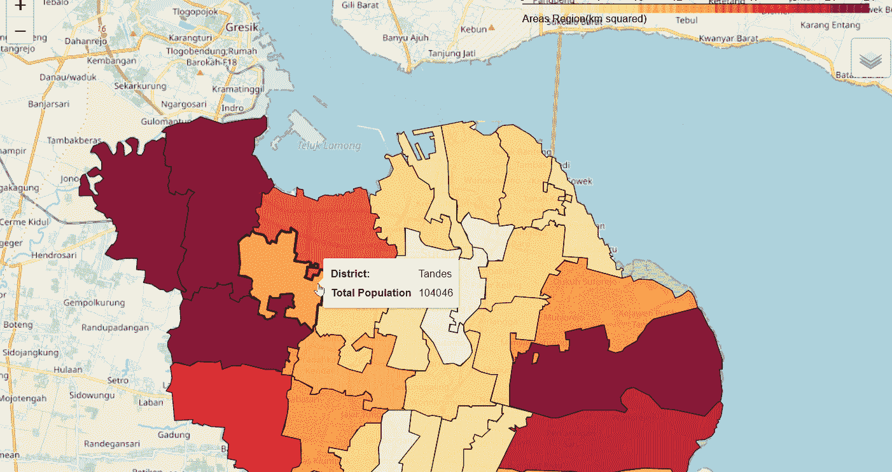
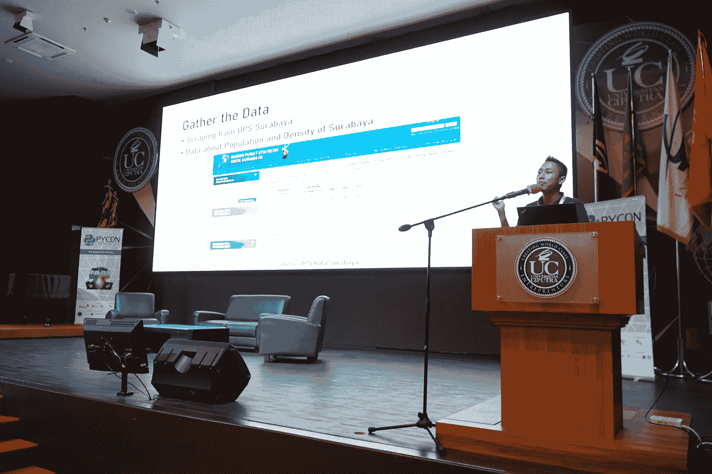

# 使用 leav 和 Streamlit 第 1 部分重新创建我的项目

> 原文：<https://medium.datadriveninvestor.com/recreating-my-project-using-folium-and-streamlit-part-1-6becec53310a?source=collection_archive---------6----------------------->

Map of Surabaya

你是否仍对自己能创造出什么样的数据科学或分析感到困惑？我希望这些内容可以帮助你创建一个项目，或者更好，因为你知道你的优势和劣势是什么，对吗？

在这篇文章中，我想重现我去年开始的项目。故事是这样的。

Lightning Talk at Python Conference Indonesia 2019

这篇文章是从我在家乡泗水参加 2019 年印度尼西亚 Python 大会开始的。我被选中在闪电谈话环节谈论我的项目，所以我只有 5 分钟的时间来谈论它。好的，就 5 分钟。我展示了什么项目？关于如何可视化的密度，我的城市，泗水，使用叶。关于这个项目的文章和 Python 大会 ID 2019 闪电谈的视频，可以在这个 [**链接**](https://github.com/rizkysifaul/PyCon2019) 和 [**链接**](https://www.youtube.com/watch?v=2luAZuLi5IA&t=468s) 上参考。

 [## 一瞬间学会数据科学！？数据驱动的投资者

### 在我之前的职业生涯中，我是一名训练有素的古典钢琴家。还记得那些声称你可以…

www.datadriveninvestor.com](https://www.datadriveninvestor.com/2020/07/23/learn-data-science-in-a-flash/) 

所以基本上，我的项目是在谈论如何显示泗水每个地区的人口密度，因为我的目标是给出一个信息，说明哪个地区的人口密度不适合居住，或者从人口密度的角度来看，提供一个关于建设市场、购物中心等场所的见解。

差不多一年了，我认为我可以做得更好来重建这个项目，因为在我现在的项目中，我只能用 Jupyter 笔记本来访问它。对于不了解代码或类似东西的人来说，他们很难知道这是什么。我的解决方案是重新创建项目，以便所有人都可以访问它，并喜欢这篇文章。使用 **Streamlit** 创建一个应用。

我把这个项目分成几个部分，因为我想保持它细节，而不是让你们所有人感到无聊，这一部分我只是关注你应该为这个重建的项目准备些什么。那么，我们开始吧，好吗？

## 数据

当然，没有数据你不能展示你的项目。所以拥有这个真的很重要。我们应该有什么样的数据？因为我们想可视化我们的地图，所以我们需要一个关于我们想要的国家或城市的数据，以及一个用于 choropleth 地图的 geojson 文件，该文件是必不可少的。基本上，您可以使用另一个城市或国家的数据，而自己有一个 geojson。

因为这是一个重建项目，所以我将使用我的泗水数据，以及基于区域的泗水地理信息。对于文件你可以参考这个 [**链接**](https://github.com/rizkysifaul/PyCon2019) 。

Polygon shape from multiple coordinate.

你为什么需要那个？我希望这张照片解释了这一点。当涉及到 choropleth 地图时，你需要一个区域的面积，基于此你需要一个文件来覆盖这种地方，所以你需要一个*多边形数据*，Geojson 支持它，这样它可以显示你在涉及到地图数据时主要看到的内容。

## 计算机编程语言

这个项目是基于 Python 语言构建的，所以如果你觉得这很难，它没有你想象的那么难，至少你知道一些基本的 Python 命令，如容器、变量等等，要了解这个项目，尤其是 Streamlit 和 Folium 包非常重要，因为 Folium 是我用来创建地图的包，Streamlit 是用来使用 Python 创建我们的应用程序的。我用 Streamlit 创建了一个简单的机器学习应用程序，你可以参考这个链接。

## Jupyter 笔记本

因为我的项目现在正在使用 Jupyter，也许我应该在那里改进我的代码，做一些调整，特别是为了展示给那些根本不懂代码的人。同样，这是一个重新创建的项目，所以我的基本项目是从这些数据和代码。

## 可视化工作室

这个软件很重要，通常我总是使用 Jupyter 笔记本，这次略有不同，因为我们想创建一个应用程序，使用 Visual Studio 或另一个类似的软件比 Jupyter 好得多，因为当我们保存代码时，我们可以实时检查应用程序，缺少什么或一切正常。

因为这是一个开始，我认为这两个来源就足够了。完成后，你可以把它发布到 Heroku，这样其他人就会知道你的应用程序在谈论什么。如果所有这些都准备好了，就为重新创建项目的下一部分做好准备，比以前好得多。关注我的**中**和 **Linkedin** [*这里*](https://www.linkedin.com/in/muhammad-sifa-ul-rizky-63525795/) 看到很有帮助就分享一下吧。欢迎在 **Linkedin** 或我的邮箱 [***这里***](http://msifaulkiki@gmail.com) 问我，另一篇文章再见。继续学习，再见！

**访问专家视图—** [**订阅 DDI 英特尔**](https://datadriveninvestor.com/ddi-intel)