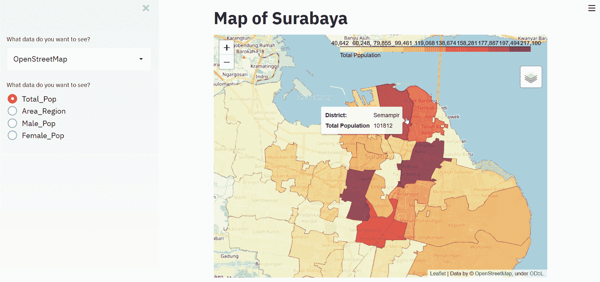

# 使用 leav 和 Streamlit 重新创建我的项目第 2 部分

> 原文：<https://medium.datadriveninvestor.com/recreating-my-project-using-folium-and-streamlit-part-2-8e7668e8924d?source=collection_archive---------0----------------------->


Map of Surabaya

嗨，欢迎回来的读者，现在让我们继续我们的旅程，重新创建我的项目，这是可视化与地图使用*叶*，和*流线*的应用程序。如果你不知道这是怎么回事，不要担心，你可以在这里阅读第一部分[](https://medium.com/datadriveninvestor/recreating-my-project-using-folium-and-streamlit-part-1-6becec53310a)**。**

**在第一部分，我把重点放在我们应该为这个项目需要什么，因为这是很重要的事情，我们应该有什么文件。一切准备就绪后，让我们重新开始。**

## **文件**

****

**对于这个项目，我们只使用两个数据，一个是**Surabaya _ Full _ of _ data . CSV**，这是我从 BPS Surabaya 获得的数据，其中包括每个地区的人口数量、区域，当然还有地区名称。另一个数据是您的 *json* 文件，其中包含您所在位置的多边形数据。这很重要，因为我们想要创建一个和标题上的图片一样的 *choropleth* 。你只需要有这些数据，如果你想创建基于你的城市或位置，要求是一样的，一个是关于你的位置的数据，而 *json* 文件为 *choropleth* ，包含多边形数据。**

## **包装要求**

**对于这个项目，我敦促你安装这些软件包，因为这是创建地图和应用程序所需要的，如 *Streamlit，follow*等等。你可以查看 **requirements.txt** 来了解使用什么包和安装**

```
pip install -r requirements.txt
```

## **设计你的应用**

****

**Design for Streamlit**

**因为我们想创建一个应用程序，我建议设计你需要在你的应用程序上显示什么。如上所述，我们只有一个重要的部分，如地图，和改变地图信息的边栏，如我们需要显示什么数据，你想看什么类型的地图。**

## **导入包**

**在所有这些部分完成后，现在让我们做一些代码。首先，让我们做一些数据科学家的仪式。导入包，比如 *Numpy，熊猫，叶子，Streamlit* 等等。使用这种包装的原因你可以在图片上看到。**

```
#import package that needed for this project#------------------------------------------------import pandas as pd # library for data analysis
import numpy as np
import json # library to handle JSON files
from geopy.geocoders import Nominatim 
# convert an address into latitude and longitude values
import requests # library to handle requests
import folium # map rendering library
import streamlit as st #creating an app
from streamlit_folium import folium_static 
#using folium on streamlit#------------------------------------------------
```

**对于 Streamlit，我正在使用来自**Streamlit-leaf**的包，它可以在那里可视化地图。感谢[兰迪·兹威奇](https://medium.com/u/28019e690096?source=post_page-----8e7668e8924d--------------------------------)创造了这个应用，更多信息，你可以参考这个 [**链接**](https://github.com/randyzwitch/streamlit-folium) 。为了更深入地了解 read，我建议在这里 阅读这个文档 [**。**](https://python-visualization.github.io/folium/quickstart.html#Getting-Started)**

## **输入数据**

**下一步是导入上面的数据，我们有两个数据，让我们使用 *read_csv* 导入 csv 文件，使用 *json.load* 导入 json 文件。**

```
data_all = pd.read_csv('Surabaya_Full_of_Data.csv')
data_geo = json.load(open('Kecamatan_Surabaya.geojson'))
```

## **清理数据**

**导入我们的数据后，现在是爱恨交加的部分，有些人喜欢做这个部分，但其他人不喜欢，因为有时清洗是痛苦的。清理是必要的，因为你需要确保一切都是相互关联的。例如，我在 **data_all** 和 **data_geo** 上有一个地区数据，如果地区名称不相同，这些数据就不会出现在地图上，所以我们应该确保这一点。**

****

**Difference between data_all and data_geo**

**你可以检查一下数据，总结一下，有一个区别，就是在数据上使用所有的大写字母，所有的和一些字符是不一样的。所以我们需要净化，让一切都一样。**

```
#for changing to title only (first character is capital)
data_all['District'] = data_all['District'].str.title()#for changing
data_all = data_all.replace({'District':'Pabean Cantikan'},'Pabean Cantian')
data_all = data_all.replace({'District':'Karangpilang'},'Karang Pilang')
```

**所以来自 **data_all** 和 **data_geo** 的所有地区数据都是相同的，所以让我们继续下一步。**

**[](https://www.datadriveninvestor.com/2020/07/23/learn-data-science-in-a-flash/) [## 一瞬间学会数据科学！？数据驱动的投资者

### 在我之前的职业生涯中，我是一名训练有素的古典钢琴家。还记得那些声称你可以…

www.datadriveninvestor.com](https://www.datadriveninvestor.com/2020/07/23/learn-data-science-in-a-flash/) 

## 创建地图

为了创建地图，我们使用*叶子*并且由于*流线型*有一个选择框的特性，我们将使用这些特性来改变地图的类型。首先，我们创建一个函数来获取地图的中心。

```
def center():
   address = 'Surabaya, ID'
   geolocator = Nominatim(user_agent="id_explorer")
   location = geolocator.geocode(address)
   latitude = location.latitude
   longitude = location.longitude
   return latitude, longitude
```

如你所见，这很重要，因为我们需要知道我们想要显示的位置的中心坐标。当我们有了纬度和经度，现在让我们可视化我们的地图。

```
#for changing type of the maps
add_select = st.sidebar.selectbox("What data do you want to see?",("OpenStreetMap", "Stamen Terrain","Stamen Toner"))#for calling the function for getting center of maps
centers = center()#showing the maps
map_sby = folium.Map(tiles=add_select, location=[runs[0], runs[1]], zoom_start=12)#design for the app
st.title('Map of Surabaya')
folium_static(map_sby)
```

要运行 Streamlit 应用程序，只需在命令提示符下使用它

```
streamlit run map_project.py
```

当一切正常时，您会看到这样的界面。


The application

## Choropleth 地图

现在，我们将创建一个 choropleth 地图，在我们成功展示我们的地图后，choropleth 很重要，因为我们想知道每个地区应该包含什么信息，如地区和总人口，以获得我们对它的了解。

这段代码讲的是当我们想要选择我们想要显示的信息时，我们需要一个选择，而使用 *sidebar.radio* 就是从我们想要显示的数据中进行选择。另一方面，dicts 对于了解列的全名的缩写是很重要的，例如，在代码中我们看到“Total_Pop ”,它在数据中表示“总人口”。

```
dicts = {"Total_Pop":'Total Population',
         "Male_Pop": 'Male Population',
         "Female_Pop": 'Female Population',
         "Area_Region": 'Areas Region(km squared)'}select_data = st.sidebar.radio("What data do you want to see?"
("Total_Pop", "Area_Region","Male_Pop",'Female_Pop'))
```

在为接口创建之后，现在我们设置一个函数来调用我们的阈值和 *choropleth* 地图，需要阈值来知道什么值应该在 *choropleth* 地图上获得比其他值更深的颜色。

```
def threshold(data):
   threshold_scale = np.linspace(data_all[dicts[data]].min(),
                              data_all[dicts[data]].max(),
                              10, dtype=float) # change the numpy array to a list
   threshold_scale = threshold_scale.tolist() 
   threshold_scale[-1] = threshold_scale[-1]
   return threshold_scaledef show_maps(data, threshold_scale):
   maps= folium.Choropleth(geo_data = data_geo,
                           data = data_all,
                           columns=['District',dicts[data]],
                           key_on='feature.properties.name',
                           threshold_scale=threshold_scale,
                           fill_color='YlOrRd',
                           fill_opacity=0.7,
                           line_opacity=0.2,
                           legend_name=dicts[data],
                           highlight=True,
                           reset=True).add_to(map_sby) folium_static(map_sby)show_maps(select_data, threshold(select_data))
```

对于函数 show_maps 来说，它就是我们想要制作的所有东西， *geo_data* 和 data 是我们需要的数据， *geo_data* 是我们的多边形数据和数据本身是我们关于它的信息。需要注意的一点是 *dicts[data]* 的用法，这是一个列名，基于我们在 select_data 侧边栏上的选择。当我们必须设置这个代码时，你会看到这张图片。


Our application

你可以看到一切都很顺利，但有一点缺失，我们不知道每个地区的确切值是多少，我们只是从颜色上知道，所以我们需要添加一些信息。

## 添加信息

这可能是最简单也是最重要的事情，因为通过一些代码，我们可以使用来自 data_all 的信息来更好地理解地图。

```
for idx in range(31):
   data_geo['features'][idx]['properties']['Total_Pop']=
   int(data_all['Total Population'][idx]) data_geo['features'][idx]['properties']['Male_Pop'] =
   int(data_all['Male Population'][idx]) data_geo['features'][idx]['properties']['Female_Pop'] =
   int(data_all['Female Population'][idx]) data_geo['features'][idx]['properties']['Area_Region'] =
   float(data_all['Areas Region(km squared)'][idx])
```

也许这是令人困惑的，为什么我们需要在 **data_geo** 上添加数据？因为我们希望悬停在地图的每个区域，从那里唯一可见的数据是我们的 data_geo，因为 data_geo 最初只包含我们的多边形数据，所以我们需要将 data_all 中的数据追加到 data_geo 中。


Comparison from data_geo

当你用有价值的信息更新了你的*数据 _ 地理*后，现在让我们做悬停的事情。基本上，对于悬停在地图上的一个区域，我们可以使用**leavy . features . geojsontooltip**things，它支持悬停而不是单击，以获得诸如总人口、区域等信息。

只需在我们创建的 show_maps 函数中添加以下代码，正如您所看到的，有两个参数，用于更改显示的信息的字段和使用别名描述信息的字段。

```
def show_maps(data, threshold_scale):
   maps= folium.Choropleth(
   ...
   ...
   ...
   folium.LayerControl().add_to(map_sby)
   maps.geojson.add_child(folium.features.GeoJsonTooltip
                                (fields=['name',data],
                                aliases=['District: ', dicts[data]],
                                labels=True))
   folium_static(map_sby)show_maps(select_data, threshold(select_data))
```

当所有的代码都被添加，现在让我们运行，你会看到这一点，与我们的地图上的一些信息。



通过一些触摸，我们可以从那里添加有价值的信息，以便当我们悬停在地图上时，它会在那里显示附加信息。实际上，你可以根据自己的需要修改这个应用程序，可能是侧边栏、界面，甚至是地图，你想改变颜色等等。完成后，您可以将其发布到 **Heroku** ，这样其他人就会知道您的应用程序在谈论什么，就像[T5【这](https://faul-maps-project.herokuapp.com/) 一样，关于如何部署到 Heroku，您可以在这里看到[](https://medium.com/curious-with-data/deploy-machine-learning-app-ke-web-dengan-heroku-part-2-26de1e57fbf4)**(印尼文版)。**

**别担心，所有这些东西都可以在我的 Github [**这里**](https://github.com/rizkysifaul/PyCon2019/tree/master/Version%202) 找到。**

**非常感谢你到目前为止的掌声和赞赏，这是我在 Medium 上写的一篇长文，所以我希望你喜欢这类文章。关注我的**中**和 **Linkedin** [*这里*](https://www.linkedin.com/in/muhammad-sifa-ul-rizky-63525795/) 看到很有帮助就分享一下吧。对于印度尼西亚研究员，我创建了一个与我的朋友 [Zaky Syihan](https://medium.com/u/e4e6772ce01c?source=post_page-----8e7668e8924d--------------------------------) 谈论数据的播客，名称是 [**对数据好奇**](https://open.spotify.com/show/3zjczqWNj3BNBt34KyqerZ) ，你可以在 Spotify 和许多其他网站上查看和收听。**

**欢迎在 **Linkedin** 或我的邮箱 [***这里***](http://msifaulkiki@gmail.com) 问我，另文再见。继续学习，再见！**

## **访问专家视图— [订阅 DDI 英特尔](https://datadriveninvestor.com/ddi-intel)****