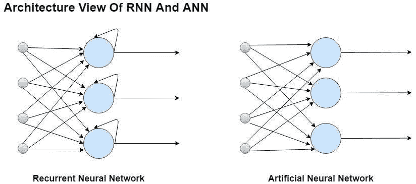
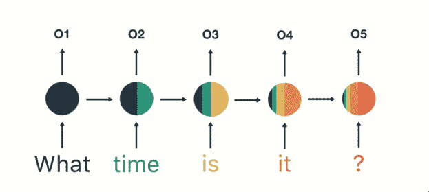
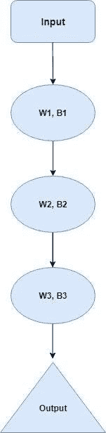
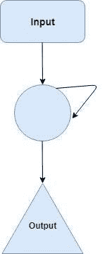
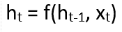
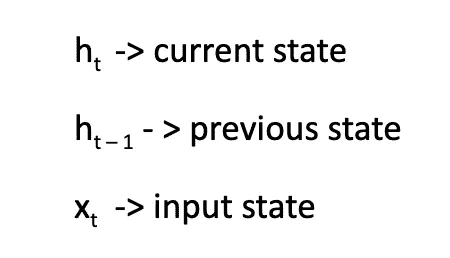
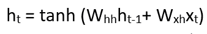
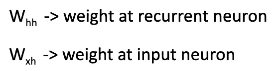
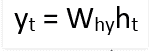

# 深度学习中的递归神经网络—第 1 部分

> 原文：<https://medium.datadriveninvestor.com/recurrent-neural-networks-in-deep-learning-part-1-df3c8c9198ba?source=collection_archive---------4----------------------->

**作者普里亚尔·瓦尔皮塔**

阅读这篇文章将有助于你理解人工神经网络(ANN)的术语，ANN 的缺点，RNN(递归神经网络)的架构观点，使用 RNN 优于 ANN 的优点，它们如何工作，以及如何构建一个系列模型和解决各种用例。有意地，我保持这篇文章基于理论和他们的解释，主要集中在递归神经网络(RNN)。

这篇博文由两部分组成，这是第一部分。本节介绍 RNN 和[，第二节将讨论 RNN 的类型和 RNN](https://medium.com/@priyalwalpita/recurrent-neural-networks-in-deep-learning-part2-ce9fe1770a31) 的一些实际用法。

[注:本文基于吴恩达博士在 Coursera](https://www.coursera.org/lecture/nlp-sequence-models/recurrent-neural-network-model-ftkzt) 的演讲

# 介绍

## 什么是人工神经网络(ANN)？

在每一层，都有一个由若干感知器/神经元组成的群体。通常被称为前馈神经网络或 ANN，因为输入只在正向上被处理。您还可以看到，ANN(或深度神经网络)由 3 层组成——输入、隐藏(一层或多层)和输出。输入层接受输入，隐藏层处理输入，结果由输出层生成。基本上每一层都试图保持一些权重。但是遇到安也有缺点。

 [## 金融中的机器学习|数据驱动的投资者

### 在我们讲述一些机器学习金融应用之前，我们先来了解一下什么是机器学习。机器…

www.datadriveninvestor.com](https://www.datadriveninvestor.com/2019/02/08/machine-learning-in-finance/) 

## 人工神经网络(ANN)的缺点

*   人工神经网络不能捕捉输入数据中的序列信息，而这些信息是处理序列数据所必需的。例如，如果两个数据元素相互关联(例如:语音识别、文本生成、文本或语音语义识别等)，我们就不能分别对待每个数据元素。

因此，为了克服这个缺点，我们将使用递归神经网络(RNN)。

**让我们首先来解释一下 RNN 和人工神经网络之间的架构观点差异:**

**“ANN 的秘密层把循环约束变成 RNN”**

Figure : Main difference between ANN and RNN

RNN 在隐藏态上有一个循环关系，正如你从上图中看到的。这种循环约束确保捕获输入数据中的顺序信息。

## 什么是递归神经网络(RNN)？

在这种神经网络中，前一步的输出作为输入馈入当前步骤。传统的神经网络发生在循环神经网络发展之前，意味着所有的输入和输出都是彼此独立的，但是在诸如需要预测句子的下一个单词的情况下，需要前面的单词，因此记住前面的单词是重要的。因此，只有 RNN 出现后，这解决了这个问题的帮助下**隐藏层**。RNN 的关键和最重要的特征是隐藏状态，它记住序列的一些细节。

[https://www . datadriveninvestor . com/2019/02/08/machine-learning-in-finance/](https://www.datadriveninvestor.com/2019/02/08/machine-learning-in-finance/)

RNN 有一种“记忆”,在这种记忆中，所有关于被测量的知识都被回忆起来。为了生成输出，它对每个层使用相同的参数，因为它对所有输入或隐藏层执行相同的功能。**与其他神经网络不同，这降低了参数的复杂性。**

## 递归神经网络(RNN)的优势

RNN 捕捉输入数据中的顺序信息，即预测以下内容时文本中单词之间的联系:

Figure : RNN flow

如您所见，输出(o1，o2，o3，o4)不仅取决于当前字，还取决于时间步长中的前一个字。

## 递归神经网络(RNN)如何工作？

让我们举个例子来理解这种方法:

在传统的神经网络中有一个隐藏层，它有自己的权重和偏差集合。分别对于权重和偏差 1，假设权重和偏差是 w1 和 b1。类似地，对于第三层，我们将有 w2、b2 和 w3、b3。这些层也是相互分离的，这意味着先前的输出不会被记忆。然而，假设存在一个更深的网络，具有一层输入、三个隐藏层和一层输出。

Figure : RNN weights

递归神经网络的工作方式如下:

1)首先，RNN 将把独立激活转换成从属激活。它还向所有层分配相同的权重和偏置，这进一步降低了 RNN 参数的复杂性，并通过向下一层提供输入来提供用于记忆先前输出的一致框架。

2)这三层相同的权重和偏差合并成一个单一的循环结构。

Figure : RNN state

**计算当前状态的公式**

其中:

**应用激活函数(tanh)的公式:**

其中:

**产量计算公式:**

