# 深度学习中的递归神经网络——第二部分

> 原文：<https://medium.datadriveninvestor.com/recurrent-neural-networks-in-deep-learning-part2-ce9fe1770a31?source=collection_archive---------0----------------------->

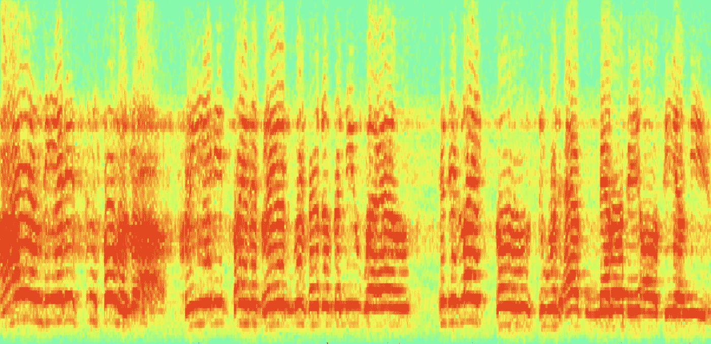

**作者普里亚尔·瓦尔皮塔**

阅读这篇文章将有助于你理解人工神经网络(ANN)的术语，ANN 的缺点，RNN(递归神经网络)的架构观点，使用 RNN 优于 ANN 的优点，它们如何工作，以及如何构建一个系列模型和解决各种用例。有意地，我保持这篇文章基于理论和他们的解释，主要集中在递归神经网络(RNN)。

这篇博文由两部分组成，这是第二部分。[第一部分介绍了 RNN 及其背后的理论。](https://medium.com/datadriveninvestor/recurrent-neural-networks-in-deep-learning-part-1-df3c8c9198ba)本节将讨论 RNN 的类型和一些实际用法。

[注:本文基于吴恩达博士在 Coursera](https://www.coursera.org/lecture/nlp-sequence-models/recurrent-neural-network-model-ftkzt) 的演讲

# **不同类型的递归神经网络(RNN)**

简而言之，RNN 有各种形式。它们如下:

*   一对一 RNN
*   一对多 RNN
*   多对一 RNN
*   多对多 RNN

因此，我们定义了递归神经网络，也称为 RNNs，是一类允许使用先前的输出作为输入同时具有隐藏状态的神经网络。它们主要用于自然语言处理和语音识别领域。让我们来看看各种类型:

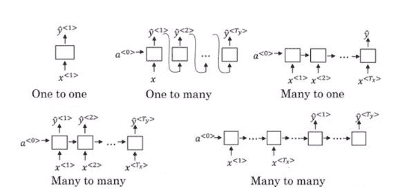

## **一对一的 RNN**

一对一 RNN(Tx= Ty=1)是神经网络最基本、最传统的形式，如上图所示，对单个输入给出单个输出。

## **一对多**

一对多(Tx=1，Ty>1)是一种 RNN 架构，在单个输入提供多个输出的情况下实施。音乐生成将是其应用的一个参考例子。RNN 模型用于音乐生成模型，从单个音符(单个输入)产生一段音乐(多个输出)。

## **多对一**

RNN (Tx>1，Ty=1)的多对一架构通常被用作情感分析模型的常见示例。顾名思义，当需要多个输入来提供一个输出时，就使用这种类型的模型。

 [## AI 将军是否已经超过了人类的智力容量？数据驱动的投资者

### 不仅在游戏中，而且在劳动力市场上，机器都比人类聪明。在今天的许多领域，使用…

www.datadriveninvestor.com](https://www.datadriveninvestor.com/2020/02/12/has-general-ai-exceeded-the-intellectual-capacity-of-humans/) 

比如:分析 Twitter 情绪的模型。该模型中的文本输入(作为多个输入的单词)给人一种固定的感觉(单一输出)。一个例子是电影分级模型，它使用评论文本作为输入来对电影进行分级，范围从 1 到 5。

## **多对多**

多对多 RNN 体系结构(Tx>1，Ty>1)采用多个输入并提供多个输出，但是多对多模型可以有两种类型，如上所示:

1.  **Tx = Ty:**

这是它适用于输入和输出层具有相同厚度的情况的位置。它也可以解释为任何输出信息都可以在命名实体识别中找到。

**2。Tx！= Ty :**

多对多架构也可以在输入和层大小不同的模型中表示，机器翻译展示了这种类型的 RNN 架构的最常见应用。结果，由于在上下文中操作的非等价的多对多 RNN 架构，机器翻译模型能够返回比输入字符串更多或更少的单词。

以下部分解释了不同类型的 RNN 的用法。

# RNN 的用法

## **语言建模和序列生成**

## **什么是语言建模？**

语言建模是自然语言处理的基本活动之一。因此，您可以学习如何使用 RNN 构建语言模型。

“语音识别”方法是语言模型中最常见的用例之一。假设您正试图创建一个语音识别程序。想象一下，就像这样，在一次演讲中，有一个词听起来很混乱，这就是我的意思

例句:“苹果和**搭配**沙拉。”

"苹果和梨沙拉."

因此，如果我们说单词“pair”或“pear”，语音识别系统不能清楚地理解但我是一个认为“梨”这个词会有意义的人，但问题是如何训练机器准确地做到这一点。

**现在，一个成功的语音识别系统通过测量两个句子的可能性并选择更有可能出现的一个，使用语言模型来捕获正确的句子(在示例中为第二个)。**

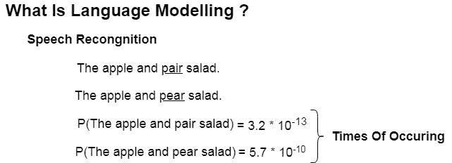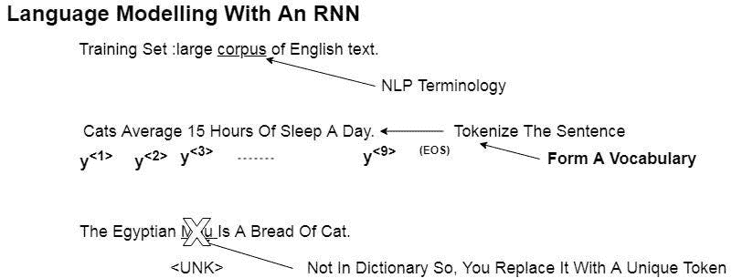

所以现在的问题是如何使用 RNN 创建这种语言模型。这些是已经采取的具体措施

1.  我们需要的第一件事是一个训练集，它是一个给定语言的广泛的文本语料库(集)(我们以英语为例)。
2.  然后，如果您的训练集中有一个句子，首先将该句子标记化，并将其表示为一个热编码向量(使用字典/词汇索引值)。仅仅作为一个例子，一个词汇可能是英语中的 10，000 个单词。
3.  使用一个额外的标记作为< EOS >在你的句子结束处添加一个额外的标记。
4.  如果你想把标点符号符号化或者丢弃，你会看到这一点。
5.  如果这样的单词(标记)没有出现在您的训练数据中正在使用的词汇表中，那么用一个特殊的标记来表示它们，如代表未知的< UNK >。
6.  然后用 RNN 来模拟不同序列的机会。

## **语音识别的递归神经网络架构**

如果你仔细观察，使用 Softmax 函数，第一个 RNN 模块的第一步是尝试预测所有字典术语的可能性。在下一步中，它试图预测第二个单词“normal ”,前提是第一个单词“cats ”(条件概率)，并继续下去，直到到达句子标记的末尾。

**所以，RNN 正在学习一次从左到右预测一个术语。**

现在，为了训练该神经网络，我们将定义成本函数，即在指定的时间阶段“t ”,如果真实单词是“y ”,而期望单词是“yhat”。

如果你在一个真正大的训练集上训练这只 RNN，它将能够很好地预测下一个学期。RNN 将能够预测“睡眠”十有八九是因为提供了过去的话作为“猫平均 15 小时”现在你已经在这个过程中训练了一个强大的语言模型。因此，当你得到一个逻辑和数学来源相同的新短语时，你可以预测句子中正确的术语。

如果你在一个真正大的训练集上训练这只 RNN，它将能够很好地预测下一个学期。RNN 将能够预测“睡眠”十有八九是因为提供了过去的话作为“猫平均 15 小时”现在你已经在这个过程中训练了一个强大的语言模型。因此，当你得到一个逻辑和数学来源相同的新短语时，你可以预测句子中正确的术语。

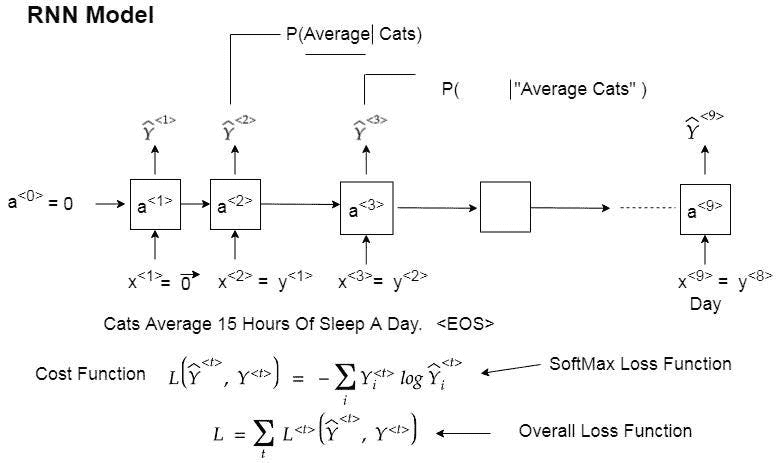

我们之前开始的例子，正确的句子可以预测为-

“苹果和梨沙拉”。

您将在训练序列模型后对分布进行采样，以查看它实际学到了什么。

## **从训练好的语言模型中抽取新的序列**

当你有了一个学习语言的模型。试试看它训练得怎么样。一种简单的测试方法是从分布中取样，看看它是否有意义。

方法是通过使用用于训练的 RNN，并使用 softmax 函数来估计字典中所有术语的可能性，然后随机选择一个单词(numpy.random.choice)。然后将该单词作为输入移动到第二时间步(一键编码的 say ),并让 RNN 预测具有来自字典的新单词的条件可能性，该字典提供了来自上一时间步的单词。这一直持续到产生< EOS >令牌(或采样)为止。如果你的词汇中不包含这个标记，那么你可以抽取 20 个单词(通常是一个句子),一旦达到时间步数就停止

有时在这个特殊的类型过程中，它会生成一个未知的令牌<unk>。但是如果你确定它永远不会产生。然后你可以删除它，让其余的词汇再次测试。</unk>

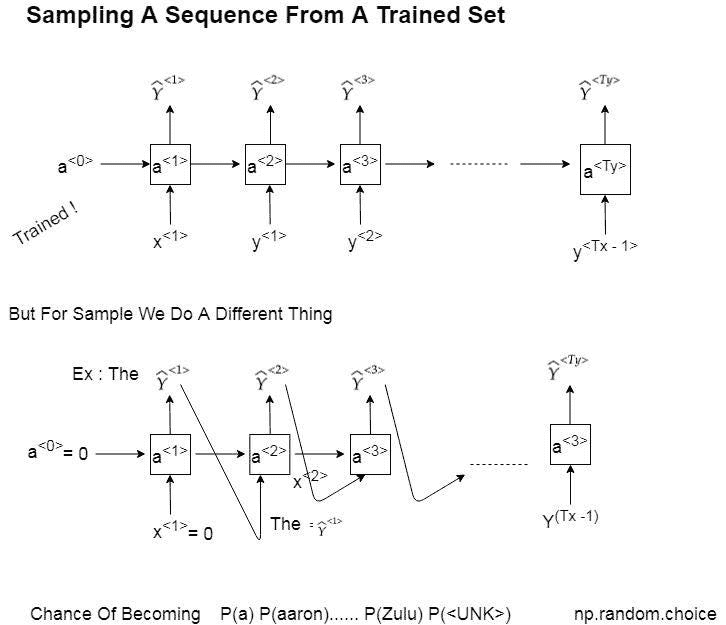

这就是你的 RNN 语言模型如何产生一个随机选择的句子。

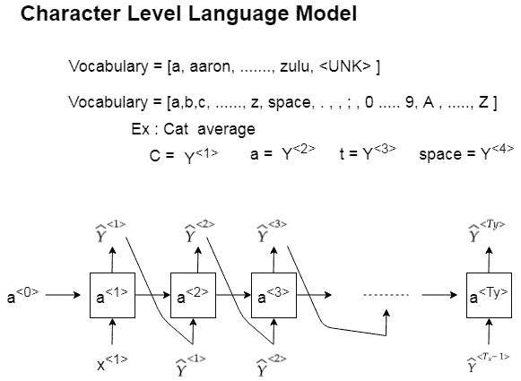

你也可以建立一个 RNN 字符级，其中你的词汇将是字母和一些特殊字符，如标点符号，数字 0-9 等。类似的结构也会随之而来。

RNN 角色等级的一个优点是你永远不会产生一个令牌< UNK>。但最大的缺点是，你要处理更长的序列和更长的时间，而且它们的计算训练成本更高。可能是你的词汇量非常有限，字符级的语言模型可能有用。

## **递归神经网络问题**

RNN 的一个问题是它会遇到梯度消失的问题。让我们看看这是什么意思。有两句话是——

*   我阿姨开的这家餐馆提供正宗的中国菜。
*   这些由我的好朋友开的餐馆提供正宗的印度食物。

在上面的例子中，你可以看到“餐馆”主语是如何影响“服务”动词的。这在英语中也被称为主语-动词一致，这是构造句子的主要原则之一。这样的规则建立了术语之间的长期依赖性(即，短语开头的单词影响短语结尾的单词)。

**基本的 RNN 架构不包含这些长期依赖关系。**

这类似于“消失梯度”问题，其中如果神经网络非常深(它有许多层)，那么当向后传播误差时，在道具开始时(最后几层)测量的梯度(导数)对最初几层的影响小得多。所以，我们说在某种程度上，梯度消失了，因为网络在这个过程中非常深入。因此，反过来，简单的 RNN 不能捕捉单词之间的长期依赖关系，因此它不能检测主语和动词相距甚远的主语-动词关系。

**因此，基本的 RNN 建筑具有非常明显的地方影响**

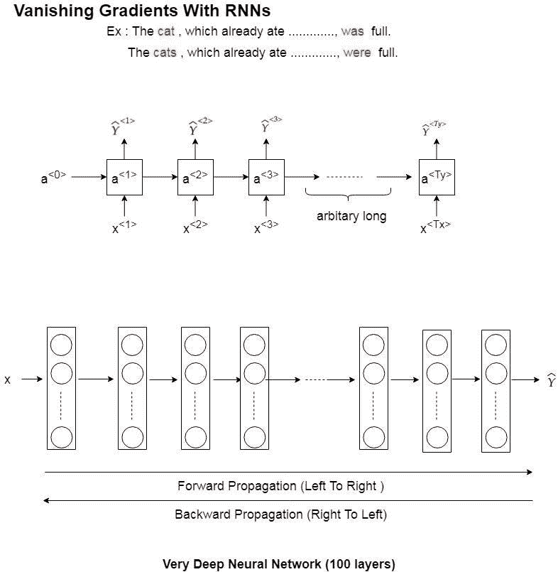

因此，这个“消失梯度”的问题是用一种特殊的 RNNs 来解决的，这种 RNNs 被称为门控循环单元，或者更普遍地被称为 GRU。

## **门控循环单元(GRU)**

它是 RNN 隐层的一个改进，因此它可以识别序列中的长程相关性和消失梯度问题。

RNN 隐藏层单元

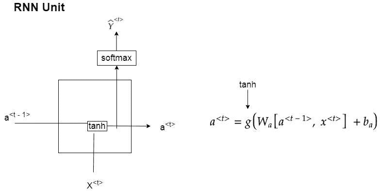

现在让我们根据 GRU 改变这个设计，这样我们就可以捕捉到长期的依赖关系。当我们从左到右阅读句子时，我们将为“memory cell”添加另一个“c”变量，以记住依存关系，例如与主语动词的一致。在我们的例子中,“餐馆”是单数还是复数，以及这如何影响与之相连的动词。

GRU 的主要部分是根据决定是否检查内存单元的“更新门”用 c 更新“c”内存单元。在我们的例子中，“c”将被设置为 1 或 0，这取决于它是单数还是复数，然后 GRU 将记住这个“Ct”值，直到在我们的例子中是动词“serve ”,并将确定它的形式。

在一些 GRU 架构中，我们经常使用另一个名为“相关性门”的门来更好地捕捉长期依赖关系(随着时间的推移而发展)。

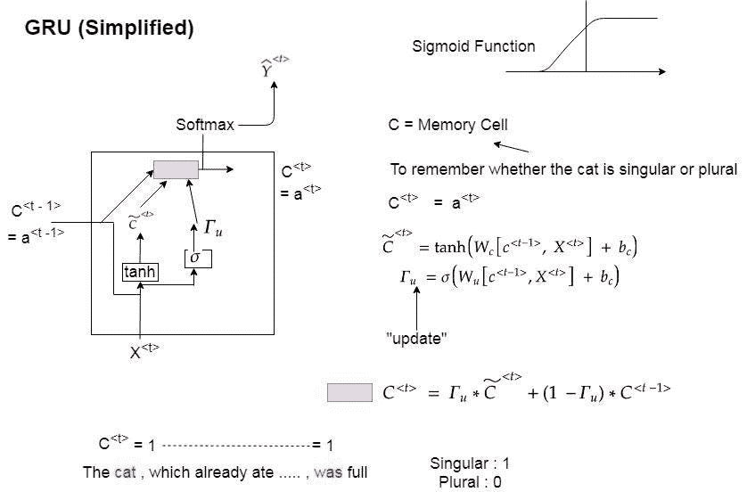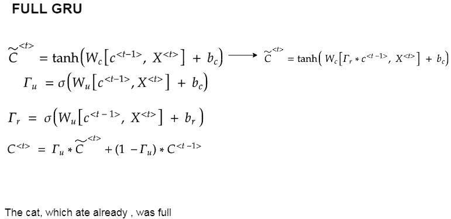

这些建筑被用于我们现在要看的大门，也就是 LSTM。

**长短期记忆(LSTM)**

它捕捉长期依赖关系，就像序列中的 GRUs 一样，但比 GRUs 更有效。这是 GRUs 的简化版。

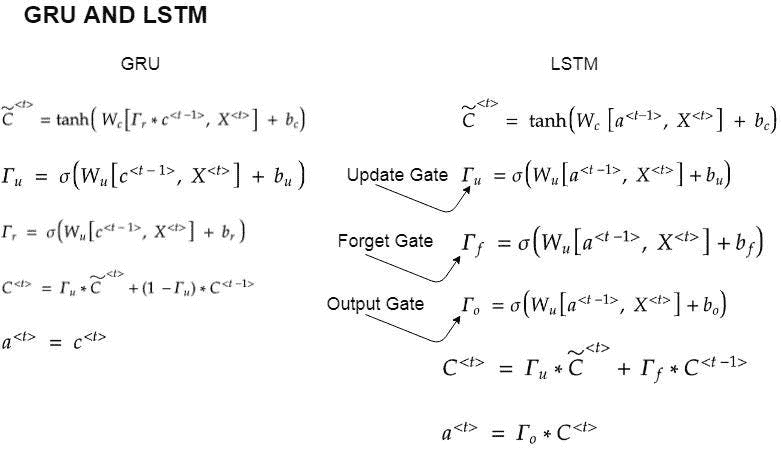

这里“at”不等于“ct ”,即激活不等于存储单元。我们确实使用了两个门，一个是“更新”，一个是“忘记”，而不是我们在 GRU 中使用的减 1 更新门。

GRU 比 lstm 简单，因为它们对于较大的模型在计算上运行得更快，但是 lstm 更有效，因为它们是 GRU 的一般版本，并且有更多的门来控制保留什么和忘记什么。

对两者的理解当然给了我们选择想要解决什么问题的权利。

## **双向递归神经网络(RNN)**

如果你还记得，当我们在讨论 RNN 的时候，我们注意到它从左到右开始读令牌。因此，它不会捕获下面的任何依赖项。

在我们的实体识别问题中，我们试图找出一个术语是否是一个人的名字？

*他说，“泰迪熊在打折！”。*

他说，“泰迪·罗斯福是一位总统！”。

因此，在第一句话中“泰迪”是一个玩具，在第二句话中是一个名字的一部分。因此，当我们有一个在两个方向(从左到右和从右到左)检查术语的网络时，这种依赖性将不会被捕获。

因此，我们将描述一种称为“双向 RNNs”的架构，它允许您在一个时间点从系列的早期和后期获取信息。现在，它也可能是 RNN 单元上的 GRU 或 LSTM 单元，但其想法是如何检查两边的序列，然后做出猜测(在我们的情况下，它是否是一个人)。

所以，这是一个无环图。由于输入序列，它将计算“a-forward 1”，然后使用“a-forward2”直到结束，同时计算“a-backward4”，“a-backward3”直到开始。在计算完所有这些秘密层之后，你可以预测 Yhat-1，Yhat-2，直到最后。

双向 RNN 的一个缺点是，你首先需要整个数据序列来做一些预测。因此，我们不能在语音识别等领域使用它，因为这意味着人需要先说点什么，然后我们的算法将开始识别不真实的语音。

## **用一个深层网络把这些都包起来**

从一开始到现在，我们已经看到了 RNN、格鲁什和伊斯特姆斯的基本块。现在，我们需要将这些东西堆积起来，建立一个深度网络或深度 RNNs 来学习非常复杂的功能。

非常感谢你阅读这篇文章。如果您有任何问题，请在这里提问或通过电子邮件(priyal@priyal.ai)或从我的 [LinkedIn](https://www.linkedin.com/in/priyalwalpita/) 联系我。