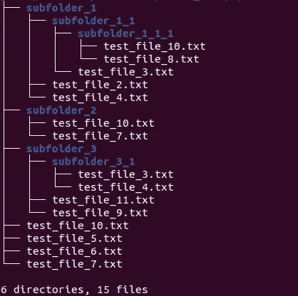

# 使用 Python、wget 和 Bash 脚本递归下载 Google Drive 文件夹的所有内容

> 原文：<https://medium.datadriveninvestor.com/recursively-download-all-the-contents-of-a-google-drive-folder-using-python-wget-and-a-bash-script-d8f2c6b105d5?source=collection_archive---------1----------------------->

# 你什么时候需要这个？

Google Drive 是目前最受欢迎的存储数据集的地方之一，其中一些数据集是公开的。但是，在某些情况下，数据集被拆分到多个文件夹和数百个单独的文件中。在这种情况下，逐个下载这些文件是非常低效的。当您必须在远程服务器上工作时，这就更加困难了，因为您没有任何 GUI 访问权限，也不能访问浏览器。

# 剧本

为了达到我的目的，我编写了一个 Python 代码，它将生成一个 bash 脚本，然后我将它复制到远程服务器并执行。所以，这是步骤。

**第一步**

我用过 **PyDrive** 库。要使用这个库，你必须完成[链接](https://pythonhosted.org/PyDrive/quickstart.html#authentication)中描述的指令。为了完整起见，我将在这里提到这些步骤。

1.  去 Google APIs 控制台创建你自己的项目。
2.  搜索“Google Drive API”，选择条目，然后单击“启用”。
3.  从左侧菜单中选择“凭据”，单击“创建凭据”，选择“OAuth 客户端 ID”。
4.  现在，需要设置产品名称和同意屏幕->单击“配置同意屏幕”并按照说明进行操作。一旦完成:
5.  选择“应用类型”为 Web 应用。
    输入适当的名称。
6.  输入 [http://localhost:8080](http://localhost:8080) 作为“授权的 JavaScript 源”。
7.  输入 [http://localhost:8080/](http://localhost:8080/) 为“授权重定向 URIs”。
8.  点击“保存”。
9.  点击客户端 ID 右侧的“下载 JSON”下载 client_secret_ <really long="" id="">.json。</really>
10.  下载的文件包含应用程序的所有身份验证信息。将文件重命名为“client_secrets.json ”,并将其放在您的工作目录中。

**第二步**

现在，在保存“client_secrets.json”文件的同一个工作目录中创建一个 python 脚本或笔记本。我在下面附上了笔记本。

**第三步**

使用 scp，将“script.sh”复制到远程服务器。
` scp ~/path/script . sh username @ IP:path '

**第四步**

1.  登录到删除服务器，导航到路径。然后使用以下命令使脚本可执行。
    `chmod 777 script.sh '
2.  运行脚本，瞧！
    `。/script.sh '

这将创建子文件夹，并下载您在 python 代码中指定的父目录中的所有文件。

我已经用这个文件夹测试过我的代码:[https://drive . Google . com/drive/folders/1 nigvjhbuuqhwnmqzboyg-zLI1q _ bOuCH？usp =共享](https://drive.google.com/drive/folders/1NIGvjHBuUQHWnMqzboyg-zLI1q_bOuCH?usp=sharing)

