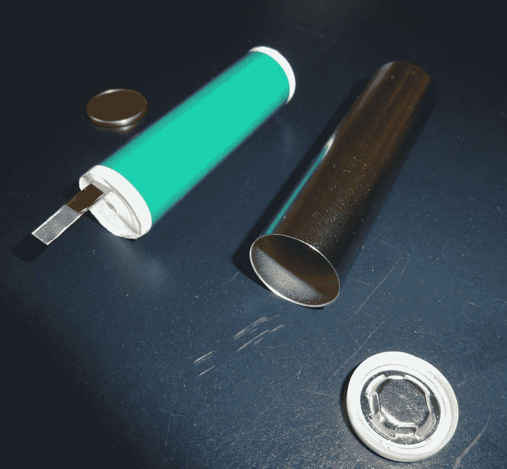

# 特斯拉明矾回收锂离子电池

> 原文：<https://medium.datadriveninvestor.com/recycling-lithium-ion-batteries-464f8d149b9c?source=collection_archive---------6----------------------->

## 那些小虫子有多毒？

Photo by [Martin Katler](https://unsplash.com/@martinkatler?utm_source=unsplash&utm_medium=referral&utm_content=creditCopyText) on [Unsplash](https://unsplash.com/s/photos/tesla-model-3?utm_source=unsplash&utm_medium=referral&utm_content=creditCopyText)

# **1。** **锂离子电池为世界供电**

[锂离子](https://www.theearthawards.org/the-common-uses-of-lithium-ion-batteries/) (Li-ion)电池为手机、笔记本电脑、不间断电源(UPS)、太阳能存储系统和电动汽车等设备供电。也许不是整个世界，但我们世界的许多重要部分都是由锂离子电池供电的。

锂离子电池比其他类型的电池更安全，因为其他类型的电池可能含有镉(镍镉电池)或铅(铅酸电池)等有毒元素。相反，锂离子电池由铁、铜、镍和钴等金属制成，当然还有锂。因此，尽管可再生能源和电动汽车的反对者不断提供错误信息，锂离子电池仍被归类为无害废物，可以安全地焚烧或填埋。

尽管锂离子电池及其制造材料是安全的，但开采这些(或任何)金属会引起环境和人道主义问题。尤其是钴，主要在刚果民主共和国的经济矿床中发现。刚果的钴产量是第二大生产国俄罗斯的 12 倍多。

2016 年,[华盛顿邮报](https://www.washingtonpost.com/graphics/business/batteries/congo-cobalt-mining-for-lithium-ion-battery/)追踪了钴的供应链，发现刚果的采矿公司侵犯人权，使用童工，并在该地区造成环境和健康灾难。

由于电动汽车的加速生产和销售将持续到可预见的未来，对锂离子电池及其材料的需求也将加速增长。如今，从刚果这样的国家开采新的金属用于锂离子电池比回收成本更低。

但这种情况可能即将改变。

# **2。****j . b .斯特劳贝尔是谁？**

[杰弗里·布莱恩·斯特劳贝尔](https://en.wikipedia.org/wiki/J._B._Straubel#Redwood_Materials)是首席技术官，第五名员工，也是特斯拉的联合创始人——直到他在 2019 年离开，创办了 Redwood Materials 来回收电池组。

虽然你可能会惊讶于除了埃隆·马斯克之外，特斯拉还有其他人在管理公司、设计汽车、转动扳手、制造汽车并销售它们……埃隆实际上让自己被一群才华横溢的明星所包围。斯特劳贝尔是他们中最聪明的。

 [## 特斯拉的平流层发射继续进行

### 回顾历史数据，展望 2020 年第 3 季度收益电话会议

medium.com](https://medium.com/datadriveninvestor/teslas-stratospheric-launch-continues-b0d242497cf2) 

斯特劳贝尔的名字出现在特斯拉的大多数专利上。他是为超级充电站网络而战的人，而不是早先宣布的电池交换路线。这只是开始。

感谢特斯拉的股东，斯特劳贝尔仍然是该公司的高级顾问。

J.B. Straubel, Co-founder and CEO of Redwood Materials (Wikimedia Commons)

45 岁的斯特劳贝尔在斯坦福大学获得能源系统工程学士(1998 年)和硕士(2000 年)学位，并于 2004 年加入特斯拉。斯特劳贝尔在特斯拉的职责包括车辆的技术和设计工程、新技术评估、研发、关键供应商和合作伙伴的技术审查、知识产权和系统验证测试。2017 年，他建立了 Redwood Materials，旨在以工业规模回收锂离子电池组。2019 年，斯特劳贝尔离开特斯拉，全职运营红杉材料公司。

# **3。** **红木材料**

特斯拉长期以来一直计划回收锂离子电池组。甚至在特斯拉的第一辆汽车 Roadster 于 2008 年开始销售时，特斯拉就已经[公布了包装回收计划](https://www.tesla.com/blog/mythbusters-part-3-recycling-our-non-toxic-battery-packs)，并强调它们的无毒成分。[早在 2011 年](https://www.tesla.com/blog/tesla-launches-battery-recycling-program-throughout-europe)，特斯拉就已经在欧洲启动了回收电池的计划。

然而，到目前为止，通过这些回收操作得到的材料数量肯定非常少。[特斯拉设计并制造了比汽车更耐用的电池组。在回收之前，特斯拉会尽一切努力延长电池组的使用寿命。他们超过 100 万辆特斯拉汽车的数据显示，行驶 15 万至 20 万英里的汽车的电池组容量保持在 85%以上。迄今为止，特斯拉的重点一直是在回收电池组之前对其进行翻新和再利用。](https://www.tesla.com/ns_videos/2019-tesla-impact-report.pdf)

 [## 特斯拉的能源产品

### 看看特斯拉的能源组合以及它们可能的发展方向

medium.com](https://medium.com/datadriveninvestor/teslas-energy-products-29ebae2aa687) 

因此，特斯拉迄今为止回收的包装数量很少，大多数回收的包装来自他们自己的 R&D 和质量控制测试部件。2019 年特斯拉影响报告称，今年全球每年回收的锂离子电池金属约为 1000 吨镍，320 吨铜和 110 吨钴。

这些听起来像是很大的数字，但为了客观地看待它们，[彭博新能源财经](https://about.bnef.com/new-energy-outlook/)报告预测 2030 年锂离子电池将需要 180 万吨镍。根据一些预测，到 2030 年，仅特斯拉一家每年就需要 115 万吨镍[，到 2025 年](https://stockhead.com.au/resources/tesla-alone-needs-26pc-of-projected-global-nickel-supply-by-2030/)，每年大约需要 27.5 万吨镍[，才能达到他们的生产目标。远远超过任何其他电池制造商。](https://seekingalpha.com/article/4379895-look-who-might-win-giant-contract-to-supply-tesla-nickel)

这就是 Redwood Materials 最大限度回收锂离子电池目标的背景。回收将有助于[最大限度地减少对这些重要战略金属的新供应](https://www.wsj.com/articles/one-of-the-brains-behind-tesla-found-a-new-way-to-make-electric-cars-cheaper-11598673630)的需求，从而最大限度地减少采矿和废物处理对环境的影响，并降低电池组的成本——目前是电动汽车最昂贵的部分。

《华尔街日报》最近报道称，斯特劳贝尔已经赢得了一些大牌投资者，包括来自环境投资基金 Capricorn 投资集团(由杰夫·斯科尔创立)和突破能源风险投资公司(由比尔·盖茨创立)的大约 4000 万美元。Redwood Materials 目前有大约 50 名员工，但计划到今年年底增加到 200 名左右。

Redwood Materials 的战略目标之一是在十年内将锂离子电池的原材料价格降至开采成本的一半左右。

Redwood Materials 目前正在小规模起步，致力于回收手机等消费电子产品。由于电动汽车市场仍然很小，回收汽车电池组的数量在一段时间内仍将很少。

但一个直接的收入来源可能是目前电池制造业务的高废品率，估计为 10%。这一数量的生产废料目前被浪费了。据估计，到 2025 年，80 千兆瓦小时的电池将被废弃，相当于 2016 年全球电池市场的总规模。这些废料相当于每年 64，000 吨锂，相当于两座矿山的年产量，价值高达 15 亿美元。这还不包括其他更昂贵的材料，如钴和镍。

《华尔街日报》报道称，松下已经向 Redwood Materials 发送了一些废料，去年开始试用了约 400 磅废料，今年发送了多达 2 吨废料。

# **4。** **锂离子电池是如何制造的**

[制造锂离子电池](https://www.tms.org/pubs/journals/JOM/0809/daniel-0809.html)所用的材料分为几类:阳极、阴极和电解液。

[阴极](https://pubs.acs.org/doi/10.1021/cr020731c)是电池的正极，因此是电子进入电池的地方。阴极材料可包括锂钴氧化物、锂锰氧化物等。

阳极是负极，也是电子离开电池的地方。阳极材料可包括锂、石墨、硅以及各种锂合金材料和金属间化合物。

电解质是在电池中产生电的化学源，并连接阳极和阴极。电解液中的离子与阳极反应并释放电子。这些电子离开阳极，穿过被供电的设备，然后返回阴极。电解质材料包括液体、聚合物和固态电解质。

Components within a Li-ion cell before sealing in the can (Wikimedia Commons)

除了上面提到的三位一体的电池材料外，还需要一些其他材料。

一个重要的是隔板，它将阳极和阴极分开，以防止电池内部短路。对于液体电解质，隔板是浸透了电解质的泡沫。

当然，还有容器，罐头，它把所有这些成分都包在一个耐用的包装里。

最具成本效益的电池形式是圆柱形，因此尽管有些人讨论了棱柱形和袋形电池等其他形式，但我们将坚持使用成本最低、体积最大的圆柱形电池。这是特斯拉使用的形式。

为了制造圆柱形电池，电极以糊状物的形式制造，涂布机将糊状物涂布在箔片上，例如用于阴极的铝箔和用于阳极的铜箔。电极涂覆的箔和隔板像果冻卷一样被堆叠和卷绕，并包装到圆柱形罐中。然后，电池充满电解液，电解液必须渗入泡沫分离器(通常是生产中最慢的步骤)。最后，连接剩余的部件，如绝缘体、密封件和安全装置，并将罐体焊接封闭。

从《华尔街日报》的报道来看，红木材料的回收处理似乎只是简单地熔化电池。这最大限度地降低了人工拆卸电池和分类回收材料的高成本。当然，对于电池制造商可以购买的原材料的回收和重组所涉及的具体加工过程，还有很多需要了解的。这些将会及时到来——但是现在 Redwood Materials 在他们准备开始生产之前都是保密的。

# **5。** **披露……**

我很高兴拥有最古老的二手特斯拉 Model S(2013 款 MS P85)，也很高兴投资了特斯拉公司。

如果你喜欢这篇关于锂离子电池的文章，你可能也会喜欢下面的文章。

这是对特斯拉能源部门的回顾:

 [## 特斯拉的能源产品

### 看看特斯拉的能源组合以及它们可能的发展方向

medium.com](https://medium.com/datadriveninvestor/teslas-energy-products-29ebae2aa687) 

这是对 SpaceX 的 Starlink 的介绍:

 [## SpaceX 的 Starlink

### 或许很快就能让高速卫星互联网进入您的家中！

medium.com](https://medium.com/predict/spacexs-starlink-high-speed-satellite-internet-to-your-home-soon-maybe-38d02eb0d072) 

这是 Starlink 最近测试的后续:

 [## 佤邦军方使用的 Starlink

### SpaceX 加快了 Starlink 互联网服务的 beta 测试，满足了军事紧急情况的严格要求…

medium.com](https://medium.com/predict/starlink-used-by-wa-states-military-bb2cd8aca83a) 

这是对网飞文化的一个观察:

 [## 网飞文化战争

### 好好看看一场有影响力但被误解的文化大革命

medium.com](https://medium.com/illumination-curated/reed-hastings-and-the-netflix-culture-wars-cfe8777e1a6a) 

感谢您的阅读，并请分享！

感谢[帕夫勒·马林科维奇](https://medium.com/@pmarinko)提出回收电池这个话题！