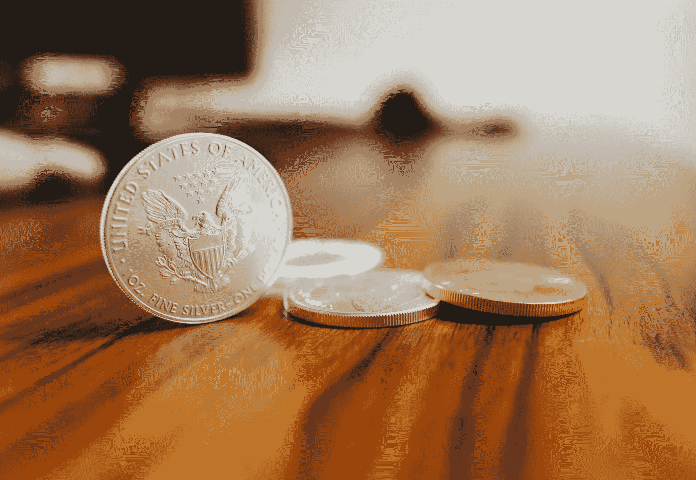

# Reddit 集团挤压白银市场的努力失败

> 原文：<https://medium.datadriveninvestor.com/reddit-group-fails-in-effort-to-squeeze-the-silver-market-12d2e9ab3b10?source=collection_archive---------27----------------------->

Photo by [Simon](https://unsplash.com/@aurazon?utm_source=unsplash&utm_medium=referral&utm_content=creditCopyText) on [Unsplash](https://unsplash.com/s/photos/u.s.-eagle-coin?utm_source=unsplash&utm_medium=referral&utm_content=creditCopyText)

在银市场上，对 Reddit 集团和 GameStop Corp .[GME](https://www.forbes.com/companies/gamestop-corp)有效的方法失败了。这个问题似乎可以归结为对大宗商品市场运作方式的明显无知。

周一，iShares Silver Trust (SLV)交易所交易基金的价格从上周五的 25 美元左右飙升至 27.92 美元。但到周二上午，涨势已经完全逆转。该基金最近的交易价格低于每股 25 美元。换句话说，它的售价低于上周五晚些时候的售价。

# 未被 Redditters 压榨的白银

总部设在纽约的 BBH 银行最近的一份报告指出:“Redditors 策划白银短期紧缩的设想并不顺利。”。

做空的想法与 GameStop 合作得很好，这种想法包括推高证券价格，迫使那些押注价格下跌的人回购他们的头寸。这家表现不佳的公司看到其股价以惊人的方式飙升，此前 Reddit 聊天组的成员推高了股价，足以迫使卖空者退出他们的头寸。

然而，这对白银市场可能不起作用。

第一个问题是，大宗商品市场不太像股票市场。

很难准确判断投资者在他们的头寸上是做空还是做多。例如，商品期货交易委员会(CFTC)关于对冲基金是持有多头还是空头头寸的数据不能给任何人完整的信息。是的，这些数据会告诉你一些关于白银期货市场的情况。但白银市场也有很大的实物面。

从事实物商品交易的银行通常会对冲价格风险。他们通过卖出与他们实际拥有的盎司数量相同的期货合同来达到这个目的。因此，即使 [CFTC 的数据显示](https://www.cftc.gov/dea/options/other_lof.htm)金融公司有净空头头寸，也很可能被实物持有抵消。经营纽约商品咨询公司 CPM 集团的杰夫·克里斯蒂安解释说，这里的。

# 也许 Redditers 没有检查他们的数据

然而，在这种情况下，Reddit 工作人员可能只是读取了错误的数据。

另一份 BBH 报告解释了如何:

*   “Redditers 正试图在贵金属领域复制 GameStop 策略，他们的假设是，银行有一个巨大的空头头寸可以作为目标。不过，请注意，数据显示，基金净做多已经有一段时间了。

白银市场的另一个误解是白银短缺。这可能是 Redditers 所相信的。如果他们这样做了，那他们就错了。

白银本身并不短缺。同样，CPM 的基督徒[解释说](https://www.youtube.com/watch?v=N54_h29SeUY&feature=youtu.be)银币和小金条短缺。周围有很多大酒吧。

是的，市场供应紧张，部分原因是季节性需求，但还没紧张到成为问题。

“它不会断的，”克里斯蒂安说。

*这是 2021 年 2 月 2 日首次发表在《Forbes.com》上的一个故事的编辑版本。*