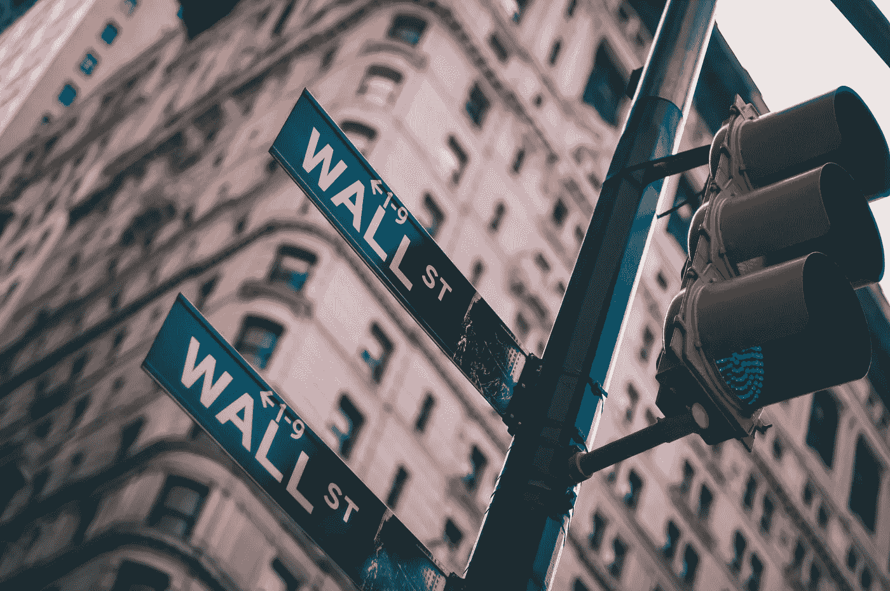

# 分析师称，Reddit 不是白银价格上涨的关键驱动力

> 原文：<https://medium.datadriveninvestor.com/reddit-not-the-key-driver-of-higher-silver-prices-analyst-says-b8950778e4c6?source=collection_archive---------37----------------------->

Photo by [lo lo](https://unsplash.com/@bylolo?utm_source=unsplash&utm_medium=referral&utm_content=creditCopyText) on [Unsplash](https://unsplash.com/s/photos/wall-street?utm_source=unsplash&utm_medium=referral&utm_content=creditCopyText)

尽管有相反的报道，但最近白银价格的飙升与 Reddit 集团引发陷入困境的零售商 GameStop 价格大幅上涨没有什么关系。

相反，大宗商品咨询公司 CPM Group 表示，白色金属价格的反弹主要是由共和党内部的动荡以及对新冠肺炎疫苗计划失败的担忧推动的。

CPM Group 的管理合伙人杰夫克里斯蒂安(Jeff Christian)在最近的一段视频中表示:“我们看到的更多是政治局势和疫情，而不是 Reddit 集团的恶作剧。”。这里可以看视频[。](https://www.youtube.com/watch?v=N54_h29SeUY&feature=youtu.be)

# Reddit 对白银的重要性没有很多人想象的那么大

“Reddit 上的人远没有很多人想象的那么重要，”Christian 说。

持有金条的 iShares Silver Trust [SLV](https://www.forbes.com/investment-funds/slv/) 的价格在 2 月 1 日周一的盘前交易中触及 2013 年 3 月以来的最高价格，当时在 Comex 的价格为每盎司 29.89 美元，较上周三的 25.39 美元上涨了 17%。

就在白银价格反弹的几天前，对冲基金投资者押注 GameStop 股价将下跌，导致该股遭受重大损失。Reddit 聊天群中的一群投资者将该股推至荒谬的高位，导致对冲基金的押注落空。

虽然有人说 Reddit 集团将对白银采取同样的措施，但 CPM 的 Christian 表示，在最近的反弹中，政治和经济问题要重要得多，在可能即将到来的白银市场反弹中也是如此。

# 疫苗、共和党问题推高银价

“投资者正在关注疫苗分销系统中的问题，”克里斯蒂安说。“它在美国失败了，在许多其他地方也表现不佳。”

他说，上周运送了 17，000 剂疫苗，帮助纽约的 900 万人获得免疫。“显然，这是行不通的。”

或者如克里斯蒂安所说，按照这种疫苗接种率，我们仍需等待数年才能控制住疫情疫情。

另外，同样重要的是华盛顿 DC 的问题。克里斯蒂安指出，两党都在进行一些反省，但共和党的反省远比民主党更糟糕。

“共和党内部确实存在分歧，”他说。

这两个问题已经吓得投资者购买白银，这种投资不会产生股息，实际上人们拥有白银是要付出代价的。

# 更多的白银上涨即将到来

克里斯蒂安认为，在未来三到五年内，金属价格将大幅攀升，部分原因是投资需求。

克里斯蒂安表示，投资者在 2020 年购买了约 1.03 亿金衡盎司，高于 2018 年和 2019 年的三分之一左右。

“你已经看到投资者对白银越来越感兴趣，”他表示。

*这是 2021 年 2 月 1 日首次发表在《Forbes.com》上的一个故事的编辑版本*