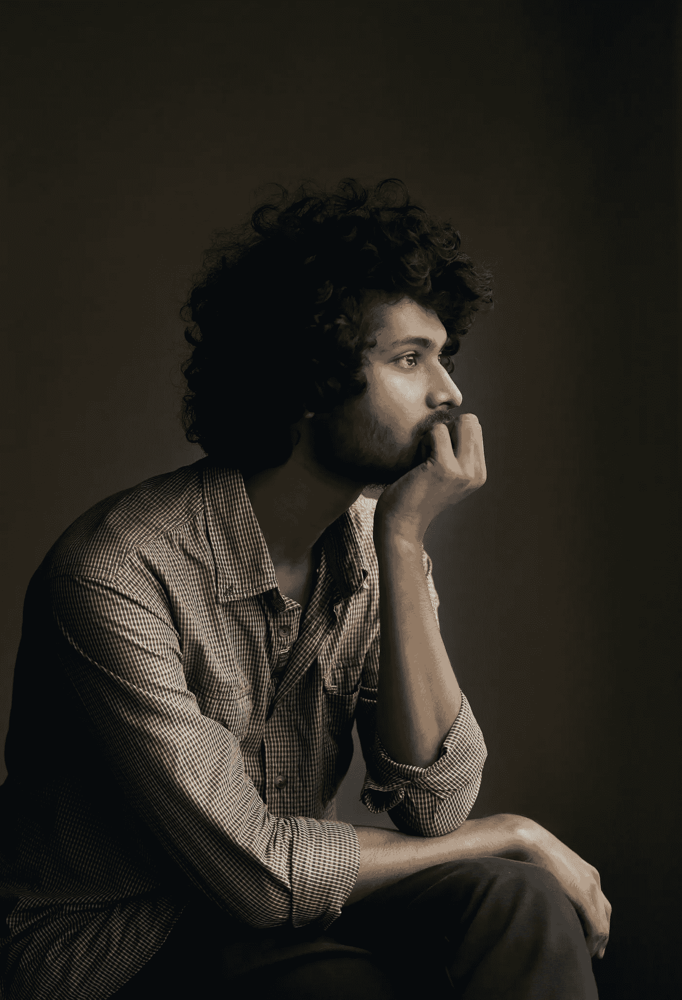

# 为 2021 年及以后重新定义“积极思维”

> 原文：<https://medium.datadriveninvestor.com/redefining-positive-thinking-for-2021-and-beyond-a670f87f854b?source=collection_archive---------22----------------------->

Photo by [Kazi Mizan](https://unsplash.com/@kaziminmizan?utm_source=unsplash&utm_medium=referral&utm_content=creditCopyText) on [Unsplash](https://unsplash.com/s/photos/thinking?utm_source=unsplash&utm_medium=referral&utm_content=creditCopyText)

*现在比以往任何时候都更需要冷静的提问和大胆的测试*

W 这一年可能是这一代人经历的最艰难的一年，在这个时候总是很流行的决心和乐观，在我们开始 2021 年时，已经成为许多人的真正需求。随着疫情继续在社会、心理、政治和经济上造成损失，集体和个人对稳定和安全的渴望空前高涨。在国会大厅最近发生的混乱之后，这一点无疑被放大了一千倍。这一点，再加上期待已久的疫苗和疲软的刺激计划推出的问题，清楚地提醒人们，回归常态的道路是多么漫长。虽然有些人(包括我自己在内)怀疑这种回到疫情之前的状态的可能性，但我们都渴望实际的、经过证明的自我能动的手段，以超越眼前，并在未来的岁月里茁壮成长。

然而，即使是寻求超越政治、宗教和其他文化途径的狂热宗派主义的人类潜能/自助领域，也不能幸免于人类不加批判地赞扬自己选择的实践和诋毁他人的倾向。例如:在新年的第一天，关于获得健康、快乐、内心平静、和谐关系和财务繁荣的最佳方法的文章、博客和视频在互联网上传播开来。无论是新时代的*秘密、*东方传统如禅宗和正念，古代哲学学科如斯多葛主义，还是更世俗的、基于科学的实践，它们都声称掌握着实现的关键。对立的体系和哲学受到指责，它们的主要倡导者经常被贴上骗子或庸医的标签，通过兜售伪科学“呜呜呜”来赚快钱。我发现这一点，尤其是对吸引力法则的批评，这一法则追溯到被称为新思维的更广泛的心灵哲学形而上学，植根于 19 世纪融合的美国超验主义运动。

正如我以前写的那样，新思想(也称为积极思维)的本质是“思想就是事物”:我们坚持不懈地思考、感受和想象的东西会带给我们体验，无论是好的、坏的还是无关紧要的。无论我们生活中“显现”的是福是祸，都不是源于变化无常的命运或我们是“愤怒的上帝手中的罪人”，而是根据宇宙法则我们精神收获的果实。"*一个人心里怎么想，他就怎么做*"，这是谚语 23:7 的释义，是该运动精神的简洁结晶，也是英国作家詹姆斯·艾伦 1903 年的里程碑式的[书](https://www.amazon.com/As-Man-Thinketh-Annotated-Inspirational/dp/1709705272/ref=sr_1_2_sspa?crid=1ZYAPFGWJRO5D&dchild=1&keywords=as+a+man+thinketh+james+allen&qid=1610051369&sprefix=as+a+man+thinketh%2Caps%2C256&sr=8-2-spons&psc=1&spLa=ZW5jcnlwdGVkUXVhbGlmaWVyPUExRjBHS0lXUTFZQjIwJmVuY3J5cHRlZElkPUEwMjMzNDc4TVdDN1Y4NVVGMlNSJmVuY3J5cHRlZEFkSWQ9QTA1ODcxMzFRUEJURE01MUI3UEQmd2lkZ2V0TmFtZT1zcF9hdGYmYWN0aW9uPWNsaWNrUmVkaXJlY3QmZG9Ob3RMb2dDbGljaz10cnVl)的书名的灵感来源。这个简单而深刻的原则几乎贯穿了自助和新时代文学的每一部主要作品，从拿破仑·希尔的 [*思考并变得富有*](https://www.amazon.com/Think-Grow-Rich-Original-Classic/dp/1722501235/ref=sr_1_10?crid=1GZX1X28QI8SP&dchild=1&keywords=think+and+grow+rich&qid=1610051541&sprefix=think+%2Caps%2C213&sr=8-10) 到埃丝特和杰里·希克斯的亚伯拉罕的通灵教导。而且，与批评者相反，广泛学科的科学研究——包括[神经可塑性](https://www.discovermagazine.com/mind/rewiring-the-brain-to-treat-ocd)、[催眠](https://www.mayoclinic.org/tests-procedures/hypnosis/about/pac-20394405)、[运动心理学](https://www.psychologytoday.com/us/blog/the-power-prime/201211/sport-imagery-athletes-most-powerful-mental-tool)和[安慰剂研究](https://www.health.harvard.edu/mental-health/the-power-of-the-placebo-effect)——为一些所谓的“呜呜呜”提供了经验支持。

最好的新思想是一种肯定生命的哲学，为个人提供一种作为上帝之子的固有尊严的肯定。尽管我们是按照造物主的形象和肖像制造的，但我们只是利用了我们先天能力的一小部分，就在生活中游荡，认为自己被我们无法控制的环境和条件所束缚。然而，通过学习训练我们的思想、情感和心理意象，我们可以展现我们内心的神性力量，实现健康、幸福、爱、心灵的平静和富足。当以一种有分寸的、成熟的方式应用时，新思想激发了我所称的深思熟虑的思考。

对一些人来说,“积极思考”意味着乐观的唯我论，个人相信他们可以通过自己的思想和意志塑造现实。而且，我很痛苦地说，自称显形教练的军团将社交媒体视为神奇的治疗方法，这种方式增加了批评者对妄想的指控的份量。人们只需要看看即将离任的宾夕法尼亚大道 1600 号的居住者(他是已故诺曼·文森特·皮尔的[狂热信徒](https://www.desmoinesregister.com/story/opinion/columnists/iowa-view/2020/11/19/trump-after-losing-adheres-norman-vincent-peale-positive-thinking/6341449002/))就能看到这种世界观有多么具有破坏性，尤其是当被一个有自私野心的人掌握时。不仅如此,“积极”这个词可能非常主观。正如我们所见，唐纳德·川普肯定认为[对自己](https://www.cnn.com/2018/01/06/politics/donald-trump-white-house-fitness-very-stable-genius/index.html)和他的议程相当积极，但事实证明，对国内外数百万人来说，这是相当消极的。(为了更深入地了解新思想——特朗普的联系，请查看杰出的加里·拉克曼的 [*黑暗之星崛起:特朗普时代的魔法和权力*](https://www.amazon.com/Dark-Star-Rising-Magick-Power-ebook/dp/B075C8BQS5/ref=sr_1_1?crid=9HXON7K8QZNK&dchild=1&keywords=gary+lachman+dark+star+rising&qid=1610048529&sprefix=gary+lach%2Caps%2C190&sr=8-1) )。

相比之下，深思熟虑的练习不会促进盲目的妄想或实现幻想的愿望。一个深思熟虑的思考者承认他们当前的处境，然后带着强烈的愿望下定决心，通过坚定的信念和明智的行动来实现他们选择的目标。一个深思熟虑的思考者不会通过盲目的鹦鹉学舌来淹没困难，而是寻求在逆境中寻找一线希望。一个深思熟虑的思考者不会武断地说出别人痛苦的原因，而是承担起发现和减轻自己痛苦的责任。一个深思熟虑的思考者选择看到所有好的方面，但不会回避尖锐地指出不公正或残酷。正如拉尔夫·瓦尔多·爱默生所写的那样，“你的善良一定有某种优势——否则就什么都不是了。”

我邀请你在未来的一年里和我一起研究新思想传统中的开创性著作(每月一篇)，这些著作强调这种深思熟虑的思考模式，最重要的是，在实践实验中检验他们的原则。当前的气候无疑为我们自己和彼此提供了很多思考、感受和有目的行动的机会。

下次再见，亲爱的读者们，保重。

康纳·麦克科马克，2021