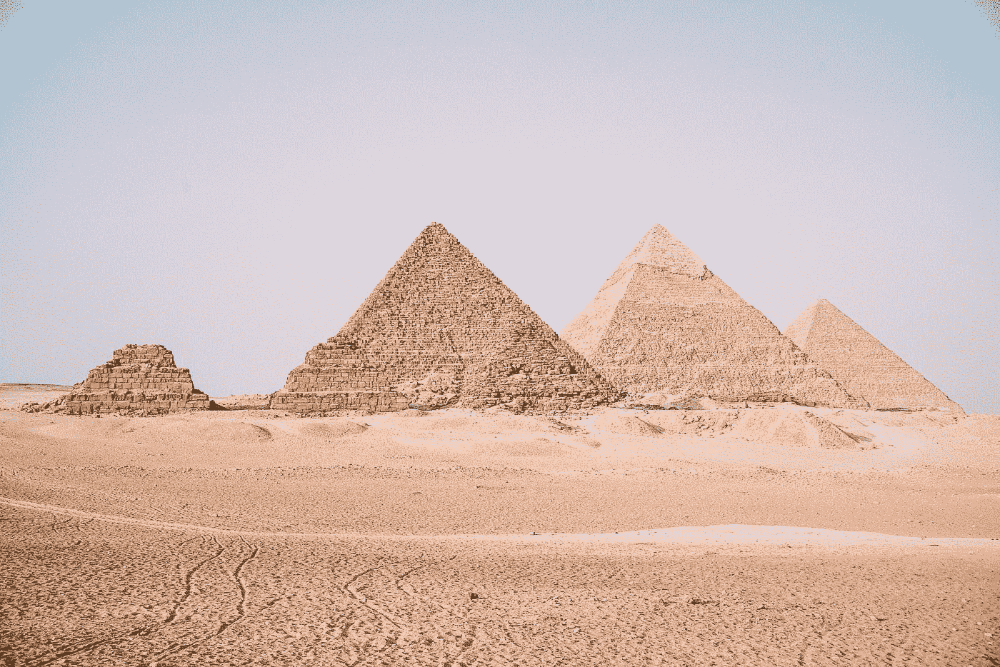
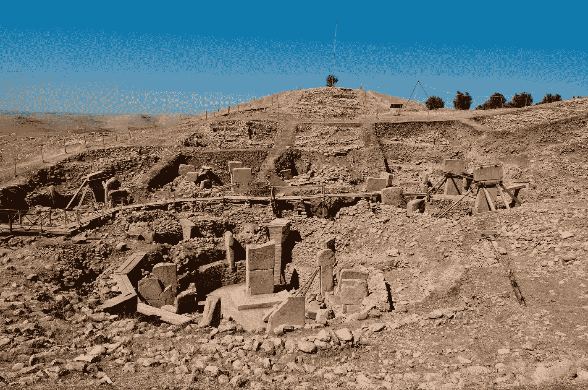

# 重新定义人类时代

> 原文：<https://medium.datadriveninvestor.com/redefining-the-human-epoch-a9d722ab257f?source=collection_archive---------5----------------------->

Photo by [Aron Visuals](https://unsplash.com/@aronvisuals?utm_source=medium&utm_medium=referral) on [Unsplash](https://unsplash.com?utm_source=medium&utm_medium=referral)

## *欢迎来到 12020 年何*

日期是如此普遍，以至于我们大多数人都不会去质疑它。我们喜欢想象我们测量时间的方式一直是一样的，但是我们今天大多数人使用的公历直到 1582 年才被引入。米开朗基罗的*大卫*比我们现在测量时间的方法还要古老。

然而，它远不止于此。将 2020 年称为 2020 年是对人类的一种伤害，也有损于我们在进化过程中眨眼之间取得的令人难以置信的飞跃。我们需要一种新的方法来定义我们的历史和一个新的日期。因此，出于我将要谈到的原因，我告诉你今年，2020 年，应该是全新世的第 12020 年。

## 日历简史

Photo by [Leonardo Ramos](https://unsplash.com/@leonardoeron?utm_source=medium&utm_medium=referral) on [Unsplash](https://unsplash.com?utm_source=medium&utm_medium=referral)

几千年来有数不清的历法，通常新的历法建立在旧的之上。古埃及阳历被认为是在公元前 3000 年左右制定的，有 365 天，每个月有三个十天的星期，一个季节有四个月，剩下的五天是圣日。他们的季节是基于尼罗河的洪水。

公元前 46 年，儒略历出现在古埃及历法中。罗马日历不再准确地反映罗马人的时间，因此当时一位著名的天文学家索西吉斯建议朱利叶斯·凯撒(该日历就是以他的名字命名的)进行一次彻底的调整。它大致给出了我们今天所知道的，一年 365.25 天，12 个月，每个月有 30/31 天。二月是唯一的例外，有 28 天，尽管每四年都会增加一天，创造了我们所说的闰年。为了巩固他的改革并纠正以前历法的缺点，公元前 46 年是 445 天。

然而，到 1582 年，很明显，即使这些改革也是不够的。索西吉斯算错了一点点，几个世纪以来，这个时间越来越长，打乱了季节，但更重要的是，对教会来说，谁将引领未来的变化，庆祝宗教节日。教皇格里高利十八世颁布法令，每年被 4 整除的年份都是闰年，除非那一年被 100 整除(1500、1700、1900 等)，尽管如果那一年被 400 整除(1200、1600、2000 等)，这条规则就不适用。这个公式虽然有点复杂，但却是我们今天大多数人用来定义时间的公式。

但是如果有另一种方式，一种更好的方式，一种在我们应得的范围内代表人类的方式呢？

## 替代日历

Photo by [Diana Vargas](https://unsplash.com/@dvbarrantes?utm_source=medium&utm_medium=referral) on [Unsplash](https://unsplash.com?utm_source=medium&utm_medium=referral)

公元前/公元 vs 公元前/公元是学术界的一个普遍争论。许多人现在选择忽略公元前(在基督之前)和公元(在我们主的年份)，因为他们的宗教提议。大多数人更喜欢公元前(前共同时代)和行政长官(共同时代)。然而，尽管语言的变化是朝着正确方向迈出的一步，但还远远不够彻底。我们仍在用一个人的生与死来定义时间。毕竟，所有的 BCE/CE 修订版完成的是删除他的名字。

我们在世界各地的大多数日历中都发现了同样的问题——它们都有强烈的宗教元素。虽然这很有意义，但鉴于日历通常用于计算宗教节日，围绕宗教的日历本质上是排斥性的。例如，世界上大约 30%的人是基督教徒，但对另外 60%的人来说，基督要么是他们宗教的一小部分，要么根本不是。这还不算许多国家日益增长的无神论人口。

那么宗教就不是衡量时间的好标准，这就引出了一个问题——最好的选择是什么？

## 全新世

Photo by [Houcine Ncib](https://unsplash.com/@houcinencibphotography?utm_source=medium&utm_medium=referral) on [Unsplash](https://unsplash.com?utm_source=medium&utm_medium=referral)

除了不基于宗教，我们的新日历还需要做两件事。第一，它需要涵盖所有的人类历史。换句话说，“零年”是人类首次成为这个星球上的主导物种的一年。第二，它不能建立在无形的基础上。

通常，当人们讨论替代日历时，他们会选择农业革命的开始或第一批现代人类的出现作为起点。这两个都不行。农业在世界各地的不同时期发展，虽然解剖学上的现代人(*智人)*被认为大约在 30 万年前出现在非洲，但时间范围太广，无法作为我们日历的基础。

这给我们提供了一个合理的选择来确定我们历史的开端——人类建造的第一个建筑。这些建筑是我们历史上的一个标志，是人类真正开始主宰世界的时刻。

## 格贝克里·泰佩

Göbekli Tepe [(By Teomancimit — CC BY-SA 3.0)](http://By &lt;a href=&quot;//commons.wikimedia.org/wiki/User:Teomancimit&quot; title=&quot;User:Teomancimit&quot;&gt;Teomancimit&lt;/a&gt; - &lt;span class=&quot;int-own-work&quot; lang=&quot;en&quot;&gt;Own work&lt;/span&gt;, <a href="https://creativecommons.org/licenses/by-sa/3.0" title="Creative Commons Attribution-Share Alike 3.0">CC BY-SA 3.0</a>, <a href="https://commons.wikimedia.org/w/index.php?curid=17377542">Link</a>)

在安纳托利亚东南部新月沃地的北部边缘，矗立着通常被称为人类的第一个建筑项目。在这里，大约 12000 年前，猎人聚集在一起建造了一系列巨大的巨石圈，大约 16 英尺高，65 英尺宽，雕刻着几十种动物，如狐狸，狮子，蝎子和秃鹫。

对于那个时代来说，这是一个无与伦比的建筑壮举，对我们来说几乎是难以想象的古老。它比巨石阵还早 6000 年，在第一批苏美尔人(公元前 3300 年)那里就像我们今天一样古老。它的目的很大程度上是一个谜。它似乎不是一个定居点，缺乏许多泄露秘密的考古迹象。许多人认为这是一座寺庙，但这些人所祈祷的神现在已经去世很久了，这使得它对我们今天来说没有任何宗教意义。

这种历法的使用是由意大利裔美国科学家凯撒·艾米利亚尼普及的，他不仅试图纠正传统的公元前和公元纪年中没有零年的现象，还试图更好地代表人类。这个新的纪元，从格贝克力山的建造开始，将被称为全新世，从这个角度来看，我们的历史开始看起来完全不同。

## 新的时间线

Photo by [noor Younis](https://unsplash.com/@nooryounis?utm_source=medium&utm_medium=referral) on [Unsplash](https://unsplash.com?utm_source=medium&utm_medium=referral)

我们在日常生活中需要做的唯一真正的改变是在当前日期前加一，使当前年份为 12，020 HE。这是一个很小的变化，但它戏剧性地展示了过去几个世纪人类进步的规模。下面是一个粗略的时间表，把格贝克力特佩作为零年，一直延续到今年，12，020 HE。

0 HE-gbekli Tepe 竣工

2000 年，中东开始农业革命

2500 年，耶利哥城建造完成，很可能是第一座城市

4000 年他——农业在美洲发展

6800 年，古代苏美尔出现了汉字

7300 年——第一部有文字记载的故事——何的史诗写作完成

8000 年，巨石阵建成

8400 年他——迈锡尼时代的希腊，可能是特洛伊战争时期

8500 年，吉萨大金字塔建成

9200 年，希腊城邦出现

9500 年，民主在雅典诞生

9700 年，他——亚历山大大帝去世

10，000 何——基督之死

11，492 何——哥伦布在美洲大陆登陆

11969 氦——登月

11989 何——万维网介绍

11998 氦——国际空间站的第一批部件发射升空

12020 何——今天

从这个角度来看，历史发展的速度对我们来说是显而易见的。与地球存在的不可估量的时间相比，12000 年只是一眨眼的时间，人类从用基本工具雕刻石柱发展到在月球上行走。

通过使用全新世历法，一种比其他试图包含所有人类历史的历法更容易理解的历法，我们可以感受到人类物种移动的惊人速度。我们在这个地球上的时间非常短暂，然而我们已经取得了惊人的成就，现在是我们拥有一个准确反映这一旅程的日历的时候了。

从我们古老的祖先从戈贝克利山眺望肥沃的新月，到宇航员从月球上回望地球，我们测量时间的方式更多地反映了我们自己，而不是我们周围的世界。为了公正地对待我们的历史，我们需要一个日历，不仅反映我们现在，而且反映我们所有的前辈。