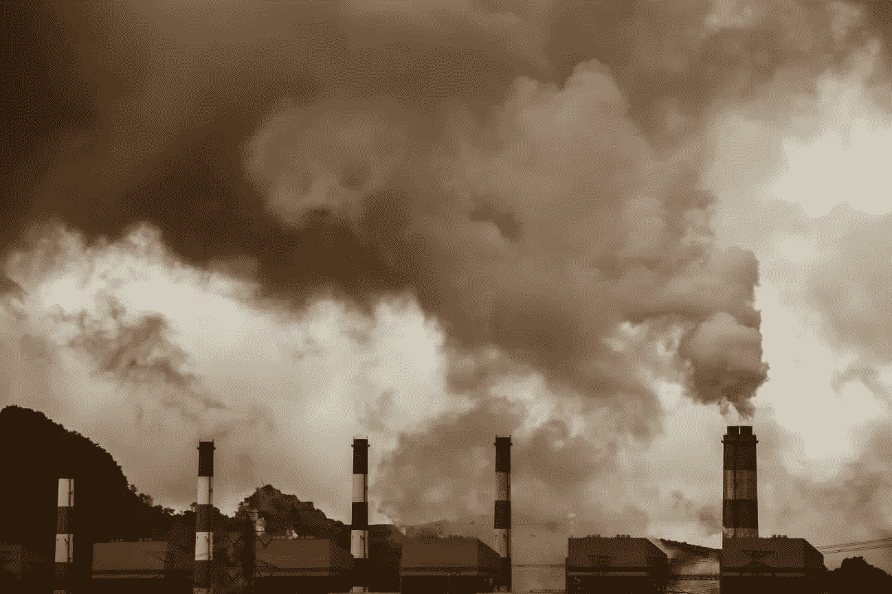

# 减少中国的煤炭消耗需要彻底的改革

> 原文：<https://medium.datadriveninvestor.com/reducing-coal-consumption-in-china-requires-sweeping-reform-468c1aa333d0?source=collection_archive---------35----------------------->

Image via: [Adobe Stock](https://stock.adobe.com/)

# *总结*

*为了在 2060 年实现碳中和的目标，中国需要放弃燃煤电厂，转而使用可再生能源。然而，这样做需要废除针对地方官员和电力生产商的过时的激励机制。北京方面能否鼓起政治意愿，克服反对这些变革的强大既得利益，将是中国进行有意义改革的能力的一个重要指标。*

***想呆在对一切都了如指掌的中国？订阅我们的时事通讯让真知灼见直接送达您的收件箱:***[***www.thechinaguys.com***](https://www.thechinaguys.com/newsletter-signup/)***。***

………

1879 年的新年前夜，新泽西州朴实无华的门洛帕克镇欢迎游客沐浴在托马斯·爱迪生最新发明的白炽灯泡的陌生光线中。在爱迪生盛大揭幕的前几天，*《纽约先驱报》*发表了一整页的文章，专门介绍这种新奇的装置，它负责产生“明亮、美丽的光，就像意大利秋天柔和的夕阳”，将在世界上掀起风暴。虽然灯泡本身不会产生烟雾或恶臭，但电力的商业化催生了燃煤电厂的建设，最终导致了世界正在努力遏制的环境影响。

Few countries understand this as intimately as China, where coal makes up [60% of its total energy supply](https://chinadialogue.net/en/business/11107-china-s-coal-consumption-on-the-rise/) and [over one million people](https://www.scmp.com/news/china/science/article/2166542/air-pollution-killing-1-million-people-and-costing-chinese#:~:text=China%20%2F%20Science-,Air%20pollution%20is%20killing%201%20million%20people%20and%20costing%20Chinese,year%2C%20research%20from%20CUHK%20shows) die every year from the adverse health effects of air pollution. After four decades of environmentally unsustainable development, the country is currently struggling with the impact that air pollution has brought on public health. Having aggressively pushed for renewable energy generation since taking office, President Xi Jinping formalized China’s transition to sustainable development in September, when he went before the UN General Assembly to announce China’s commitment to carbon neutrality by 2060\. However, reducing emissions is directly contingent on reducing China’s historical reliance on coal-fired power plants. To shed its dependence, China must overturn a system of preferential treatment towards electric power producers developed nearly 40 years ago and in doing so, summon the political will to challenge powerful vested interests.

# Carbon Neutrality

Carbon neutrality refers to net-zero emissions, a state when carbon emissions are offset by carbon removal. To achieve carbon neutrality, a country must either reduce emissions to zero, develop advanced carbon removal capabilities, or employ both strategies in tandem. Given the limitations of current carbon recapture technologies, the creation of carbon sinks through reforesting and similar measures remains the most viable form of carbon recapture. Nonetheless, because reforesting takes decades to cultivate, the most attractive path to carbon neutrality rests on overall emissions reduction. A research report put together by the Institute for Climate Change and Sustainable Development (ICCSD) at Tsinghua University, one of China’s leading environmental policy think tanks, seizes this approach and offers a likely roadmap for achieving carbon neutrality within the next forty years.

目前，煤炭发电和使用汽油等可燃燃料进行运输和直接加热在能源组合中占主导地位。为了过渡到碳密集度较低的结构，清华大学的提案强调扩大电力在能源供应中的份额，并在 2050 年前将煤炭的份额减少到几乎为零。通过发电满足交通和住宅部门日益增长的能源需求(自 2010 年以来，交通和住宅部门的能源需求比总需求增长了 80%,目前占中国全部能源需求的三分之一),中国将超越美国和欧洲广泛使用的基于石油的供暖和交通燃料。然而，北京面临的真正挑战在于消除能源供应中的煤炭，以尽可能清洁地发电。

煤炭占中国能源供应的 62%,尽管这比十年前略有下降，但与实现碳中和所需的份额相比仍有很大差距。根据清华大学的报告，中国必须在 2050 年将煤炭占能源供应的比例降至 10%，才能在 2060 年实现碳中和。最终，煤炭应该被排除在能源组合之外。包括可再生能源和核能在内的非化石燃料来源将填补这一空白。该报告接着指出，中国必须在未来 30 年将太阳能发电能力提高 10 倍，将风能和核能发电能力提高 7 倍，才能实现其目标。到 2060 年，化石燃料和非化石燃料的角色将发生逆转，非化石燃料将满足全国 85%的能源需求。尽管这一情景要求中国在未来 30 年内每年投资相当于 GDP 的 1 . 5%—2 %,但其经济模式——允许政府迅速将大量资源转向高优先级项目——将有可能让中国进行必要的投资。

# 对绿色革命充满热情

向可持续能源未来的转变需要政治意愿、深思熟虑的发展政策和技术突破的结合。北京似乎越来越具备这三个条件。政府发布的第十三个五年计划标志着向“清洁、低碳、安全、高效的能源体系”迈进，习主席在 9 月的联合国演讲中呼吁进行“绿色革命”。此外，在经历了几十年的环境治理不善后，习主席已经将建设“生态文明”作为他 2049 年“复兴中华民族”承诺的基石。

除了支持环保言论，北京还颁布了支持转型的政策，将非化石燃料在能源结构中的比例从 2010 年的 9%提高到 2018 年的 12%。随着政府干预继续显著刺激电动汽车市场，2019 年道路上的电动汽车数量超过【2.58 万辆，是迄今为止世界上最高的。然而，北京方面承诺碳中和的最重要指标，将来自其成功控制大型煤炭企业的能力。

## 理解产能过剩

与美国不同，中国有决定政策结果的既得商业利益。上世纪 90 年代，北京方面设计了中国的金融体系，以尽快配置资本，从而加速国内投资。实现中央政府设定的基础设施目标优先于减少经济浪费，在这些喧嚣的年代，无数价值可疑的项目被委托进行。最终，考虑不周的对非生产性企业的投资创造了既得经济利益，这些利益决定维持他们获得廉价信贷和优惠待遇的机会。其中一个既得利益者是煤炭行业。由于中国政府强调以可承受的价格扩大能源供应，以支持不断加快的经济增长，煤炭行业的规模和影响力都出现了爆炸式增长。

自 2011 年以来，中国煤电厂的利用率从[的 60%骤降至 49%](https://www.carbonbrief.org/analysis-will-china-build-hundreds-of-new-coal-plants-in-the-2020s#:~:text=China's%20coal%2Dfired%20capacity%20currently,being%20proposed%20at%20250%2D350GW.) 。过去 10 年，煤炭消费占总能源消费的比例持平，新燃煤电厂的建设只是继续推低利用率。煤炭行业的持续增长并非非理性决策的产物，而是政府激励和中国治理架构的结果。

两项政策延续了中国对煤炭的热爱:保证运营时间和国家制定的批发电价。在 20 世纪 80 年代和 90 年代，北京优先考虑发电能力的快速扩张，以保持该国令人兴奋的增长率。为了尽快使发电上网，北京通过保证对电力生产商产品的需求(例如运营时间)来吸引他们。此外，国家将电力批发价格设定在保证合理投资回报的水平。这些政策有效地确保了生产商的利润，并助长了不可持续的发电能力繁荣。

## 全面治理改革

仅仅这些政策并不能解释为什么中国在过去的五年里增加的燃煤发电能力比世界其他国家的总和还要多 50%。值得注意的是，直到 2014 年，中央政府一直严格控制着燃煤电厂的许可审批，这部分抵消了投资的高激励。将许可审批权下放到省级政府的改革解除了燃煤发电投资的最后一个障碍，在接下来的一年，审批率[增加了两倍](https://voxeu.org/article/china-overinvested-coal-power-here-s-why#:~:text=While%20policy%20efforts1%20have,competitive%20market%20price%20of%20electricity.)，燃煤发电投资开始腾飞。省级政府很快批准并支持投资，因为它们是根据辖区内的经济增长来推动的，而电厂建设在短期内会促进就业和经济活动。当产能过剩变得明显时，有问题的管理者已经被提升了。因此，权力下放将审批时间缩短了一半，并导致燃煤发电能力过剩。

因此，中国必须通过缩减近 40 年前建立的激励制度来克服这一自我制造的障碍，要么重新思考如何评估省级行政官员的表现，要么收回批准或拒绝许可的权力。尽管发电量的增加并不意味着煤炭消费的增加，但如果中国想投资可再生能源，就不能在能源领域的经济浪费上犯同样的错误。此外，随着每一座新电厂的建成，中国的煤炭利益变得更加根深蒂固。如果政府避免建设新的燃煤电厂，北京亲煤的特殊利益集团的政治影响力将会降低。

# 可持续发展之路

一扇机会之窗已经为中国打开，让中国转变能源部门，走上可持续发展的道路。星星与中国政策制定管道中的所有相关行为者——党、私营部门和政策智库——保持一致，以实现快速的能源转型。此外，中国经济模式的结构使得中央政府能够迅速将资源分配给高优先级项目。

然而，这种发展模式也是中国在 2060 年实现碳中和的最大绊脚石。北京方面能否成功克服由中国过时的激励制度所产生的化石燃料利益，将成为衡量中国改革能力的一个重要指标。过去 10 年未能在大型煤炭行业占据主导地位，对北京方面在其他领域深化市场改革的能力来说将是一个不祥之兆，而市场改革是向创新驱动型经济转型的先决条件。随着气候变化和中国发展目标的时间越来越紧迫，赌注不能再高了。

*原载于 2020 年 11 月 12 日*[*【https://thechinaguys.com】*](https://thechinaguys.com/reducing-coal-consumption-in-china-requires-sweeping-reform/)*。*