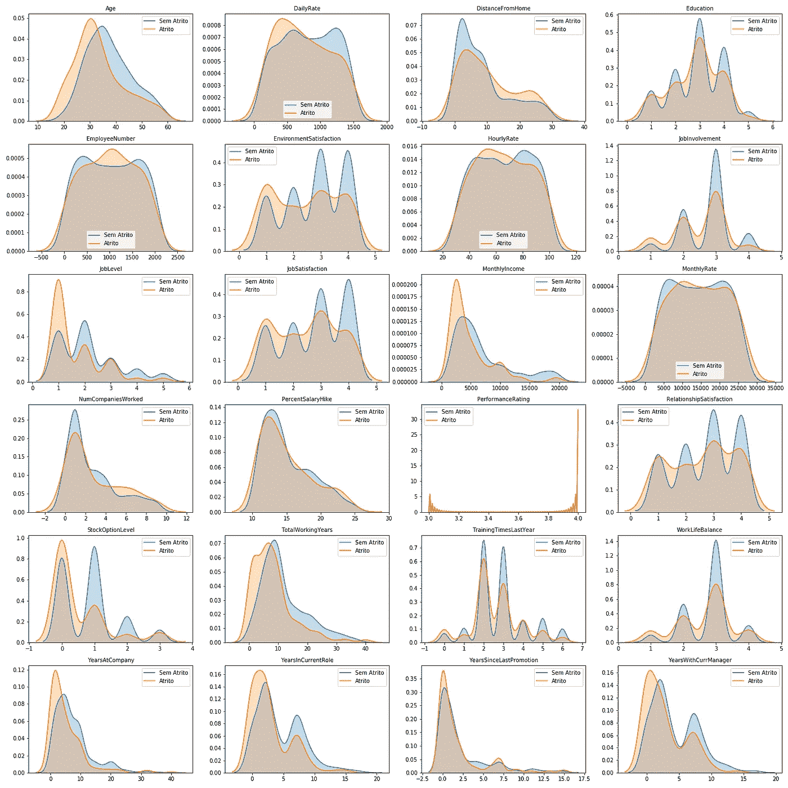

# 利用机器学习降低员工流动率

> 原文：<https://medium.datadriveninvestor.com/reducing-employee-turnover-with-machine-learning-c9a79af7ddd?source=collection_archive---------3----------------------->

如何在人力资源部门使用机器学习，留住自己最优秀的人才？

[https://www.freepik.com/](https://www.freepik.com/)

随着每天产生的数据量的增加，对于公司来说,**至关重要的是知道如何**收集**和**使用**他们的数据，以给他们带来**竞争优势**。**

公司可以通过多种方式从数据科学中获益。例如 [**推荐系统**](https://towardsdatascience.com/recommender-systems-in-practice-cef9033bb23a) 就可以非常有用。但是即使在**电子商务**中，重要的是**理解**和**照顾好你的员工**。

> 考虑到这一点，这个项目的目标是分析可用的数据，并寻找减少员工流动的方法，增加优秀专业人员的保留率。

使用从 [**Kaggle**](https://kaggle.com/) 收集的数据，我们将建立一个能够预测员工中**流失**的**机器学习**模型，它可以帮助公司采取**预防**行动来**最大限度地减少**流失影响，**提高**员工**生活质量**，以及**留住**公司最优秀的专业人士。

**你可以看看完整的项目，所有的分析和代码都在这个** [**链接**](https://colab.research.google.com/drive/10Z92TmOSxSn547UDT5F3Ic2995QpFJ2_) 上。

# 探索性数据分析

第一步是理解我们的数据。使用 Python 和熊猫图书馆，我们可以发现有趣的见解。

**减员**表示员工在工作场所是否出现减员。我们将使用它作为我们的**目标**变量。在我们的数据集中，这将是与**周转率**最相关的特征，这也是我们关注它的原因。

 [## 金融中的机器学习

### 在我们讲述一些机器学习金融应用之前，我们先来了解一下什么是机器学习。机器…

www.datadriveninvestor.com](https://www.datadriveninvestor.com/2019/02/08/machine-learning-in-finance/) 

有了更多的数据，我们可以使用和/或创建新的功能，更好地代表员工离开公司的机会。

# 数字特征

首先，让我们看看数字特征的统计分布:

*   整个公司的平均年龄几乎是 37 岁。
*   大多数员工都受过大学教育。
*   因为我们在谈论一个美国数据集，我们假设收入值是以**美元**计算的。这意味着**在公司的平均月收入**为**6502.93**美元。

# 分类特征

就分类特征而言，我们的分析得出了以下结果:

*   大多数员工没有出现自然减员。
*   **研究&开发**是员工人数最多的部门。
*   **男人**是公司的大多数。
*   在公司最常见的工作是**销售主管**。
*   大多数员工都已经结婚了。
*   大多数员工**不加班。**

# 性别平等

freepik.com

意识到性别平等这样的主题非常重要。这是一项必须认真对待的重要事业。努力减少男女之间的不平等是绝对**必须**的。

有了雇员的收入和教育数据，就有可能检查出性别之间的差异。

Statistical Distribution of Education By Gender — The higher the number, the higher the education level.

当比较性别时，我们可以看到女性的教育水平略高。对于这个变量，数字越高，说明你的教育水平越好。

Salary Comparison In US Dollars.

在这家特殊的公司里，性别平等似乎成为了现实。女性的教育水平略高于男性****，平均工资**高于男性**，在**分析的每一个百分点**中，除了公司最高工资支付给男性。********

# ****密度图****

****密度图是强大的可视化工具，可以帮助我们获得有价值的见解。****

****我们在这里的主要目标是分析我们的**分类**问题的两个**类**之间的**分布**(**损耗** = 0 或 1)。****

****分析每类分布中的**差异**，我们可以识别出对我们的问题**更重要**的一些变量。****

********

> ******黄色**呈现的分布代表有减员的员工**和**蓝色**，对于**没有减员**的员工。******

**我们在这里寻找的是**分布**之间的**差异**，以找到**的关键点**，用于**预测**员工**流失**。**

**总的来说，**分布**与**非常相似**，没有呈现出巨大的差异。因此，我将只分析**与**不同的特性。**

**从这些图表中可以获得一些见解:**

*   ****年龄**的分布导致相信**年轻**的员工有**更强的倾向**进行**减员**。**
*   **说到**离家**的距离，我们可以注意到**距离**越远，员工就越有可能发生**减员**。**
*   ****工作参与度**向我们表明**参与度较低的**员工往往会有**更多的自然减员**。**
*   ****工作级别**表明**级别较低的员工**更有可能出现**流失**。**工作满意度**和**月度收入**也是如此。**
*   **随着**值增加**，StockOptionLevel 和**总工作年限**也显示**减少**损耗**水平**。**
*   ****年入职**、**年入职**、**年升职**、**年离职**在**早年**表现出更多的减员，并随着时间的推移而演变。这可以暗示**适应**的问题，既然**比**短了**比**长，那么**更有可能**比**减员**。**

# ****平衡数据****

**对公司来说幸运的是，出现自然减员问题的员工是少数。对公司来说，这可是天大的好消息。然而，对于我们的模型来说，这并不是最好的情况。为了**提高**的**性能**，并获得更好的**结果**，我们需要**平衡我们的数据**。**

**简而言之，我们要做的是**转换**我们的数据集，以便两个类(流失和非流失)是**平衡的**，**按比例分布的**。**

**为此，我们将在采样器 下使用 [**，因为我们想要**保留少数类**(损耗)。**](https://imbalanced-learn.readthedocs.io/en/stable/generated/imblearn.under_sampling.RandomUnderSampler.html)**

****

**经过适当的平衡后，结果如下:**

****

# **数据预处理**

**为了让我们的数据符合机器学习模型，我们必须对其进行处理。预处理数据时，我们将经历两个不同的步骤:**

*   **类别特征的转换:我们将使用**标签编码器**，它将字符串转换成代表类别的数字。**
*   **数字特征的转换:使用**最小最大缩放器**。简单来说，MinMaxScaler 在从 0 到 1 的范围内对数字进行排序。这个过程也有助于处理异常值，因此我们之前没有处理它们。**

****

**Dataset after Data Preprocessing.**

# **机器学习**

**预测流失和防止人员流动。**

****

**现在，我们更好地了解了我们的数据和公司的现实，并对我们的数据进行了清理和准备，是时候使用**机器学习**来进行**预测**，这可以帮助我们在公司内部防止**人员流失** / **冲突**的**预防**，从而**减少人员流动**。**

**为此，我们将使用两种不同的**机器学习算法**:**

> **逻辑回归**
> 
> **随机森林**

## **逻辑回归**

**为了更好地理解逻辑回归背后的理论，请访问数据科学**。不过简单来说，我就**线性**和**逻辑回归**的区别来引用他们。****

> ****“在逻辑回归中，我们不像线性回归那样直接用直线拟合数据。相反，我们用一条 S 形曲线来拟合我们的观察结果*。*****

********

****Linear vs. Logistic Regression****

## ****数据不平衡的基线****

****由于我们正在进行一个存在于**真空**中的项目，也就是说，没有公司以前使用的或**参数**的**，我们需要创建我们自己的**基线**，这是一个**可接受的成功阈值**，它将作为未来**改进**的**参考**。******

**在这种情况下，我将使用一个**逻辑回归**模型，用我们的**不平衡**数据进行训练。这将是一个重要的参考，从中我们可以得出结论，是否值得平衡我们的数据。**

****

**分析**混淆矩阵**，我们可以看到我们有太多的**假阳性**，这是一个问题。**

*   **尽管有大约 87%的**准确性****，这并不是我们在模型中寻找的全部，我们的**假阳性**清楚地表明了这一点。****
*   ****我们的 **AUC** 是 **0.6291** ，这意味着我们还有很大的**改进空间**。为了更好的理解 **ROC_AUC** ，查看 [**这篇文章**](https://towardsdatascience.com/understanding-auc-roc-curve-68b2303cc9c5?gi=47a7f19e8b78) 。简单来说，为了这个项目，我们只需要明白，**高的**我们的 **AUC 得分**，好的**。******

## ******平衡数据的逻辑回归******

******现在我们有了一个需要改进的基线，是时候使用我们仔细处理过的数据并找到获得更好结果的方法了。******

************

******在这里，我们可以看到使用**平衡**数据的结果比**更好**。******

*   ****尽管有一个**更差的准确性**分数，我们的 **AUC 提高了**，这是好的。****
*   ****然而，我们仍然得到**假阴性**和特别是**假阳性**的**高数字**。****

****总之，我们已经**击败了**我们的**基线**，这本身就是**向**正确方向**迈出的**一步。****

## **随机森林**

**如前所述，我们还将使用**随机森林**对我们的员工进行分类。让我们看看它与以前的型号相比如何。**

****

**顾名思义，**随机森林**是一种**基于树的算法**，随机使用大量**决策树**(森林)。在遍历树之后，它产生树的最常见的结果。**

**让我们看看效果如何。**

****

# **最重要的特性—特性的重要性**

**我们可以进行的另一个重要验证是**特性重要性**，检查哪些特性对我们模型的决策更重要。**

****

# **评估随机森林模型**

****随机森林**模型比逻辑回归稍好。**

**即使不是很大的改进，用**适当调教**、**两个**型号都可以**改进**。**

**然而，**最重要的变量**是**极其有价值的**，因为它们可以给我们**洞察**关于**流失**的最**关键**点，有了这些信息，公司可以在流失发生之前**采取行动。****

**在最重要的变量中，我想强调的是:**

*   **加班绝对是最重要的变量。**
*   **每月收入**
*   **StockOptionLevel**
*   **年龄**
*   **工作级别**
*   **总计工作年数**

**我们可以识别出许多与**职业**、**利益**和**工作量**相关的变量。压力大吗？不被赏识的感觉？这些只是假设。只有对公司和员工进行更深入的分析，才能确定这一点。**

# **结论**

****数据科学**是一个成长中的领域，有很多东西需要**探索**和**改进**。在这个项目中，目标是为**人力资源**部门呈现某种 **MVP** 。**

**毫无疑问，接触到**更多的数据**，**与公司其他团队的协作**，对公司**背景**的更大的理解**以及对所展示模型的**优化**以及其他人的**实施**，那么**结果**会好很多。****

**无论如何，我希望已经提供了有趣的见解，和一个有价值的项目。如果您有任何意见、问题或建议，请随时在 [**LinkedIn**](https://www.linkedin.com/in/rafael-n-duarte/) 上联系我，并在 [**GitHub**](https://github.com/rafaelnduarte) 上查看我的其他项目。**

# **谢谢大家！**

****