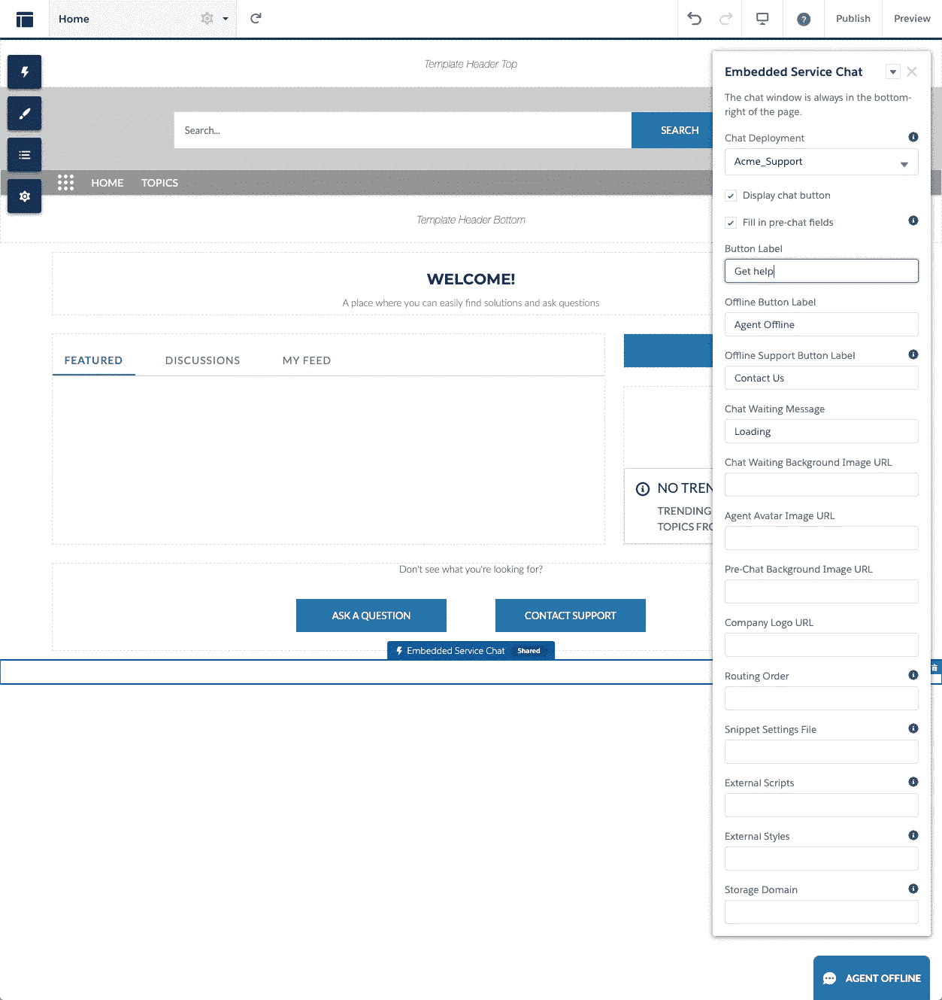
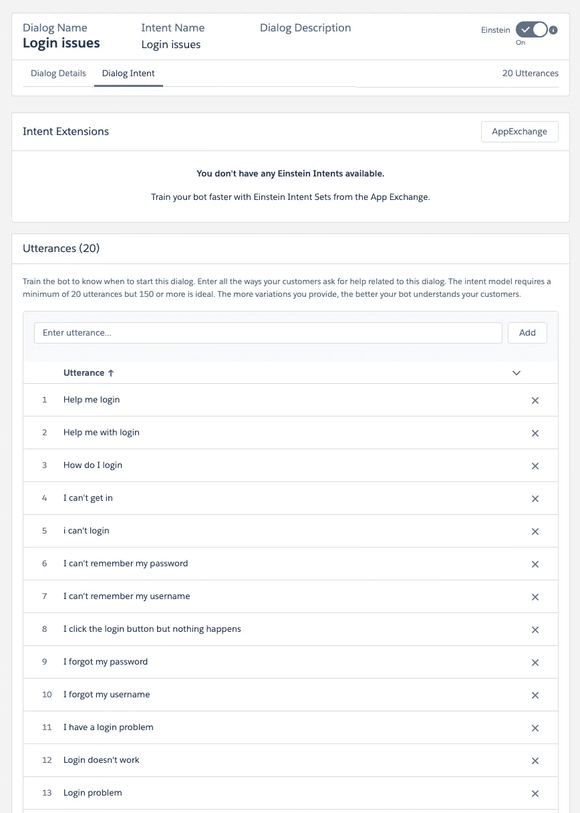
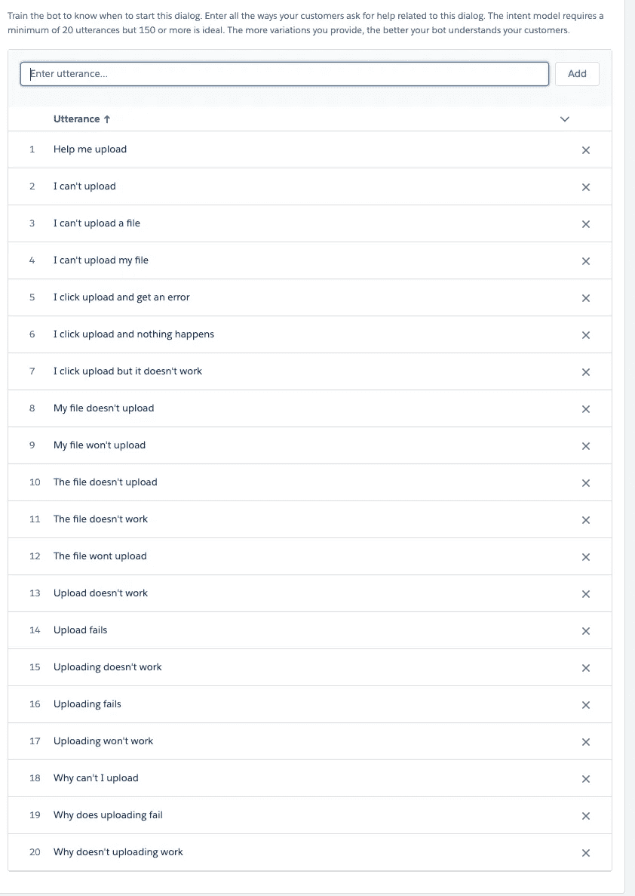
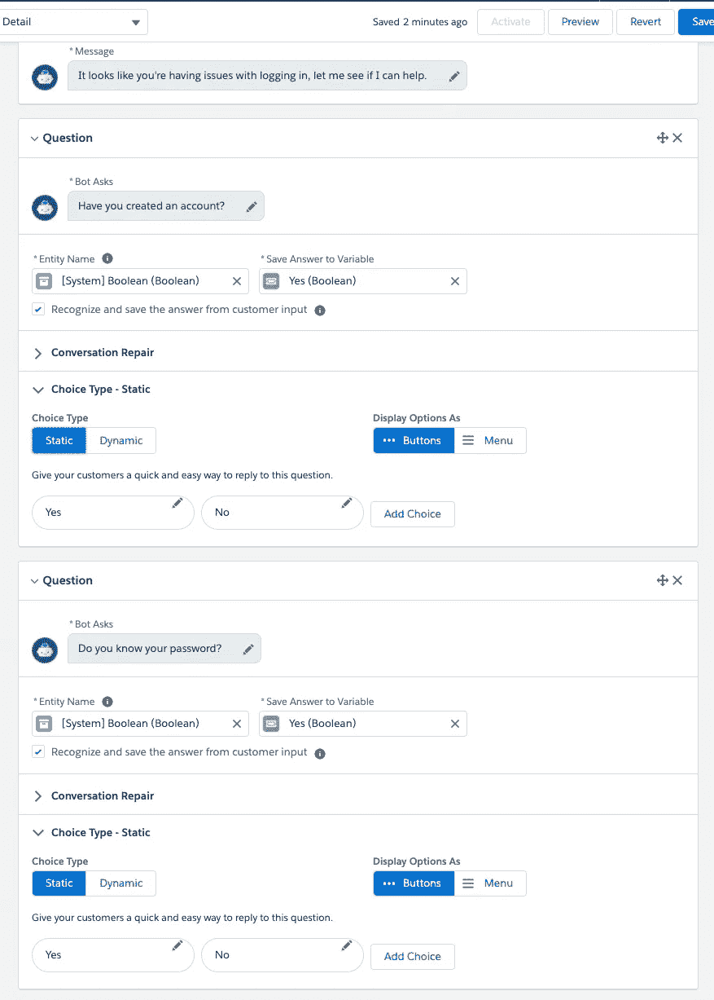
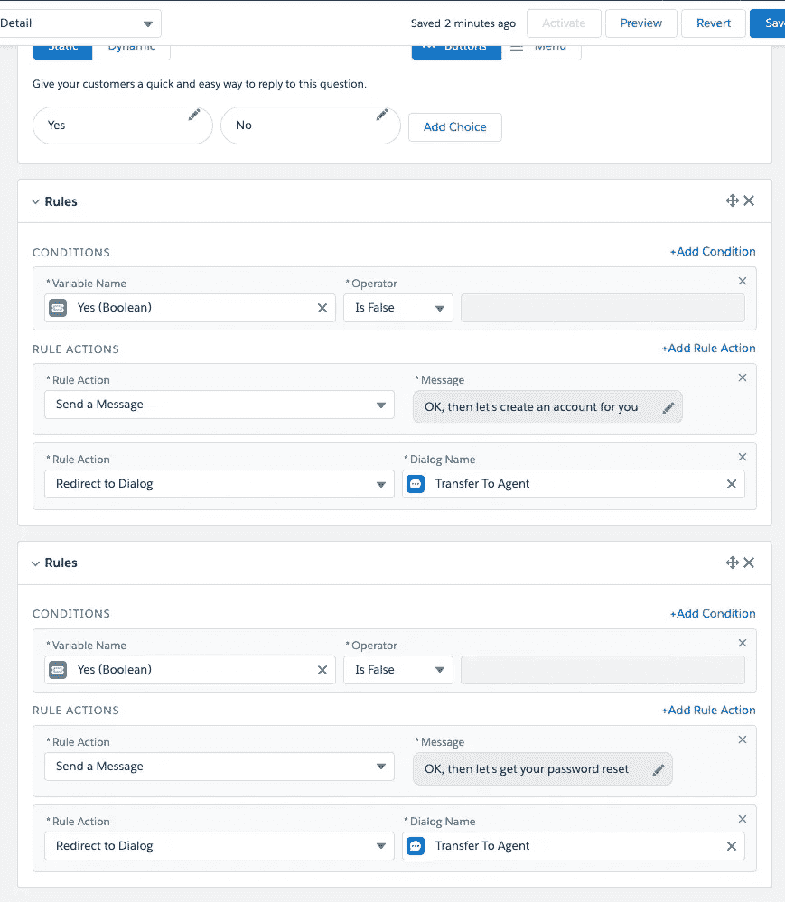
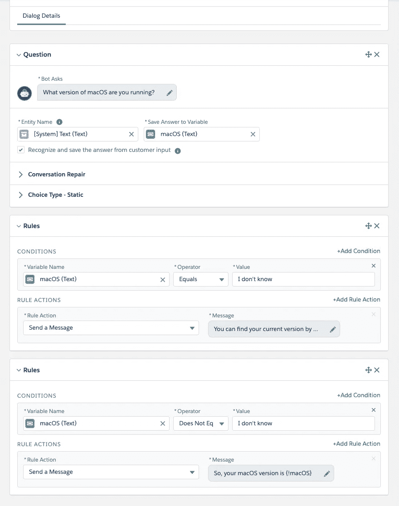
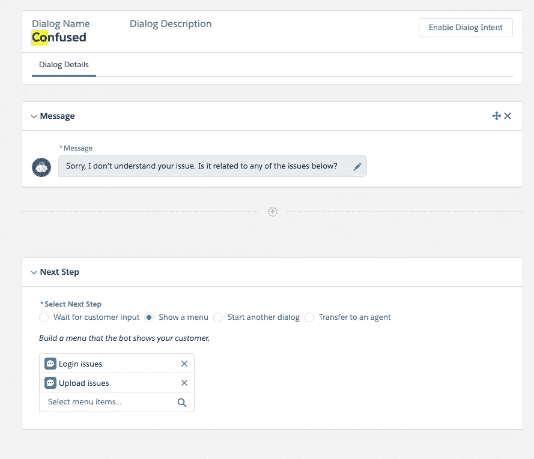
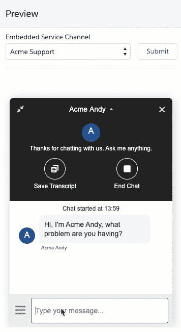
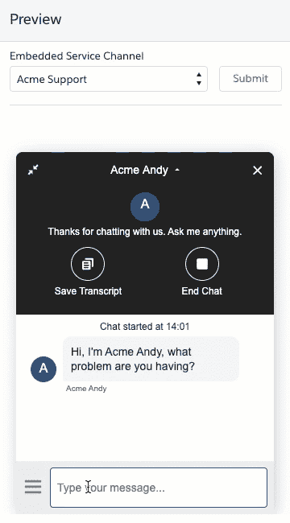
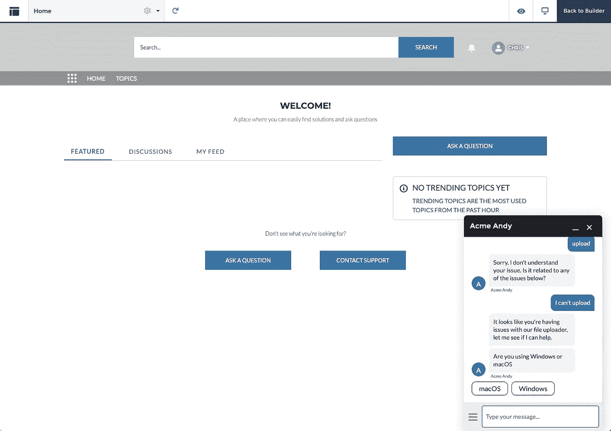

# 使用爱因斯坦驱动的聊天机器人减少支持过载

> 原文：<https://medium.datadriveninvestor.com/reducing-support-overload-with-an-einstein-powered-chatbot-735562630c28?source=collection_archive---------14----------------------->

聊天机器人有各种各样的用例。更常见的用途之一是帮助减少重复性的客户服务工作，使人工代理能够专注于更复杂的个人任务。在本教程中，我为一家小公司创建了一个基本的机器人来协助客户支持团队。该机器人可以回答一些关于虚构软件应用程序的常见问题。该机器人使用自然语言处理(NLP)来识别某些问题并做出适当的响应，如果用户提问，或者该机器人无法理解或回答，则引导用户到人工支持代理。

有很多平台可用于创建机器人，但我决定尝试 Salesforce 的 [Einstein，因为它可以与客户服务团队常用的 Salesforce 数据和工作流集成。](https://developer.salesforce.com/einstein)

# 爱因斯坦聊天机器人

Einstein 是 Salesforce 平台的 AI，为创建预测模型提供基础设施，以与 Salesforce 数据进行交互。这包括分析、文本和图像分析，以及结合了文本分析和 Salesforce 工作流的 bot 平台。

# 创建社区并添加聊天

我想把一个机器人添加到我用 Heroku 建立的外部站点，但是按照步骤创建并把它添加到一个 [Salesforce 社区](https://trailhead.salesforce.com/en/content/learn/modules/service-cloud-platform-efficiency/create-self-service-communities-and-portals)似乎是最简单快捷的方法，因为我不需要建立一个定制服务器或白名单。

第一步是创建社区并添加聊天功能，我的机器人将使用它与客户交谈。我用[这个 Trailhead 模块](https://trailhead.salesforce.com/en/content/learn/projects/build-an-einstein-bot/prep-for-einstein-bots?trail_id=service_einstein)作为向导。对于我的具体情况，我将我的社区称为“客户支持”，并选择了一个适合的域，[*https://acme-users-developer-edition.um6.force.com/support*。](https://acme-users-developer-edition.um6.force.com/support.)我还将一些设置更改为“Acme Support”以适应我的用例，并将我的域添加到*网站 URL* 步骤中。

当您将嵌入式聊天添加到您的社区组件时，请确保您选择了正确的*聊天部署*并配置其外观以适合您的用例。

如果你想将机器人添加到你自己的网页上，而不是为机器人创建一个社区，创建一个“网络聊天”按钮(按照上面 Trailhead 模块中[提到的相同步骤)，然后按照这个 Trailhead 模块](https://trailhead.salesforce.com/en/content/learn/projects/build-an-einstein-bot/prep-for-einstein-bots#Tdxn4tBK-heading5)开始。

在 trailhead 中 webchat 流的末尾，该模块是一个代码片段，您可以将其粘贴到您的网页(包括 Apex 页面)中以添加您的 bot。无论您是在 Salesforce 社区还是在您的自定义站点上实现 bot，创建基于 Einstein 的 bot 的流程都是相同的。

无论您决定在何处托管 bot，都要更新代码片段中的值，以确保您将域添加到网站 *URL* 文本字段，例如，“https://acme-computers . heroku app . com/”。您可以通过更改 CSS 和 JavaScript 值来定制 bot 体验，或者使用`embedded_svc.settings.extraPrechatFormDetails`和`embedded_svc.settings.extraPrechatInfo`参数添加定制的 JavaScript 值。使用`extraPrechatFormDetails`向聊天记录发送附加信息，使用`extraPrechatInfo`将这些值映射到 Salesforce 中的新记录或现有记录。在文档中找到更多细节。

# 创造爱因斯坦机器人

现在到了有趣的部分，用爱因斯坦添加和配置一个机器人。为了开始，我按照[这个线索模块。](https://trailhead.salesforce.com/content/learn/projects/build-an-einstein-bot/set-up-an-einstein-bot?trail_id=service_einstein)

创建一个机器人需要一定程度的预先计划和考虑用户可能如何与机器人交互，以及他们可能对它有各种类型的问题和请求。值得思考的是，您的客户目前如何与人工支持代理进行交互，并找到与机器人进行比较的方法。一个机器人也应该有个性的元素，获得这种个性需要考虑你当前的商业品牌，以及人们什么时候会与你的机器人互动。例如，根据用户的情况，语调可能需要改变。例如，在处理严重问题时，机器人使用较少的幽默可能比第一次问候用户更合适。[sales force 文档](https://help.salesforce.com/articleView?id=bots_service_best_practice.htm&type=5)提供了您可以阅读的其他资源。

这个 Acme support bot 示例旨在帮助遇到问题的人使用一个简单的软件，让人们登录到一个帐户，并上传特定的文件。

你可以在下面看到我添加的初始设置。对于菜单项，我添加了人们常见的两个问题领域:登录问题和上传问题，以及其他几个常规选项。

# 建造爱因斯坦机器人

有了 bot，您就可以开始让它适合用例了。首先，这里有一个 bot builder 部分的概述，以及您可以使用它们来更改什么。

*   *概述*:bot 基本信息和设置。值得检查的是在*通道*部分中定义了一个部署。如果到目前为止您已经遵循了类似的步骤，这可能已经设置为前面聊天设置步骤中的值。在此部分中，您还可以设置希望在会话之间存储的信息类型。
*   *对话框(见上面截图)*:定义用户与机器人的潜在交互点。例如，这可以包括机器人要求用户进行讨论的不同类型的问题。
*   *实体*:您想要从用户那里收集的数据类型。例如，您可以收集客户详细信息、有关技术问题的更多信息或购买偏好。
*   *变量*:存储从用户处收集的特定数据的容器。这些是您存储您定义的或 Salesforce 为您定义的实体值的地方。

 [## 聊天机器人:我们都在学习与机器交谈|数据驱动的投资者

### 当你打算与一家公司进行第一次接触时，它们会突然出现。它们可能是你手机里的声音，也可能是…

www.datadriveninvestor.com](https://www.datadriveninvestor.com/2020/05/25/chatbots-we-are-all-learning-to-talk-to-machines/) 

接下来，我要详细看看最有趣的部分，对话。

# 配置对话框

您可以在左侧菜单中看到一些对话框的一些预定义功能。房子图标显示这是机器人启动的默认对话框，三条水平线显示这是用户可以随时返回的主菜单。还有一些默认对话框，用于结束聊天、转移给人类，或者当机器人不理解时(默认为“困惑”)。

在每个对话框的右侧面板中，您可以定义初始消息和后续步骤，例如请求更多详细信息。

要在机器人上使用 Einstein，你需要点击主面板右上角的*启用对话意图*按钮。然后，点击*对话意图*窗格，开始添加“话语”。话语是用户可能向机器人提出特定问题的方式。一旦你添加了最少 20 个，你就可以从上面的开关启用爱因斯坦。当爱因斯坦被禁用时，机器人只能处理精确匹配的话语；有了爱因斯坦，它就能推断出问题。一旦机器人匹配了一个话语，它就会切换到相应的对话。

对于这个例子，我为登录问题和上传问题对话框添加了话语。如果 Einstein 找到了匹配，那么机器人就会显示一条信息，并呈现一个新的菜单项，要么带客户到某个地方获取进一步的信息，要么指引他们到服务代表那里。在一个生产聊天机器人，你可能会使这更复杂。

在您的 bot 接收到输入后，您可以基于该输入触发后续步骤，这可以是各种选项，包括询问更多问题、重定向到其他对话框、调用 Salesforce 流或 Apex 对象，或者基于用户的后续步骤触发上述不同组合的规则。

例如，一旦我的机器人识别出用户有登录问题，它会询问用户是否有帐户，或者忘记了密码，存储他们的答案并将其重定向到人工代理以寻求帮助。相反，我可以触发 Apex 或工作流。我使用了静态选择，但是您也可以从 Salesforce 对象填充这些选择，或者将用户发送到新帐户或密码重置流程。

您可以输出用户输入的数据，以便与他们确认。例如，在了解用户在上传文件时遇到问题后，机器人会了解用户正在使用 macOS，并询问他们使用的是什么版本。如果他们选择一个值，机器人重复它。如果没有，机器人会提供如何找到版本的说明，并再次询问。

为了改善用户的 bot 体验，可以考虑定制“混乱”的对话框文本。下面我修改了文本并展示了一个菜单，显示了用户体验的一般问题。

# 预览机器人

你可以先点击*激活*和*预览*按钮来测试爱因斯坦机器人。请注意，当 bot 处于活动状态时，您不能对其进行更改。选择合适的*嵌入式服务渠道*，填写联系方式，并测试您的话语、意图和对话。

# 激活机器人

当机器人准备就绪时，点击*激活*按钮，切换回您之前创建的社区，并将社区切换到*预览*模式。现在你可以像普通用户一样和机器人聊天了。

# 随着时间的推移训练机器人

无论你事先训练了多少，当你在进一步的调整和配置后部署你的机器人时，人们会以你意想不到的方式使用你的机器人。有两种方法可以调试问题和适应你的机器人。

第一个是*性能*页面。在这里，您可以看到过去会议的事件记录和发生的事件。

第二个是*模型管理*页面，它向您展示您的话语在用户中的表现以及他们使用的话语。在这个页面中，您可以添加更多的话语，并根据常见用法重新训练语言模型。

# 结论

在本文中，我展示了如何将 Salesforce 的 Einstein bot 平台添加到您的客户服务工具集中，以及您可以用来为客户创建 bot 体验的一些配置和功能。我介绍了如何将 Einstein 聊天机器人添加到 Salesforce 或外部网页，以及如何自定义从这些网页传递给聊天机器人的值。

我们都使用过聊天机器人，这些机器人让我们感到沮丧、困惑，并希望与人类取得联系。创建聊天机器人背后的用户体验，使其变得有用、有价值和个性化，是这个过程中最难的部分。我希望使用一个与客户数据直接集成的平台能帮助你创造出你的客户正在寻找的体验。

*原载于*[*https://dzone.com*](https://dzone.com/articles/reducing-support-overload-with-an-einstein-powered)*。*

## 访问专家视图— [订阅 DDI 英特尔](https://datadriveninvestor.com/ddi-intel)