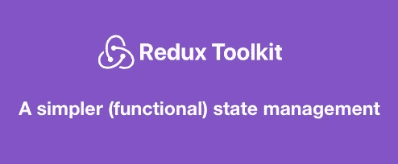

# Redux 工具包

> 原文：<https://medium.datadriveninvestor.com/redux-toolkit-eb07f753649?source=collection_archive---------0----------------------->



## 更简单的(功能性)状态管理

所以我是因为我的一个新项目才知道这个的，这个团队想在投入这个项目之前做实际的研究。他们不想继续使用旧的技术，他们想找点乐子。

所以当我被问及是否做过 React/Toolkit 时，我说是的，以为他们指的是 Redux dev toolkit，但我错了。

**旁注** *这是一个三部分系列的第一部分，在这个系列中，我将带您了解该工具包从初级到高级的特性。*

> ***那么什么是 Redux-toolkit 呢？***

[**-Redux-toolkit**](https://redux-toolkit.js.org/)是实现 *Redux* 的一种新方式，一种更具功能性的方式。它更干净，你写更少的代码行，我们得到相同的 Redux 状态管理，我们开始喜欢和信任。最好的部分是它已经内置了 *redux-thunk* 。另外，他们使用 *immerJs* 来处理所有的不变性，所以我们需要考虑的是需要做什么。

我将创建一个计数器应用程序，以实现工具包的基础。

**注意:我将使用我自己的*[react-boilerplate](https://medium.com/datadriveninvestor/react-boilerplate-adc97f608251)*与*[*Rebass*](https://rebassjs.org/getting-started)*库进行造型*

> ***让我们开始***

首先，让我们添加工具箱、Rebass 和 react-redux:

```
npm i --save @reduxjs/toolkit react-redux rebass 
```

现在在 tradition redux 中，我们用来创建一个*存储*文件夹来保存所有的 reducers、动作和常量(动作类型)文件。这里每个减速器被认为是一个*特征*，所以*存储*文件夹被重命名为 ***特征***/**/*特征*** 。

[](https://www.datadriveninvestor.com/2020/07/07/introduction-to-time-series-forecasting-of-stock-prices-with-python/) [## 用 Python |数据驱动投资者进行股票价格时间序列预测简介

### 在这个简单的教程中，我们将看看如何将时间序列模型应用于股票价格。更具体地说，一个…

www.datadriveninvestor.com](https://www.datadriveninvestor.com/2020/07/07/introduction-to-time-series-forecasting-of-stock-prices-with-python/) 

所以我创建了***features/counter/counter . js***文件，在这里我将实现工具包。

要实现一个缩减器，我们需要三样东西:

*   初态
*   行动
*   减速器本身

redux-toolkit 为我们提供了一些函数，有点像钩子，来创建我们的动作和 reducer。

```
import { createAction, createReducer } from "@reduxjs/toolkit";
```

让我们定义我们的初始状态和减速器:

**注意:我将比较传统实现和工具箱实现*

```
//tradtional reducer
const initialState = 0;

function counter(initialState, action) {
switch (action.type) {
 case 'INCREMENT':
  return state + 1
 case 'DECREMENT':
  return state - 1
 default:
  return state
}}//toolkit reducerconst initialState = {value: 0};const reducer = **createReducer**(initialState, {
"INCREMENT": state => {
  state.value = state.value + 1;
},
"DECREMENT": state => {
  state.value = state.value - 1;
}
});
```

我们的初始值将被设为 0。在我们的 reducer 中需要两个动作，即递增和递减计数器值。

***createReducer*** 函数接受两个参数，第一个是初始状态，第二个是*动作类型*。

在传统的 redux 实现中，我们会为动作类型创建一个单独的文件结构，但是在 *redux-toolkit* 中，它是在一个地方定义的。这极大地提高了代码的可维护性，因为所有东西都在一个地方，而且是结构化的。

> ***让我们再进一步***

在上面的例子中，我们使用了 **createReducer** 方法来定义缩减器，但是让我们分开我们的操作。

**createAction** 方法，正如它所说的那样，它用一个动作类型创建动作，并更新减速器状态。

使用 createReducer 时，使用 builder 函数将操作映射到 Reducer。

```
const increment = createAction("counter/increment");
const decrement = createAction("counter/decrement");const reducer = createReducer(initialState, (builder) => {
 builder.addCase(increment, (state, action) => {
  state.value = state.value + 1;
 });
 builder.addCase(decrement, (state, action) => {
  state.value = state.value - 1;
 });
});
```

通过使用 useDispatch 钩子或 mapDispatchToProps，可以导出和调度这些操作。

createReducer and createAction in action

要查看完整的示例，您可以在这里查看 git repo。

[关于在 Redux Toolkit 中创建切片的第 2 部分](https://abhimanyuchauhan-61309.medium.com/createslice-in-redux-toolkit-c5e5441b75d9)。

## 获得专家观点— [订阅 DDI 英特尔](https://datadriveninvestor.com/ddi-intel)