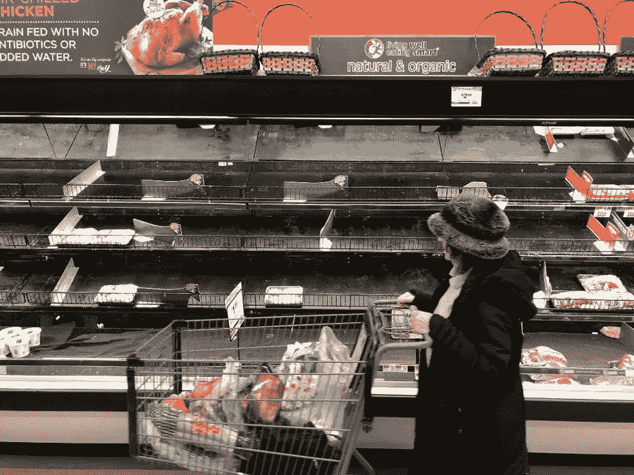
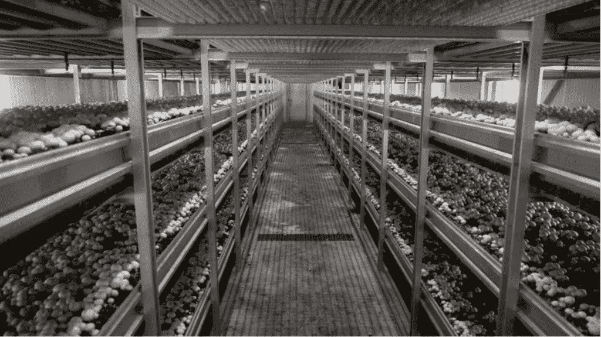
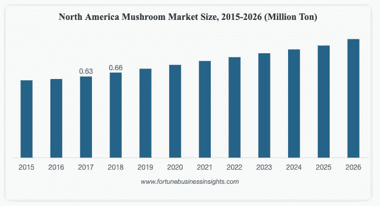

# 里斯特:用机器人收获蘑菇，彻底改变全球食品体系

> 原文：<https://medium.datadriveninvestor.com/reest-revolutionizing-the-global-food-system-with-robot-harvested-shrooms-99eee082ac95?source=collection_archive---------10----------------------->

2020 年的第一场总统辩论已经被认为是公共话语的失败。不幸的是，在 200，000 多人死于新冠肺炎之后，美国如同繁荣时期一样陷入了悲痛之中。在纽约，随着春天记忆的消逝，我们已经看到病例激增。很少有人还能立即回忆起不堪重负的医院和空空如也的超市货架带来的恐慌。我们适应社会距离和面具新常态的能力带来了一种准稳定的气氛。不幸的是，在华盛顿刻薄言辞的阴影下，隐藏着一个摇摇欲坠的食品体系和超过 5000 万粮食不安全公民(包括七分之一的儿童)的真相。

去年夏天，我驾车穿越美国 9000 多英里，观察了无尽的玉米、小麦、土豆、葡萄和柑橘作物。虽然今天的大多数灌溉系统都是全自动的，但收割仍然有非常人性化的因素。随着冠状病毒的需求，严重依赖移民工人和低收入临时工的现行制度的弱点变得非常明显。在 ff Venture Capital，我们已经了解了农业自动化的机遇(Covid 之前)，我们对 Burro 的投资就是证明(见之前的[文章](https://robotrabbi.com/2020/02/24/farm/))。在当前情况下，养活这个国家需要更高的产量、更低的成本和更大的创意。

正如办公室已经接受在线视频一样，农业正在经历一场新的室内自动化解决方案的革命。最新的词条是[李斯特](https://www.reest.io/)。SOSV 的 HAX 加速器，旨在通过其新颖的机器人技术提高全球真菌产量。在与创始人兼首席技术官 Denys Kotelovych 的交谈中，他向我解释了他对创业的顿悟。Kotelovych 的合伙人 Petro Shmigelskyi 住在乌克兰的利沃夫，他的家庭传统是种植蘑菇。“基本上，我的联合创始人的亲戚是一个蘑菇农场的所有者，所以他知道他们面临的问题。主要问题是劳动力、工作条件和产量质量。你必须在蘑菇长到需要的尺寸时就采摘，而且要快，这样它们就不会过度生长。这是一项单调的工作，你必须决定选择哪一个，同时站在高湿度和低温环境中的高架子上，”Kotelovych 解释道。

 [## 智能空中机器人大军将如何革新物流行业|数据驱动…

### 智能空中机器人即将改变运输和物流行业，但还有一些…

www.datadriveninvestor.com](https://www.datadriveninvestor.com/2020/05/15/how-armies-of-intelligent-aerial-robots-will-revolutionize-the-logistics-industry/) 

根据最新的[统计数据](https://www.transparencymarketresearch.com/pressrelease/mushroom-market.htm)，全球蘑菇市场预计到 2024 年将超过 690 亿美元。真菌数量的上升很大程度上是由于人们对蘑菇的营养价值和加工食品消费的认识不断提高。利用当前的市场高峰，东欧企业家分享了他们在分类和收获孢子方面的进展，“我们开始将我们的蘑菇收获机器人租赁给现有的蘑菇农场，这样我们就可以创造收入并制造其他类型的机器人。我们把我们的机器人放在架子上，它们开始扫描蘑菇田，分析数据，跟踪蘑菇并准时采摘那些准备好的，生产装满蘑菇的篮子。最终，我们的目标是建立一个完整的蘑菇养殖解决方案，其中唯一需要的是种植供应品和菌丝体，从而将蘑菇收集到现成的销售箱中，供普通消费者使用。”

在分解他的发明解决方案时，这位机器人专家详细介绍了他的专有机电系统，“我们设计了专门针对蘑菇的夹持器(正在申请专利)，通过我们的软件，我们可以精确地识别那些应该使用深度相机和 CV(计算机视觉)采摘的蘑菇。”Kotelovych 进一步阐述了夹持器如何解决机器收割的最大挑战——不破坏库存。“重要的是不要损坏蘑菇，因为人们喜欢看到又好又新鲜的蘑菇，当你稍微对蘑菇施加太大的力时，它就会变暗，这可不好，”这位自豪的发明家描述道。

除了构建工作原型，这个创新团队还将与美国最大的蘑菇供应商之一 Basciani Foods 一起在美国推出其解决方案。除了大幅提高产量之外，该产品旨在节省 30%的成本。在概述他的商业模式时，Kotelovych 说:“我们每收获 1 公斤蘑菇收取 0.2 美元，相比之下，人工采摘者每收获一公斤蘑菇要支付 0.3 美元+其他费用。因此，现在节省了 30%，不仅是价格，而且通过使用我们的算法，我们可以通过仔细选择最佳收割策略来提高总产量。”这家初创公司目前正在筹集资金，在未来 18 个月内制造 100 个机器人。当我追问这位技术专家对未来机会的看法时，他解释说，“我们也考虑过其他作物，但蘑菇产业是一个巨大的市场，所以我们现在完全专注于此。”

随着疫情的继续，Kotelovych 认为这是解决劳动力问题的最佳时机，“即使在 Covid 之前，种植者也在与人斗争，这很正常，没有人愿意在这样的环境中做平凡而乏味的工作，所以是的，Covid 只是向所有人展示了这个问题应该自动化。”他进一步反思道，“当我们看到蘑菇行业与劳动力相关时，我们感到很奇怪，所以我们立即看到了机器人的机会……我现在在农业领域看到了很多机会，所以我的真实看法是，我们将很快看到大量的机器人。”

## 获得专家视图— [订阅 DDI 英特尔](https://datadriveninvestor.com/ddi-intel)

