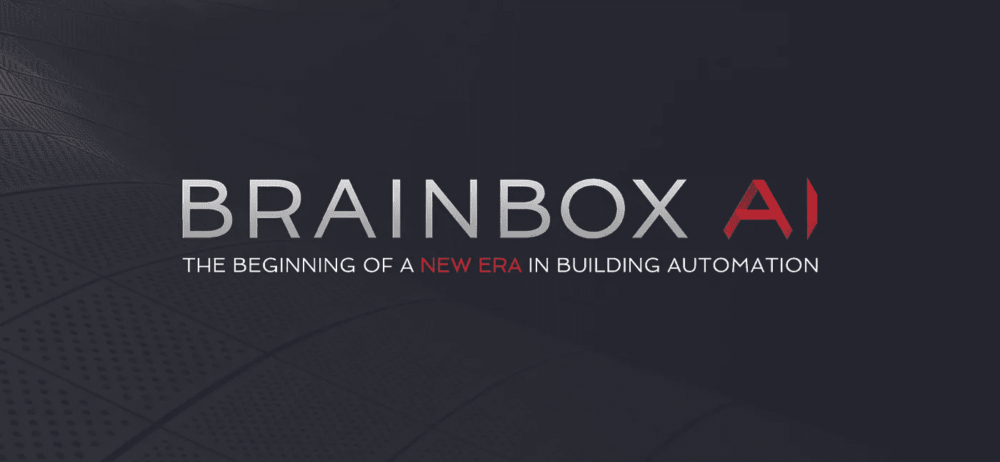
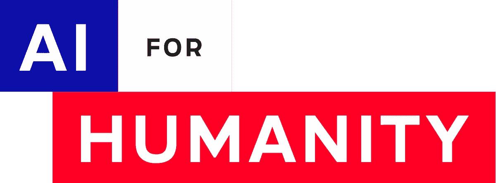
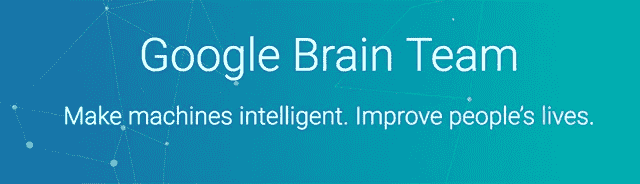

# 对 2020 年虚拟世界峰会的思考

> 原文：<https://medium.datadriveninvestor.com/reflection-on-the-2020-virtual-world-summit-ai-b5f3bc219a6d?source=collection_archive---------18----------------------->

我最近有机会参加世界人工智能美洲峰会……这意味着作为一个高中生，我可以花两天时间坐在地下室听一些人工智能领域的顶尖专家谈论他们的工作，并有机会与他们中的一些人交谈！！

由于新冠肺炎疫情，会议被转移到虚拟形式，我想花点时间感谢 InspiredMinds 团队，是他们让这一切成为可能。事实上，这种体验几乎更丰富，因为它是在线的。我可以安排 30 分钟的时间与演讲者和其他与会者进行一对一的通话，而不是只有几分钟的时间与人交谈。

 [## AI 将军是否已经超过了人类的智力容量？数据驱动的投资者

### 不仅在游戏中，而且在劳动力市场上，机器都比人类聪明。在今天的许多领域，使用…

www.datadriveninvestor.com](https://www.datadriveninvestor.com/2020/02/12/has-general-ai-exceeded-the-intellectual-capacity-of-humans/) 

正如你所想象的，所涵盖的主题是高度多样化的，并且从许多不同的角度进行探讨，因为人工智能是如此的交叉。**气候变化、人工智能中的战斗偏见、机器人传感和 ML 驱动的漏洞修复**只是研究领域中的一小部分。

> **我真正感到震惊的是对社会公益和道德责任的强调。**

有了这样一种无处不在的强大技术，简单地利用它来获取利润或权力可能很容易，但我欣赏每个人保护隐私和使用人工智能来积极改变世界的承诺。

我想分享一下现在人们用人工智能做的疯狂事情的快照。

## 气候变化:

气候变化显然是一个主要的紧迫问题，也是人工智能的主要用例，因为有大量的气候和天气数据。

支持可持续企业的人工智能咨询公司 Axionable 的首席安全官亚历克西斯·汉纳特(Alexis Hannart)讨论了两个当前的应用。风能和太阳能可再生能源随着能源消耗需求而波动。目前的天气模型通常预测 24-36 小时的时间范围，为短期预测留下了机会缺口。**能够预测短期风力和太阳能波动对于我们能够可靠地使用可再生电网是必要的。**

他还谈到使用 CNN 来识别早期飓风和其他风暴，并预测它们的强度和位置。虽然现在很关键，但随着气候变化导致更严重的风暴，这将变得越来越重要。

在 BrainBox AI，CTO Jean-Simon Venne 讲述了他们在实现**主动 HVAC 系统**方面的工作。当前的加热和冷却系统只是在温度超出其正常范围时启动，然而，这迫使其过度补偿，并导致温度在过低和过高之间波动，从而消耗大量能量。他们的解决方案使用传感器已经收集的数据，通过 LSTM 运行数据，并主动启动 HVAC 系统。他们的全自动系统非常精确，节省了大量能源。

萨沙·卢乔尼(Sasha Luccioni)是一名博士后研究员，也是人工智能造福人类科学项目的负责人，他也谈到了许多应用，其中许多应用都专注于提高意识，让更多人参与进来。

她致力于找出问题和技术之间的交叉点(信息在 [climatechange.ai](https://www.climatechange.ai/) )，并为出发点提供资源和想法。她指出的一些研究领域是:*优化电网分布，改进电池技术，优化运输流程和供应链，绘制农场排放地图，精准农业，根据湿度和风力使用无人机播种，以及跟踪媒体对气候变化的报道*。

她还致力于将模型对未来的预测转化为人们可以看到的图像。搜索 50 年后你所在的位置，看看 5 英寸的洪水是什么样子，会让影响变得更加明显。

最后，她谈到了这些最大似然算法产生的 **GHG 排放**。这里有一个网站,可以让你计算你的算法的排放量，这样你就可以更清楚，也许花更少的时间来训练你的算法，或者使用更可持续的服务器。

## 道德:

人工智能依赖于数据，有太多的事情可能出错。

**隐私** —数据来自何处与保持数据安全一样重要。应该制定什么样的规则或政策来保护我们？刮掉图像是可以接受的还是应该付费？

**偏差** —由于算法是根据数据训练的，**如果数据有偏差或不够多样化，那么算法将是不准确的，并使偏差永久化**。如果你训练一个模型来预测你是否想要雇用某人，它可能会接受更少的女性，因为这就是你的数据所描绘的。Samasource 的高级产品经理 Audrey Boguchwal 谈到了一项**研究，该研究表明，计算机视觉算法很难识别深色皮肤的行人，只是因为它没有获得足够多的深色皮肤人的照片**来识别他们是人。如果我们的自动驾驶汽车不能识别某些类型的人，这就是一个主要问题。因此，对于算法来说，拥有高质量、多样化的数据和不断学习以限制偏差是至关重要的。

信任——怎样才能让我们信任人工智能？许多演讲者提出的观点是**人工智能是一个如此宽泛的术语，以至于将人工智能作为一个整体进行分类和决策是没有意义的**。我们已经在许多事情上信任 AI，从导航到 Siri 和 Alexa 到路由数据包，没有人对此有问题。然而，仍然有许多问题需要解决，有些是合理的，有些不是。

> 解决这些问题的关键是技术专家、政策制定者和公众之间的密切合作，以确保每个人都受到教育，并采取适当的预防措施。

## 机器人技术:

机器人技术是理解和收集自然世界数据的伟大工具。麦吉尔大学计算机科学学院院长 Gregory Dudek 谈到了我们如何在许多方面涵盖了尺寸、可部署性和灵活性，但对于完全自主的智能机器人来说，仍然有许多障碍。

机器人很难选择应该收集什么数据。他讨论了解决这个问题的几种方法:

*   科学家指出什么是有趣的。这要求科学家能够清楚地阐明奖励和决策过程，以便机器人可以实现贝叶斯奖励学习。
*   **搜索最多样化的数据**。在这种情况下，机器人只是被允许漫游，并发回它发现的 6 个最不同的图像。这个问题是，并不是所有的多样性都是好的。一个水下机器人拍摄了一段珊瑚的镜头，发回了一张沙子的图像，仅仅是因为它与珊瑚不同，而这张图像与另一张几乎相同，只是它有一根悬在里面的电线。虽然这两者都是独特的，但它们不是有用的数据。
*   **导航到最有趣的事情**。机器人被允许跟随照片中最有趣的部分。在这里，它也追求新鲜感，在看了一件东西一会儿后，它就厌倦了，继续前进。然而，并不是所有这些都有用，例如，中途被一只乌龟分散了注意力。所以问题是，机器人如何在其一般任务的背景下确定什么是有趣的？
*   **补丁检测**。在前面的例子中，当机器人跟踪某物时，它可以使用 CNN 识别不同帧中的物体。因此，科学家想要教它他们觉得有趣的东西，可以只标记一个物体有趣或不有趣，机器人将知道所有其他相关的帧应该有相同的标签。

在一篇完全独立的文章中，GlobalDWS 的首席技术官和联合创始人 Rami Wehbe 谈到了他们使用**服务机器人帮助老年人护理**的工作。他们的机器人具有“视觉”、语言处理、语音和运动能力，可以为老年人提供陪伴和照顾。

我还和法尔哈德·拉赫巴尼亚聊了聊，他是诺托斯科技公司的创始人之一。我们谈到了他们的工作**使用生物仿生和 ML 来提高无人机的效率，以了解气流和温度梯度，从而确定最节能的飞行路径**。他们的技术允许无人机用更少的电池运行更长时间。

## 其他一些有趣的事情:

丹尼·塔洛是谷歌大脑研究团队的工程师，他正在研究如何利用人工智能为开发者提供错误修复建议。我们讨论了**代码如何具有结构，因此最好使用图网络**进行分析，而不是将其压缩成线性数据。在这种情况下，它有点像分子，结构告诉你一些超出精确公式的东西。我还了解到，围绕哪些代码允许您进行培训存在许多安全问题，在拿出产品的概念验证版本进行测试和使其足够准确以有所帮助而不是有害之间存在微妙的平衡。

我与加州大学伯克利分校的心理学家 Celeste Kidd 进行了交谈，他的实验室专注于理解我们如何学习。她发现我们对某事的信心大多基于最近的证实。如果你搜索某个东西，在看了 3 个 3 分钟的视频后，所有视频都说了同样的事情，你对它是真的信心会非常高，你会把它当作事实。一旦你达到这一点，几乎不可能说服你不这样做。在一个网上信息如此之多、假新闻越来越多的时代，这个问题尤其重要。她的实验室现在正致力于找出阻止人们快速做出这些决定的方法。

在更技术性的方面，Samy Bengio 谈到了谷歌在理解深度学习为什么有效上的大脑团队合作。他认为这是一个非常重要的问题，这样我们就可以了解算法是如何工作的，以及它们何时不工作。

一个问题是**算法是记住训练数据还是创造归纳**？传统的想法一直是，参数越多，训练数据误差就越小，但过了某一点后，测试数据误差就会因为过拟合而增大。

他们进行了一项测试，其中一个算法被给予一组带标签的数据，另一个副本被给予相同的数据，只是带有随机标签。在这两种情况下，训练数据被 100%准确地识别，而测试数据被准确地标记为正确标记的数据，而不是随机标记的数据。**这意味着，即使当训练数据精度移至 0 时，测试数据仍会下降**，测试数据误差曲线不再像 U 形，而是在插值阈值后下降。这很好，因为这意味着我们的模型可以更准确，我们不需要太担心过度拟合。

他讨论的另一个问题是**神经网络中的所有层是否同等重要**。通过将一些层的输入参数替换为最初设置的参数，**他们能够发现一些层是关键的，而其他层是稳健的**。这是有希望的，因为这意味着只有关键层才是真正重要的，其他层有很大程度的灵活性。

总的来说，这是一次令人惊叹的经历，无论是听演讲还是与人会面，我都学到了很多关于人工智能的各种应用以及 ML 开发人员必须处理的重要道德和安全问题。

*大声喊出来* [*伊莎贝拉·格兰迪奇*](https://www.linkedin.com/in/izzygrandic/) *，TKS 多伦多团队，以及* [*迈克尔·拉斯普兹*](https://www.linkedin.com/in/michael-raspuzzi-b3409194/) *给我机会出席！感谢所有在会议期间抽出时间与我交谈的人！*