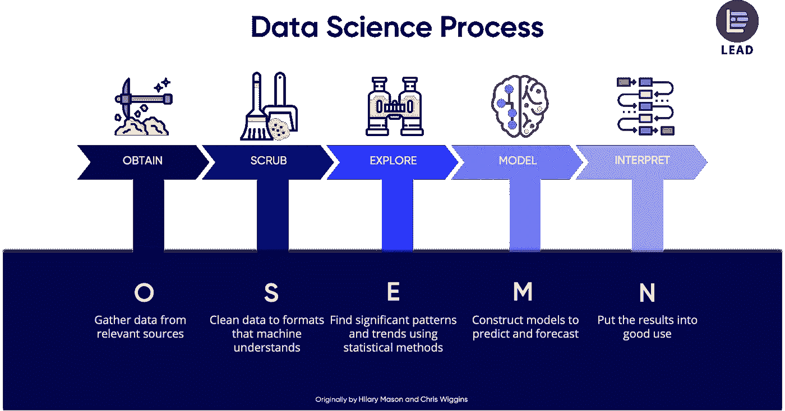
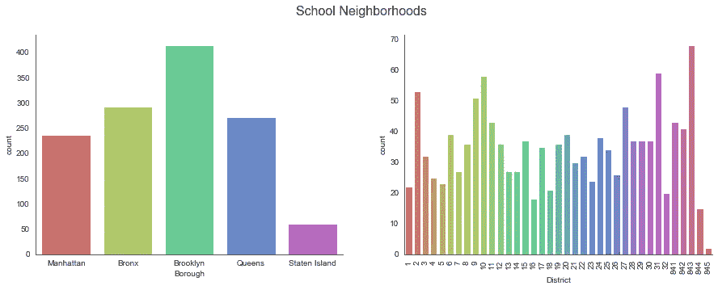
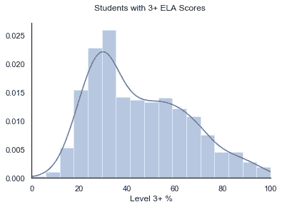
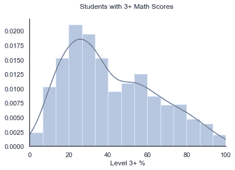
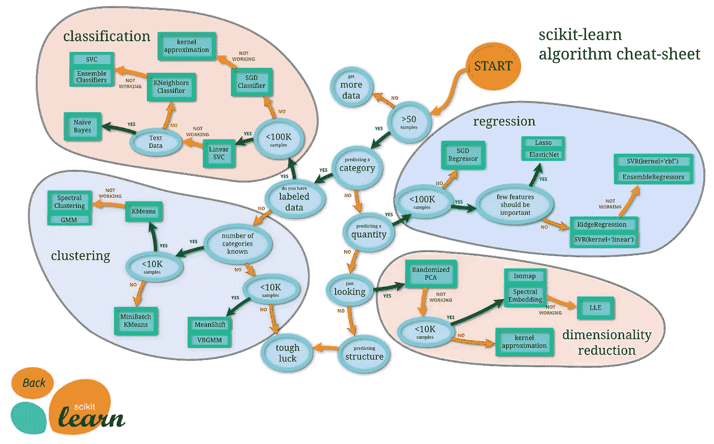
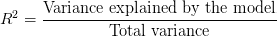

# 纽约市公立学校 NYS 英语和数学成绩的回归分析

> 原文：<https://medium.datadriveninvestor.com/regression-analysis-of-nyc-public-schools-state-assessment-scores-aeecc1bff9fc?source=collection_archive---------7----------------------->

Photo by [Feliphe Schiarolli](https://unsplash.com/@flpschi?utm_source=medium&utm_medium=referral) on [Unsplash](https://unsplash.com?utm_source=medium&utm_medium=referral)

作为纽约市教育局(NYCDOE)的前教师，我的经历强烈依赖于学校的环境，这导致了我的问题:学校的环境如何影响学生的 ELA(英语语言艺术)和数学评估分数。

我使用监督机器学习技术来分析我找到的数据集。监督学习是当数据集被标记时，具有输入和输出参数。

# 数据科学过程

我经历了 OSEMN 过程的每一步，你可以在下面看到，使用机器学习来预测一所学校在纽约州(NYS) ELA 和数学评估中获得 3 级或 4 级的学生百分比，达到或超过目标的学生百分比。

## 1.获取(数据收集)

这些数据来自 NYCDOE 的[开放数据网站](https://infohub.nyced.org/reports/school-quality):它提供 2017-2018 学年给学生、家长和老师的质量审查(QR)报告和调查结果。该数据由 1276 行(来自纽约市所有 5 个区(曼哈顿、布朗克斯、布鲁克林、皇后区和斯塔滕岛)的 1276 所学校)和 16 个特征(QR 报告中的 11 个不同类别和调查中的 5 个问题)组成。

关于学校质量的 QR 类别:

*   支持性环境
*   有趣且富有挑战性的课程
*   有效的教学
*   有效的学校评估
*   明确传达高期望
*   教师协作
*   安全、包容、社会情感成长
*   资源分配和管理
*   确定、跟踪和实现目标
*   深思熟虑的教师发展和评价
*   学校决策评估与调整

关于学校环境的调查问题:

*   合作教师
*   有效的学校领导
*   严格的指导
*   牢固的家庭-社区关系
*   信任

## 2.擦洗(数据清理)

作为机器学习的数据准备的一部分，我首先使用了 *join* 函数将 QR 报告的数据帧与调查结果的数据帧结合起来。然后，我将 QR 评级编码成数字(“未达到目标”1、“接近目标”2、“达到目标”3、“超过目标”4)。这个过程的最后一部分是处理丢失的值。5 个特性有缺失值，但每个特性有不到 20%的值缺失，所以我使用中值来替换每个缺失值。

## 3.探索(EDA 探索性数据分析)

我使用了各种可视化工具，使用 Python 的 Matplotlib 和 Seaborn 包，在数据中寻找模式和趋势。

下面的图表显示了 1276 所学校在五个区和 37 个区的分布情况。我查看了这一分布，以了解数据来自哪些地区。

下图显示了在 ELA 评估中获得 3 级或 4 级的学生百分比分布。

下图显示了在数学评估中获得 3 级或 4 级的学生的百分比分布。

## 4.模型

监督学习有两种类型:*回归*和*分类*。回归是当你的输出(你预测的值)是连续的，预测一个数量。另一方面，分类是当你的输出是离散的，预测一个类别。

我按照 [scikit-learn 指南](https://scikit-learn.org/stable/tutorial/machine_learning_map/index.html)选择了一个合适的机器学习算法:因为我预测的是一个数量，样本少于 100k，所以我使用了岭回归、SVR(线性和‘RBF’核)和随机森林回归(整体回归)。我还在 scikit-learn 和 statsmodels 包中使用了多元线性回归来分析各种特性的重要性。我使用 GridSearch 进行超参数调优来优化模型，并使用 R 平方分数进行评估。

r 平方衡量数据与拟合回归线的接近程度。R 平方越大，回归模型就越符合观察值。

## 5.口译

在预测一所学校在 ELA 评估中获得 3 级或 4 级的学生比例时，随机森林回归法得分最高。

五大预测特征:

1.  有效的教学
2.  确定、跟踪和实现目标
3.  学校决策评估与调整
4.  清晰的沟通——高期望值
5.  有效的学校领导

在预测一所学校的学生在数学评估中获得 3 级或 4 级的百分比时，采用“rbf”核的 SVR 得分最高。

五大预测特征:

1.  信任
2.  有效的学校评估
3.  有趣且富有挑战性的课程
4.  深思熟虑的教师发展和评价
5.  有效的教学

# 结论

正如你在上面看到的，有效的教学和学习是对预测一所学校在 ELA 和数学评估中获得 3 级或 4 级的学生比例影响最大的特征之一。这些模型的结果表明，学校应该把重点放在这一领域。关于“有效的教与学”需要什么，质量审查标题规定:

> 教师教学源于一套连贯的信念，即学生如何学得最好，这些信念由州标准提供信息…与课程相一致，吸引并满足所有学习者的需求，以便所有学生都能产生有意义的工作成果

# **挑战和后续步骤**

我遇到的最大挑战之一是在一个小数据集中。虽然数据只有 1276 个观察值是有意义的，因为这项研究只涉及纽约市的公立学校，有 1276 所学校，但小数据集可能是 R 平方得分低的因素之一。

为了获得更多的数据，我想使用多年的质量审查和调查。这将使我也能看到学校质量如何在几年间发生变化，以及这如何影响学生在 ELA 和数学评估中的表现变化。