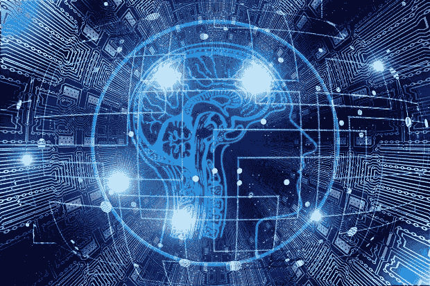

# 重新人性化数据和分析|数据驱动的投资者

> 原文：<https://medium.datadriveninvestor.com/rehumanizing-data-and-analytics-data-driven-investor-5a3b209cdcfc?source=collection_archive---------15----------------------->

我对社交媒体有点又爱又恨。我阅读其他人不得不说的话，以至于被激怒到足以激发我写作，希望激起一场讨论，这反过来又激怒了我，让我再写一些来激起更多的讨论。我想这是我自找的！

我最近的几个小妙语得到了一些有趣的回应。这里有一个:

我:“实施有效数据治理的许多挑战都与关于治理数据的错误观念有关。数据无法治理；它们是无生命的。更确切地说，是处理和使用数据的“人”需要被治理。即使是最复杂的人工智能也起源于人。”

对此，一位数据专家回应道:“数据是可以管理的。”(我确实意识到这将完全取决于“治理”的定义。)

这是另一个。有一个帖子将经典编程/ [机器学习](http://www.datadriveninvestor.com/glossary/machine-learning/)和演绎/归纳推理相提并论，暗示是计算机在进行推理。我的回答是:

我:“我明白这个想法，但不是计算机在进行推理，而是编程背后的人在进行推理。计算机只是接收指令让它发生。让我们不要赋予计算机它们不具备的能力，也不要让我们的同类进一步延续这种能力。”

原帖反过来回应:“计算机会推理。”

我可以说许多丰富多彩的事情，但我克制自己不这样做可能对每个人都有好处。

 [## 数据科学和软件工程哪个更有前途？数据驱动的投资者

### 大约一个月前，当我坐在咖啡馆里为一个客户开发网站时，我发现了这个女人…

www.datadriveninvestor.com](https://www.datadriveninvestor.com/2019/01/23/which-is-more-promising-data-science-or-software-engineering/) 

在哲学层面上，这些争论呈现出不同的视角，让你思考。我自称是观点多元化的拥护者——我相信，无论你做什么，都有必要让我们脚踏实地、卓有成效，尤其是在数据和分析领域。然而，从这些交流的背景来看，我几乎可以肯定，这些评论的情绪并不涉及深刻的哲学问题，以人道为代价，我对此感到非常不安。

如果我有一个相对较大的数据专家团队，我会希望有一些哲学上不同的人带来不同的视角。但是，如果你的数据团队主要甚至完全由诚实地认为数据和计算机可以承担我们作为人类视为近乎神圣的责任的人组成，那将是有害的。当您有一个较小的数据团队时，或者当您仍然处于数据和分析工作的早期阶段时，它就不那么宽容，并且更容易受到业务和数据之间更大的脱节的影响。这是你雇用谁作为第一个分析专家如此重要的关键原因之一——它可以成就或摧毁组织的分析未来。

我见过很多这样的例子，这些观点是战术主流。这太常见了，可能是显性的、隐性的，甚至是无意的；可悲的是，这些观点往往被本应更了解情况的数据专业人士和被误导的商业领袖所延续，他们含蓄而无意地让数据和分析承担了本应属于人类的角色和责任。比如拥有决定权。比如问责制。

尽管它很流行，但当我遇到“数据驱动”这个术语时，我会退缩。它低估了人类在决策中的作用。数据很重要，但它们并不能驱动我们；它们只是让我们有机会更好地了解情况，从而更好地“为人服务”。如果我们允许数据驱动我们，我们就允许自己屈从于数据；我们没有尽到做人类事情的责任。如果我们真的需要什么，我更喜欢“基于数据的”或“面向数据的”。

我还认为“数据文化”和“Excel 文化”一样重要。数据是人们使用的工具，文化不是围绕着工具形成的。如果我们让一个工具来定义我们——而不是帮助或补充——我们的行为方式，那么我们只是在偷懒，我们应该为此感到困惑。

以分析的民主化为例。许多这方面的尝试都以分析的无政府状态告终；这与流行的分析民主化解释有关，这种解释关注技术可用性和可访问性，而几乎总是忽略一个关键因素——治理——当然是使用分析的人。以及没有适当地注意到与他人合作和分享的真正需要，这种需要使我们的日子过得充实而有价值，以及其他人类的事情。

我担心，在我们开始担心人工智能接管人类之前，我们要么没有意识到，要么错误地接受，或者更糟的是，习惯于数据和分析中的非人性化想法。好像我们正在允许甚至促进这种情况发生。数据和分析，包括人工智能，如果不是以人为中心，就什么都不是。把人放在第一位，用数据来支持我们变得更人性化，我们都会过得更好。

*原载于 2020 年 3 月 9 日*[*【http://www.datadriveninvestor.com】*](http://www.datadriveninvestor.com/2020/03/09/rehumanizing-data-and-analytics/)*。*