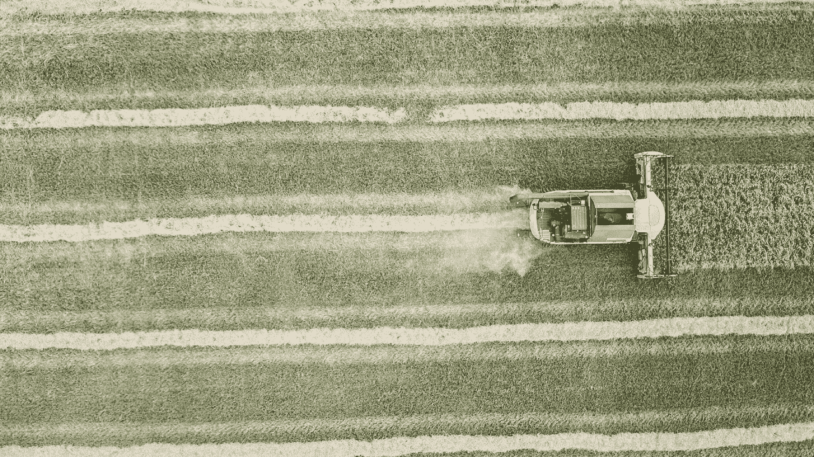
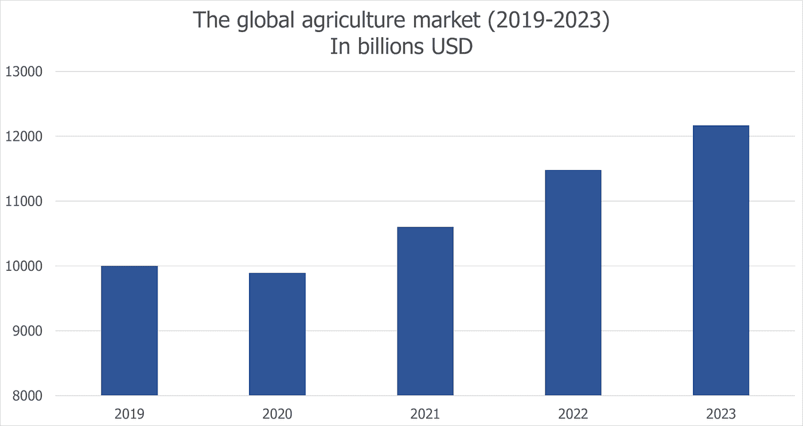
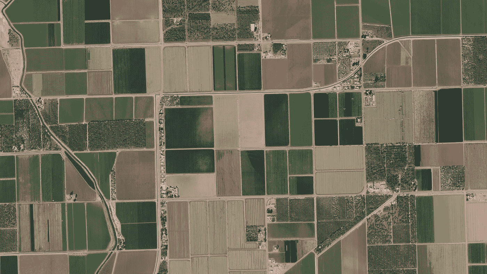
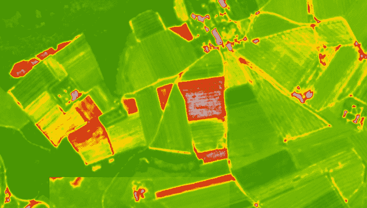
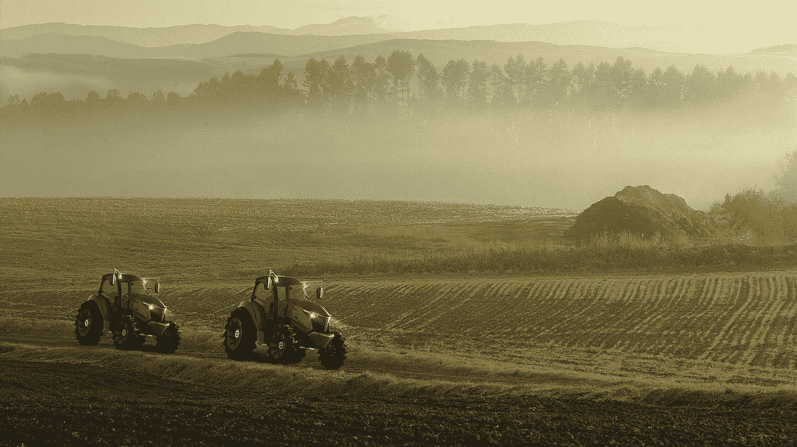
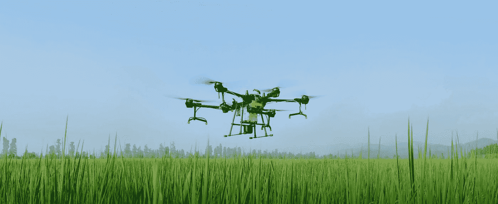

# 利用数据分析和机器学习重新想象农业

> 原文：<https://medium.datadriveninvestor.com/reimagining-agriculture-with-data-analytics-and-machine-learning-fafe757f78df?source=collection_archive---------4----------------------->

根据[研究](https://www.thebusinessresearchcompany.com/report/agriculture-global-market-report-2020-30-covid-19-impact-and-recovery)，全球农业市场预计每年增长 8%，2023 年达到 12 万亿美元。由于这种增长，需要应对该行业的最大挑战，如世界人口增长、城市化进程加快、自然资源的紧张使用以及全球气候变化。满足食品需求的方法之一是广泛使用数据驱动技术。

在过去的五年里，数据大大加强了精准农业的地位，提供了在哪里、如何以及何时播种的重要知识。数据分析已经成为了解农田当前状态的不可或缺的信息来源，同时也允许根据历史信息管理作物和预测产量。这就是为什么现在比以往任何时候都更需要收集和最大限度地发挥农业数据的价值。

# 如今数据是如何收集的

如今，农场数据最常见的来源是卫星和无人机图像、田间的物联网传感器以及拖拉机、播种机、收割机、化肥等农用车辆。让我们快速了解一下农业分析中最常用的数据源。

## 卫星和无人机图像

卫星图像可用于各种场景，如远程监测农田、跟踪作物生长、确定田地边界、识别杂草等。如今，农业科技初创公司和农民使用来自哨兵等经典卫星星座的数据。Sentinel 的优点是免费提供数据，图像以各种波段传送，如 RGB 或红外。但是 Sentinel 有一些缺点，比如图像分辨率差，数据更新频率低——每三到五天更新一次。

下一代卫星，如 Planet 或 DigitalGlobe，正在处理 Sentinel 的缺点，提供近实时更新和高分辨率图像。在这些数据的帮助下，有可能详细地监控田地的状态，建立精确的专题地图，并检查收获的健康状况。然而，这些解决方案也有自己的缺点:对于农民来说，图像成本高；对于开发商来说，原始图像中的波段数量少。

*PlanetScope imagery example, Desert Agriculture, Bard, California, USA. Source:* [*Planet Lab*](https://www.planet.com/gallery/#!/post/desert-agriculture)

此外，一般来说，如果田地被云覆盖或者有阴影落在上面，卫星图像就没什么用了。为了最大限度地减少这些事件，数据科学家将来自多个来源的图像(如卫星和航空图像)结合起来，以创建一个无干扰的整体画面。这也被称为混合意象。航拍是用无人机，飞机，甚至热气球来进行的。种植者最常使用无人机，因为它们以低成本提供高分辨率图像。然而，不可能每天都发射无人机，因此图像更新的低频率影响了这类解决方案的准确性。

## 物联网传感器

物联网设备已经在农业中使用了很长时间。这一切都始于 90 年代初 GPS 技术的兴起，当时美国空军将定位系统用于民用任务。自那以后，农民们越来越多地将注意力转向农业设备和传感器，而以前这些设备和传感器只有军方或科学家才能使用。

市场上已经有几十种设备，可以直接安装在田间。在他们的帮助下，农学家可以获得关于气象条件、酸度、湿度和土壤成分的最新信息。其他类型的传感器可以安装在农业机械上，以监控拖拉机的路线，控制燃料，种子和肥料的消耗，以及接收有关设备磨损的信息。

 [## 什么是数据目录，它如何使机器学习取得成功？数据驱动的投资者

### 数据目录是机器学习和数据分析的燃料。没有它，你将不得不花费很多…

www.datadriveninvestor.com](https://www.datadriveninvestor.com/2020/08/27/what-is-a-data-catalog-and-how-does-it-enable-machine-learning-success/) 

# 机器学习和数据分析重新想象农业的方式

数据本身并不意味着什么，也不会以任何方式帮助农民。它需要被分析以在此时此地做出决定。

为了应对这一挑战，农民使用人工智能农业技术解决方案来处理原始数据，分析数据并提取价值，以提高业务效率。因此，计算机能够处理卫星图像并检测各种事件，如田地的边界或杂草的群集。这些信息可以用于更精确的田地播种、施肥，以及对抗减缓作物生长的有害植物。

卫星图像数据也是不同计算工具的良好来源。例如，这些数据可用于创建专题田间地图，农学家可以在地图上清楚地识别土壤类型、地表高度和播种历史。这些信息使农民能够决定哪些作物最适合种植，实施生物多样性和作物轮作政策，评估作物和肥料的使用情况等。有了这些信息，农民可以影响种植作物的效率，防止土壤耗竭，并提高企业绩效。此外，卫星图像允许计算各种农业指数，如 NDVI 指数、国家干旱指数、国家干旱指数等。

*Visualization of the NDVI on satellite imagery, where the red spots are the rare or dried grass: the green — the vegetation is homogeneous.*

如今，农民们利用这些解决方案为未来的技术奠定了基础。因此，高精度 GIS(地理信息系统)数据将允许在田间使用自主拖拉机、播种机、肥料和浇水机，这些设备将由各种传感器控制，如 GPS、激光雷达和相机。这将避免诸如双播或漏播等问题，从而更有效地利用自然资源。例如，日本公司 YANMAR 展示了机器人拖拉机，它配备了各种传感器，可以在地形中定位，完全自主，可以通过移动设备控制。

*YANMAR’s driverless tractors*

自主技术的进步也将使无人机能够执行远程种植、定点施肥、护理患病植物和杂草控制等任务。例如，DJI 正在向大众市场推出监测农田和牲畜的精准农业无人机。一些型号的无人机可以携带高达 20 公斤的载荷，特别是用于精确喷洒作物。

*The latest DJI’s agro-drone Agras T20*

有了最先进的卫星，就有可能创造出实时监测植物生长、确定其行为和识别患病植物的仪器。欧洲航天局计划发展其哥白尼计划，并在 2021 年发射两颗新卫星，这将补充现有的星座。这将允许您更精确地分析场并创建更精确的仪器。商业集团也计划发展。Planet 承诺扩大其卫星舰队，并提供各种光谱的地球表面摄影和视频拍摄，因为云不会干扰对地球表面的分析。

# 为什么农业仍在老问题中挣扎

在过去的五年里，农业技术产业取得了巨大的进步。所生成数据的深度和广度、各种新型传感器、更灵活的软件解决方案，以及允许系统间数据传输的 API 的重大改进——所有这些都已经可以用于几乎每个农场。然而，我们仍然没有在基础数据分析方面取得多大进展，更不用说利用人工智能的力量了。那么为什么会这样呢？

## 数据碎片

在农业领域，数据不仅分散在所有行业参与者中，甚至在一个组织内部也是如此，其中精准农业数据存储在一个系统中，销售数据存储在另一个系统中，所有这些都没有集成到 CRM 中。所以把这些放在一起是一个真正的挑战。此外，从田地和农场收集的数据也不规范。没有任何法规或其他先决条件可以刺激农业企业将数据纳入单一标准。

## 缺乏共识

农民不理解他们可以从数据分析中获得的价值。对他们来说，这些技术看起来太复杂，难以理解。但是市场需要改变。即使是如此保守的企业在不久的将来也将不得不采用这一切。

另一方面，创业公司并不了解农业综合企业的所有问题。例如，你不能在东南亚和北美应用同样的方法。一般来说，土地耕作、土壤施肥和传统耕作的方式是不同的。由于方法因地区而异，因此在技术上也应该不同。这种态度只会让许多为了技术而技术的产品从市场上消失，而没有深入的领域专业知识。

## 高价

是的，许多现有的解决方案对大多数用户来说都很昂贵。在野外使用传感器的有效性仍然是一个有争议的问题。大型农场需要大量设备，这意味着购买、安装和集成到网络中的费用。此外，在现场，他们需要传输互联网或为所有传感器配备蜂窝电话，这是昂贵的，并不总是可能的。此外，由于农用车辆发生事故，设备发生故障的风险很高。

但这是暂时的。与任何其他技术一样，出现的解决方案越多，最终消费者就越容易接触到它们。目前，农民可以结合不同的数据分析技术，尽可能使用便宜的工具，必要时使用昂贵的工具。

# 结论

农业数据分析已经在这里了。有了它，农民已经通过利用农业数据的价值优化了业务流程，降低了成本，增加了利润。不幸的是，对大多数农民来说，由于各种原因，现代技术仍然不可用。

我们的使命是让更多的种植者获得精准农业技术。机器学习和数据分析可以帮助实现这一目标，并实现最重要的目标:帮助农民生产更实惠的产品，为我们星球上不断增长的人口提供优质食品。

## 访问专家视图— [订阅 DDI 英特尔](https://datadriveninvestor.com/ddi-intel)