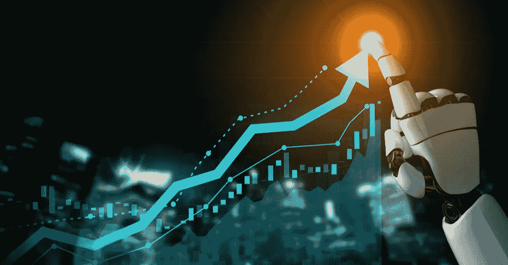
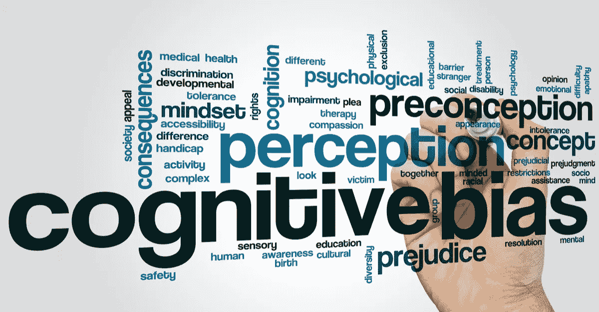

# 重新想象人工智能时代的投资

> 原文：<https://medium.datadriveninvestor.com/reimagining-investing-in-the-age-of-ai-3adb76af3696?source=collection_archive---------20----------------------->

投资管理行业沉浸在几十年来以某种方式运作的过程中，这种方式基于学术理论和知识(其中一些可能已经过时或无效)，以及根深蒂固的人类经验。然而，传统的以人为中心的理财方式正在辜负投资者的期望——见我的[上一篇文章](https://www.alchetec.co.za/post/the-hard-truth-about-active-fund-management)。这种连锁效应导致全球大多数积极型基金经理的表现都不及基准。

 [## 轻松投资颠覆性技术|数据驱动型投资者

### 研究并做好你的尽职调查，找出 10 个可能主宰未来行业的装袋者可能会很难。的…

www.datadriveninvestor.com](https://www.datadriveninvestor.com/2020/07/13/investing-in-disruptive-technology-made-easy/) 

不断有关于各种行业被技术进步和[人工智能](https://www.alchetec.co.za/post/artificial-intelligence-101) (AI)爆发所颠覆的新闻。但是很少有关于使用人工智能和机器学习(ML)实际管理资金的文章，当然是在南非。本文将探讨人工智能可以为投资管理行业带来的一些好处。

> “人工智能能否成功应用于一项传统上一直由人类执行的任务——理财。”

**定量分析师和机器人顾问**

传统的量化交易方法——一种依靠数学和统计模型来识别和执行交易机会的策略，已经存在了几十年。这些技术的例子包括均值回归、趋势跟踪、统计套利等。这些技术中的大多数都是显式编程的规则，基于许多关于金融市场的性质和演变的假设(免责声明:这些通常是错误的)。

也有一些关于机器人顾问的宣传，这些机器人顾问提供基于算法的数字建议，只需适度或最少的人工干预。然而，这些平台也硬编码有预定的规则，根据它们有限的输入参数来管理投资者的资金。

**人工智能驱动的交易策略**

或许可以预见的是，一些世界上最成功的投资管理公司正在严重依赖技术和人工智能来建立他们的交易策略。

文艺复兴科技公司和两个适马公司长期以来一直站在重塑投资管理的前沿。他们的方法是科学和技术驱动的，大部分员工拥有科学、数学和工程学位。最近，贝莱德(BlackRock)等其他公司在 2017 年对人工智能驱动的战略给予了大力支持，富达投资(Fidelity Investments)正在悄悄建立一支由 140 名数据科学家组成的团队。所有这些公司都在培养与信息供应商、技术提供商和学术专家的关系，旨在为投资行业铺平道路。

在投资管理的背景下，人工智能和技术可以在三个方面带来好处:

> **1。人工智能可以减少人类偏见对投资决策的负面影响**

所有人都有行为偏见、微妙的复杂性和偏见，这些都会对客观性产生负面影响，尤其是在涉及财务影响的时候。近年来，行为经济学家和认知心理学家揭示了大多数人做出的大量非理性决定。

厌恶损失:我们都倾向于感受两倍于收益喜悦的损失痛苦。这表现在投资者经常以产生潜在收益为代价来避免潜在损失。

确认偏差:有没有注意到你倾向于更重视支持你先前观点的证据？投资者寻求能证实他们现有观点的信息；因此，他们会忽略挑战他们最初前提的相反信息。这是他们投资决策的价值如何被扭曲的一个例子。

赌徒谬误:这是指一种错误的想法，认为某一事件或多或少是可能的，因为之前发生了一系列事件。当投资者认为一只股票在一系列交易时段后会以完全相反的运动失去或获得价值时，他们经常陷入这种陷阱。

规避风险的偏见:对坏消息比对好消息更重视。这种偏见可能会导致风险的影响比回报的可能性更重要。

从众效应:当人们开始做某事，因为其他人似乎都在做时，就会出现这种情况。当投资者随大流时，他们通常会感觉更好。但正如沃伦·巴菲特所证明的，抵制这种诱惑可能会更有利可图。

随着市场继续快速变化，以及每天产生的大量数据，传统的估值和投资理念要避免落入这些陷阱变得极其困难和昂贵。大多数糟糕的投资者决策在很大程度上归因于自然的人类行为偏差，这是一种折衷的特征，在机器学习算法中并不存在。一些最成功的全球管理公司共有的一个特征证明了这一点，这些公司几十年来一直利用技术和算法成功地帮助他们为客户做出更好的投资决策。

> **2。人工智能可以分析所有形式的数据**

数据领域非常广阔。过去，图像、文本和声音等许多格式的信息只能通过人类的理解来处理。这些感官和物理格式对于计算机来说很难用作输入。如今，人工智能算法可以比人类更快更好地识别图像中的元素。

例如，通过检查沃尔玛停车场的卫星图像，人工智能算法可以在沃尔玛的销售数据发布之前预测它们。类似地，可以分析来自移动电话的 GPS 位置，以了解特定零售商店的客流量，从而预测相对于以前时期的商店收入。当机器大规模询问这些数据集时，它们可以检测出预测公司业绩的有用趋势。

采用这种方法的基金经理正在部署高性能计算机来处理大量数据集，最终利用证券价格的模式，并根据既定的目标和策略进行预测。他们以极快的速度夜以继日地做这件事。这些算法不是精确地遵循人类编码的指令，而是通过试错过程，随着市场条件的变化进行自我调整和进化，随着更多数据的到来，产生越来越准确的预测。因此，这也解释了为什么拥有这种技术的基金经理会在竞争中领先一步。

> **3。人工智能可以降低运营成本**

人工智能在投资中的整合不仅具有颠覆性，还具有可扩展性。这项技术将通过人工智能和区块链等创新，以提高中后台职能的运营和成本效率的形式带来的影响是不可否认的。然而，随着人工智能和云计算在未来几年继续发展，真正的颠覆将发生在前台系统，即资金管理的方式。

人工智能可以使用许多相同的资源来消化和分析来自全球任何金融市场的数据，而不必雇用具有特定地理和金融市场专业知识的团队。这使得基金管理公司不仅能够降低在本地市场的运营成本，还能降低在海外市场的运营成本。

**新时代**

人工智能驱动的投资策略有许多优势。人工智能模型对数据的假设要少得多，不断适应不断变化的市场条件，并根据现实测试自己的信念。

采用这种方法的基金经理不仅要雇佣精通计算机科学、数学和统计学的团队，还要意识到缺乏经验的团队通常会犯的错误和陷阱，这一点至关重要。其中一些包括不考虑生存偏差、前瞻偏差、过度拟合和样本内回测(这是一个单独的主题，可以在另一篇文章中单独讨论。)

当然，某些技术和技术方法或算法会比其他的更好，一路上也会有失败，但这就是新的竞争会产生的地方。此外，计算机肯定在某些领域并不比人类优越，比如处理歧义和建立关系。然而，随着时间的推移，这些领域也可能被智能技术所掌握。

正如彼得·泰尔所言——“技术是奇迹，因为它能让我们用更少的资源做更多的事情。”从这个概念，我们可以理解技术是如何在主动基金管理中推动创新和变革的关键。

- *Yossi 拥有电气工程学士学位，是一名人工智能爱好者，并为国内外的银行和金融服务提供了人工智能解决方案。Yossi 一直对投资充满热情，目前正在利用他在机器学习、技术和数据方面的专业知识，在全球股票市场推动公正和适应性强的投资策略。要了解更多信息，请联系 yossi@alchetec.co.za*[*linked ln*](http://www.linkedin.com/in/yossi-ziskin-014932119)*或发送电子邮件至*