# 强化学习——一种交互式学习

> 原文：<https://medium.datadriveninvestor.com/reinforcement-learning-an-interactive-learning-b1fa29166fc8?source=collection_archive---------6----------------------->

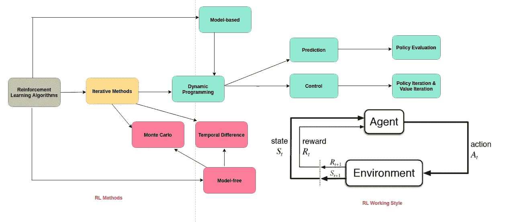

**Reinforcement Learning Methods and working style**

**互动学习**

强化学习是机器学习的一部分，代理通过与环境交互来自主学习。RL 不需要数据集。

强化学习的历史和 MDP 由于它的流行和更先进的研究今天被更详细地覆盖，它适用于主要的应用，如自动驾驶汽车，机器人，未知和艰苦的环境。

本文通过例子探讨了动态编程的 MDP & RL 方法。这篇文章特别适合初学者和那些想知道 RL 是如何进入画面的人。由于代理人行为的不确定性，在线学习是热门和必要的。在上面的标题图中，我更详细地介绍了绿色矩形框主题。

RL 不像监督学习或模仿数据集，因为它在没有任何干预的情况下，独自在**已知**和**未知**环境中表现出色。

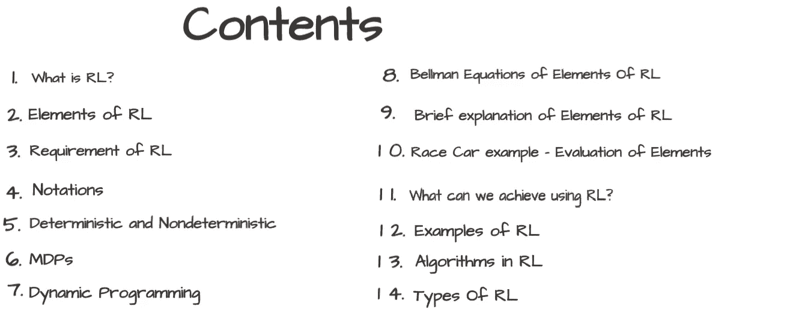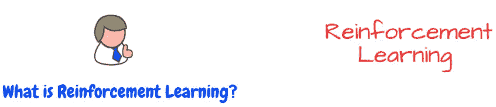

强化学习是一种机器学习，它与环境交互来学习，这种行为的组合产生了最有利的结果。

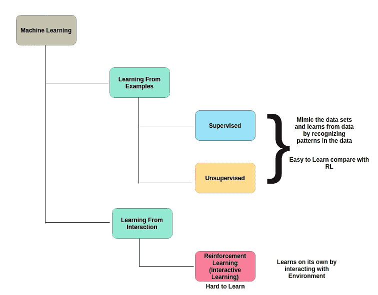

**Picture describe RL appearance in ML**

为了对环境中的主体进行推理，RL 引入了两个新概念，即:状态和动作。世界在特定时间停止的状态称为**“状态”**。代理可以执行一个可能的**【动作】**来改变当前状态。

为了驱动代理执行动作，每个状态产生一个相应的**奖励**。一个代理计算每个状态的期望总报酬，称为一个状态的**值**。

RL 作品图片如下:

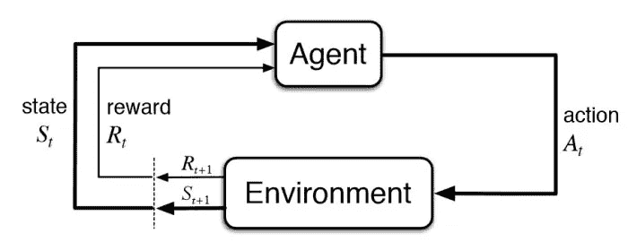

Reinforcement Learning working style

一个代理在环境中的时间“t”执行状态中的动作，并在时间 t+1 获得新的状态和该动作的奖励。

在每个步骤中，代理

> *执行一个动作*
> 
> *观察新状态*
> 
> *领取奖励*

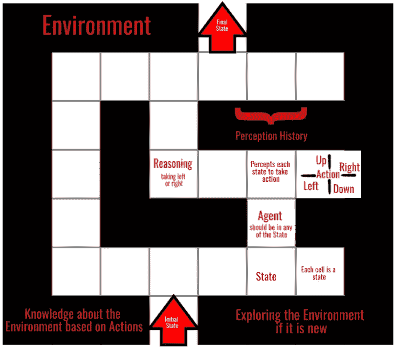

**Environment, State, Action,Agent,etc., described in Maze Example**

在强化学习中，我们不知道一系列行为的最终成本或回报，直到它被执行。代理人的目标是找到一系列能最大化**回报**的行动。基本强化学习处理最大化回报。

自主智能体应该学会在没有人类操作员任何指导的情况下，通过反复试验来执行任务。RL 允许我们建造智能机器。它为行为提供了形式主义。RL 不需要数据来训练智能代理。

RL 代理可以通过分层学习显著减少学习时间——首先解决初级学习问题，然后组合解决方案来解决一个复杂的问题。

RL 通过对过去的记忆来处理非马尔可夫环境。

> 强化学习不需要训练数据，而是适用于未知环境。

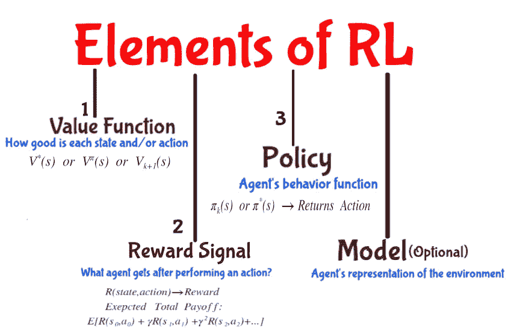

这些元素及其变体在马尔可夫决策过程中被很好地定义。在这篇文章中，我们将简要地去 MDP。

RL 动态地而非离线地学习马尔可夫决策过程(MDP)。它评估每个状态的值，无论哪个状态值最大，都将进入该状态。

除了下面的主题，还需要理解它的符号。

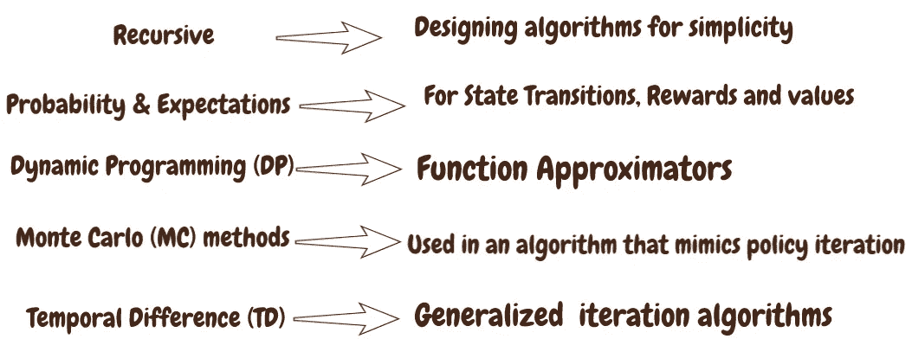

**Major Concepts used in Reinforcement Learning**

**注意，动态规划、蒙特卡罗评估和时间差学习是迭代方法。**

请注意，不同的作者、大学和博客使用不同的符号，以下符号是基于理查·萨顿的《T2 强化学习》这本书

我试图探索不同的符号，以便读者熟悉这些符号。

我试图探索不同的符号，以便读者熟悉这些符号。例如，以下 3 个符号是相同的。

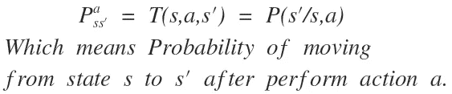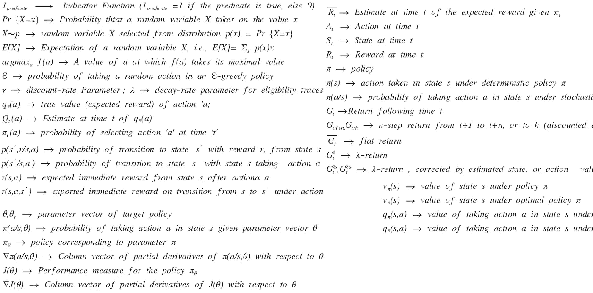

**Notations used in Reinforcement Learning and Markov Decision Processes (MDPs)**

在我们开始研究 RL 概念的例子之前，我们先考虑一下马尔可夫决策过程(MDPs ),它可以被视为离线规划，而 RL 则被视为在线规划。

让我们考虑状态和动作如何有助于**问题解决**、 **MDPs** 和**强化学习**。

在任何时候，代理都应该处于环境中任何可能的状态。

动作是确定性的和非确定性的。确定性动作在当前状态下执行并仅产生一个后继状态，而非确定性状态在当前状态下执行动作并产生多个后继状态。

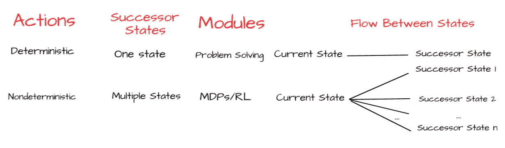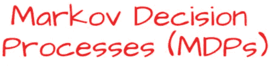

马尔可夫决策过程(MDPs)在非确定性搜索问题中起着至关重要的作用，它以一种有效的方式处理多个后继状态，它主要被认为是离线规划，并且主体对变迁和报酬(或环境)有充分的了解。MDP 提供了通常提出 RL 问题的形式主义。

马尔可夫决策过程由几个属性定义。马尔可夫决策过程是一个元组，它被定义为

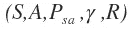

其中:

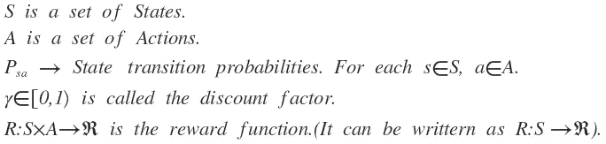

鉴于现在，未来独立于过去。一个状态被称为马尔可夫的当且仅当:

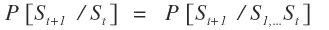

状态从历史中获取所有相关信息。一旦状态是已知的，历史可以被丢弃，即状态是未来的充分统计。

MDP 可以被建模为国家行动奖励序列

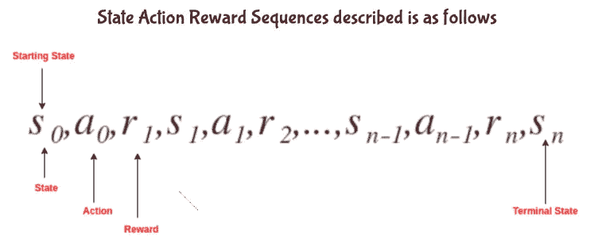

奖励函数被定义为，

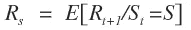

回报函数是从时间步长 t 开始的总折扣奖励，定义为

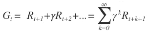

价值函数 V(s)描述了状态 s 的长期价值。价值函数有不同的变体，下面简单介绍。

状态值函数 V(s)是从状态 s 开始的期望收益

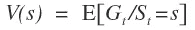

价值函数可以分解为即时报酬和后继状态的贴现值。

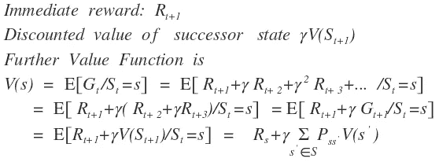

**Value Function Decomposition**

继承国的直接回报和贴现值

这是与被称为[动态规划](https://en.wikipedia.org/wiki/Dynamic_programming)的数学优化方法相关的最优性的必要条件。

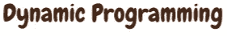

DP 通过以递归方式分解成简单的子问题来简化复杂的问题。

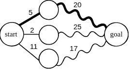

**Image from Wiki**

**最优子结构:**一个复杂的问题可以通过分解成子问题，并使用递归概念寻找子问题的最优解而得到最优解决，那么它就是最优子结构。

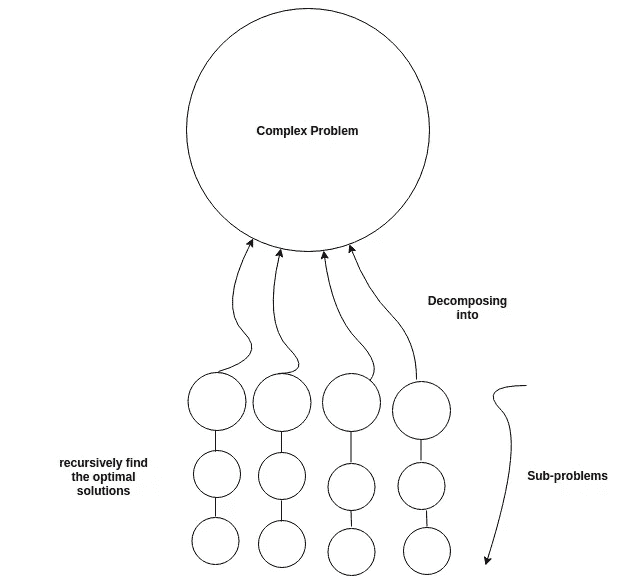

**DP solves complex problem by decomposing into sub-problems and find optimal solution using recursive concept**

子问题可以递归地嵌套在更大的问题中，因此 DP 方法是适用的，那么在更大的问题的值和子问题的值之间存在关系。在最优化文献中，这种关系被称为**“贝尔曼方程”。**

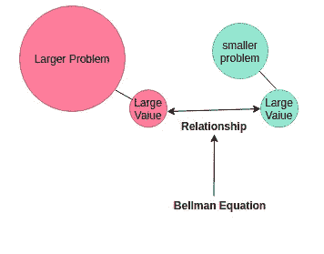

**This Relationship is called Bellman Equation**

贝尔曼方程可以用矩阵简明地表达，

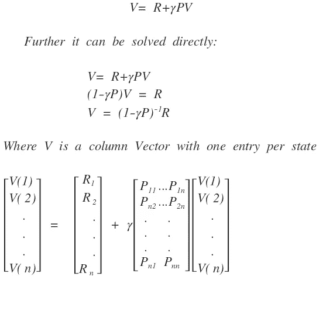

价值函数具有需要策略的变量。它们是状态-价值函数和行动-价值函数，这将在政策定义之后讨论。

策略是给定状态的动作分布，

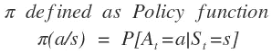

策略完全定义了代理的行为。MDP 策略取决于当前状态(而非历史)，即策略是固定的(与时间无关)

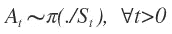

状态转换和奖励功能与策略结合在一起，定义如下

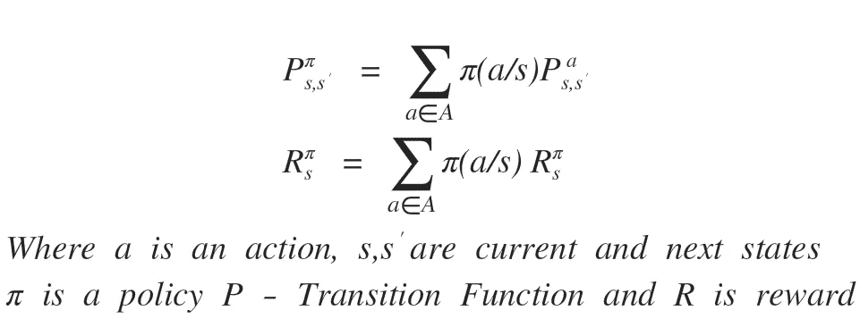

状态值函数是从状态 s 开始的期望收益，然后遵循策略

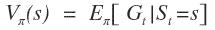

行动价值函数是从状态 s 开始的期望收益，采取行动 a，然后遵循政策

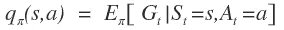

状态-价值和行动-价值函数可以分解为直接回报加上后继状态的贴现值

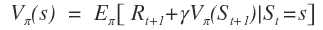

**State-value Function**

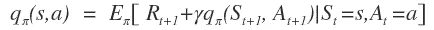

**Action-value Function**

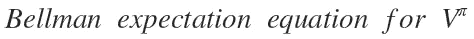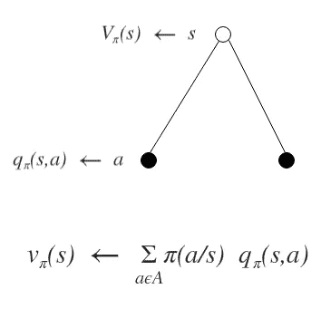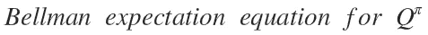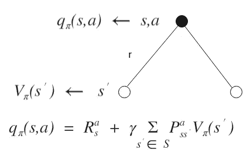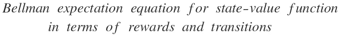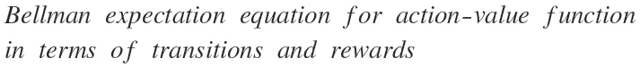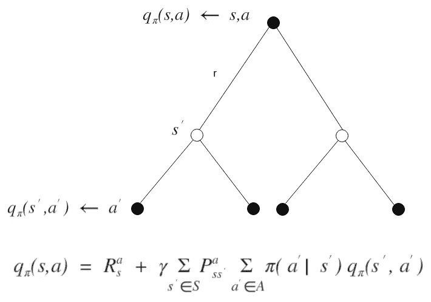

状态-价值函数的贝尔曼期望方程可以用矩阵形式表示如下

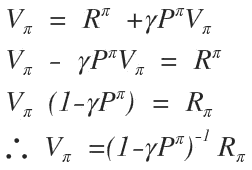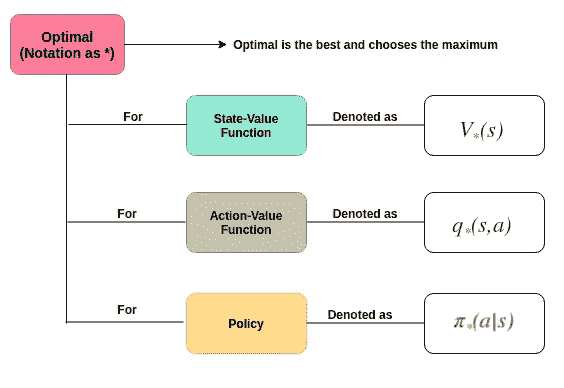

**Optimality for state-value, action-value and policy.**

**最佳状态值函数**

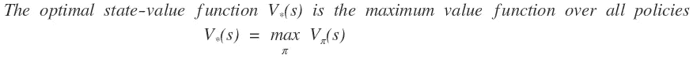

**最佳动作值函数**

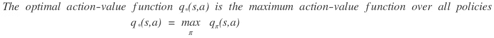

最佳值函数指定了可能的最佳性能，一旦知道，它将被标记为已在 MDP 解决。

**最优策略**

定义策略的偏序如下

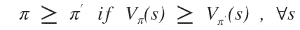

最优策略可以通过最大化最优价值行动来找到

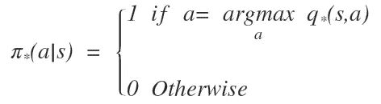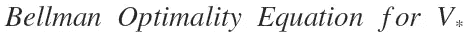

最佳值函数通过贝尔曼最优方程递归关联:

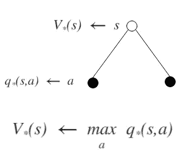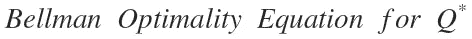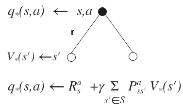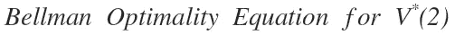

**Bellman Optimality Equation for action-state function**

RL 导出了算法的 MDP 的一些概念，正如已经陈述的，它提供了 RL 问题通常被提出的形式。

让我们考虑一个汽车有三种状态的例子，并从这些状态中评估所需的功能。

State-space graph for a race car (search problem)

正如你在这个例子中看到的，奖励用(+/-)符号表示，动作(慢、快)和过渡没有符号。基于这个图表，我们需要计算**价值函数**和**策略**。

 [## 机器学习和人工智能如何改变电子商务的面貌？|数据驱动…

### 电子商务开发公司，现在，整合先进的客户体验到一个新的水平…

www.datadriveninvestor.com](https://www.datadriveninvestor.com/2020/11/19/how-machine-learning-and-artificial-intelligence-changing-the-face-of-ecommerce/) 

让我们构造转换函数和奖励函数表，并在价值和政策迭代中使用。

在我们开始评估或检查之前，我们需要价值迭代、策略提取和策略迭代。

> *值迭代用于计算状态的最优值，通过迭代更新直到收敛。*

值迭代是一种动态规划算法，它使用迭代更长的时间限制来计算时间限制值，直到收敛，即在时间**‘k’**和**‘k+1’时，每个状态的 V 值是相同的。**根据定义，它应该是

它的操作如下

**值迭代的计算:**

**步骤 1** :我们开始将初始状态设置为零，即，

**步骤 2:** 在我们的第一轮更新中，我们可以计算第一状态(冷状态)

计算状态后，状态值如下:

求解 MDP 的最终目标是确定一个最优策略，一旦使用一种叫做**“策略提取”**的方法确定了状态的所有最优值，就可以得到最优策略。

如前所述，最佳策略是

策略迭代是一种算法，它保持值迭代的最优性，同时提供显著的性能增益。

策略迭代需要策略评估和策略改进。

它封装了策略评估和策略提取

策略改进用于生成更好的策略。它对由策略评估生成的状态值使用策略提取来生成这个新的和改进的策略。

算法如下:

1.  定义初始策略。
2.  反复进行政策评估和政策改进，直至达到收敛。

从图像上看，政策改进如下:

我们为赛车示例计算策略迭代如下:

1.  定义初始策略。

终端状态(过热)没有传出操作，没有策略可以为其赋值。因此，我们简单地为任何终端状态赋值 0。

下一步是对初始状态运行一轮策略评估。即，

我们现在可以使用这些值运行策略提取。

策略提取

这个例子给出了策略迭代的真正威力，只需要 2 次迭代。

因此，我们在底层工作中完成了赛车示例的价值迭代和策略迭代。

**Achievements of using Reinforcement Learning**

**Examples along with States , Actions and Rewards.**

有两种类型的强化学习，基于模型的学习和无模型的学习。都是用来做决策的。

基于模型的学习算法使用转移函数和奖励函数以及在控制探索期间获得的样本。。

无模型学习(Model-free learning)，试图直接估计状态的值或 q 值，而不使用转换和奖励。

**Types of RL Algorithms**

下图描述了强化学习算法。

强化学习可以应用在艰苦的环境中，下图描述了它的典型应用。

强化学习并不容易理解，它要求用户应该完全了解其方法的内部工作原理。虽然我们有 3 种不同的迭代方法，但本文涵盖了一种类型的迭代方法，即带有赛车示例的动态编程。虽然有许多主题需要涵盖，但它们将在以后的文章中得到证明。在机器人、自主车辆、机器、发动机等领域的应用中，虚拟现实是一个非常热门的研究领域。,

感谢您阅读本文，感谢您的反馈、评论和分享。如果评论中有错误，请告诉我。

**进入专家视角—** [**订阅 DDI 英特尔**](https://datadriveninvestor.com/ddi-intel)