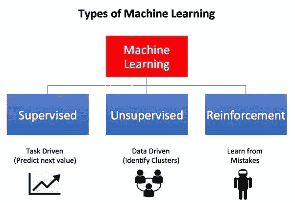
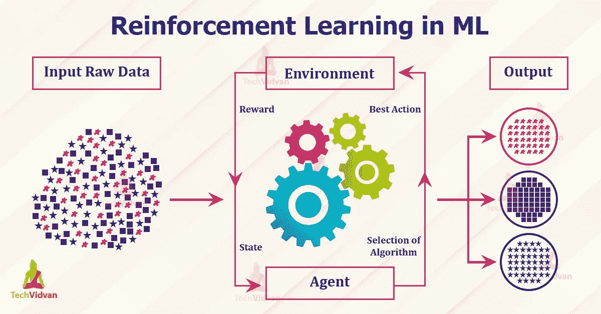

# 强化学习

> 原文：<https://medium.datadriveninvestor.com/reinforcement-learning-cea620b89676?source=collection_archive---------25----------------------->

强化学习是一种受行为主义心理学启发的机器学习方法。强化学习与其他机器学习方法形成对比，因为算法没有明确地被告知如何执行任务，而是自行解决问题。

强化学习与监督学习的不同之处在于，在监督学习中，训练数据带有答案，因此模型是用正确的答案来训练的，而在强化学习中，没有答案，而是由强化代理来决定如何执行给定的任务。在缺乏训练数据的情况下，它必然会借鉴其经验。

作为一个代理，它与它的环境相互作用，并根据它的表现获得奖励状态。相反，代理人会因为表现不正确而受到惩罚。随着时间的推移，代理人使用动态规划做出决策，以最大化其奖励，最小化其惩罚。

## 强化学习的类型

*   **正向强化学习**被定义为当一个事件由于一种特定的行为而发生时，增加该行为的强度和频率。在这种类型的强化学习中，算法为某个结果接收一种类型的奖励。换句话说，这里我们试图为每一个好的结果增加一个奖励，以增加一个好结果的可能性。
*   **负强化学习**被定义为行为的强化，因为负面条件被阻止或避免。在这种类型中，我们试图去除一些负面的东西以提高性能。

## 强化学习的利与弊

## **优势**

*   可以解决高阶复杂问题。
*   由于它的学习能力，它可以用于神经网络。
*   由于模型不断学习，以前犯的错误将来不太可能发生。
*   当涉及到创建模拟器、自动汽车中的物体检测、机器人等时。，强化学习在模型中起着很大的作用。
*   即使没有训练数据，它也会从处理训练数据的经验中学习。

## **缺点**

*   使用强化学习模型来解决更简单的问题是不正确的。原因是，这些模型通常处理复杂的问题。我们将浪费不必要的处理能力和空间来处理更简单的问题。
*   我们需要大量数据来输入模型进行计算。强化学习模型需要大量的训练数据才能得出准确的结果。这消耗了时间和大量的计算能力。
*   当涉及到在真实世界的例子上建立模型时，维护成本是非常高的。就像建造无人驾驶汽车和机器人一样，我们需要对硬件和软件进行大量的维护。