# 期权交易的强化学习

> 原文：<https://medium.datadriveninvestor.com/reinforcement-learning-for-options-trading-765c84d0d97d?source=collection_archive---------0----------------------->

## 金融中的人工智能

## q 学习+ Black-Scholes =最优期权价格


Image Credit: Financial Times

人工智能正在对金融的许多领域产生影响，尤其是交易领域。多种多样的人工智能子领域，如深度学习、强化学习和自然语言处理，目前正被用于预测股票走势。强化学习交易代理试图通过试错来学习股票价格。通过将 Q 学习(一种强化学习算法)与 Black-Scholes 模型(一种传统的期权定价模型)相结合，我们可以创建一个 Q 学习 Black Scholes (QLBS)模型来确定最优期权价格。

在本文中，我将回顾期权、Black-Scholes 模型和 Q 学习，然后展示一个欧式看跌期权的 Q 学习 Black-Scholes 模型的实现。

*注:点击* [*此处*](#aced) *如果想直奔 QLBS 模式的实现(链接在手机 app 中不起作用)*

# 解释的选项

期权是一种衍生证券，这意味着它们的价值取决于股票或商品等其他资产的价格。例如，一份股票的期权合约通常代表 100 股基础股票。期权合约的价格被称为溢价。本质上，该合同允许持有人在合同到期时或到期前以预先确定的价格(称为执行价格)购买或出售一定数量的基础资产。此外，持有人没有义务购买或出售，所以他们也可以让合同到期。

两种主要的期权是看涨期权和看跌期权；前者允许持有者以规定的价格购买资产，后者允许持有者以规定的价格出售资产。买家可以用看涨期权进行投机，用看跌期权进行对冲。

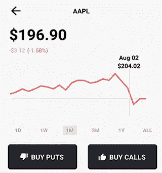

Image credit: Gatsby

为了更好地理解这一点，我们来看一个真实世界的例子。假设苹果股票的交易价格是每股 200 美元。你认为股票可能在下个月涨到 210 美元以上，以每份合约 0.67 美元的价格买入 210 美元的看涨期权。如果价格在合同到期日之前或到期日上涨超过 210 美元，你以 210 美元买入股票，如果股票下跌或没有上涨超过 210 美元，你只损失 67 美元的溢价(0.67 x 100 股)。相反，假设你已经持有苹果股票，并认为价格可能下跌，导致你以每份合同 0.63 美元的价格买入 190 美元的看跌期权。如果在合约到期日之前或到期日，股价跌破 190 美元，你以 190 美元卖出股票获利，如果股价没有下跌，你只损失 63 美元的溢价(0.63 x 100 股)。既然我们理解了期权，让我们继续讨论布莱克-斯科尔斯模型。

# 布莱克-斯科尔斯模型

布莱克-斯科尔斯方程，可能是金融学中最著名的方程，提供了第一个广泛使用的期权定价模型。当前股票价格、期权的执行价格、预期利率、到期时间和波动性(价格波动的量度)都被用作计算期权理论价值的输入。由经济学家费希尔·布莱克、迈伦·斯克尔斯和罗伯特·默顿于 1973 年提出的这个等式影响巨大，以至于为斯科尔斯和默顿赢得了 1997 年的诺贝尔经济学奖(布莱克不幸在获得这一荣誉之前去世)。

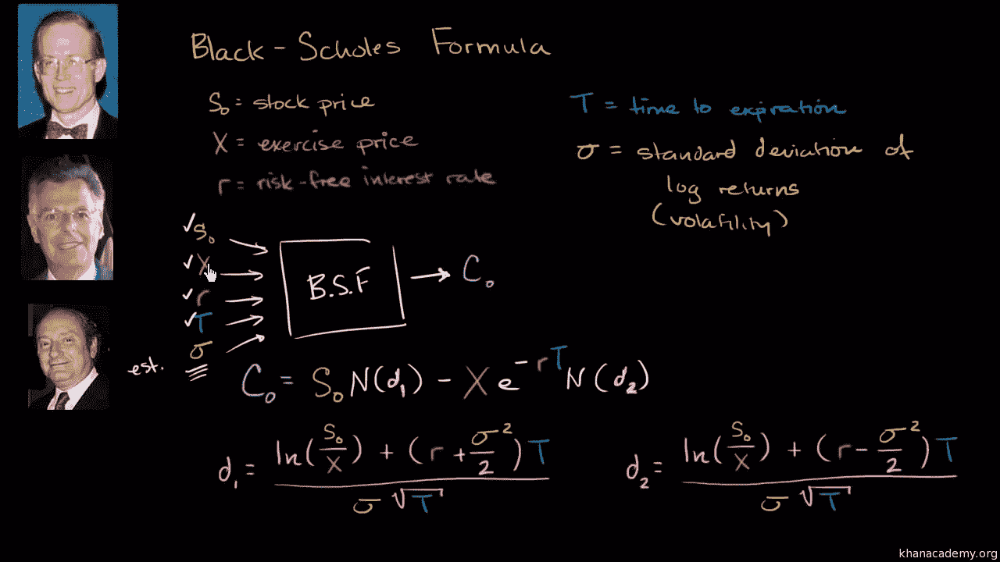

Image Credit: KhanAcademy

在上图中，C 是买入期权价格，N(d1)是对应于买入期权 delta(资产价格变化与其衍生产品价格相应变化的比率)的正态分布，N(d2)是对应于买入期权到期时行使的概率的正态分布。

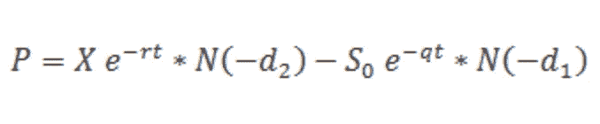

Black-Scholes for put option

为了简洁起见，我将把重点放在布莱克-斯科尔斯方程所做的假设以及它的局限性上，而不是它背后的实际数学。如果你想更深入的了解布莱克-斯科尔斯，看[这个](https://www.khanacademy.org/economics-finance-domain/core-finance/derivative-securities/black-scholes/v/introduction-to-the-black-scholes-formula)。

## 假设

*   期权是欧式的(只能在到期时行使，不能在到期前行使)
*   在期权有效期内不支付股息。
*   市场是有效的(市场运动无法预测)。
*   购买期权没有交易成本。
*   已知且恒定的无风险利率和基础资产的波动性。
*   标的资产的正态分布回报。

## 限制

*   不适用于美国期权(可在到期前行使)
*   波动性在现实生活中是波动的
*   存在交易成本
*   无风险利率在现实生活中并不总是恒定的

很好，现在我们对 Black-Scholes 有了一个大致的了解，在开始实施 QLBS 模型之前，我们将回顾一下 Q 学习。

# q 学习

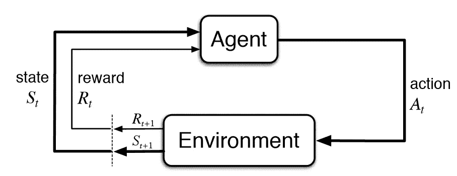

Image Credit: [Reinforcement Learning:An Introduction](http://incompleteideas.net/book/bookdraft2017nov5.pdf)

在强化学习中，目标是回报最大化。代理执行一个动作来从一个状态转换到下一个状态，并且在每个状态中采取的动作给代理一个奖励。例如，想象一个场景，一只狗和它的主人。在家里(环境)，狗(代理人)在主人命令它坐下(状态)时跑来跑去(动作)，不接受任何款待(奖励)。在下一个状态中，如果主人命令狗坐下，它会坐下(因为跑步没有给食物)并接受食物。本质上，狗通过反复试验来学习。

[](https://www.datadriveninvestor.com/2019/02/19/artificial-intelligence-trends-to-watch-this-year/) [## 今年值得关注的 5 大人工智能趋势|数据驱动的投资者

### 预计 2019 年人工智能将取得广泛的重大进展。从谷歌搜索到处理复杂的工作，如…

www.datadriveninvestor.com](https://www.datadriveninvestor.com/2019/02/19/artificial-intelligence-trends-to-watch-this-year/) 

Q-learning 是一种强化学习算法，目标是学习最优策略(策略告诉代理在什么情况下采取什么行动)。状态 x 动作的维度 Q 表具有初始化为零的值。然后，代理选择一个动作，观察一个奖励，并进入一个新的状态，更新 Q，即在每个时间 t 在一个状态中采取的动作的“质量”。下面是算法。

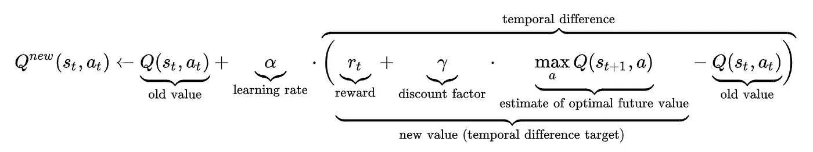

Image Credit: [Wikipedia](https://en.wikipedia.org/wiki/Q-learning)

学习率通常在所有时间 t 内都是恒定的，它决定了从 0(代理没有学习到新信息)到 1(代理只考虑最近的信息)新信息覆盖旧信息的程度。此外，折扣系数决定了未来奖励的重要性，范围从 0(仅当前奖励重要)到 1(优先考虑长期奖励)。

代理可以通过两种方式与环境交互。一种方式是利用，代理使用 Q 表作为参考，并选择具有最高值的动作。然而，Q-table 以全零开始，所以有时必须随机选择动作。这就是探索，当代理随机选择一个行动，而不是基于最大未来回报选择。epsilon 值设置您希望代理探索而不是利用的时间百分比。

最后，是时候进入 Q 学习和 Black -Scholes 的交叉点了！

# q 学习+布莱克-斯科尔斯

当 Q-learning 和 Black-Scholes 结合时，我们的 QLBS 模型使用交易数据来自主学习最优期权价格和最优对冲。在模型的实现中，我们将使用欧式看跌期权。在实现 QLBS 模型之前，我们还将实现经典的 Black-Scholes 公式来比较两者的结果。为了避免这篇文章变得不必要的长，我将省略图形代码，直接展示图形；你仍然可以点击[这里](https://colab.research.google.com/drive/1wa2puOkPuUt5LHdQBbyLJtQi6qYTYEC0)查看完整代码(该项目是 Coursera 的[金融强化学习](https://www.coursera.org/learn/reinforcement-learning-in-finance)课程中的一个练习)。

# 进口

首先，我们进行必要的进口。

```
import numpy as np
import pandas as pd
from scipy.stats import norm
import random
import time
import matplotlib.pyplot as plt
import sys
```

# 蒙特 卡罗模拟

在导入之后，我们将为价格的蒙特卡罗模拟设置参数。蒙特卡洛模拟用于模拟由于随机变量的存在而不可预测的过程中不同结果的概率(如股票价格变动)。

```
S0 = 100      # initial stock price
mu = 0.05     # drift
sigma = 0.15  # volatility
r = 0.03      # risk-free rate
M = 1         # maturityT = 24        # number of time steps
N_MC = 10000  # number of pathsdelta_t = M / T                # time interval
gamma = np.exp(- r * delta_t)  # discount factor
```

# 布莱克-斯科尔斯模拟

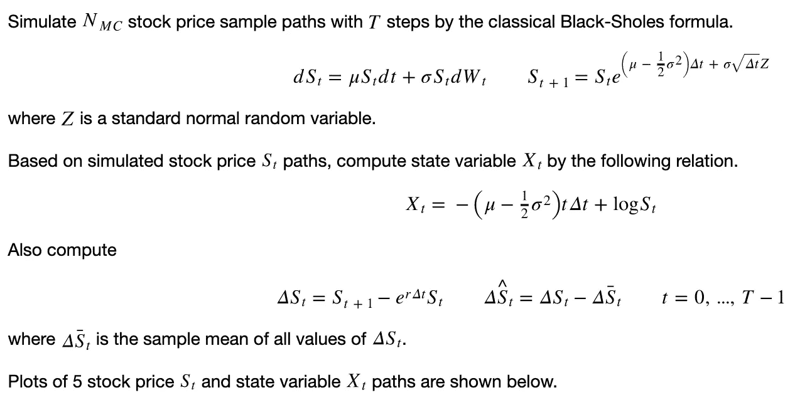

Images from Coursera: Reinforcement Learning in Finance

```
np.random.seed(42)# stock price
S = pd.DataFrame([], index=range(1, N_MC+1), columns=range(T+1))
S.loc[:,0] = S0# standard normal random numbers
RN = pd.DataFrame(np.random.randn(N_MC,T), index=range(1, N_MC+1), columns=range(1, T+1))for t in range(1, T+1):
    S.loc[:,t] = S.loc[:,t-1] * np.exp((mu - 1/2 * sigma**2) * delta_t + sigma * np.sqrt(delta_t) * RN.loc[:,t])delta_S = S.loc[:,1:T].values - np.exp(r * delta_t) * S.loc[:,0:T-1]
delta_S_hat = delta_S.apply(lambda x: x - np.mean(x), axis=0)# state variable
X = - (mu - 1/2 * sigma**2) * np.arange(T+1) * delta_t + np.log(S)   # delta_t here is due to their conventions
```

这是一些股票价格和状态变量路径的样子。

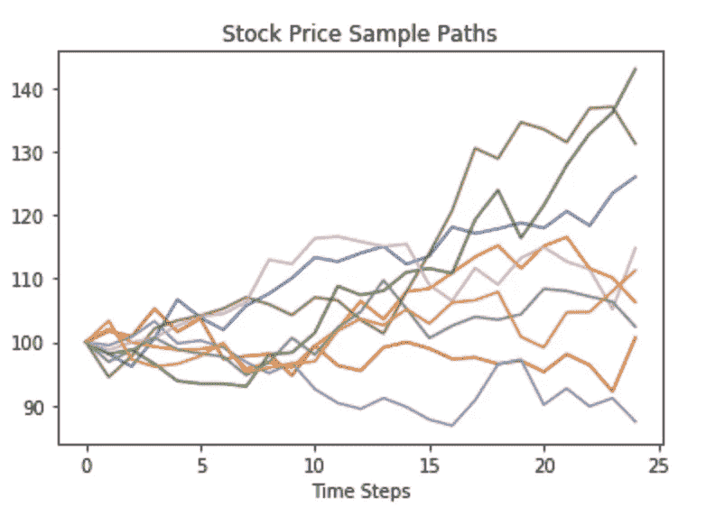

# 最终收益

最终收益是投资者在期权策略到期时获得的金额。我们将定义一个函数来计算欧式看跌期权的最终收益。

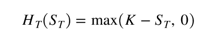

```
def terminal_payoff(ST, K):
    # ST   final stock price
    # K    strike
    payoff = max(K - ST, 0)
    return payoff
```

# 样条基函数

样条函数是由多项式函数分段构造的函数。B 样条函数是最大可微的插值基函数，我们可以用它来表示状态变量 x。

```
!pip install bspline
import bspline
import bspline.splinelab as splinelabX_min = np.min(np.min(X))
X_max = np.max(np.max(X))
print('X.shape = ', X.shape)
print('X_min, X_max = ', X_min, X_max)p = 4            # order of spline (as-is; 3 = cubic, 4: B spline?)
ncolloc = 12tau = np.linspace(X_min,X_max,ncolloc)  
# These are the sites to which we would like to interpolate# k is a knot vector that adds endpoints repeats as appropriate for a spline of order p
# To get meaninful results, one should have ncolloc >= p+1
k = splinelab.aptknt(tau, p) 

# Spline basis of order p on knots k
basis = bspline.Bspline(k, p)        

f = plt.figure()
# B   = bspline.Bspline(k, p)     # Spline basis functions 
print('Number of points k = ', len(k))
basis.plot()
```

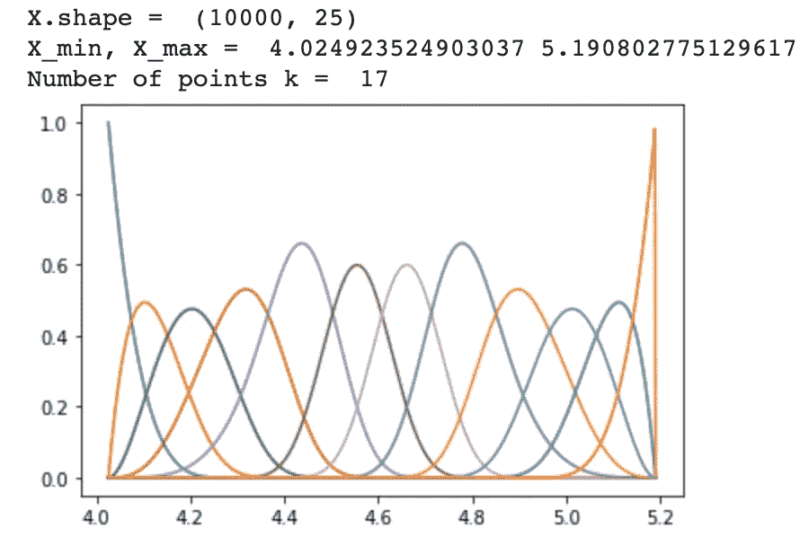

# 数据矩阵

现在我们用特征值做数据矩阵；这里的特征是数据点处的基函数值，输出是维数为 num_tSteps x num_MC x num_basis 的 3D 数组。

```
num_t_steps = T + 1
num_basis =  ncolloc # len(k) #data_mat_t = np.zeros((num_t_steps, N_MC,num_basis ))
print('num_basis = ', num_basis)
print('dim data_mat_t = ', data_mat_t.shape)# fill it 
for i in np.arange(num_t_steps):
    x = X.values[:,i]
    data_mat_t[i,:,:] = np.array([ basis(el) for el in x ])
```

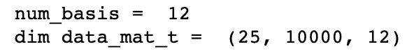

# QLBS 的动态规划解决方案

简单解释一下，马尔可夫决策过程(MDP)包含一组可能的世界状态 S、一组可能的动作 A、一个实值奖励函数 R(s，A)以及每个状态下每个动作效果的描述 T。贝尔曼最优方程可以提供一个最优策略来求解每个 MDP。

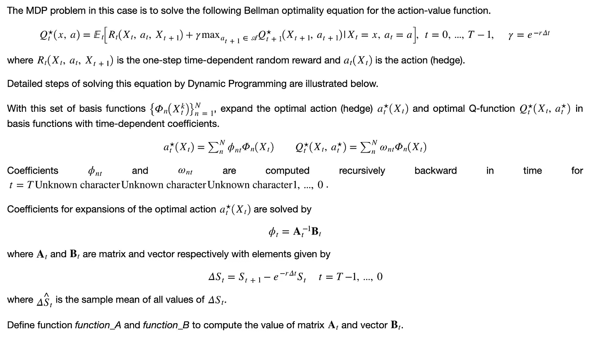

# 定义期权执行和风险规避参数

```
risk_lambda = 0.001 *# risk aversion*
K = 100             *# option stike*
```

# 计算最佳行动的系数

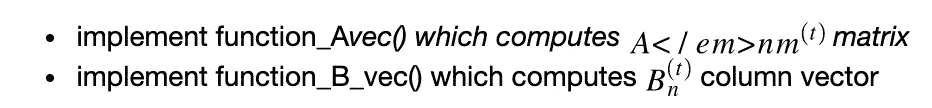

```
# functions to compute optimal hedges
def function_A_vec(t, delta_S_hat, data_mat, reg_param):
    X_mat = data_mat[t, :, :]
    num_basis_funcs = X_mat.shape[1]
    this_dS = delta_S_hat.loc[:, t]
    hat_dS2 = (this_dS ** 2).values.reshape(-1, 1)
    A_mat = np.dot(X_mat.T, X_mat * hat_dS2) + reg_param * np.eye(num_basis_funcs)
    return A_mat

def function_B_vec(t, Pi_hat, delta_S_hat=delta_S_hat, S=S, data_mat=data_mat_t, gamma=gamma, risk_lambda=risk_lambda):
    tmp = Pi_hat.loc[:,t+1] * delta_S_hat.loc[:, t]
    X_mat = data_mat[t, :, :]  # matrix of dimension N_MC x num_basis
    B_vec = np.dot(X_mat.T, tmp)
    return B_vec
```

# 计算最佳对冲和投资组合价值

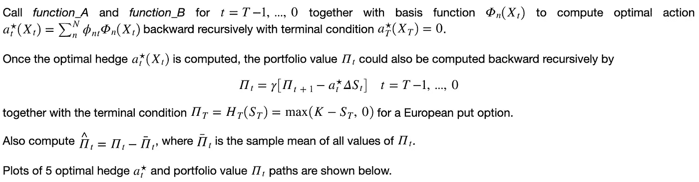

```
# portfolio value
Pi = pd.DataFrame([], index=range(1, N_MC+1), columns=range(T+1))
Pi.iloc[:,-1] = S.iloc[:,-1].apply(lambda x: terminal_payoff(x, K))Pi_hat = pd.DataFrame([], index=range(1, N_MC+1), columns=range(T+1))
Pi_hat.iloc[:,-1] = Pi.iloc[:,-1] - np.mean(Pi.iloc[:,-1])# optimal hedge
a = pd.DataFrame([], index=range(1, N_MC+1), columns=range(T+1))
a.iloc[:,-1] = 0reg_param = 1e-3 # free parameter
for t in range(T-1, -1, -1):
    A_mat = function_A_vec(t, delta_S_hat, data_mat_t, reg_param)
    B_vec = function_B_vec(t, Pi_hat, delta_S_hat, S, data_mat_t, gamma, risk_lambda)
    # print ('t =  A_mat.shape = B_vec.shape = ', t, A_mat.shape, B_vec.shape)

    # coefficients for expansions of the optimal action
    phi = np.dot(np.linalg.inv(A_mat), B_vec)

    a.loc[:,t] = np.dot(data_mat_t[t,:,:],phi)
    Pi.loc[:,t] = gamma * (Pi.loc[:,t+1] - a.loc[:,t] * delta_S.loc[:,t])
    Pi_hat.loc[:,t] = Pi.loc[:,t] - np.mean(Pi.loc[:,t])

a = a.astype('float')
Pi = Pi.astype('float')
Pi_hat = Pi_hat.astype('float')
```

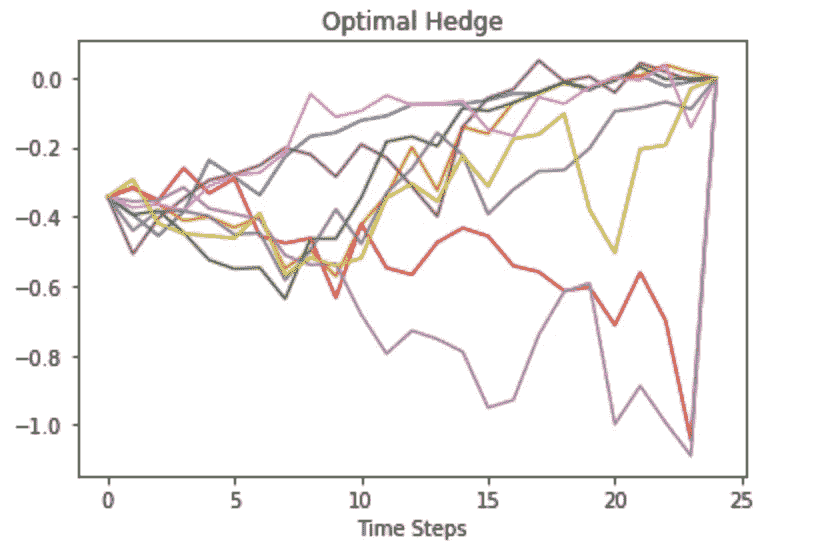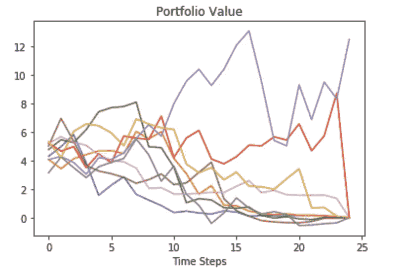

# 计算所有路径的奖励

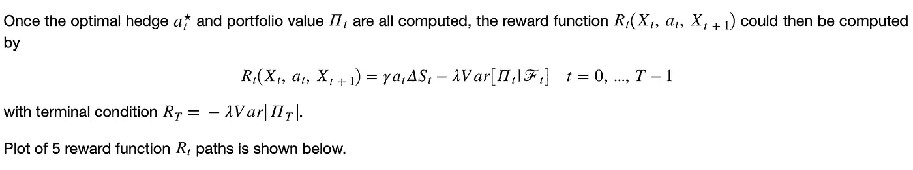

```
# Compute rewards for all paths
# reward function
R = pd.DataFrame([], index=range(1, N_MC+1), columns=range(T+1))
R.iloc[:,-1] = - risk_lambda * np.var(Pi.iloc[:,-1])for t in range(T):
    R.loc[1:,t] = gamma * a.loc[1:,t] * delta_S.loc[1:,t] - risk_lambda * np.var(Pi.loc[1:,t])

# plot 10 paths
plt.plot(R.T.iloc[:, idx_plot])
plt.xlabel('Time Steps')
plt.title('Reward Function')
plt.show()
```

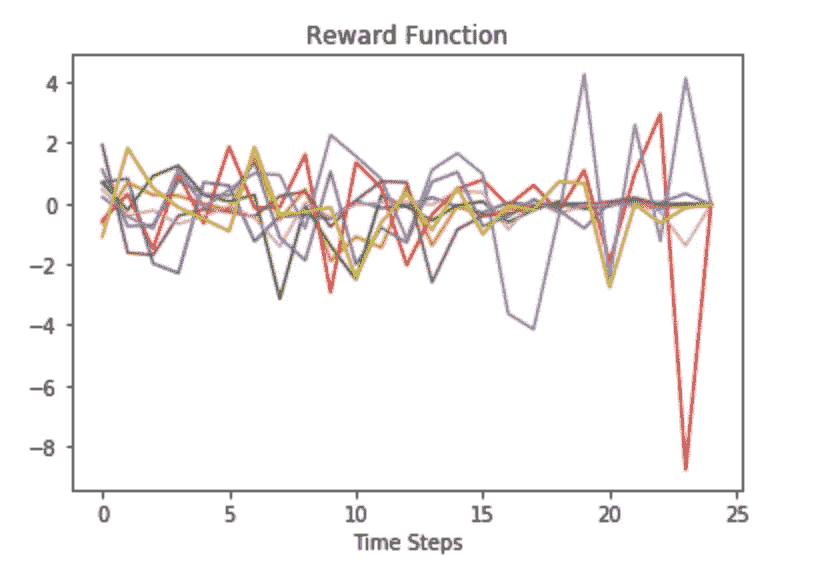

# 计算最佳 Q 函数

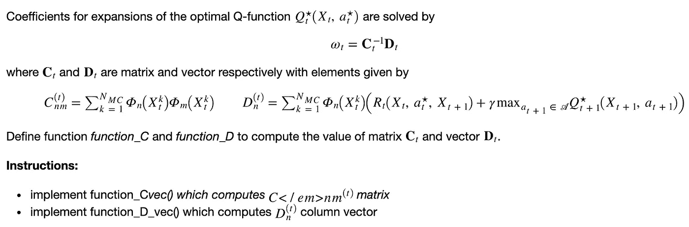

```
def function_C_vec(t, data_mat, reg_param):
    X_mat = data_mat[t, :, :]
    num_basis_funcs = X_mat.shape[1]
    C_mat = np.dot(X_mat.T, X_mat) + reg_param * np.eye(num_basis_funcs)
    return C_mat

def function_D_vec(t, Q, R, data_mat, gamma=gamma):
    X_mat = data_mat[t, :, :]
    D_vec = np.dot(X_mat.T, R.loc[:,t] + gamma * Q.loc[:, t+1])
    return D_vec
```

现在我们可以调用这些函数来得到最优的 Q 函数

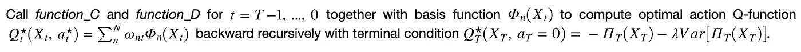

```
# Q function
Q = pd.DataFrame([], index=range(1, N_MC+1), columns=range(T+1))
Q.iloc[:,-1] = - Pi.iloc[:,-1] - risk_lambda * np.var(Pi.iloc[:,-1])reg_param = 1e-3
for t in range(T-1, -1, -1):
    C_mat = function_C_vec(t,data_mat_t,reg_param)
    D_vec = function_D_vec(t, Q,R,data_mat_t,gamma)
    omega = np.dot(np.linalg.inv(C_mat), D_vec)

    Q.loc[:,t] = np.dot(data_mat_t[t,:,:], omega)
```

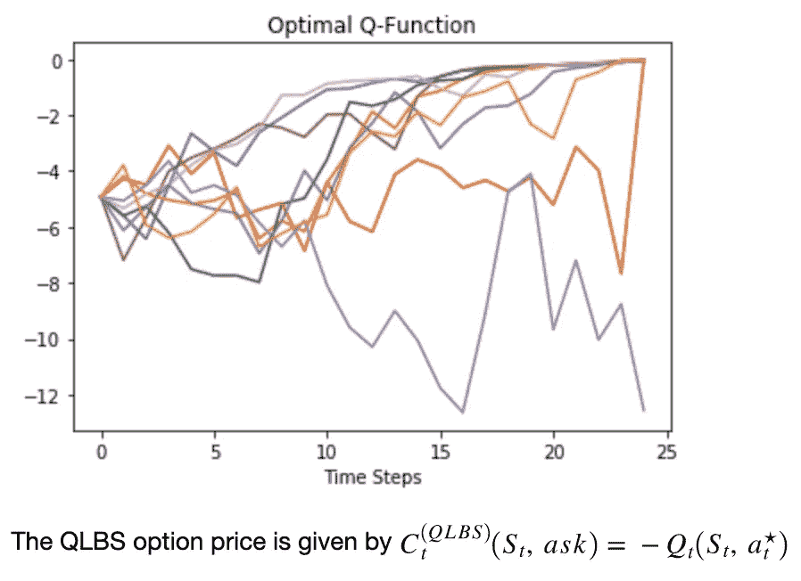

# 比较

让我们将 QLBS 价格与 Black-Scholes 公式给出的欧式看跌价格进行比较。

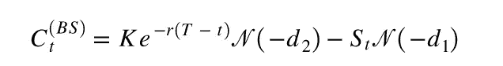

```
# The Black-Scholes prices
def bs_put(t, S0=S0, K=K, r=r, sigma=sigma, T=M):
    d1 = (np.log(S0/K) + (r + 1/2 * sigma**2) * (T-t)) / sigma / np.sqrt(T-t)
    d2 = (np.log(S0/K) + (r - 1/2 * sigma**2) * (T-t)) / sigma / np.sqrt(T-t)
    price = K * np.exp(-r * (T-t)) * norm.cdf(-d2) - S0 * norm.cdf(-d1)
    return pricedef bs_call(t, S0=S0, K=K, r=r, sigma=sigma, T=M):
    d1 = (np.log(S0/K) + (r + 1/2 * sigma**2) * (T-t)) / sigma / np.sqrt(T-t)
    d2 = (np.log(S0/K) + (r - 1/2 * sigma**2) * (T-t)) / sigma / np.sqrt(T-t)
    price = S0 * norm.cdf(d1) - K * np.exp(-r * (T-t)) * norm.cdf(d2)
    return price
```

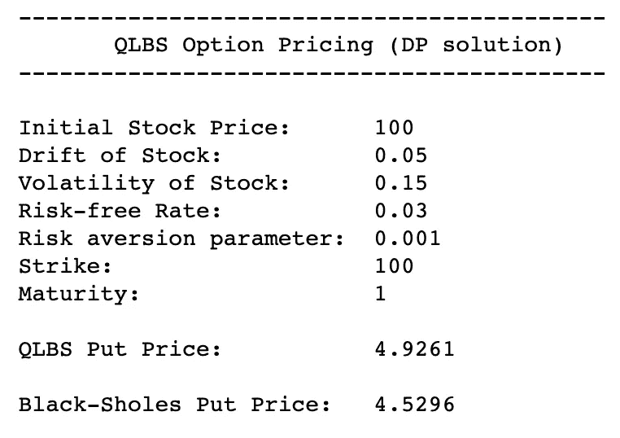

这里，我们可以看到 QLBS 看跌价格比 Black-Scholes 看跌价格高 0.4。鉴于期权价格在大多数路径中大幅下跌，我们可以看到 QLBS 看跌期权价格明显优于 Black-Scholes 看跌期权价格。

# 摘要

作为参考，下面是我们在整个项目中绘制的各种图表。在欧式看涨期权上测试 QLBS 与 BS，并试图找出 Q 学习如何应用于美式看涨/看跌期权，这将是非常有趣的。再一次，如果你想看的话，我在这里链接了项目[的全部代码。](https://colab.research.google.com/drive/1wa2puOkPuUt5LHdQBbyLJtQi6qYTYEC0)

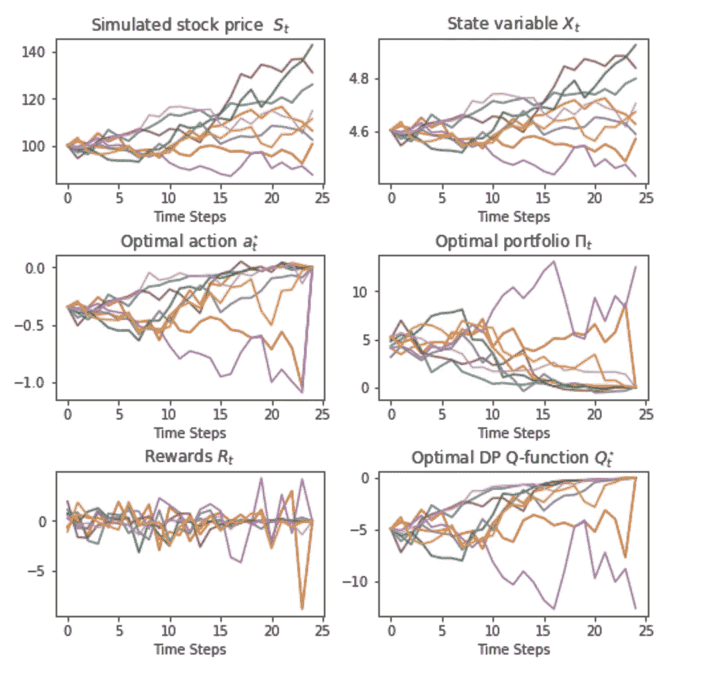

咻，今天到此为止！

# 参考

[1] Coursera，[金融中的强化学习](https://www.coursera.org/learn/reinforcement-learning-in-finance)

[2]伊戈尔·哈尔珀林，[QLBS Q-Learner Goes NuQLear:拟合 Q 迭代、逆 RL、期权组合(2018)](https://arxiv.org/abs/1801.06077#clicktoread) 、arXiv

[3]詹姆斯·陈，[期权](https://www.investopedia.com/terms/o/option.asp)，Investopedia