# 强化学习——MDP

> 原文：<https://medium.datadriveninvestor.com/reinforcement-learning-mdp-639aecec6da4?source=collection_archive---------2----------------------->

# 介绍

强化学习基于**奖励假设**。

> 所有的好都可以用预期**累积**回报的最大化来描述

单词**累积**在这里很重要，因为它允许代理采取产生低回报的行动，但从长远来看可能会导致更高的回报。

## 例如:

让我们把一个未经训练的人想象成我们想要减肥的代理人。这个人，让我们称他为威利先生，每天可以选择去健身房或者吃一整块蛋糕。

现在，去健身房的直接回报对威利先生来说真的很低，因为这是一项艰苦的工作，并不真正令人愉快…而且他有点懒。

另一方面，吃一个超级美味的甜巧克力蛋糕会有很高的即时回报。所以，如果威利先生只关心短期利益，他会吃掉整个蛋糕。然而，正如你和我可能知道的，每周去三次健身房，吃一份沙拉可能会导致六块腹肌(或者至少不会因糖尿病而过早死亡)，这意味着从长远来看更高的回报。耶！

嗯，是的，强化学习，在这种情况下，就像你妈妈告诉你吃蔬菜，因为从长远来看更健康。没有及时行乐。不#yolo。

去健身房锻炼一年并健康饮食的累积回报高于每天只吃一块蛋糕。

当然，正如我们将在后面看到的，有一个参数可以调整行为，使人们更喜欢即时奖励而不是长期累积奖励。

让我们定义系统的重要组件:

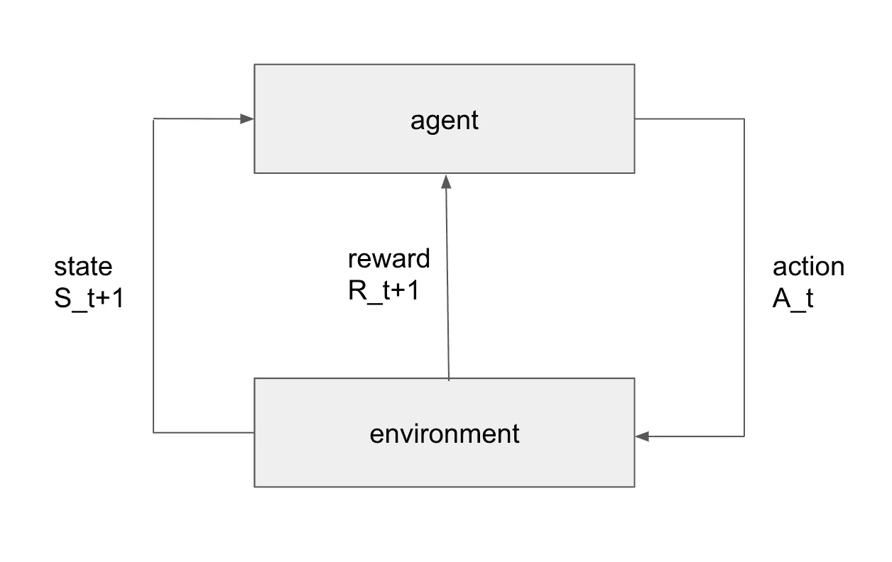

阿根是在动作之间做出选择的组件。在上面的例子中，这是威利先生的大脑。

**环境**是代理之外的一切(威利先生的身体、健身房等。)

决定采取**一项行动 *A_t*** (吃蛋糕、去健身房等。)在时间步长 t，环境的状态被这个动作改变。

现在，环境在时间步 *t+1* 发出奖励 *R* 。(吃含糖蛋糕的多巴胺奖励高，在健身房无聊锻炼的奖励低)。威利先生在时间步 *t+1* 收到奖励和新的更新状态 *S* (体重增加或减少)。

现在，我们只是假设代理的状态与环境的状态相同。绝对不总是这样。例如，中世纪的托马斯爵士二世认为地球是平的(代理人的状态)，但事实是世界是一个球体。(环境状况)。

这意味着代理人的选择改变了环境。根据所做的选择，会发出或高或低的奖励，代理需要根据更新后的状态采取新的行动。

# MDP-马尔可夫决策过程

马尔可夫决策过程是一个为决策建模的数学框架。

如上所述，环境的状态与代理的状态相同。对于所谓的完全可观测 MDP 来说，情况总是如此。

在我们的 MDP 中，我们有以下组件:

*   **答:**代理可以采取的一组有限的**动作**
*   **S:** 状态**的有限集**
*   如果采取特定动作*和*，从状态 s 转换到 s’的概率:

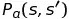

*   采取特定动作 *a* 并从状态 s 转换到状态 s’后的即时奖励:

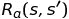

让我们用上面的健身房例子来说明一个 MDP:

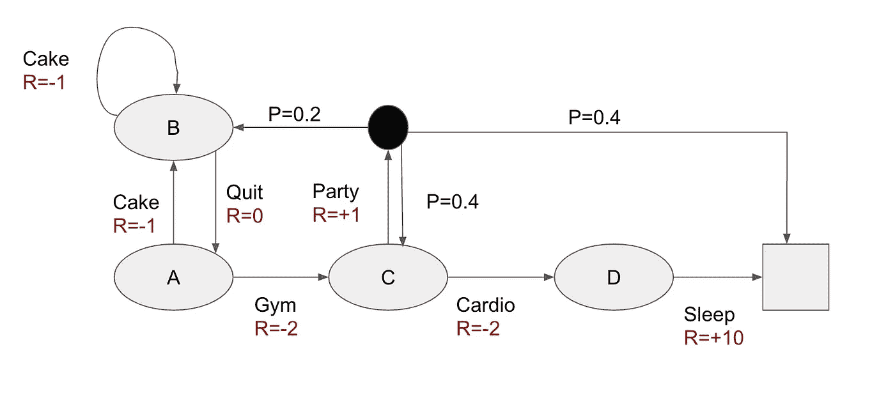

## 轨迹和返回

我们定义了状态 *A、B、C、D* 和结束状态，这里显示为一个正方形。在导致从状态 *s* 转换到状态*s’*的每一个所采取的行动下，都显示了直接奖励 *R* 。

让我们从状态 *A* 开始。如果代理处于状态 *A* 并选择动作*蛋糕，*那么环境会立即奖励他 *R=-1* ，这仍然高于动作*健身房*和 *R=-2* 的奖励。然后，他将从状态 *A* 转换到状态 *B* 。从那里他可以选择吃更多的蛋糕或者放弃，这将把他带回到 *A* 。

假设威利先生决定辞职，而不是吃更多的蛋糕。

最终，他决定选择动作*健身房(R=-2)* ，然后*有氧* *(R=-1)* 和*睡眠(R=+10)* ，这将导致*结束状态*。

链条将会是

***A、*** *蛋糕，R=-1 →* ***B、*** *退出，R=0 →* ***A、*** *健身房，R=-2→**C、* *有氧，R =-2*

当然，有更多的方法可以达到最终状态。那些不同的链也被称为**轨迹。**

每一个轨迹都有一个**回报**，这个回报是在到达终点状态的途中所获得的所有奖励的总和。上述轨迹的回报将是-1 + 0 + -2 + -2 + 10 = +5。

上面 MDP 的另一个重要部分是黑点。当代理决定将动作方从状态 *C* 带走时，有 0.2 的概率从那里转移到状态 *B* ，有 0.4 的概率转移回状态 *C* ，有 0.2 的概率转移到结束状态。这里的不同之处在于，在采取行动之后，并不能 100%确定我们最终会处于哪种状态。采取这一行动后，我们无法完全控制环境会把我们抛向何方。嗯，在聚会上喝了几杯后，威利先生可能会跳过有氧运动，去睡觉，或者在他想吃蛋糕的状态中结束。然而，对于所有其他标有行动的箭头来说，他最终会处于哪种状态是很清楚的。从 *s* 过渡到*s’*的概率就是我们前面提到的

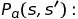

让我们分析另一个轨迹。

***A、*** *健身房，R=-2 →* ***C、*** *聚会，R=-2 →* ***结束***

这条轨迹的回报是:-4

让我们将返回定义为 ***G_t*** ，它是从时间步长 t 开始的返回 *G*

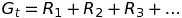

## 折扣

我们的回报中又增加了一样东西。 *γ* 就是所谓的折扣。 *γ* 是介于 0 和 1 之间的数字。

如果我们选择更接近于零的*γ***，**那么眼前的奖励比后来的奖励更有价值。现在吃蛋糕变得比未来六块腹肌的奖励更重要。另一方面，对于更接近 1 的值，后来的奖励变得更相关。

折扣值用于以下一些原因

*   避免了循环 MDP 中的无限回报。通过在某个时候使用折扣，未来的回报将几乎为零。这将使链变得有限。
*   不确定在遥远的将来会发生什么。如果我们可能永远也到不了那里，那么重视那些不太相关的回报是有意义的。
*   在某些情况下，支持即时奖励更有意义，比如在金融业，现在的现金比以后的现金更好。

## 政策

正如我们之前说过的，我们现在感兴趣的是获得尽可能高的累积奖励。这意味着我们在寻找回报最大的轨迹。为了实现这一点，我们的代理人需要在每个状态下做出最佳选择，使累积回报最大化。

这就是政策发挥作用的地方:

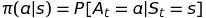

一个策略基本上描述了代理选择行动 *a i* 的概率，如果他处于状态 *s* ，

这可能是确定性的，就像我们上面的健身房例子中的状态 *D* 一样，代理人唯一可以选择的是*睡眠*，在那里他将过渡到最终状态。

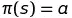

在确定性策略函数 ***π*** 的情况下，它将状态 *s* 映射到动作 *a* 。这告诉我们“如果在状态 *s* 中，代理将以 100%选择动作 *a* ”。

另一方面，随机策略是代理人选择一个行动 *a，*给定在某些状态 *s.* 的替代行动的概率。例如，在状态 *A* 中，策略可以告诉我们代理人可能选择行动*蛋糕*的概率为 20%，选择*健身房*的概率为 80%。

这意味着最大化累积回报和创建具有最高回报的轨迹的方法是找到最优策略函数π。从长远来看，最好的政策会导致我们采取最大化回报的行动。

## 最优策略

因此，MDP 的目标是找到**最优政策函数π** 以获得最高回报 *G_t* 。

现在你问:“沃尔特。但是，我们如何得到最优的政策，如何！？."

放松点孩子。我们需要先谈谈价值函数:

**状态值功能**

> MDP 的状态值函数 v_π(s)是从状态 s 开始，然后遵循策略π的期望收益 G_t。

它描述了每个状态 *s* 的期望收益 *G_t* 。基本上，处于一个状态 s 有多有价值，因此在遵循π策略的同时进入另一个状态也有多有价值。

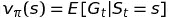

我们可以将 **v_π(s)** 分解如下:

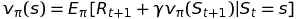

这是预期的即时回报加上下一个状态的贴现值。

**动作值功能**

> 行动值函数 q_π(s)是从状态 s 开始，采取行动 a，然后遵循策略π的期望收益 G_t。

*q_π(s，a)* 是状态 *s* 和动作 *a* 对的期望值。与状态值函数的主要区别在于动作值函数告诉我们一个动作 *a* 在 之后 ***有多有价值，它是在遵循策略π时从状态 *s* 中取出的。***

我们也可以改写 ***q_π(s，a):***

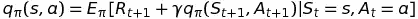

同样我们可以用期望的即时回报和下一步 S_t+1 和 A_t+1 的状态-动作*对 S 和 A 来表达 ***q_π(s，a)*** *。**

在 MDP 图中，我们将把 ***q_π(s，a)*** 写在黑点上。在上面的例子中，我们只有一个。对于那些没有点的箭头，以及在承诺一个特定的动作后，我们清楚地转换到哪个状态的箭头，我们可以想象那里有一个黑点，只有一个可能的状态结束。

**寻找最优策略**

由于 *v_π(s)* 是遵循策略 *π* 时给定状态 *s* 的期望收益，我们需要选择策略 *π* ，其中 *v_π(s)* 是最大值状态函数。这意味着对于所有状态，如果 v_π(s) ≥ v_π'(s) ，则一个*策略π* 优于另一个*π’:*

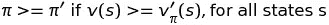

**最佳状态值函数** ***v*_π(s)*** 是所有值状态函数中的最大值状态函数，每个值状态函数遵循不同的策略。

换句话说，当我们找到了 v*_π(s) 时，我们也找到了最佳策略 *π*。*

*v*_π(s)* 是我们通过遵循策略 *π*可以从所有状态的 MDP 中得到的最大值。*

*v*_π(s)* 是遵循特定策略 *π* 的结果。所以这个策略只能是最优策略 *π*。*

> ***定理:*** *对于任意有限的 MDP，至少存在一个最优策略π*，使得它优于或等于其他所有可能的策略π。*
> 
> π∫≥π，对于所有策略π

**贝尔曼最优性方程**

为了实际获得最佳状态值函数 *v*_π(s)* 代理需要从状态 s 的所有可能动作 a 中挑选状态-动作对 q*(s，a)的下一个最大值:

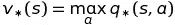

对于代理来说，这只是意味着:如果您处于状态 *s* 中，只需选择动作 *a* ，该动作具有 *q* 的最高值。

现在要实际计算 *q** ，我们需要做以下工作:

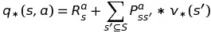

我们考虑行动 *a* 的即时回报 R 和代理人可能结束的所有价值状态的乘积的贴现和，以及在采取行动 *a* 后从 *s* 转换到*s’*的概率 P。

我们现在可以通过用最后一个表达式替换 *q*(s，a)* 来表示 *v*(s)* :

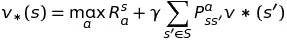

最后一个方程称为状态值函数的贝尔曼最优方程，它为我们提供了一种将当前状态的值表示为下一个状态的值的方法。因此，我们可以递归计算所有状态的所有 *v*(s)* 。

我们还可以将 q*(s，a)的贝尔曼最优方程描述如下:

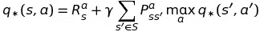

类似于状态值函数的贝尔曼最优方程，我们可以递归地计算所有状态-动作对的所有 q*(x)。

我们通过在 q*(s，a)上最大化来获得最大化策略

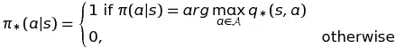

我们遍历一个状态的所有 *q*(s，a)* ，并决定采取获得最大 *q*(s，a)* 值的动作。因此，我们将状态 *s* 中的动作 *a* 的策略设置为 1，而将所有其他动作的策略设置为 0。我们现在有一个确定性的 MDP 政策。对于遵循最优策略的代理，100%确定采取哪个动作来获得每个状态的最大值。

# 感谢阅读！

在下一篇文章中，我将描述我们如何利用这些知识通过迭代过程来计算策略。留下一些掌声来支付威利先生的健身房费用。