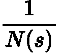
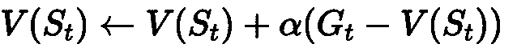

# 强化学习-用于政策评估的蒙特卡罗方法。

> 原文：<https://medium.datadriveninvestor.com/reinforcement-learning-monte-carlo-for-policy-evaluation-312fd2e8331d?source=collection_archive---------0----------------------->

在[之前的博客文章](https://medium.com/datadriveninvestor/reinforcement-learning-planning-dynamic-programming-45f81a3cc9fa)中，我们已经使用动态编程为代理已知环境模型的问题找到了解决方案。然而，在现实世界的问题中，模型并不总是已知的。例如，这就是为什么在股票市场上赚钱如此困难的原因。我们没有关于环境的完整信息，事先也不知道转移概率。

在本帖中，我们将讨论如何使用蒙特卡洛来解决预测/评估问题。通过在没有 MDP 的情况下获得价值函数。

# 蒙特卡罗方法

在本帖中，我们将仅使用蒙特卡洛来评估政策 *π* 。这意味着我们正在寻找状态值函数 v_π(s)给定策略 *π。它也适用于动作值函数 q_π(s ),但是为了简单起见，我们在这里集中于 v_π(s)。*

请记住，状态值只不过是从遵循策略 *π* 的状态 *s* 开始到最后一个时间步长 T 的结束状态的贴现累积奖励:

一个**事件**是从初始状态 *s* 到结束状态的所有状态的序列。它是 ***而不是*** 一个连续的 infit 序列。此外，对于每一集，我们得到不同的返回 G_t。视频游戏的一集的例子可以是所有状态的序列，即从开始到游戏结束的帧。

现在，让我们选择我们的一个状态作为初始状态*s _ I。*我们通过遵循策略π经历一个完整的插曲，并最终到达结束状态 *s_e* 。

我们重复这个很多很多次。在每次迭代中，根据随机策略 *π，最终状态可能以不同的方式达到。*这就导致每一集的回报 *G_t* 都不一样。对这些回报求平均，可以得到初始状态 s_i 的真实状态值的近似表示。

如果我们对所有状态进行这一过程，其中我们总是选择不同的状态作为初始状态，那么我们获得每个状态的状态值的良好近似**,并因此获得环境模型的状态值函数。这是蒙特卡罗背后的主要思想。**

 [## AI 和机器学习有什么区别？数据驱动的投资者

### 这两个主题背后有很多令人兴奋的东西，所以这是一个快速指南，介绍了它们是什么以及它们有什么…

www.datadriveninvestor.com](https://www.datadriveninvestor.com/2020/01/22/whats-the-difference-between-ai-and-machine-learning/) 

通过考虑未来的回报和未来状态的值，而不是使用动态规划和贝尔曼方程来计算时间步长 t 时状态 s 的精确值，我们通过运行许多集来获得真实值函数的估计，然后观察我们为每个集获得的回报，并对所有集进行平均。不需要模型。

Monte Carlo follows the policy and ends up with different samples for each episode. The underlining model is approximated by running many episodes and averaging over all samples. Dynamic Programming, on the other hand, would consider all future actions and future states from every state.

有两种不同的方法来评估政策使用蒙特卡罗。首次就诊和每次就诊。对于这两种情况，我们为每个状态 S 保留一个计数器 N(s ),并将每个状态的每集不同回报的总和保存在 S(s)中。

N(s)和 S(s)累加值，直到完成所有 K 集。在每一集之后，它们不会被设置为零。

让我们仔细看看这两种方法。

## **每次访问蒙特卡罗政策评估**

我们迭代 K 集。在每集中，每当我们到达状态 s 时，我们就将该状态的计数器 N(s)加 1。有可能在同一个情节中多次达到相同的状态。对于所有这些访问，计数器增加。

在所有这些访问中，我们还通过添加当前集 k 的返回 G_t 来更新当前 S(s)值，从状态 S 开始到结束状态。对于每次访问，G_t 可以是不同的。

完成后，我们通过执行以下操作来更新状态的当前值:

这只是到目前为止所有剧集的平均回报。

该算法如下所示:

## 首次访问蒙特卡罗政策评估

我们做的和每次蒙特卡罗策略评估一样。这里唯一的区别是，在同一集内，我们仅在状态 S 第一次访问时更新 N(s)和 S(s ),在我们的算法中，我们将检查 S 是否在该集中第一次被访问，然后才更新它们。

## **增量蒙特卡罗**

现在，我们在每集之后递增地更新 V(s ),而不是先浏览所有集，最后只更新所有状态的 V(s)。我们不再需要探访了。

我们计算剧集 G_t 的实际输出和我们的估计 V(s)之间的误差项。记住 G_t 总是从当前状态开始计算。

我们按照平均误差的方向更新 V(s ):

看看每集之后的更新:

在每次迭代中，我们都向我们看到的样本靠近一点，并且越来越接近平均值。

算法是:

我们不用 N(s)来考虑所有的状态，而是用一个常数α。这样，我们只关心固定的步数，允许忘记一些状态。

这在更灵活的环境中，在非平稳问题中是有意义的。这实际上几乎是真实世界的情况。机器人不需要考虑它曾经走过的每一步来决定下一步。只是一些过去的步骤很重要。缺点是通过使用固定步长α而不是均值，我们会对 V(s)进行欠校正或过校正。

对于我们的更新部分，这意味着我们只需用α替换 1/N(s)。

这也使得我们上面的算法简单了一点，因为我们不再需要跟踪 N(s)。

## 蒙特卡洛的问题

*   仅适用于小插曲，不适用于连续或无限的问题
*   我们需要先完成一集，然后才能更新所有值。这对于自动驾驶汽车来说是不好的，如果使用蒙特卡罗，只有在事故发生后，即事件结束时，才会更新状态值。那有点太晚了。