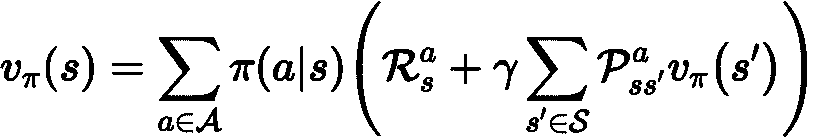

# 强化学习——规划和动态规划

> 原文：<https://medium.datadriveninvestor.com/reinforcement-learning-planning-dynamic-programming-45f81a3cc9fa?source=collection_archive---------6----------------------->

在上一篇[帖子](https://medium.com/@wlaurito2/reinforcement-learning-mdp-639aecec6da4)中，我们讨论了强化学习和 MDP 的一些基础知识。现在，我们将描述如何通过使用动态规划寻找最优策略来求解 MDP。

# 规划问题

一个*规划问题*的环境完全可以被一个代理观察到。因此，一个完全可观测的 MDP 是解决规划问题的基础。

例如，在扑克游戏中，代理看到所有对手的牌，并且知道一副牌中所有牌的顺序。

规划问题有两种情况:

## 预言；预测；预告

其中之一就是*预测题*。这里的输入是一个完全可观测的 MDP 和一个策略π。作为输出，我们获得了*状态值函数 v_π。*有了价值函数，我们现在就能够评估给定政策的未来 *π* 。我们可以通过遵循政策 *π来说一个状态会有多好。*

例如，在我们的扑克游戏中，我们可以预测下一张抽的是哪张牌，以及根据策略π，代理将出哪张牌。我们感兴趣的是预测玩家的每个回合会有多好。我们通过获得*状态值函数 v_π来实现。*

## 控制

计划的另一个例子是*控制。*输入再次是完全可观测的 MDP，但是现在没有给出策略*π**。*在这种情况下，我们所寻找的，是在我们的 MDP 中为每个州获得最大价值的最佳行为方式*。*因此，我们在寻找最优策略 *π** 和最优状态值函数 *v** 。

赢得扑克游戏归结为找到最佳策略的行为。因为代理人像不朽的宙斯一样知道和看到一切，所以它只是一个计划如何在每个回合进行的问题。

 [## AI 和机器学习有什么区别？数据驱动的投资者

### 这两个主题背后有很多令人兴奋的东西，所以这是一个快速指南，介绍了它们是什么以及它们有什么…

www.datadriveninvestor.com](https://www.datadriveninvestor.com/2020/01/22/whats-the-difference-between-ai-and-machine-learning/) 

# 策略迭代

为了实际找到最优策略并求解我们的 MDP，我们可以使用预测方法来评估策略 *π* 以获得状态值函数 v_ *π。我们称这个过程为政策评估。*

基于这个状态值函数，我们现在可以通过贪婪地行动并选择具有最大行动值的行动来计算新的、更好的策略*π’*。基于上述控制问题的方法，该步骤被称为**策略改进**。

接下来，我们重复评估过程，这次使用策略π’来获得*v _π’。*

***通过迭代评估和策略改进两个过程，我们最终得到最优策略π*和最优状态值函数 v*。***

## **迭代政策评估**

为了评估一项政策，我们将使用稍微修改过的*贝尔曼期望方程*。这就是为什么我们需要先检查原始方程:

在上一篇文章中，我已经描述了 v_ *π的 Bellman *最优性*方程。*您可能还记得，*s’*代表从状态 s(在时间步长 t)采取动作 *a* 后的下一步(在时间步长 t+1)。

这里的主要区别是，我们现在不仅仅考虑在一种状态下给予我们最大回报的行动，而是考虑一个主体通过遵循随机策略 *π* 可以选择的*所有*行动，因此我们现在通过选择行动来总结所有可能的状态 s’。根据贝尔曼期望方程，我们基于代理可能达到的所有状态来更新每个状态值。

让我们来看看贝尔曼期望方程的修正版:

你能看出不同之处吗？我们用右侧的*v _ k(s’)*代替了 v _*π(s’)*，等式的左侧从 v_ *π(s)* 变为 v_k+1(s)。干得好！为你击掌！

这个修改版本告诉我们如何更新我们的状态值，并被称为*迭代策略评估。*为了得到下一次迭代的状态值函数的每个状态的值 *v_k+1* ，我们根据上一次迭代的状态值函数 *v_k* 计算新函数的每个状态。换句话说，我们使用“旧”状态*s’，*s 的后继状态的值，来计算在 *v_k+1(s)* 的时间步长 *t* 的“新”状态 *s* 的值。

目前，我们正在使用所谓的**同步备份**，因为下一个状态值函数的所有状态都被一次性更新，并且只有当所有状态都被更新时，我们才得到新的 v_k+1。

更新了所有状态后，通过应用修改后的*贝尔曼期望方程*，我们现在有了一个基于π *的新的价值函数 *v_π* 。我们现在知道遵循这个特殊的政策是多么有价值。*

## 政策改进

我们现在可以使用这个新计算的状态值函数来改进我们的策略。我们通过创建一个新策略*π’*来做到这一点，该策略选择具有最大动作值的动作 *a* ，从而最大化 MDP 中每个状态 *s* 的值。通过这样做，我们最终得到一个新的状态值函数 v_π'(s)，它大于或等于 v_π(s)。

选择具有最大动作值的动作 a 意味着新策略π'贪婪地作用于 *q_π(s，a):*

新政策只是忽略了旧政策会做的事情，而是总是选择给我们带来最大回报的行动。

通过证明策略改进定理，我们可以证明贪婪行为的策略π'总是比原始策略π好。

## **政策改进定理**

让我们考虑一个用于 *v_π* 的确定性策略 *π* 。为什么是决定论？在策略改进的一次迭代之后贪婪地行动使得策略无论如何都是确定的，因为贪婪策略*π’*为每个状态 *s* 选择一个动作，该动作最大化该状态的值。这意味着我们可以假设从确定性策略开始。

在对每个状态遵循这个特定的确定性策略 *π* 之后，我们最终得到:

这是因为每个状态 *s* 的值取决于所采取的动作 *a* ，因此对于每个状态 *s* ，状态值 *v_π* 和动作值 *q_π* 相等。

现在，我们要展示为什么遵循贪婪策略*π’*会导致*v _π’(s)*大于或等于原来的 *v_π(s)。*

**政策改进定理**如下:

它基本上说:遵循确定性贪婪策略 *π' (s) = a* ，而不是 *π(s) = a，*对于所有状态导致 q_ *π(s，π')*大于或等于 v_ *π(s)* 并且因此也在

让我们先证明从 *s* 到后继状态*s’*的一步。如前所述 *π'(s)* 选择动作值最大的动作 *q_π(s，a)* 。通过遵循*π’(s)*而不是 *π(s)* 用于该单个状态，然后继续原始策略π *，*，则我们最终得到*v _π’(s)*大于或至少等于 *v_π(s)* 。这意味着我们的政策 *π'(s)* 确实优于或等于 *π(s)* ，如果这仅适用于一个州的话。我们可以把 *q_π(s，π')*写成:

这告诉我们，q_ *π* (s，*π’(S)*就是通过跟随*π’*得到的期望即时报酬 *R_t+1* 加上通过跟随π *得到的下一个状态 *S_t+1* 的贴现值所代表的未来报酬。*

我们现在知道 *π' (s)* 对于特定的状态一定更好。我们现在可以将 *v_π(s) ≤ q_π(s，π')*应用到 *γv_π(S_t+1)* 来表明这对于下一个状态也是成立的:

这告诉我们，q_ *π* (s，*π’(S)*就是通过跟随*π’*得到的期望即时报酬 *R_t+1 和* R_t+2 加上通过跟随π *得到的下一个状态 *S_t+3* 的贴现值所代表的未来报酬。*

如果我们对所有状态重复应用 *v_π(s) ≤ q_π(s，π')*，我们最终将得到:

也就是 **q_ *π(，π'(s)) = v_π'(s)***

因此证明了

是真的，因为策略 *π' (s)* 对于每个状态来说确实比原始策略 *π(s)* 更好。

# 价值迭代

值迭代是策略迭代的特例，策略评估只有一次单次迭代 *k=1* 。我们可以使用稍加修改的贝尔曼最优方程，因此将策略评估和策略改进结合在一个更新规则中:

我们再次使用时间步长 k 的先前价值函数的状态来获得 *k+1* 的价值函数的状态。**但是现在我们直接选择奖励最大化的动作**。通过反复应用这一规则，我们获得了最优价值函数，并由此获得了我们在上一篇文章中看到的最优策略。

**举例:最短路径**

假设我们有以下状态和动作(见下图)。所有动作都有奖励 *R=-1* 。结束状态是一个正方形，位于右下角。对于 *k=0* 中的所有值状态，我们从 *0* 开始。

对于 *v_0* ，我们得到如下:

接下来，我们同步迭代应用修正的贝尔曼最优方程。首先对于 *k=1* 的每个状态得到 *v_1* 。例如，对于左上角的状态，我们称之为 A，我们计算状态值如下:

我们将修改的贝尔曼最优方程应用于每个状态，并得到具有以下状态值的新的值函数*v1*:

让我们为 v2 再做一次:

现在让我们仔细看看标有红色 F 的状态和左上角的状态 A:

正如你现在看到的，一条清晰的路径由状态和它们的值来表示。

通过继续这个过程，对于 k=4，我们将得到如下结果:

在每一步中，我们通过选择那些引导我们达到最高价值状态的行动来获得我们的最优政策。在这种情况下，最优策略有不同的路径。

为了帮助你更好地理解价值迭代是如何工作的，你可以从最终状态开始考虑到“最接近”的状态，例如我们上面的状态 F。实际上，不一定要有结束状态，MDP 可以有循环。值迭代仍然可以工作，但是想象一个结束状态仍然有助于理解它是如何工作的，以及它是如何在每次迭代中从该状态向后“传播”到所有状态的。

我们把这个问题分成子问题。我们从直接指向最终状态的行动中选择最佳行动，这给了我们最高的回报。我们对每个“最接近”最终状态的状态都这样做。一旦我们完成了这些，我们就可以进行下一次迭代，来解决从指向上一次迭代状态的状态中找到动作的最高值的子问题，依此类推。在动态规划中，这叫做 ***最优性原理*** 。我们通过寻找子问题的解来获得完整问题的解。

# **异步动态编程**

在同步动态编程中，我们需要为旧的值函数保存一个数组，为新的值函数保存一个数组。然后，我们使用旧值函数的状态来计算新值函数中的每个状态。只有计算完新值函数中的所有值，我们才能删除旧函数，然后使用新计算的函数进行下一次迭代。新函数在下一次迭代中成为旧函数，过程再次开始。由于这在现实世界中不是非常有效和实用，我们可以使用**异步动态编程**。

## 就地动态编程

一种技术是就地动态编程。这里的想法是不用保存两个数组，一个用于旧的，另一个用于新的值函数，我们只使用一个数组，直接就地更新状态。我们直接使用更新的状态。只要我们连续到达所有的状态，我们最终总是得到一个更新的值函数。

当然还有更多像**实时动态编程**和**优先级扫描**，这里我就不描述了。

# **结论**

感谢阅读。在下一篇文章中，我将写关于无模型预测。