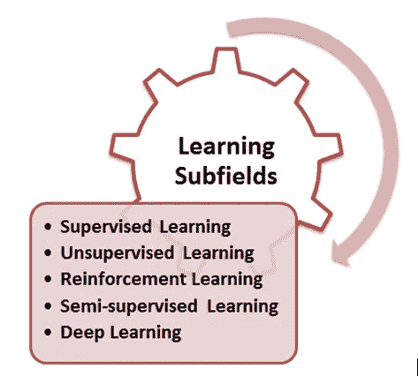
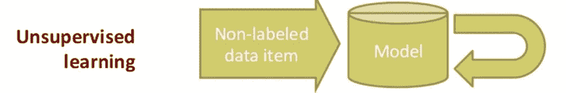

# 强化学习(RL)简化

> 原文：<https://medium.datadriveninvestor.com/reinforcement-learning-rl-simplified-87b4aa74b85b?source=collection_archive---------5----------------------->

在这篇博客中，我将介绍以下强化学习的分类。很容易在一张思维导图中形象化并记住完整的概念。这是我学习的方式，希望你们都觉得很容易理解和应用..

在深入强化学习之前，我们先回顾一下不同的学习方法。下图描绘了机器学习的各个子领域。这些子字段是机器学习算法分类的方式之一。

***监督学习:*** 监督学习是所有关于操作到一个已知的期望，在这种情况下，需要从被定义的数据中分析什么。在这种情况下，输入数据集也称为“带标签的”数据集。归入这一类别的算法侧重于建立输入和输出属性之间的关系，并推测性地使用这种关系来为新的输入数据点生成输出。在上面的部分中，为分类问题定义的例子也是监督学习的例子。标记数据有助于建立可靠的模型，但通常昂贵且有限。

***无监督学习:*** 在一些学习问题中，我们头脑中没有任何特定的目标要解决，具体来说这种学习被称为无监督分析或学习。这种情况下的目标是解密数据中的结构，而不是建立数据的输入和输出属性之间的映射，事实上，输出属性没有定义。由于这个原因，这些学习算法在“未标记的”数据集上操作。

所以，给定一串 x，这里的目标是定义一个函数 f，它能给出一组 x 的简洁描述。因此，这被称为集群。

f(x)

***半监督学习(SSL):*** 半监督学习是关于使用标记和未标记的数据来学习更好的模型。对于未标记的数据有适当的假设是很重要的，任何不适当的假设都会使模型无效。半监督学习的动机来自人类的学习方式。

# 强化学习:背景

强化学习是关于专注于从结果中获得最大回报的学习。

> ***类比:*** *在教初学走路的孩子新习惯的同时，奖励初学走路的孩子每次听从指令的行为非常奏效。事实上，他们知道什么样的行为有助于他们获得回报。这正是强化学习。也叫信用评估学习。*

 [## 数据科学和软件工程哪个更有前途？数据驱动的投资者

### 大约一个月前，当我坐在咖啡馆里为一个客户开发网站时，我发现了这个女人…

www.datadriveninvestor.com](https://www.datadriveninvestor.com/2019/01/23/which-is-more-promising-data-science-or-software-engineering/) 

最重要的是，在强化学习中，该模型还负责做出决策，并为此获得定期奖励。与监督学习不同，这种情况下的结果不是即时的，可能需要执行一系列步骤才能看到最终结果。理想情况下，该算法将生成一系列有助于实现最高回报或效用的决策。

这种学习技术的目标是通过探索和利用数据来有效地衡量取舍。例如，当一个人必须从 A 点旅行到 B 点时，将有许多方式，包括乘飞机、水路、公路或步行，考虑这些数据来衡量这些选项中每一个的权衡是很有价值的。另一个重要的方面是延迟奖励意味着什么？它会如何影响学习？例如，在像国际象棋这样的游戏中，奖励识别的任何延迟都可能改变或影响结果。

因此，这种表示非常类似于监督学习，不同之处在于输入不是 x，y 对，而是 x，z 对。目标是在给定 x 和 z 的情况下，找到一个标识 y 的函数 f。在接下来的几节中，我们将进一步探讨 z 是什么。

给定 z，y = f(x)。

正式定义:

> 强化学习被定义为一种通过奖励和惩罚对代理进行编程的方式，而不需要指定任务是如何完成的
> 
> -卡尔布林，利特曼和摩尔，96 年

因此，net-net，RL 既不是一种神经网络，也不是神经网络的替代方案，而是一种强调学习反馈的机器学习的“正交”方法，用于评估学习者的表现，没有衡量表现的标准行为目标，例如，学习骑自行车。

现在，让我们看看正式的或基本的 RL 模型，并了解不同的要素，作为第一步，让我们了解一些基本术语。

代理:代理是一个既是学习者又是决策者的实体，在这种情况下通常是一个智能程序。

*环境*:环境是一个实体，它负责在代理执行一个动作的情况下产生一个新的情况。它对行动给予奖励或反馈。所以，简而言之环境就是一切事物而不是代理人。

*状态*:是一个动作落地一个实体的情况。

*动作*:动作是由代理执行的导致状态变化的步骤。

*策略*:策略是代理在给定时间点如何行为的定义。它详细描述了状态和动作之间的映射，通常是一个简单的业务规则或功能。

*奖励*:奖励规定了有助于达到目标的行动的短期利益。

*价值*:强化学习中还有一个重要的元素，那就是价值函数，而奖励函数是关于一个行为的短期或即时收益，价值函数是关于长期收益。这个值是一个代理人从世界开始的时候期望得到的奖励的累积。

# 强化学习的例子

理解强化学习的一个最简单的方法是看看它的一些实际和真实的应用。在这一节中，我们将列出并理解其中的一些。

***例 1*** : **棋局**:在棋局中，一个棋手下了一步棋；这一步是由对手玩家的一系列反击动作的明智选择所驱动的。玩家的下一步行动是由对手采取什么行动决定的。

***例二*** : **电梯调度**:我们以一栋楼多楼层多电梯为例；这里的关键优化要求是选择哪个电梯应该被送到哪个楼层，并且被归类为控制问题。这里的输入是跨楼层、电梯位置和一组楼层按下的一组按钮(电梯内部和外部)。奖励是这种情况是人们想使用电梯的最少等待时间。在这里，系统再次学习如何控制电梯，通过在建筑物的模拟中学习，系统通过对来自过去的动作值的估计来学习控制电梯。

***例 3*** : **移动机器人行为**:移动机器人需要根据过去找到充电点的速度来决定是到达充电点还是下一个垃圾点。

# 评估性反馈

强化学习区别于其他学习类型的关键特征之一是，它使用信息来评估特定动作的影响，而不是盲目地指示需要采取什么动作。一方面，评估性反馈表明所采取的行动有多好，而指导性反馈表明什么是正确的行动，而不管是否采取了行动。尽管这两种机制各自不同，但在某些情况下，这些技术可以结合使用。在本节中，我们将探索一些评估性反馈方法，为本章的其他部分奠定基础。

# **钢筋对比方法**

我们在大多数选择方法中都看到，奖励最大的行为比奖励较小的行为更有可能被选中。重要的问题是，奖励是大是小，如何衡量质量？我们总是需要一个参考数字来限定奖励的高值或低值。这个参考值叫做参考报酬。开始的参考奖励可以是先前接收的奖励的平均值。使用这种思想的学习方法被称为强化比较法。这些方法比行动者-价值方法更有效，并构成了行动者-批评家方法的基础，我们将在后面的章节中讨论。

## 强化学习问题——网格世界的例子

我们将尝试使用著名的例子“网格世界”来理解强化学习问题。这个特殊的网格世界是一个 3 X 4 的网格，如下图所示，是世界复杂性的一个近似值。

这个例子假设世界是一个游戏，你从一个叫做开始状态的状态开始(从位置 1，1 开始)，让我们假设可以采取四个动作，包括向左、向右、向上和向下移动。目标是确保使用这些行动，我们朝着位置 4，3(绿色)所示的目标前进，我们需要避免位置 4，2 所示的红框。

**开始状态:**位置 1，1 à世界从这里开始

**成功状态**:位置 4，3 à世界在这里结束，处于成功状态

**失败状态**:位置 4，2 à世界终结于此，处于失败状态

当世界末日的时候，我们需要重新开始。

**墙**:位置 2，2 处有路障或墙。此位置无法导航。

为了从起点(1，1)达到目标(4，3)，可以在以下方向采取步骤:

一个方向上的每一步都把你从一个位置移动到另一个位置(这里的位置不过是状态)。例如，从位置 1，1 沿“向上”方向的移动会将您带到位置 1，2，依此类推。

从一个给定的位置不能拍摄所有的方向，让我们以下面的例子为例，从位置 3，2，只能拍摄上、下和右。向左移动会撞到墙上，因此不能采取。也就是说，只有上下移动才有意义，因为向右移动会移动到危险的位置，导致无法达到目标。

类似地，网格边界中的任何位置都有限制，例如位置 1、3 允许向右和向下移动，任何其他移动都不会改变该位置。

现在让我们看看从起点(1，1)到目标(4，3)的最短路径。有两种解决方案

o **解决方案 1:** 右à右à上à上à右(5 步)

o **解决方案 2** :上à上à右à右à右(5 步)

在现实世界中，并不是所有的动作都能按预期执行；存在影响性能的可靠性因素，或者说存在不确定性。如果我们给例子加一个小小的警告，说每次有一个动作从一个位置移动到另一个位置，这个动作是正确的概率是 0.8。这意味着有 80%的可能性运动按预期执行。在这种情况下，如果我们要衡量方案 1(RàRàUàUàR)成功的概率。

行动按预期发生的概率+行动不按预期发生的概率

= 0.8 x 0.8 x 0.8 x 0.8 x 0.8+0.1 x 0.1 x 0.1 x 0.1 x 0.8

= 0.32768 + 0.00008 = 0.32776

正如我们所见，不确定性因素确实会改变结果，在下一节中，我们将讨论捕捉这些不确定性的决策过程框架。

# 强化学习—主要特征

> 强化学习不是一套技术，而是一套问题，集中于任务是什么，而不是任务应该如何处理。
> 
> 强化学习被认为是机器使用奖励和惩罚进行学习的工具，这更像是一种试错驱动。
> 
> 强化学习采用评估性反馈。评估性反馈衡量所采取行动的有效性，而不是衡量行动是最好还是最差。(请注意，监督学习更多的是一种指导性学习，它测量动作的正确性，而不考虑正在执行的活动)
> 
> 强化学习中的任务更多的是联想任务。关联任务依赖于确定和执行最适合给定情况的动作的情况。非关联任务是那些独立于给定情境的任务，当任务静止时，学习者会找到最佳行动。

这总结了强化学习的核心概念，在下一篇文章中，我将介绍强化学习的解决方法。请分享您的意见和反馈。