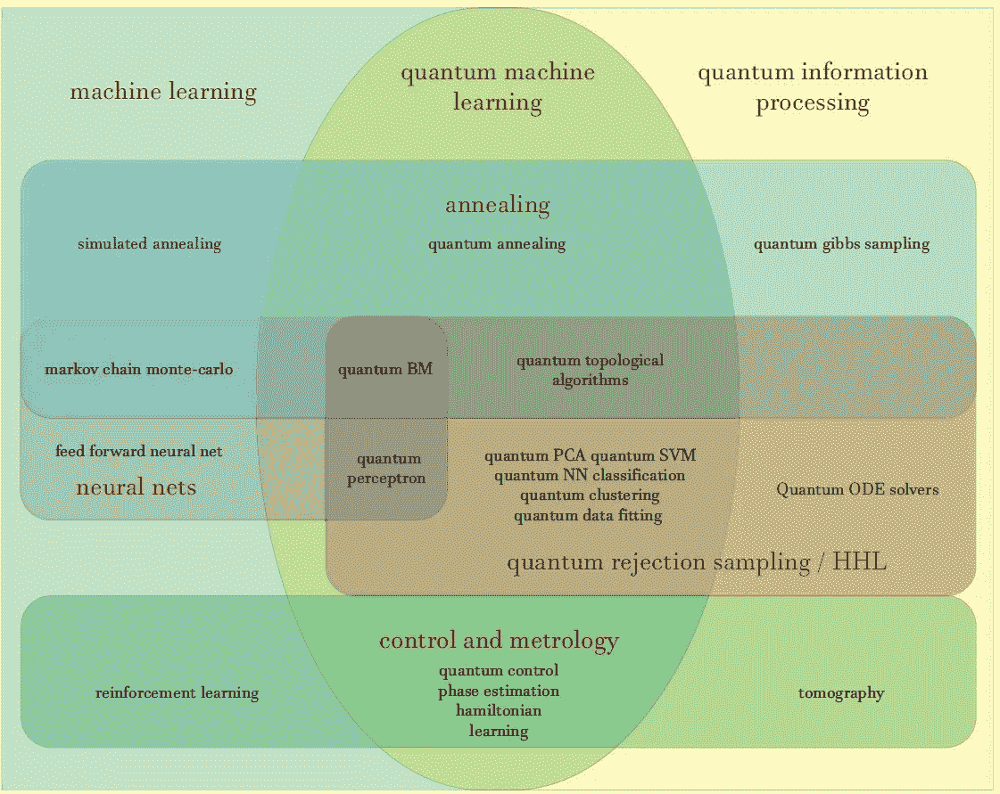
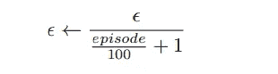
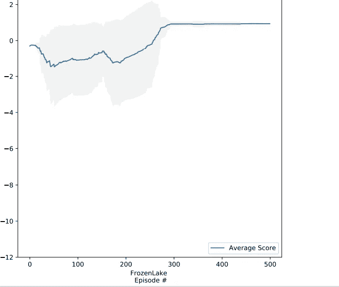

# 使用量子计算的强化学习

> 原文：<https://medium.datadriveninvestor.com/reinforcement-learning-using-quantum-computing-361a977c641d?source=collection_archive---------3----------------------->

要理解这篇文章，你必须知道强化学习的基础，比如代理 q 值和目标值的概念。你脑海中可能出现的一个普遍问题是，为什么我们使用量子来训练我们的强化学习模型，你可以通过阅读整篇文章来找到答案，所以让我们在量子世界中开始你的机器学习之旅。

量子电路的第一个也是最重要的品质是，它比传统的神经网络需要更少的参数，这使它们有望模拟复杂的环境。对于目标网络，我采用一个冰冻湖泊的架构。

[https://gym.openai.com/envs/FrozenLake-v0/](https://gym.openai.com/envs/FrozenLake-v0/)

目标电路每 20 步更新一次。对于经验重放，重放存储器的长度设置为 80，以适应测试环境。优化过程需要计算量子测量的期望值的梯度，这可以通过相同的电路架构和略微不同的参数来进行

在冰湖环境中，总共有 16 个状态。因此，它需要 4 个量子位来代表所有状态。我希望你们都明白量子位的意义。

环境方面的行动和奖励如下:

动作:动作空间中有四个动作。量子电路的输出是 0、1、2、3，它们对应于左、下、右、上的动作

奖励:在这种环境下，成功实现目标的奖励为+1.0，任务失败的奖励为-0.2，即步入洞中。此外，为了鼓励代理人走最短的路径，每走一步还有 0.01 英镑的奖励。

 [## 金融中的机器学习|数据驱动的投资者

### 在我们讲述一些机器学习金融应用之前，我们先来了解一下什么是机器学习。机器…

www.datadriveninvestor.com](https://www.datadriveninvestor.com/2019/02/08/machine-learning-in-finance/) 

> **内存消耗上的量子优势:**在基于神经网络的深度 Q 学习中，对于冰湖环境，参数个数将为 2 × N2 + 2 × N。但有了量子电路，电路参数的数量减少到 N × (3 × 2 + 1)。

我选择的优化是成为 RMSprop，学习率= 0.01，alpha = 0.4，eps = 1，广泛应用于深度强化学习。体验回放的批量大小是 5。冰湖中使用的ε-贪婪策略如下:

奖励集中在 300 集，所以不需要训练更多，快乐编码。

这篇文章的所有代码都在我的 github 上:[https://github . com/AFNANAMIN/AI _ Freelancing/blob/master/Reinforcement _ Learning _ with _ Quantum _ computing . ipynb](https://github.com/AFNANAMIN/AI_Freelancing/blob/master/Reinforcement_Learning_with_Quantum_Computing.ipynb)