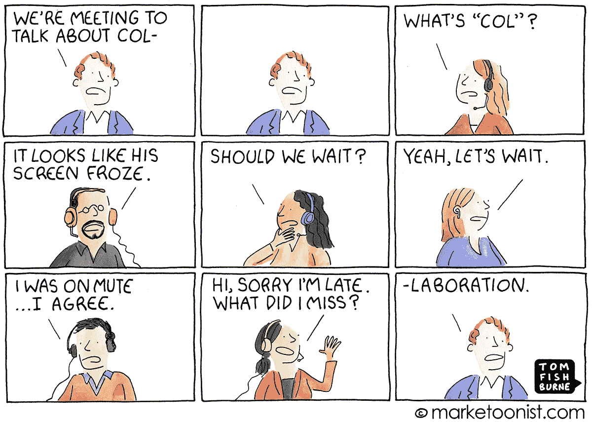

# 关系 b/w 操作和数字工作场所

> 原文：<https://medium.datadriveninvestor.com/relation-b-w-operations-and-digital-workplace-c963ee572488?source=collection_archive---------17----------------------->

即兴操作性能是成功数字化的必要条件。

经过几十年的经验和研究，对数字化转型的理解得出了这样一个结论:**数字化转型**可以用**转型运营**来实现。我们引入了一系列技术细节，以增强我们的*客户支持* 和*后台系统。*

> 较少关注一个组织的运营或员工需求。

到目前为止，我们花了这么多时间来真正了解数字化转型的症结，是因为市场上解决各种用例的工具太多，很难找到实际问题所在。

许多企业在雇佣符合文化的员工、修补销售流程、管道管理、营销信息等方面投入了最大努力。主要是承认外部需求的东西。这让他们更少地忙于**解决与员工及其工作环境相关的内部**问题。

随着随机的或较少分析的工具的出现，由于费力的操作系统和很少或没有灵活性，对于员工来说，敏捷和高效是一个令人不快的情况。对于知识工作者来说，协作和敏捷是最重要的因素。

 [## 不开玩笑:营销是为了搞笑|数据驱动的投资者

### 当你把幽默和营销结合在一起时，这是一件有趣的事情。当然，马克·安德森希望如此。别叫他雪莉。相反…

www.datadriveninvestor.com](https://www.datadriveninvestor.com/2019/02/25/no-fooling-marketing-goes-for-laughs/) 

企业将冗余的任务或事件视为流程，并且只自动化那些可重复的**和结构化的**。他们仍然没有意识到较少考虑的“**非结构化流程**”所带来的影响。

> 相比之下，非结构化过程是不可识别的，并且数量巨大，而结构化过程在自然界中是显而易见的。

**例如**，在一个制造单元中，通过传送带完成的工作被有意识地标记为过程，而不是人工干预/ **特别优化**是及时的要求，没有被注意到。同样，有许多用例在一个组织中产生和解决，但由于缺乏涵盖适应性用例的过程系统，这些用例经常被忽视。

还需要一个记录个人或团队工作的几个项目的开始和结束的系统。**如招聘举例**。招聘网站需要更新，需要向现有同事发送推荐电子邮件，需要筛选 X 份简历，需要通知参与项目的人员，等等，这是一个巨大的项目，每一步都有明确的时间表。

> 像这样的项目需要更少的控制和更多的协作。

为什么我们现有的工作场所需要更多的团队合作和更少的控制。当我们说数字化工作场所时，协作是运营成功的关键。

分享你对数字化工作场所的看法。