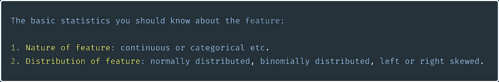
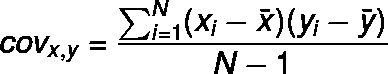
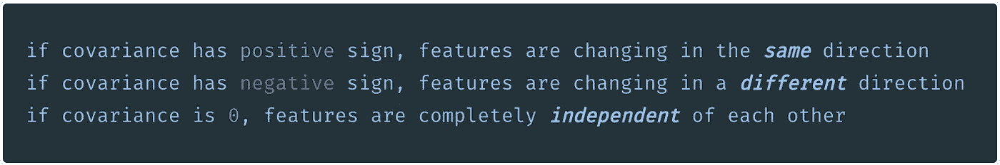
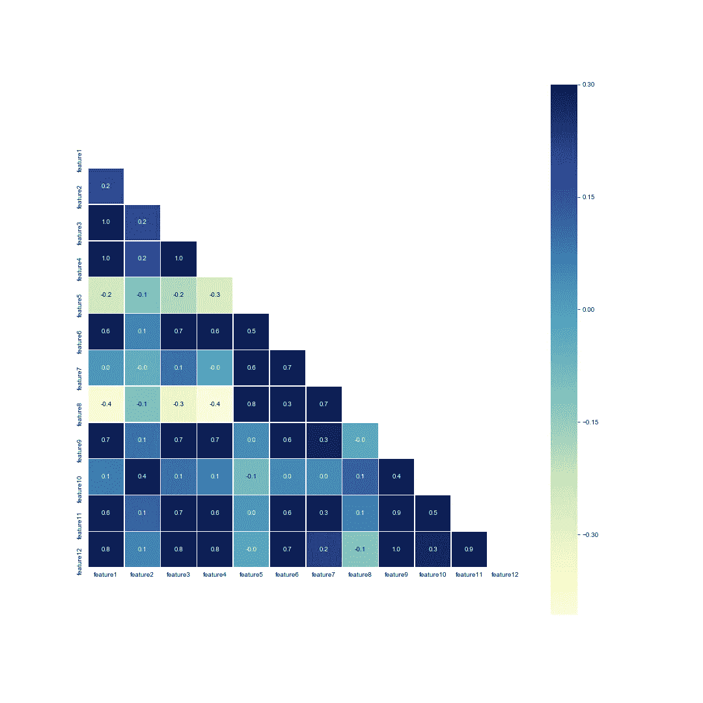
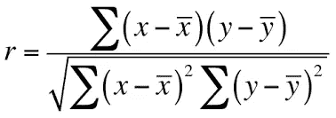
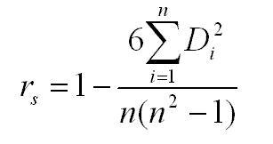

# 数据之间的关系也称为相关性

> 原文：<https://medium.datadriveninvestor.com/relationship-aka-correlation-between-features-e1fbc244694e?source=collection_archive---------7----------------------->

在机器学习和数据科学中，数据探索或数据分析是建立有效模型的首要步骤。在进行数据分析时，我们首先需要了解数据及其目的，然后了解数据的性质和分布，无论数据是高斯(正态)分布还是无分布，然后分析或思考可以使用哪些统计方法来提取可用于建立模型的有用信息。这有助于我们制作更好的模型。此外，通过这样做，我们可以过滤不需要的特征，只允许那些为模型提供有用信息的特征，从而降低模型的复杂性。

一旦我们弄清楚了特征的上述基本属性，我们就可以相应地应用统计方法。提取和理解单个特征的统计量是相对容易的。但是如果我们想了解两个或更多特征之间的统计关系呢？

为了找到特征之间的关系，我们需要计算相关系数并执行一些测试来提取有价值的信息。为了应用这样的度量和测试，我们应该确定这样的方法和数据类型之间的兼容性。我将在这篇文章中讨论所有这些细节。

由于各种原因，数据集中的要素可以相互依赖或独立。为了找出它们之间的相关程度，我们经常使用*协方差*和*相关性*度量或者一些统计方法来量化它们之间的关系。

# 协方差

这两个特征之间的关系可以通过计算协方差来找到。以下是计算两个要素之间协方差的公式:

协方差本身不会给出任何有用的见解。所以，为了加强协方差方法，我们通常使用不同的相关方法，如下所述。

# 相互关系

特征之间的关系或相关性表现为

在这篇博客中，我们将涵盖所有流行的相关方法，并试图了解何时对不同类型的数据使用这些方法。

有两种主要类型的相关方法:

*   **参数相关性**
*   **非参数相关性**

在寻找特征之间的相关性时，如果特征具有高斯分布或线性关系，我们应用*参数相关性*方法，而如果特征是无分布的或分布未知，我们应用*非参数相关性*方法。热图将帮助我们更好地可视化所有特征之间的相关性。

Heatmap

> 作为一般的经验法则，当特征是名义的(分类的)或顺序的，那么应该选择一个**非参数**测试，当特征是连续的，那么应该选择一个**参数**测试。

**参数相关性:**参数测试假设你正在处理的特性是*正态分布*或者遵循*钟形曲线*。检查两个特征之间关联强度的最常见参数测试是

*   皮尔逊相关

**非参数相关性:**非参数检验被称为*无分布*检验，因为它们不遵循任何关于数据分布的假设。其中一些列举如下:

*   斯皮尔曼等级相关
*   肯德尔等级相关系数
*   古德曼和克鲁斯卡尔的秩相关
*   萨默斯等级相关

 [## 差异-相关性与因果关系|数据驱动的投资者

### 我们人类喜欢听和讲故事。我们注定会自然而然地在日常生活事件中寻找模式…

www.datadriveninvestor.com](https://www.datadriveninvestor.com/2020/05/09/the-disparity-correlation-vs-causation/) 

## **皮尔森相关性**

当评估两个连续变量之间的关系时，使用皮尔逊相关。皮尔逊相关系数的计算方法是将两个变量的协方差除以标准偏差的乘积。

Pearson’s Correlation

该系数返回一个介于-1 和 1 之间的值，分别表示负相关和正相关，系数值为 0 表示不相关。系数< -0.5 and > 0.5 表示特征之间的显著相关性。完美的正相关是+1，完美的负相关是-1。

具有正态分布(高斯)的两个特征之间的相关性可以计算为皮尔逊相关性。但是对于不符合正态分布(分类)的特征，我们通常使用等级相关。让我们来了解一下等级相关性。

**什么是秩相关？**

等级相关度量特征之间的顺序关系或者不同顺序变量的等级之间的关系。

等级相关性的计算方法是，将 1 作为列中最大的数字，将 2 作为第二大的值，依此类推，对于相同的分数，等级将是平均等级。然后可以计算等级相关系数，以表示两个等级变量之间的关联。

秩相关方法被称为非参数相关或无分布相关。要了解更多关于如何计算排名的信息，请看这里的。

## **斯皮尔曼关联**

它衡量两个排序变量之间关联的强度和方向。当皮尔逊相关的假设被违反时，使用它。斯皮尔曼相关方程如下所示:

**Spearman’s Correlation**

其中 D 是秩和 n 的差，I 是对数

它计算皮尔逊相关性，但使用特征的等级。下面是计算斯皮尔曼相关系数的[例子](https://statistics.laerd.com/statistical-guides/spearmans-rank-order-correlation-statistical-guide.php)。

**肯德尔等级相关**

它为两个特征之间的匹配或一致等级的数量计算归一化分数。

> 肯德尔τ= C-D/C+D

其中 C 是[一致对](https://www.statisticshowto.com/concordant-pairs-discordant-pairs/)的数量，D 是不一致对的数量。

和谐对是低于某一等级的较大等级的数量，而不和谐对是低于某一等级的较小等级的数量。

直观上，当两个特征之间的观察值具有相似的等级时，两个特征之间的肯德尔相关性将会很高，而当两个特征之间的观察值具有不同的等级时，肯德尔相关性将会很低。下面是[例子](https://www.statisticshowto.com/kendalls-tau/)计算肯德尔的秩相关系数。

**古德曼和克鲁斯卡尔的等级相关性**

它测量两个有序特征之间存在的关联的强度和方向。它基于[两个假设](https://statistics.laerd.com/spss-tutorials/goodman-and-kruskals-gamma-using-spss-statistics.php)，一个假设是两个特征应该在顺序尺度上测量，另一个假设是特征应该处于单调关系

当特征之间有许多联系时，这是有用的。平局是指比较两个特征时两个值相同。

为了简单起见，我避开了公式及其解释。可以查看[例子](https://www.statisticshowto.com/gamma-coefficient-goodman-kruskal/)看看如何计算 Goodman 和 Kruskal 的秩相关系数。

**萨默斯等级相关性**

它是一个顺序因变量和一个顺序自变量之间关联的度量。Somers 的等级相关性是基于这样的假设，即一个特征是序数相关的，而其他特征是序数无关的

当你想区分因变量和自变量时，Somers 的秩相关是合适的，Goodman 和 Kruskal 的γ不区分两个序数变量。

*总结，我们涵盖了两个特征之间参数和非参数相关的不同相关系数。在随后的博文中，我将介绍 t 检验、方差分析、卡方检验等测试方法。对于两个以上的特征。与此同时，如果你有兴趣了解更多关于机器学习的知识，你可以看看我的其他* [*博客*](https://medium.com/@charlespatel/underneath-numpy-array-python-list-42a30e62f693) *。感谢:)*

# 参考

 [## SPSS 统计教程和统计指南

### 非常适合统计学课程、学位论文和研究项目。我们的统计测试选择器帮助您…

statistics.laerd.com](https://statistics.laerd.com/)  [## 统计学如何:我们其余人的基本统计学！

### 寻找初级统计帮助？你来对地方了。统计怎么有 1000 多条…

www.statisticshowto.com](https://www.statisticshowto.com/) 

**访问专家视图—** [**订阅 DDI 英特尔**](https://datadriveninvestor.com/ddi-intel)