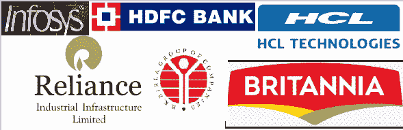

# 已发布:2020 年第 1 季度(4 月-6 月)结果| COVID proof 与 hit 对比

> 原文：<https://medium.datadriveninvestor.com/released-quarter-1-apr-june-2020-results-covid-proof-vs-hit-comparison-c630fd91e876?source=collection_archive---------28----------------------->

Photo by [Samson](https://unsplash.com/@samsonyyc?utm_source=medium&utm_medium=referral) on [Unsplash](https://unsplash.com?utm_source=medium&utm_medium=referral)

Q1 2020 的结果已经出来了，我们已经将印度顶级公司的数据整合并分类为 COVID hit 与 COVID proof。在本文中，在疫情期间盈利的公司将被引用为 COVID proof，而利润损失/减少将被引用为 COVID hit。

如果你还没有读到因 C-19 而受影响的前 6 大行业，请在此阅读*。*

**

**Individual Pic credit — Google Images**

# *Infosys [COVID 证明]*

*该公司报告的合并净利润为 1000 卢比。423.3 亿欧元，与去年同期相比增长了 11.4%。*

> **“我们在 Q1 的业绩，尤其是增长，清楚地证明了我们的服务产品的相关性&对客户业务优先事项的深刻理解，在这个时代引起了他们的共鸣。这也证明了我们的员工领导在此期间的非凡奉献精神，”印孚瑟斯首席执行官兼总经理 Salil Parekh 说。**

# *信实工业基础设施有限公司*

*该公司报告的合并净利润为 1000 卢比。205 亿英镑，与去年同季度的业绩相比下降了 2%。*

> **“公司在准备独立财务结果时已经考虑了新冠肺炎可能产生的影响，包括但不限于其流动性评估和持续经营假设、其金融&非金融资产的可回收价值、对收入的影响&以及对成本预算的影响，”公司表示。**

# *HDFC 银行[COVID 证明]*

*该公司报告净利润为 100 万卢比。665.862 亿欧元，与去年同期相比增长了 19.58%。*

> **“经济活动的持续放缓导致零售贷款发放、第三方产品销售、客户使用信用卡&借记卡、收款效率&免除某些费用的减少。因此，费用或其他收入减少了约 30 万卢比。10 亿卢比，”该公司表示。**

# *HCL 技术公司[COVID hit]*

*该公司报告净利润为 100 万卢比。292.5 亿欧元，与去年同季度的业绩相比下降了 7.3%。*

> **“我们生活在一个前所未有的时代，世界各地的组织和人们都在应对与疫情相关的挑战。然而，这也促使企业接受疫情作为变革的催化剂，着眼于在组织的每个层面建立敏捷性&弹性。HCL 及其合作伙伴正在帮助客户接受数字化转型&创新，以便在这种新常态下变得更加强大。我相信，凭借利用数字动力的果断行动&可持续商业实践，我们将共同成为更强大的实体。”HCL Technologies 前董事长希夫·纳达尔(Shiv Nadar)表示。**

# *大不列颠工业公司*

*该公司报告净利润为 100 万卢比。545.70 亿，比去年同季度的业绩高出 117%。*

> **“鉴于疫情相关不确定性的动态性质，我们迅速通过提取供应链效率、减少浪费&固定成本杠杆来提高成本效率。考虑到市场需求增加导致的库存限制，我们还对媒体支出进行了合理化。这些措施帮助我们改善了业务状况，在本季度实现了营业利润的大幅增长。**

* [## 冠状病毒疫情正在重塑区块链吗？该技术如何帮助应对该病毒|数据…

### 当前的冠状病毒疫情已经严重影响了区块链和加密货币行业的方方面面…

www.datadriveninvestor.com](https://www.datadriveninvestor.com/2020/07/15/is-the-coronavirus-pandemic-reshaping-blockchain-and-how-can-the-tech-help-tackle-the-virus/) 

# 世纪纺织工业公司

公司报告的总收入。40.974 亿，与去年同季度的业绩相比下降了 53.68%。

> *“这是一个充满挑战的季度&虽然我们从疫情的影响中恢复过来，但我们的重点仍然是为利益相关方创造价值。在艰难时期，我们专注于数字化&消费者连接，”董事总经理 JC Laddha 说。*

**最后一行~**

除了行业内的激烈竞争，这是公司用自己的策略竞争以留在市场上的真实时间。希望你喜欢我们的证明与点击对比，你可以在评论区表达自己来激励我们；)

保持优雅！

本博客缩短了详细的主题以帮助读者，并且不提供任何意见。

*来源:经济时报，活薄荷&彭博金特*

*原载于 2020 年 7 月 18 日 http://summarized4u.blogspot.com***。**

***访问专家视图—** [**订阅 DDI 英特尔**](https://datadriveninvestor.com/ddi-intel)**