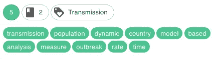
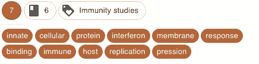
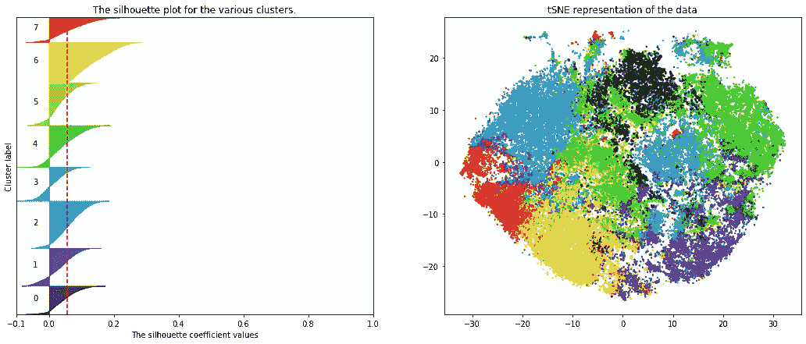
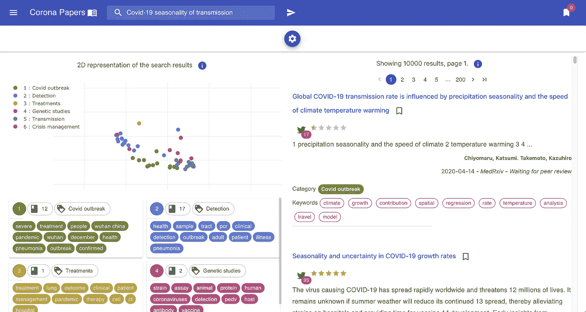
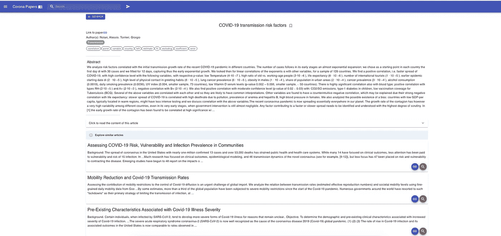
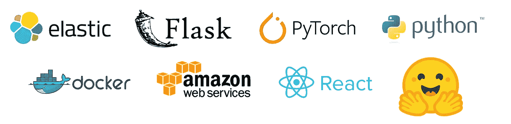
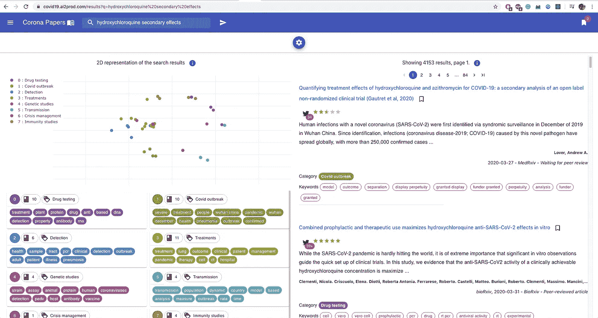
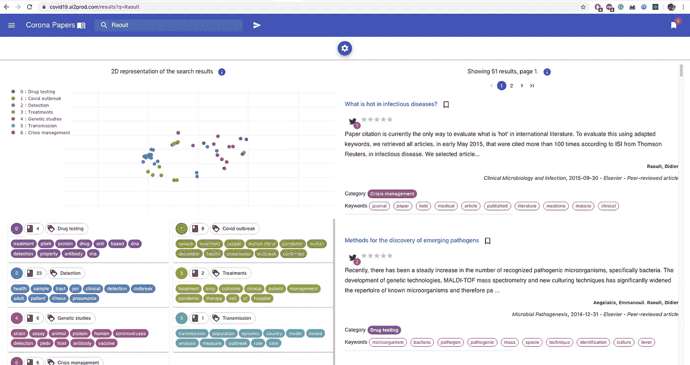
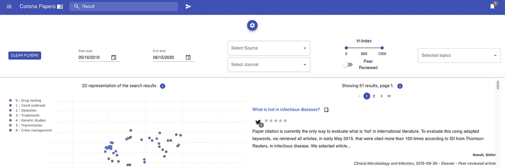

# 发布电晕论文——探索新冠肺炎研究的人工智能搜索引擎

> 原文：<https://medium.datadriveninvestor.com/releasing-corona-papers-an-ai-powered-search-engine-to-explore-covid-19-research-4b18d1259491?source=collection_archive---------1----------------------->

## 用 BERT、Elasticsearch 和 React 构建搜索引擎。

在过去的几个月里，新冠肺炎疫情酒店彻底改变了我们的生活。幸运的是，各国政府和研究人员仍在努力与之斗争。

在这篇文章中，我谦虚地把我的作品带到大楼里，并提出了一个人工智能工具，以帮助医疗从业者跟踪新冠肺炎的最新研究。

二话没说，见见[电晕论文](https://covid19.ai2prod.com)🎉

Corona Papers: a demo

在这篇文章中，我将:

*   **浏览 Corona Papers 的主要功能，并强调它与其他搜索引擎的不同之处**
*   **共享数据预处理和话题检测管道的代码，以便在类似项目中应用**

# 什么是电晕纸？

Corona Papers 是一个搜索引擎，它索引了关于新冠肺炎的最新研究论文。

如果您刚刚观看了该视频，接下来的部分将深入了解更多细节。如果你还没看过，你需要知道的都在这里。

**1 —论文和丰富元数据的精选列表**📄
Corona Papers 索引了由 [Kaggle](https://www.kaggle.com/allen-institute-for-ai/CORD-19-research-challenge) 提供的新冠肺炎开放研究数据集(CORD-19)。该数据集是超过 138，000 篇学术文章的定期更新资源，包括超过 69，000 篇关于新冠肺炎、新型冠状病毒和相关冠状病毒的全文。

Corona Papers 还整合了来自 [Altmetric](https://www.altmetric.com/) 和 [Scimgo Journal](https://www.scimagojr.com/journalrank.php) 到**的额外元数据，以说明每篇文章的在线存在和学术受欢迎程度。**更具体地说，它获取诸如脸书墙上的分享数量、维基百科上的帖子数量、转发数量、出版期刊的 H 指数等信息。

 [## 人工智能和监督资本主义|数据驱动的投资者

### 大科技，总是现在:人工智能推动的大科技，已经使购物，搜索，在你的…

www.datadriveninvestor.com](https://www.datadriveninvestor.com/2020/03/04/on-artificial-intelligence-and-surveillance-capitalism/) 

整合这些元数据的目的是考虑每篇论文在学术和非学术团体中的影响和传播力。

External metadata: Altemetric and SJR

## **2 —使用语言模型的自动主题提取**🤖

Corona Papers **使用机器学习管道**自动为每篇文章标记相关主题。
这是使用 [CovidBERT](https://huggingface.co/gsarti/covidbert-nli) 完成的:一种针对医疗数据进行微调的最先进的语言模型。凭借[拥抱脸](https://medium.com/u/b1574f0c6c5e?source=post_page-----4b18d1259491--------------------------------)库的强大功能，使用这个模型相当容易。

[Hugging Face](https://huggingface.co/)

为了更清楚起见，我们来分解一下主题检测管道:

*   鉴于摘要代表了每篇文章的主要内容，它们将用于发现主题而不是全部内容。
    首先使用 CovidBERT 嵌入它们。这产生了 **768 维的向量。
    —** 注意，CovidBERT **将每个摘要作为一个整体嵌入**，这样得到的向量封装了整个文档的语义。
*   对这些向量执行主成分分析(PCA ),以降低它们的维数，从而去除冗余并加速后面的计算。**保留 250 个组件**以确保 95%的解释差异。
*   KMeans 聚类应用于这些 PCA 组件之上，以便发现主题。在对集群数量进行多次迭代后， **8 似乎是正确的选择**。
    —有许多方法可以选择簇的数量。我亲自看了每个集群的[剪影图](https://scikit-learn.org/stable/auto_examples/cluster/plot_kmeans_silhouette_analysis.html)(如下图)。⚠️在这一步已经做了一个假设:每篇文章都被分配了一个独特的主题，也就是主导主题。如果你想在每篇论文中生成一个混合主题，正确的方法是使用[潜在的狄利克雷分配](https://en.wikipedia.org/wiki/Latent_Dirichlet_allocation)。**然而，这种方法的缺点是它没有集成 COVIDBert 嵌入。**
*   生成集群后，我查看了每一个集群，以了解潜在的子主题。我首先尝试了字数统计和 [TF-IDF](https://fr.wikipedia.org/wiki/TF-IDF) 评分来选择每个聚类中最重要的关键词。**但是这里最有效的方法是通过对每个聚类的文档执行 LDA 来提取这些关键词。**这很有意义，因为每个集群本身就是子主题的集合。
    发现了不同的相干星团。以下是一些带有相应关键字的示例(聚类名称是根据关键字手动确定的)

Examples of generated topics

*   最后，主要为了好玩，我决定在一个交互式 2D 地图中表示这些文章，以提供对聚类及其可分性的可视化解释。为此，我对 PCA 组件应用了 tSNE 降维。没什么特别的。

Silhouette and tSNE plots

为了给搜索体验带来更多的交互性，我决定将 tSNE 可视化嵌入到搜索结果中(这仅在桌面视图上可用)。
在每个结果页面上，图上的点(左边)代表相同的搜索结果(右边):这给出了结果在语义空间中如何相互关联的想法。

Search results + tSNE visualization

## 3 —类似论文的推荐

一旦你点击一篇给定的论文，Corona Papers 会向你显示它的详细信息，如标题、摘要、完整内容、原始文档的 URL 等。

此外，它还提供了一系列相似的文章供用户阅读和收藏。

这些文章是基于一个相似性度量计算的 CovidBert 嵌入。
这里有两个例子:

Similar articles on Covid-19 impact on pregnancy

Similar articles on risk factors

## 4 —一系列现代网络技术📲

电晕纸是使用现代网络技术建立的

Corona Paper’s stack

> ***后端***

其核心是使用 **Elasticsearch** 来执行全文查询、复杂的聚合和排序。例如，当你输入一系列关键词时，Elasticsearch 首先将它们与标题、摘要匹配，最后是作者姓名。

下面是一个查询示例:

query: “hydroxychloroquine secondary effects”

这是第二个符合作者名字的:

query: “Raoult”

后端的下一个重要组件是 Flask API:它是 ElasticSearch 和前端之间的接口。

> ***前端***

前端界面是使用 [Material-UI](https://medium.com/u/9d99f1b2974b?source=post_page-----4b18d1259491--------------------------------) 构建的，这是一个很棒的 React UI [库](http://material-ui.com/)，带有各种设计良好且健壮的组件。

它被用于设计不同的页面，更具体地说，是带有可折叠搜索过滤器面板的搜索页面:

*   出版日期
*   出版公司(即来源)
*   日志名称
*   同行评议文章
*   杂志的 h 索引
*   主题

Additional search filters

因为可访问性很重要，我的目标是让 Corona Papers 成为研究人员可以在不同设备上使用的响应工具。使用 [Material-UI](https://medium.com/u/9d99f1b2974b?source=post_page-----4b18d1259491--------------------------------) 帮助我们设计了一个干净简单的界面。

Corona Papers

> ***云和***

我使用 docker-compose 在 AWS 上部署了 Corona 文件。

# 如何在实践中使用 CovidBERT

使用 **sentence_transformers** 包从 CovidBERT 加载并生成嵌入，就像编写这几行代码一样简单

Generate CovidBERT embeddings

如果您对数据处理和主题提取管道感兴趣，可以看看我的 Github [资源库](https://github.com/ahmedbesbes/covidbert-topic-mining)中的代码。

你会发现两个笔记本:

**1-数据整合. ipynb:**

*   用来自 Altmetric、Scimago Journal 和 CrossRef 的外部元数据整合 CORD 数据库
*   从标题和摘录中生成 CovidBERT 嵌入

**2-topic-mining.ipynb:**

*   使用 CovidBERT 嵌入生成主题
*   为每个聚类选择相关的关键字

# 从这个项目中可以学到什么重要的经验教训？

构建电晕纸一直是一个有趣的旅程。这是一个混合自然语言处理、搜索技术和网页设计的机会。这也是很多实验的场所。

以下是一些技术和非技术方面的笔记，我先保密，现在与你分享:

*   不要低估 Elasticsearch 的力量。该工具提供了强大的可定制搜索功能。掌握它需要大量的努力，但这是一项非常有价值的技能。
    访问官方[网站](https://www.elastic.co/guide/en/elasticsearch/reference/current/getting-started.html)了解详情。
*   使用诸如 CovidBERT 的语言模型为文本相似性任务提供了有效的表示。
    如果你正在进行文本相似性任务，寻找一个在类似你的语料库上预先训练的语言模型。否则，训练你自己的语言模型。
    这里有很多可用的型号。
*   Docker 是部署的首选解决方案。非常整洁、干净、高效地编排应用程序的多种服务。
    点击了解更多关于 Docker [的信息。](https://docker-curriculum.com/)
*   在 React 中编写 UI 真的很有趣，也不是特别困难，尤其是当你使用像 [Material-UI](https://medium.com/u/9d99f1b2974b?source=post_page-----4b18d1259491--------------------------------) 这样的库时。
    关键是首先从你的应用草图开始，然后分别设计单个组件，最后组装整个东西。
    这个我花了一段时间才掌握，因为我是 React 新手，不过这里有一些我用过的教程:
    — React 官方[网站](https://reactjs.org/tutorial/tutorial.html)
    — Material UI 官方[网站](https://material-ui.com/)那里可以找到一堆组件
    —我也推荐这家伙的频道。它很棒，很有趣，可以让你很快开始学习 React 基础知识。

React Tutorial For Beginners — Dev Ed

*   文本聚类不是一个全自动的过程。您必须几乎手动地微调集群的数量，以找到正确的值。这需要监控一些指标，并对结果进行定性评估。

当然，有些事情我希望我有时间去尝试，比如用 Github actions 设置 CI-CD 工作流和构建单元测试。如果你有使用这些工具的经验，我会非常感谢你的反馈。

# 把话传出去！与您的社区共享 Corona 文件

如果你做到了这一步，我真的要感谢你的阅读！

如果你觉得电晕论文有用，请分享这个链接

 [## 电晕纸

### 一个人工智能搜索引擎挖掘新冠肺炎的研究论文

covid19.ai2prod.com](https://covid19.ai2prod.com) 

和你的社区。

如果您有改进功能的要求，或者如果您想报告一个错误，请不要犹豫，与我联系。

我期待着收到你的来信！

最好的，

**访问专家视图—** [**订阅 DDI 英特尔**](https://datadriveninvestor.com/ddi-intel)