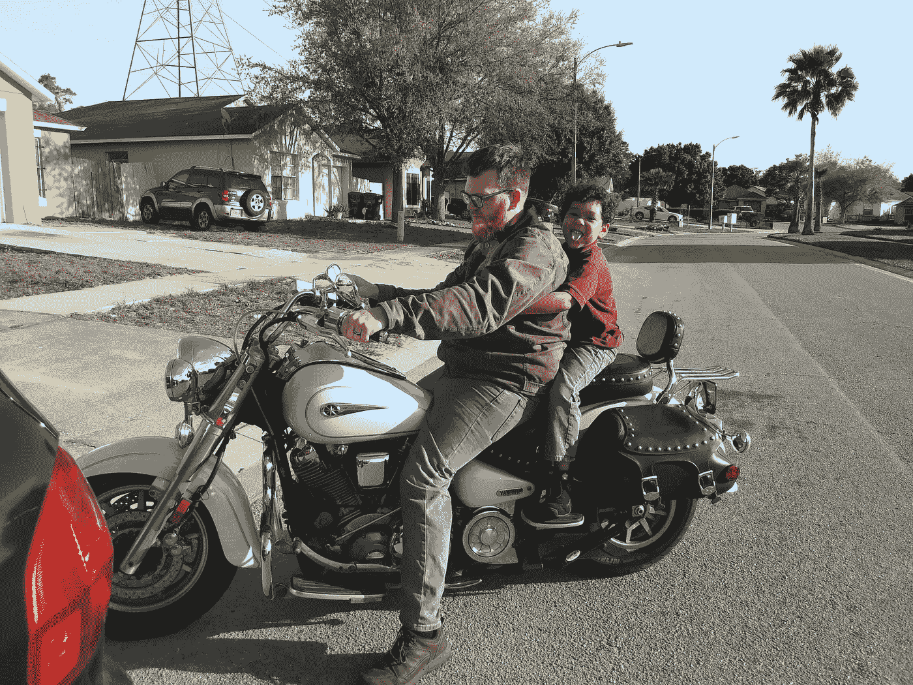
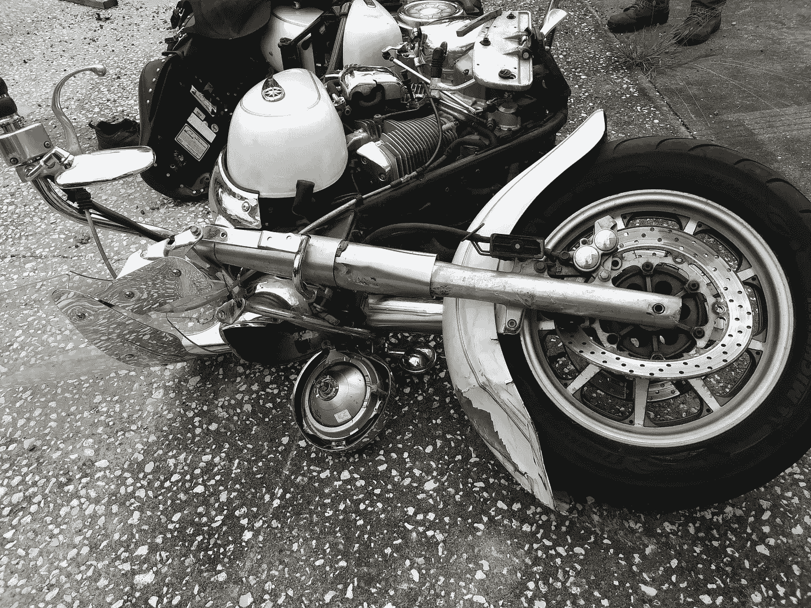
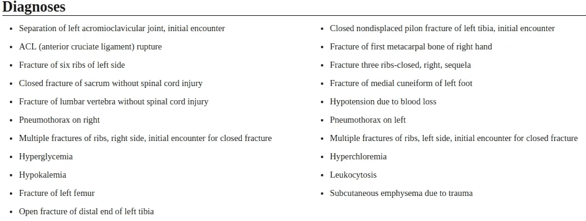
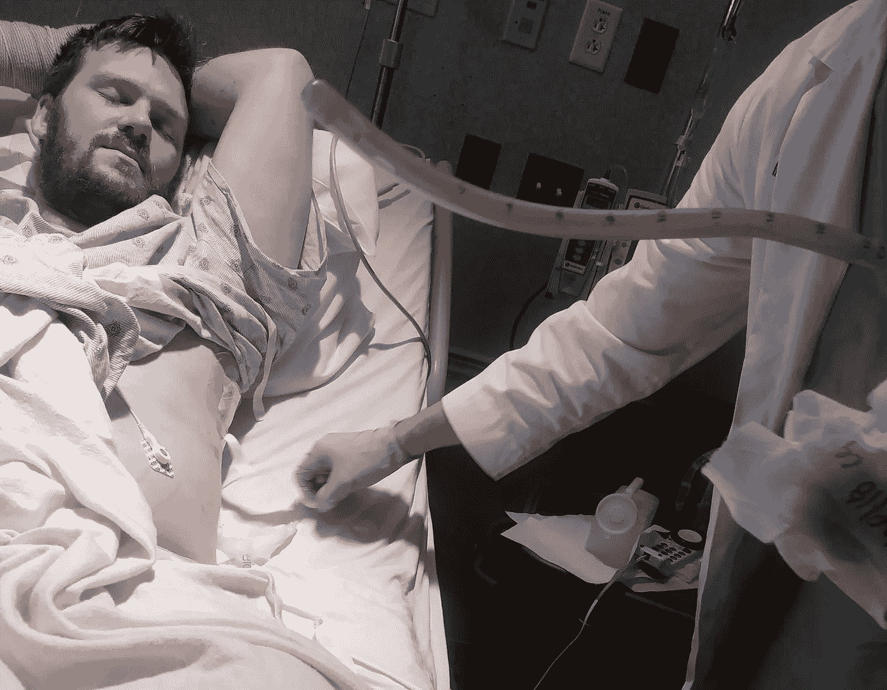
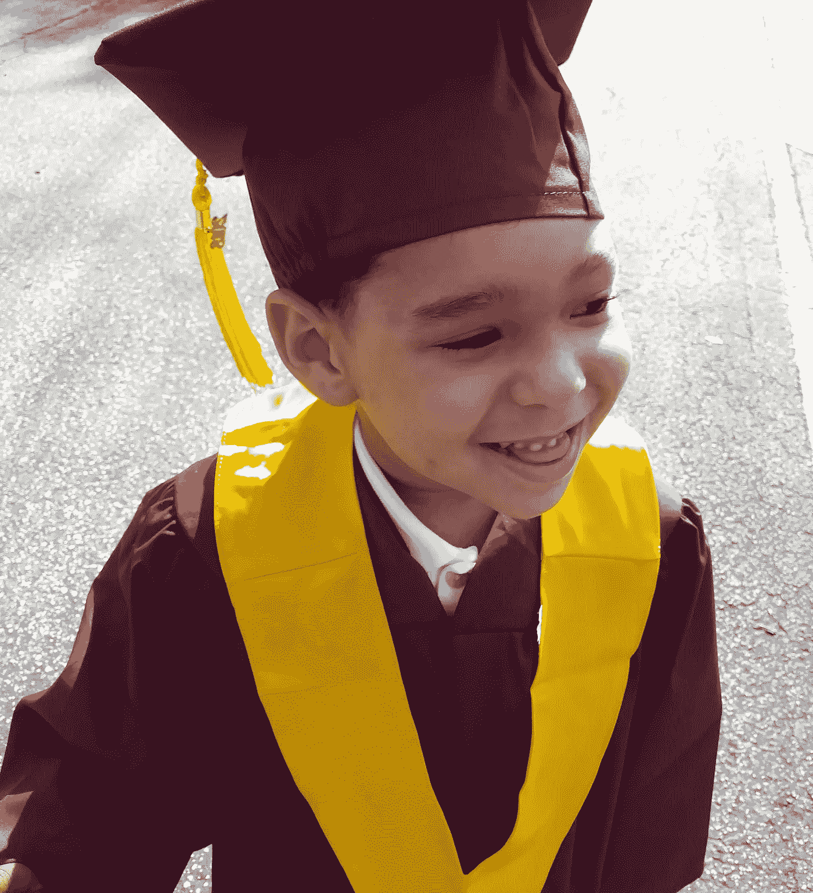
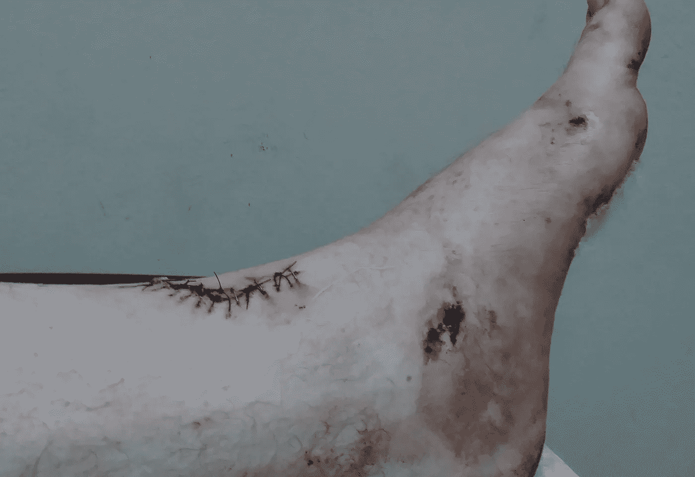
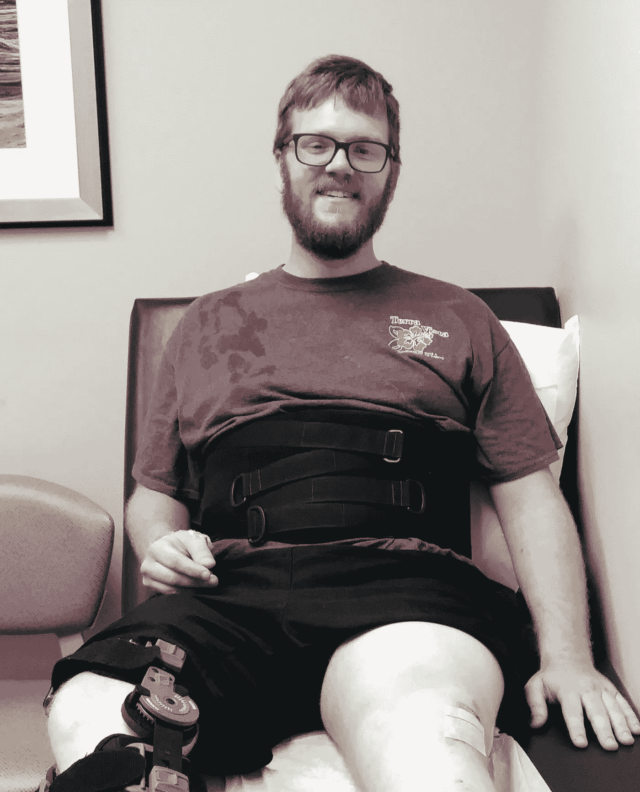
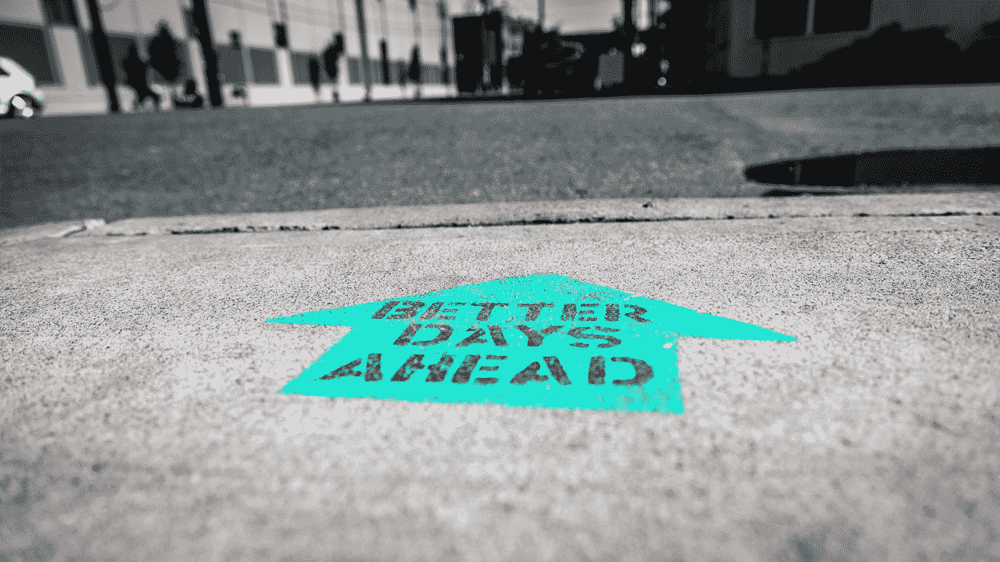

# 2021 年，持续的积极会改变你的生活

> 原文：<https://medium.datadriveninvestor.com/relentless-positivity-will-change-your-life-in-2021-1dd02716ee80?source=collection_archive---------20----------------------->

## 你的思想包含了整个宇宙——好好利用它

*2021 年 3 月 23 日更新——成功了。* [*更新 2021 年 4 月 1 日—我用这篇文章写了另一篇关于写文章的文章。成功是可能的，朋友。我爱你，感谢阅读！*](https://kbtheauthor.medium.com/proof-that-life-gets-better-ad28922e8472?sk=7be142afbeddce1b779554cbaf056a28)

我已经摆脱了假设来年将会带来改变的习惯。

不会的。不要假装它会。

我不想成为一个扫兴的人。我只是在传递帮助我每一年都过得更好的建议。

停止期待更好的一年，开始实施策略让它发生。这里有一个帮助你度过新的一年。

# 我喜欢称之为**持续的积极性。**

回到 2017 年，我和我的家人被赶出了我们的公寓。我们最后和我妻子的父母住在一起。这应该是一个临时设置。剧透警告:**不是。**

我立即开始找工作。我有几个月运气不好，那时我还用我的退税买了一辆摩托车。

Me and Junior on the bike. He’s so silly.

1700 立方厘米的屁股在我的大腿之间，我走上了寻找收入的道路。我的意思是，我开着摩托车上下班了几天——9 个工作日，18 个日历日。然后灾难降临了。

Junkyard photo. Notice the large tire-shaped indent and bent brake disc.

虽然我不知道，但我已经在用**坚持不懈的积极性**的力量来改变我的生活。我只是没有学会如何释放它的真正潜力——或者我自己的潜力。

2018 年 5 月 18 日我在下班回家的路上，被一辆 SUV 撞了。5000 磅的钢铁与我的身体相撞，让我的自行车停在轨道上，大概也让我的身体飞了起来。

Translation: My shit’s fucked up.

May 20th. Thumbs up for being alive!

图片的时候，5 月 20 日下午，我已经进出手术 48 小时了。我输了 6 个单位的血来救我的命。

在我所有的手术后，一个看起来像大卫·哈伯的护士在重症监护室给了我更多的 pRBC(浓缩红细胞)。他漫不经心地告诉我，我的血液“仍然有点低”，他们想提高它。

我想，对我来说不错。

我认为这张照片很好地体现了持续的积极性。

在连续两天的痛苦之后，我仍然能够微笑并竖起大拇指，因为我还活着。我现在还是，但我以前也是。

May 22\. The tube was in my chest to fix my punctured lungs. Putting it in was horrible. Getting it out was amazing.

当有人从你的胸腔里取出 6 英寸以上的乙烯管时，你脸上的表情就是这样。改天我会写下**将外科手术刀插入你肋骨之间的经历。**

老实说，这一切都糟透了。我是怎么活下来的？我保持乐观。

# 持续的积极救了我的命。

在过去的两年里，我的心态是我健康最重要的资产。

当我不得不使用助行器单脚跳着去任何地方*时，我保持乐观，享受生活。我蹦跳着去看电影。我蹦蹦跳跳地去看我儿子幼儿园毕业。我在镇上跳来跳去，痛得要命。**但是我跳了。***

我本可以无所事事，闷闷不乐地诉说我的痛苦。相反，我看到了这个:

June 1st, 2018\. My son’s graduation from Kindergarten. He never looks at the camera.

这些是我康复过程中的里程碑。我已经做了 6 次手术来修复我身体上的损伤。每次做完后，他们都会帮你缝合。第一批预约中有一项是从我的左脚上拆线和缝钉。

June 8th, 2018\. Those stitches are about to come out.

从你的皮肤里取出东西真糟糕。订书钉，缝针，都糟透了。尽管如此，我仍然保持乐观。我将要忍受一些痛苦，但在这之后，痛苦会结束。缝针和订书针会使你的皮肤疼痛和发痒。让他们出来是一种祝福。

The wet spots on my shirt are from me biting down on a wet cloth. They removed about 60 staples.

在上面的图片中，我有一个支撑我断裂的脊柱的支架和一个支撑我断裂的前交叉韧带的支架。我基本上是被螺丝钉、钉子和支架固定在一起的。

尽管如此，你还是看到了一个快乐的人。我很高兴，因为我刚刚克服了另一个障碍。我爬上了另一个顶峰，从皮肤里取出了那些该死的钉子和缝线。

Photo by [Ian Taylor](https://unsplash.com/@carrier_lost?utm_source=medium&utm_medium=referral) on [Unsplash](https://unsplash.com?utm_source=medium&utm_medium=referral)

# 不懈的积极也会拯救你。

我有今天，是因为坚持不懈的积极。我从死亡的边缘走到成为一名成功的媒介作家。一路走来，我克服了太多的障碍，无法一一列举。

人类是生存机器。你的身体会尽自己的一份力量继续前进，是你的思想在作怪。你的宇宙就是你的心态。

你将整个宇宙(为你)保存在你的大脑中。你可以利用这一点。永远不要让任何事情阻止你成为最好的自己。

在你的生活中，会有事情让你沮丧的时候。**没关系。**

我 24 岁了，我不知道我是否还能使用我的左腿。肯定有一些绝望的时刻。在你的生活中出现局部的消极情绪是可以的，因为你需要平衡。

但是，不要让它接管。保持积极的态度，你就会拥有积极的生活。年份不重要，重要的是你的心态。

今天，我过着正常的生活，事故带来的影响只是积极的。我还有些痛苦让我想起过去，但我们不都是吗？

尽管失去了工作、家庭和几乎是我的生活，我还是保持了积极的态度。

***你也可以。***

感谢阅读。

**进入专家视角—** [**订阅 DDI 英特尔**](https://datadriveninvestor.com/ddi-intel)