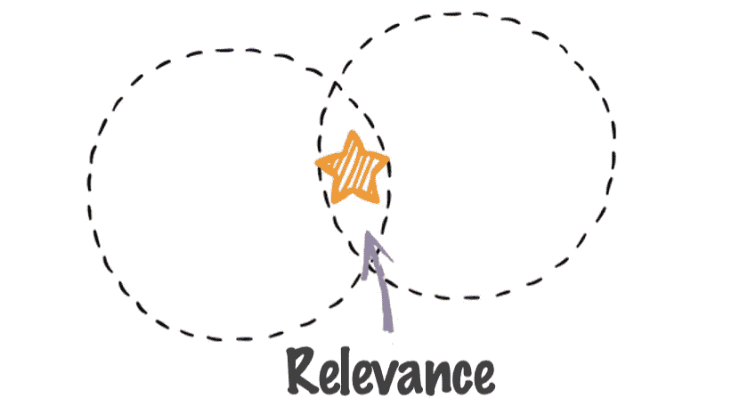
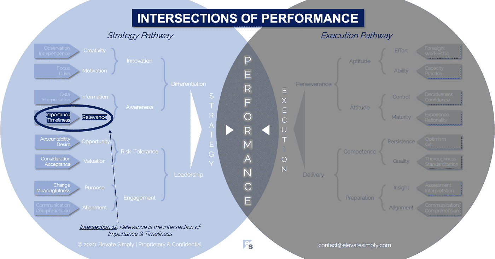

# 12.相关性:重要性和及时性的交集

> 原文：<https://medium.datadriveninvestor.com/relevance-the-intersection-of-importance-timeliness-56cc748eb066?source=collection_archive---------11----------------------->

Image from 123rf.com

从表面上看，确定相关性似乎很简单，几乎微不足道，因为我们做得很快。这是基于现有信息的简单判断。理想情况下，这些信息是客观的或真实的，但是在缺乏客观性的情况下，我们将使用主观信息或观点。大多数时候，客观性和主观性交织在一起，影响着我们的相关性认知。

我们有意识或无意识地对几乎任何事情都使用关联镜头。在商业中，相关性是至关重要的，它决定了从目的到战略到产品和服务的一切。理解在一个组织中相关性是如何被确定的是有趣的，因为它提供了对绩效的洞察力。

**业务相关性**

为了防止过时，最强的公司必然会永远进行自我评估。

*   我们(公司)相关吗？
*   我们的产品/服务是否相关？
*   我们的商业模式相关吗？
*   我们做出的商业决策相关吗？
*   我们的人相关吗？

上面的每个问题后面都可以跟着“为什么，持续多长时间？”相关性必须是高层领导的首要关注点。无关紧要会扼杀业绩、成功和寿命……更不用说工作保障了。

当评估相关性确定的有效性时，视角是关键:

*   评估的是什么？
*   如何对其进行评估？
*   谁在评估它？
*   正在考虑哪些客观输入？(事实/数据)
*   正在考虑哪些主观输入？(偏见/观点)
*   为什么要评估？
*   什么时候评估？

观察一家公司内部潜在的相关性倾向，有助于理解回答这些问题的严谨性……什么是相关性？什么不相关？

**什么是关联交集？**

相关性是重要性和及时性的交叉点*(见下图交叉点 12)*。为了让某样东西变得有意义，它必须在适当的时候有价值。

*重要性*

你怎么知道一件事是否重要？

*   有人说这很重要
*   你从过去的经验中知道
*   有数据/信息可以证明这一点
*   这似乎/感觉/听起来很重要

以我的经验来看，有一种不言而喻的期望，即有证据证明任何商业决策的相关性。这种证明通常采取重要性的形式。例如，“我们做出这个决定是因为这个特性存在于产品中很重要。”

然而，重要性只是关联等式的一半。

交叉点 12:相关性=重要性+及时性

Image by [Brett Simpson](https://medium.com/u/191cf90a65d7?source=post_page-----56cc748eb066--------------------------------)

*时效性*

如果只有重要性才是最重要的，那就不需要“相关性”这个词了。相关性更大更广。有一个基于时间的因素…这是重要的吗？如果不是，什么时候重要？在这一点上，它也变得更加相关。让我们再看一下上面的例子，并为其添加及时性，“我们做出这个决定是因为当我们下个月发布 1.0 版时，这个特性存在于产品中是很重要的。”

众所周知，产品范围决策需要相关性分析。不仅仅是这些特性是什么，还包括这些特性在 1、2、3 等版本中何时可用。有很多“超前于时代”的产品或服务的故事。其中许多肯定是重要的发现、创新或概念，但由于各种原因，时机不对，因此它们的相关性不如它本来可以或将来会有的那样强。

当公司确保相关性的时间成分被考虑时，它们通过实现对任务和资源的使用进行优先排序的能力来设定更有效的绩效路径。

**领导者能做什么？**

战略是关于领导者辨别相关性和非相关性的能力。如果他们能够区分什么是现在重要的，什么是明天重要的，他们就优化了团队或公司的工作量。

这很棘手，因为相关性假设了某种程度的未来可预测性或可控性。例如，以一个开发周期为 1 年的产品为例。企业领导人在过去做出的决策假设(或预测？)产品的未来相关性。

有时公司创造相关性(这可以表现为需求)，而其他时候公司对相关性做出反应。无论哪种方式，领导者在寻求相关性时都需要平衡重要性和及时性。

**总结&下一个**

下次当你判断某件事相关或不相关时，后退一步，问问自己是如何以及为什么得出这个结论的。答案可能包括重要性和及时性。

下次我们将考察绩效的第 13 个交叉点，也就是**信息交叉点**。

在这一系列文章中，我们探索了性能的交叉点，共有 30 个。绩效的交叉点*框架基于*[*Brett Simpson*](https://www.linkedin.com/in/brettjsimpson/)*[*董事总经理*](https://www.linkedin.com/company/elevatesimply/) *的经验和见解，以及他作为企业家、顾问和投资者在大大小小的组织中 20 多年的领导经验。**

***绩效-文章链接的交集***

*1.[业绩:战略的交集&执行](https://medium.com/the-innovation/1-performance-the-intersection-of-strategy-execution-2bf06329f8d4)*

*2.[战略:领导力的交叉点&差异化](https://medium.com/the-innovation/2-strategy-the-intersection-of-leadership-differentiation-a568b17731ab)*

*3.[领导:参与的交集&风险承受能力](https://medium.com/the-innovation/3-leadership-the-intersection-of-engagement-risk-tolerance-f8c887e6c1d3)*

*4.[差异化:创新的交叉点&意识](https://medium.com/@brettjsimpson/4-differentiation-the-intersection-of-innovation-awareness-a21d053ecf12)*

*5.[啮合:目的交集&对准](https://medium.com/@brettjsimpson/5-engagement-the-intersection-of-purpose-alignment-953747437c26)*

*6.[风险承受能力:机会的交叉点&估值](https://medium.com/@brettjsimpson/6-risk-tolerance-the-intersection-of-opportunity-valuation-29cf4d9a0ac)*

*7.[认知:信息的交集&关联性](https://medium.com/@brettjsimpson/7-awareness-the-intersection-of-information-relevance-f0fd5322bcb7)*

*8.[创新:创造力的交汇点&动机](https://medium.com/@brettjsimpson/8-innovation-the-intersection-of-creativity-motivation-7c1a12e0d5e2)*

*9.[目的:变化的交叉点&意义](https://medium.com/@brettjsimpson/9-purpose-the-intersection-of-change-meaningfulness-9f12b0153e1)*

*10.[估值:对价的交集&验收](https://medium.com/@brettjsimpson/valuation-the-intersection-of-consideration-acceptance-eebe7b15e763)*

*11.[机会:欲望的交汇&责任](https://medium.com/the-innovation/opportunity-the-intersection-of-desire-accountability-7e81adb1e195)*

*12.[相关性:重要性的交集&及时性](https://medium.com/@brettjsimpson/relevance-the-intersection-of-importance-timeliness-56cc748eb066)*

*13.[信息:数据的交集&解读](https://medium.com/@brettjsimpson/information-the-intersection-of-data-interpretation-62acc94ba8bf)*

*14.[动机:焦点的交集&驱动](https://medium.com/@brettjsimpson/14-motivation-the-intersection-of-focus-drive-d9ebd3ca9951)*

*15.[创造力:观察的交集&独立性](https://medium.com/@brettjsimpson/15-creativity-the-intersection-of-observation-independence-57f7294acb2b)*

*16.执行:毅力和交付的交叉点*(即将推出！)**

*17.交付:准备与能力的交叉点*(即将推出！)**

*18.毅力:天资与态度的交汇*(即将推出！)**

*19.准备:洞察与对齐的交集*(即将推出！)**

*20.能力:坚持与质量的交集*(即将推出！)**

*21.态度:控制与成熟的交集*(即将推出！)**

*22.资质:努力与能力的交集*(即将推出！)**

*23.洞察力:评估与解释的交集*(即将推出！)**

*24.质量:彻底性和标准化的交汇点*(即将推出！)**

*25.坚持:乐观与勇气的交汇*(即将推出！)**

*26.成熟:经验与理性的交集*(即将推出！)**

*27.控制:果断与自信的交集*(即将推出！)**

*28.能力:能力与实践的交集*(即将推出！)**

*29.努力:远见和职业道德的交集*(即将推出！)**

*30.对齐:传播与综合的交汇点*(即将推出！)**

*在 [**领导力、辅导和个人成长**](https://app.ddichat.com/category/leadership-coaching-and-personal-growth) 中安排一次对话:*

* [## 专家-领导力、教练和个人成长- DDIChat

### DDIChat 允许个人和企业直接与主题专家交流。它使咨询变得快速…

app.ddichat.com](https://app.ddichat.com/category/leadership-coaching-and-personal-growth) 

在此申请成为 DDIChat 专家[。
与 DDI 合作:](https://app.ddichat.com/expertsignup)[https://datadriveninvestor.com/collaborate](https://datadriveninvestor.com/collaborate)
点击这里订阅 DDIntel [。](https://ddintel.datadriveninvestor.com/)*